# Matplotlib Explorations

## Line Plot


```python
import matplotlib.pyplot as plt
import numpy as np
from numpy.random import randint
```


```python
%matplotlib inline
```


```python
x = np.linspace(1, 10, 20)
x
```


    array([ 1.        ,  1.47368421,  1.94736842,  2.42105263,  2.89473684,
            3.36842105,  3.84210526,  4.31578947,  4.78947368,  5.26315789,
            5.73684211,  6.21052632,  6.68421053,  7.15789474,  7.63157895,
            8.10526316,  8.57894737,  9.05263158,  9.52631579, 10.        ])


```python
y=randint (1, 50, 20)
y
```


    array([16, 48, 47, 27,  6,  4, 39, 32, 18, 42, 28, 33, 29, 31, 25, 38, 10,
           18, 26, 23])


```python
x.size, y.size
```


    (20, 20)


```python
help(plt)
```

    Help on module matplotlib.pyplot in matplotlib:
    
    NAME
        matplotlib.pyplot
    
    DESCRIPTION
        `matplotlib.pyplot` is a state-based interface to matplotlib. It provides
        a MATLAB-like way of plotting.
        
        pyplot is mainly intended for interactive plots and simple cases of
        programmatic plot generation::
        
            import numpy as np
            import matplotlib.pyplot as plt
        
            x = np.arange(0, 5, 0.1)
            y = np.sin(x)
            plt.plot(x, y)
        
        The object-oriented API is recommended for more complex plots.
    
    FUNCTIONS
        acorr(x, *, data=None, **kwargs)
            Plot the autocorrelation of *x*.
            
            Parameters
            ----------
            x : array-like
            
            detrend : callable, optional, default: `mlab.detrend_none`
                *x* is detrended by the *detrend* callable. This must be a
                function ``x = detrend(x)`` accepting and returning an
                `numpy.array`. Default is no normalization.
            
            normed : bool, optional, default: True
                If ``True``, input vectors are normalised to unit length.
            
            usevlines : bool, optional, default: True
                Determines the plot style.
            
                If ``True``, vertical lines are plotted from 0 to the acorr value
                using `Axes.vlines`. Additionally, a horizontal line is plotted
                at y=0 using `Axes.axhline`.
            
                If ``False``, markers are plotted at the acorr values using
                `Axes.plot`.
            
            maxlags : int, optional, default: 10
                Number of lags to show. If ``None``, will return all
                ``2 * len(x) - 1`` lags.
            
            Returns
            -------
            lags : array (length ``2*maxlags+1``)
                The lag vector.
            c : array  (length ``2*maxlags+1``)
                The auto correlation vector.
            line : `.LineCollection` or `.Line2D`
                `.Artist` added to the axes of the correlation:
            
                - `.LineCollection` if *usevlines* is True.
                - `.Line2D` if *usevlines* is False.
            b : `.Line2D` or None
                Horizontal line at 0 if *usevlines* is True
                None *usevlines* is False.
            
            Other Parameters
            ----------------
            linestyle : `.Line2D` property, optional
                The linestyle for plotting the data points.
                Only used if *usevlines* is ``False``.
            
            marker : str, optional, default: 'o'
                The marker for plotting the data points.
                Only used if *usevlines* is ``False``.
            
            Notes
            -----
            The cross correlation is performed with :func:`numpy.correlate` with
            ``mode = "full"``.
            
            .. note::
                In addition to the above described arguments, this function can take a
                **data** keyword argument. If such a **data** argument is given, the
                following arguments are replaced by **data[<arg>]**:
            
                * All arguments with the following names: 'x'.
            
                Objects passed as **data** must support item access (``data[<arg>]``) and
                membership test (``<arg> in data``).
        
        angle_spectrum(x, Fs=None, Fc=None, window=None, pad_to=None, sides=None, *, data=None, **kwargs)
            Plot the angle spectrum.
            
            Compute the angle spectrum (wrapped phase spectrum) of *x*.
            Data is padded to a length of *pad_to* and the windowing function
            *window* is applied to the signal.
            
            Parameters
            ----------
            x : 1-D array or sequence
                Array or sequence containing the data.
            
            Fs : scalar
                The sampling frequency (samples per time unit).  It is used
                to calculate the Fourier frequencies, freqs, in cycles per time
                unit. The default value is 2.
            
            window : callable or ndarray
                A function or a vector of length *NFFT*.  To create window vectors see
                `window_hanning`, `window_none`, `numpy.blackman`, `numpy.hamming`,
                `numpy.bartlett`, `scipy.signal`, `scipy.signal.get_window`, etc.  The
                default is `window_hanning`.  If a function is passed as the argument,
                it must take a data segment as an argument and return the windowed
                version of the segment.
            
            sides : {'default', 'onesided', 'twosided'}
                Specifies which sides of the spectrum to return.  Default gives the
                default behavior, which returns one-sided for real data and both
                for complex data.  'onesided' forces the return of a one-sided
                spectrum, while 'twosided' forces two-sided.
            
            pad_to : int
                The number of points to which the data segment is padded when
                performing the FFT.  While not increasing the actual resolution of
                the spectrum (the minimum distance between resolvable peaks),
                this can give more points in the plot, allowing for more
                detail. This corresponds to the *n* parameter in the call to fft().
                The default is None, which sets *pad_to* equal to the length of the
                input signal (i.e. no padding).
            
            Fc : int
                The center frequency of *x* (defaults to 0), which offsets
                the x extents of the plot to reflect the frequency range used
                when a signal is acquired and then filtered and downsampled to
                baseband.
            
            Returns
            -------
            spectrum : 1-D array
                The values for the angle spectrum in radians (real valued).
            
            freqs : 1-D array
                The frequencies corresponding to the elements in *spectrum*.
            
            line : `~matplotlib.lines.Line2D`
                The line created by this function.
            
            Other Parameters
            ----------------
            **kwargs
                Keyword arguments control the `.Line2D` properties:
            
                Properties:
                agg_filter: a filter function, which takes a (m, n, 3) float array and a dpi value, and returns a (m, n, 3) array
                alpha: float or None
                animated: bool
                antialiased or aa: bool
                clip_box: `.Bbox`
                clip_on: bool
                clip_path: Patch or (Path, Transform) or None
                color or c: color
                contains: callable
                dash_capstyle: {'butt', 'round', 'projecting'}
                dash_joinstyle: {'miter', 'round', 'bevel'}
                dashes: sequence of floats (on/off ink in points) or (None, None)
                data: (2, N) array or two 1D arrays
                drawstyle or ds: {'default', 'steps', 'steps-pre', 'steps-mid', 'steps-post'}, default: 'default'
                figure: `.Figure`
                fillstyle: {'full', 'left', 'right', 'bottom', 'top', 'none'}
                gid: str
                in_layout: bool
                label: object
                linestyle or ls: {'-', '--', '-.', ':', '', (offset, on-off-seq), ...}
                linewidth or lw: float
                marker: marker style
                markeredgecolor or mec: color
                markeredgewidth or mew: float
                markerfacecolor or mfc: color
                markerfacecoloralt or mfcalt: color
                markersize or ms: float
                markevery: None or int or (int, int) or slice or List[int] or float or (float, float)
                path_effects: `.AbstractPathEffect`
                picker: float or callable[[Artist, Event], Tuple[bool, dict]]
                pickradius: float
                rasterized: bool or None
                sketch_params: (scale: float, length: float, randomness: float)
                snap: bool or None
                solid_capstyle: {'butt', 'round', 'projecting'}
                solid_joinstyle: {'miter', 'round', 'bevel'}
                transform: `matplotlib.transforms.Transform`
                url: str
                visible: bool
                xdata: 1D array
                ydata: 1D array
                zorder: float
            
            See Also
            --------
            :func:`magnitude_spectrum`
                :func:`angle_spectrum` plots the magnitudes of the corresponding
                frequencies.
            
            :func:`phase_spectrum`
                :func:`phase_spectrum` plots the unwrapped version of this
                function.
            
            :func:`specgram`
                :func:`specgram` can plot the angle spectrum of segments within the
                signal in a colormap.
            
            Notes
            -----
            
            
            .. note::
                In addition to the above described arguments, this function can take a
                **data** keyword argument. If such a **data** argument is given, the
                following arguments are replaced by **data[<arg>]**:
            
                * All arguments with the following names: 'x'.
            
                Objects passed as **data** must support item access (``data[<arg>]``) and
                membership test (``<arg> in data``).
        
        annotate(s, xy, *args, **kwargs)
            Annotate the point *xy* with text *text*.
            
            In the simplest form, the text is placed at *xy*.
            
            Optionally, the text can be displayed in another position *xytext*.
            An arrow pointing from the text to the annotated point *xy* can then
            be added by defining *arrowprops*.
            
            Parameters
            ----------
            text : str
                The text of the annotation.  *s* is a deprecated synonym for this
                parameter.
            
            xy : (float, float)
                The point *(x, y)* to annotate.
            
            xytext : (float, float), optional
                The position *(x, y)* to place the text at.
                If *None*, defaults to *xy*.
            
            xycoords : str, `.Artist`, `.Transform`, callable or tuple, optional
            
                The coordinate system that *xy* is given in. The following types
                of values are supported:
            
                - One of the following strings:
            
                  =================   =============================================
                  Value               Description
                  =================   =============================================
                  'figure points'     Points from the lower left of the figure
                  'figure pixels'     Pixels from the lower left of the figure
                  'figure fraction'   Fraction of figure from lower left
                  'axes points'       Points from lower left corner of axes
                  'axes pixels'       Pixels from lower left corner of axes
                  'axes fraction'     Fraction of axes from lower left
                  'data'              Use the coordinate system of the object being
                                      annotated (default)
                  'polar'             *(theta, r)* if not native 'data' coordinates
                  =================   =============================================
            
                - An `.Artist`: *xy* is interpreted as a fraction of the artists
                  `~matplotlib.transforms.Bbox`. E.g. *(0, 0)* would be the lower
                  left corner of the bounding box and *(0.5, 1)* would be the
                  center top of the bounding box.
            
                - A `.Transform` to transform *xy* to screen coordinates.
            
                - A function with one of the following signatures::
            
                    def transform(renderer) -> Bbox
                    def transform(renderer) -> Transform
            
                  where *renderer* is a `.RendererBase` subclass.
            
                  The result of the function is interpreted like the `.Artist` and
                  `.Transform` cases above.
            
                - A tuple *(xcoords, ycoords)* specifying separate coordinate
                  systems for *x* and *y*. *xcoords* and *ycoords* must each be
                  of one of the above described types.
            
                See :ref:`plotting-guide-annotation` for more details.
            
                Defaults to 'data'.
            
            textcoords : str, `.Artist`, `.Transform`, callable or tuple, optional
                The coordinate system that *xytext* is given in.
            
                All *xycoords* values are valid as well as the following
                strings:
            
                =================   =========================================
                Value               Description
                =================   =========================================
                'offset points'     Offset (in points) from the *xy* value
                'offset pixels'     Offset (in pixels) from the *xy* value
                =================   =========================================
            
                Defaults to the value of *xycoords*, i.e. use the same coordinate
                system for annotation point and text position.
            
            arrowprops : dict, optional
                The properties used to draw a
                `~matplotlib.patches.FancyArrowPatch` arrow between the
                positions *xy* and *xytext*.
            
                If *arrowprops* does not contain the key 'arrowstyle' the
                allowed keys are:
            
                ==========   ======================================================
                Key          Description
                ==========   ======================================================
                width        The width of the arrow in points
                headwidth    The width of the base of the arrow head in points
                headlength   The length of the arrow head in points
                shrink       Fraction of total length to shrink from both ends
                ?            Any key to :class:`matplotlib.patches.FancyArrowPatch`
                ==========   ======================================================
            
                If *arrowprops* contains the key 'arrowstyle' the
                above keys are forbidden.  The allowed values of
                ``'arrowstyle'`` are:
            
                ============   =============================================
                Name           Attrs
                ============   =============================================
                ``'-'``        None
                ``'->'``       head_length=0.4,head_width=0.2
                ``'-['``       widthB=1.0,lengthB=0.2,angleB=None
                ``'|-|'``      widthA=1.0,widthB=1.0
                ``'-|>'``      head_length=0.4,head_width=0.2
                ``'<-'``       head_length=0.4,head_width=0.2
                ``'<->'``      head_length=0.4,head_width=0.2
                ``'<|-'``      head_length=0.4,head_width=0.2
                ``'<|-|>'``    head_length=0.4,head_width=0.2
                ``'fancy'``    head_length=0.4,head_width=0.4,tail_width=0.4
                ``'simple'``   head_length=0.5,head_width=0.5,tail_width=0.2
                ``'wedge'``    tail_width=0.3,shrink_factor=0.5
                ============   =============================================
            
                Valid keys for `~matplotlib.patches.FancyArrowPatch` are:
            
                ===============  ==================================================
                Key              Description
                ===============  ==================================================
                arrowstyle       the arrow style
                connectionstyle  the connection style
                relpos           default is (0.5, 0.5)
                patchA           default is bounding box of the text
                patchB           default is None
                shrinkA          default is 2 points
                shrinkB          default is 2 points
                mutation_scale   default is text size (in points)
                mutation_aspect  default is 1.
                ?                any key for :class:`matplotlib.patches.PathPatch`
                ===============  ==================================================
            
                Defaults to None, i.e. no arrow is drawn.
            
            annotation_clip : bool or None, optional
                Whether to draw the annotation when the annotation point *xy* is
                outside the axes area.
            
                - If *True*, the annotation will only be drawn when *xy* is
                  within the axes.
                - If *False*, the annotation will always be drawn.
                - If *None*, the annotation will only be drawn when *xy* is
                  within the axes and *xycoords* is 'data'.
            
                Defaults to *None*.
            
            **kwargs
                Additional kwargs are passed to `~matplotlib.text.Text`.
            
            Returns
            -------
            annotation : `.Annotation`
            
            See Also
            --------
            :ref:`plotting-guide-annotation`.
        
        arrow(x, y, dx, dy, **kwargs)
            Add an arrow to the axes.
            
            This draws an arrow from ``(x, y)`` to ``(x+dx, y+dy)``.
            
            Parameters
            ----------
            x, y : float
                The x and y coordinates of the arrow base.
            dx, dy : float
                The length of the arrow along x and y direction.
            
            Returns
            -------
            arrow : `.FancyArrow`
                The created `.FancyArrow` object.
            
            Other Parameters
            ----------------
            **kwargs
                Optional kwargs (inherited from `.FancyArrow` patch) control the
                arrow construction and properties:
            
            Constructor arguments
              *width*: float (default: 0.001)
                width of full arrow tail
            
              *length_includes_head*: bool (default: False)
                True if head is to be counted in calculating the length.
            
              *head_width*: float or None (default: 3*width)
                total width of the full arrow head
            
              *head_length*: float or None (default: 1.5 * head_width)
                length of arrow head
            
              *shape*: ['full', 'left', 'right'] (default: 'full')
                draw the left-half, right-half, or full arrow
            
              *overhang*: float (default: 0)
                fraction that the arrow is swept back (0 overhang means
                triangular shape). Can be negative or greater than one.
            
              *head_starts_at_zero*: bool (default: False)
                if True, the head starts being drawn at coordinate 0
                instead of ending at coordinate 0.
            
            Other valid kwargs (inherited from :class:`Patch`) are:
            
            Properties:
                agg_filter: a filter function, which takes a (m, n, 3) float array and a dpi value, and returns a (m, n, 3) array
                alpha: float or None
                animated: bool
                antialiased or aa: unknown
                capstyle: {'butt', 'round', 'projecting'}
                clip_box: `.Bbox`
                clip_on: bool
                clip_path: Patch or (Path, Transform) or None
                color: color
                contains: callable
                edgecolor or ec: color or None or 'auto'
                facecolor or fc: color or None
                figure: `.Figure`
                fill: bool
                gid: str
                hatch: {'/', '\\', '|', '-', '+', 'x', 'o', 'O', '.', '*'}
                in_layout: bool
                joinstyle: {'miter', 'round', 'bevel'}
                label: object
                linestyle or ls: {'-', '--', '-.', ':', '', (offset, on-off-seq), ...}
                linewidth or lw: float or None
                path_effects: `.AbstractPathEffect`
                picker: None or bool or float or callable
                rasterized: bool or None
                sketch_params: (scale: float, length: float, randomness: float)
                snap: bool or None
                transform: `.Transform`
                url: str
                visible: bool
                zorder: float
            
            Notes
            -----
            The resulting arrow is affected by the axes aspect ratio and limits.
            This may produce an arrow whose head is not square with its stem. To
            create an arrow whose head is square with its stem,
            use :meth:`annotate` for example:
            
            >>> ax.annotate("", xy=(0.5, 0.5), xytext=(0, 0),
            ...             arrowprops=dict(arrowstyle="->"))
        
        autoscale(enable=True, axis='both', tight=None)
            Autoscale the axis view to the data (toggle).
            
            Convenience method for simple axis view autoscaling.
            It turns autoscaling on or off, and then,
            if autoscaling for either axis is on, it performs
            the autoscaling on the specified axis or axes.
            
            Parameters
            ----------
            enable : bool or None, optional
                True (default) turns autoscaling on, False turns it off.
                None leaves the autoscaling state unchanged.
            
            axis : {'both', 'x', 'y'}, optional
                Which axis to operate on; default is 'both'.
            
            tight : bool or None, optional
                If True, first set the margins to zero.  Then, this argument is
                forwarded to `autoscale_view` (regardless of its value); see the
                description of its behavior there.
        
        autumn()
            Set the colormap to "autumn".
            
            This changes the default colormap as well as the colormap of the current
            image if there is one. See ``help(colormaps)`` for more information.
        
        axes(arg=None, **kwargs)
            Add an axes to the current figure and make it the current axes.
            
            Call signatures::
            
                plt.axes()
                plt.axes(rect, projection=None, polar=False, **kwargs)
                plt.axes(ax)
            
            Parameters
            ----------
            arg : None or 4-tuple
                The exact behavior of this function depends on the type:
            
                - *None*: A new full window axes is added using
                  ``subplot(111, **kwargs)``
                - 4-tuple of floats *rect* = ``[left, bottom, width, height]``.
                  A new axes is added with dimensions *rect* in normalized
                  (0, 1) units using `~.Figure.add_axes` on the current figure.
            
            projection : {None, 'aitoff', 'hammer', 'lambert', 'mollweide', 'polar', 'rectilinear', str}, optional
                The projection type of the `~.axes.Axes`. *str* is the name of
                a custom projection, see `~matplotlib.projections`. The default
                None results in a 'rectilinear' projection.
            
            polar : boolean, optional
                If True, equivalent to projection='polar'.
            
            sharex, sharey : `~.axes.Axes`, optional
                Share the x or y `~matplotlib.axis` with sharex and/or sharey.
                The axis will have the same limits, ticks, and scale as the axis
                of the shared axes.
            
            
            label : str
                A label for the returned axes.
            
            Other Parameters
            ----------------
            **kwargs
                This method also takes the keyword arguments for
                the returned axes class. The keyword arguments for the
                rectilinear axes class `~.axes.Axes` can be found in
                the following table but there might also be other keyword
                arguments if another projection is used, see the actual axes
                class.
            
                Properties:
                adjustable: {'box', 'datalim'}
                agg_filter: a filter function, which takes a (m, n, 3) float array and a dpi value, and returns a (m, n, 3) array
                alpha: float or None
                anchor: 2-tuple of floats or {'C', 'SW', 'S', 'SE', ...}
                animated: bool
                aspect: {'auto', 'equal'} or num
                autoscale_on: bool
                autoscalex_on: bool
                autoscaley_on: bool
                axes_locator: Callable[[Axes, Renderer], Bbox]
                axisbelow: bool or 'line'
                clip_box: `.Bbox`
                clip_on: bool
                clip_path: Patch or (Path, Transform) or None
                contains: callable
                facecolor: color
                fc: color
                figure: `.Figure`
                frame_on: bool
                gid: str
                in_layout: bool
                label: object
                navigate: bool
                navigate_mode: unknown
                path_effects: `.AbstractPathEffect`
                picker: None or bool or float or callable
                position: [left, bottom, width, height] or `~matplotlib.transforms.Bbox`
                prop_cycle: unknown
                rasterization_zorder: float or None
                rasterized: bool or None
                sketch_params: (scale: float, length: float, randomness: float)
                snap: bool or None
                title: str
                transform: `.Transform`
                url: str
                visible: bool
                xbound: unknown
                xlabel: str
                xlim: (bottom: float, top: float)
                xmargin: float greater than -0.5
                xscale: {"linear", "log", "symlog", "logit", ...}
                xticklabels: List[str]
                xticks: unknown
                ybound: unknown
                ylabel: str
                ylim: (bottom: float, top: float)
                ymargin: float greater than -0.5
                yscale: {"linear", "log", "symlog", "logit", ...}
                yticklabels: List[str]
                yticks: unknown
                zorder: float
            
            Returns
            -------
            axes : `~.axes.Axes` (or a subclass of `~.axes.Axes`)
                The returned axes class depends on the projection used. It is
                `~.axes.Axes` if rectilinear projection are used and
                `.projections.polar.PolarAxes` if polar projection
                are used.
            
            Notes
            -----
            If the figure already has a axes with key (*args*,
            *kwargs*) then it will simply make that axes current and
            return it.  This behavior is deprecated. Meanwhile, if you do
            not want this behavior (i.e., you want to force the creation of a
            new axes), you must use a unique set of args and kwargs.  The axes
            *label* attribute has been exposed for this purpose: if you want
            two axes that are otherwise identical to be added to the figure,
            make sure you give them unique labels.
            
            See Also
            --------
            .Figure.add_axes
            .pyplot.subplot
            .Figure.add_subplot
            .Figure.subplots
            .pyplot.subplots
            
            Examples
            --------
            ::
            
                # Creating a new full window axes
                plt.axes()
            
                # Creating a new axes with specified dimensions and some kwargs
                plt.axes((left, bottom, width, height), facecolor='w')
        
        axhline(y=0, xmin=0, xmax=1, **kwargs)
            Add a horizontal line across the axis.
            
            Parameters
            ----------
            y : scalar, optional, default: 0
                y position in data coordinates of the horizontal line.
            
            xmin : scalar, optional, default: 0
                Should be between 0 and 1, 0 being the far left of the plot, 1 the
                far right of the plot.
            
            xmax : scalar, optional, default: 1
                Should be between 0 and 1, 0 being the far left of the plot, 1 the
                far right of the plot.
            
            Returns
            -------
            line : `~matplotlib.lines.Line2D`
            
            Other Parameters
            ----------------
            **kwargs
                Valid keyword arguments are `.Line2D` properties, with the
                exception of 'transform':
            
                Properties:
                agg_filter: a filter function, which takes a (m, n, 3) float array and a dpi value, and returns a (m, n, 3) array
                alpha: float or None
                animated: bool
                antialiased or aa: bool
                clip_box: `.Bbox`
                clip_on: bool
                clip_path: Patch or (Path, Transform) or None
                color or c: color
                contains: callable
                dash_capstyle: {'butt', 'round', 'projecting'}
                dash_joinstyle: {'miter', 'round', 'bevel'}
                dashes: sequence of floats (on/off ink in points) or (None, None)
                data: (2, N) array or two 1D arrays
                drawstyle or ds: {'default', 'steps', 'steps-pre', 'steps-mid', 'steps-post'}, default: 'default'
                figure: `.Figure`
                fillstyle: {'full', 'left', 'right', 'bottom', 'top', 'none'}
                gid: str
                in_layout: bool
                label: object
                linestyle or ls: {'-', '--', '-.', ':', '', (offset, on-off-seq), ...}
                linewidth or lw: float
                marker: marker style
                markeredgecolor or mec: color
                markeredgewidth or mew: float
                markerfacecolor or mfc: color
                markerfacecoloralt or mfcalt: color
                markersize or ms: float
                markevery: None or int or (int, int) or slice or List[int] or float or (float, float)
                path_effects: `.AbstractPathEffect`
                picker: float or callable[[Artist, Event], Tuple[bool, dict]]
                pickradius: float
                rasterized: bool or None
                sketch_params: (scale: float, length: float, randomness: float)
                snap: bool or None
                solid_capstyle: {'butt', 'round', 'projecting'}
                solid_joinstyle: {'miter', 'round', 'bevel'}
                transform: `matplotlib.transforms.Transform`
                url: str
                visible: bool
                xdata: 1D array
                ydata: 1D array
                zorder: float
            
            See also
            --------
            hlines : Add horizontal lines in data coordinates.
            axhspan : Add a horizontal span (rectangle) across the axis.
            
            Examples
            --------
            * draw a thick red hline at 'y' = 0 that spans the xrange::
            
                >>> axhline(linewidth=4, color='r')
            
            * draw a default hline at 'y' = 1 that spans the xrange::
            
                >>> axhline(y=1)
            
            * draw a default hline at 'y' = .5 that spans the middle half of
              the xrange::
            
                >>> axhline(y=.5, xmin=0.25, xmax=0.75)
        
        axhspan(ymin, ymax, xmin=0, xmax=1, **kwargs)
            Add a horizontal span (rectangle) across the axis.
            
            Draw a horizontal span (rectangle) from *ymin* to *ymax*.
            With the default values of *xmin* = 0 and *xmax* = 1, this
            always spans the xrange, regardless of the xlim settings, even
            if you change them, e.g., with the :meth:`set_xlim` command.
            That is, the horizontal extent is in axes coords: 0=left,
            0.5=middle, 1.0=right but the *y* location is in data
            coordinates.
            
            Parameters
            ----------
            ymin : float
                   Lower limit of the horizontal span in data units.
            ymax : float
                   Upper limit of the horizontal span in data units.
            xmin : float, optional, default: 0
                   Lower limit of the vertical span in axes (relative
                   0-1) units.
            xmax : float, optional, default: 1
                   Upper limit of the vertical span in axes (relative
                   0-1) units.
            
            Returns
            -------
            Polygon : `~matplotlib.patches.Polygon`
            
            Other Parameters
            ----------------
            **kwargs : `~matplotlib.patches.Polygon` properties.
            
            Properties:
                agg_filter: a filter function, which takes a (m, n, 3) float array and a dpi value, and returns a (m, n, 3) array
                alpha: float or None
                animated: bool
                antialiased or aa: unknown
                capstyle: {'butt', 'round', 'projecting'}
                clip_box: `.Bbox`
                clip_on: bool
                clip_path: Patch or (Path, Transform) or None
                color: color
                contains: callable
                edgecolor or ec: color or None or 'auto'
                facecolor or fc: color or None
                figure: `.Figure`
                fill: bool
                gid: str
                hatch: {'/', '\\', '|', '-', '+', 'x', 'o', 'O', '.', '*'}
                in_layout: bool
                joinstyle: {'miter', 'round', 'bevel'}
                label: object
                linestyle or ls: {'-', '--', '-.', ':', '', (offset, on-off-seq), ...}
                linewidth or lw: float or None
                path_effects: `.AbstractPathEffect`
                picker: None or bool or float or callable
                rasterized: bool or None
                sketch_params: (scale: float, length: float, randomness: float)
                snap: bool or None
                transform: `.Transform`
                url: str
                visible: bool
                zorder: float
            
            See Also
            --------
            axvspan : Add a vertical span across the axes.
        
        axis(*args, emit=True, **kwargs)
            Convenience method to get or set some axis properties.
            
            Call signatures::
            
              xmin, xmax, ymin, ymax = axis()
              xmin, xmax, ymin, ymax = axis([xmin, xmax, ymin, ymax])
              xmin, xmax, ymin, ymax = axis(option)
              xmin, xmax, ymin, ymax = axis(**kwargs)
            
            Parameters
            ----------
            xmin, xmax, ymin, ymax : float, optional
                The axis limits to be set.  This can also be achieved using ::
            
                    ax.set(xlim=(xmin, xmax), ylim=(ymin, ymax))
            
            option : bool or str
                If a bool, turns axis lines and labels on or off. If a string,
                possible values are:
            
                ======== ==========================================================
                Value    Description
                ======== ==========================================================
                'on'     Turn on axis lines and labels. Same as ``True``.
                'off'    Turn off axis lines and labels. Same as ``False``.
                'equal'  Set equal scaling (i.e., make circles circular) by
                         changing axis limits. This is the same as
                         ``ax.set_aspect('equal', adjustable='datalim')``.
                         Explicit data limits may not be respected in this case.
                'scaled' Set equal scaling (i.e., make circles circular) by
                         changing dimensions of the plot box. This is the same as
                         ``ax.set_aspect('equal', adjustable='box', anchor='C')``.
                         Additionally, further autoscaling will be disabled.
                'tight'  Set limits just large enough to show all data, then
                         disable further autoscaling.
                'auto'   Automatic scaling (fill plot box with data).
                'normal' Same as 'auto'; deprecated.
                'image'  'scaled' with axis limits equal to data limits.
                'square' Square plot; similar to 'scaled', but initially forcing
                         ``xmax-xmin == ymax-ymin``.
                ======== ==========================================================
            
            emit : bool, optional, default *True*
                Whether observers are notified of the axis limit change.
                This option is passed on to `~.Axes.set_xlim` and
                `~.Axes.set_ylim`.
            
            Returns
            -------
            xmin, xmax, ymin, ymax : float
                The axis limits.
            
            See also
            --------
            matplotlib.axes.Axes.set_xlim
            matplotlib.axes.Axes.set_ylim
        
        axvline(x=0, ymin=0, ymax=1, **kwargs)
            Add a vertical line across the axes.
            
            Parameters
            ----------
            x : scalar, optional, default: 0
                x position in data coordinates of the vertical line.
            
            ymin : scalar, optional, default: 0
                Should be between 0 and 1, 0 being the bottom of the plot, 1 the
                top of the plot.
            
            ymax : scalar, optional, default: 1
                Should be between 0 and 1, 0 being the bottom of the plot, 1 the
                top of the plot.
            
            Returns
            -------
            line : `~matplotlib.lines.Line2D`
            
            Other Parameters
            ----------------
            **kwargs
                Valid keyword arguments are `.Line2D` properties, with the
                exception of 'transform':
            
                Properties:
                agg_filter: a filter function, which takes a (m, n, 3) float array and a dpi value, and returns a (m, n, 3) array
                alpha: float or None
                animated: bool
                antialiased or aa: bool
                clip_box: `.Bbox`
                clip_on: bool
                clip_path: Patch or (Path, Transform) or None
                color or c: color
                contains: callable
                dash_capstyle: {'butt', 'round', 'projecting'}
                dash_joinstyle: {'miter', 'round', 'bevel'}
                dashes: sequence of floats (on/off ink in points) or (None, None)
                data: (2, N) array or two 1D arrays
                drawstyle or ds: {'default', 'steps', 'steps-pre', 'steps-mid', 'steps-post'}, default: 'default'
                figure: `.Figure`
                fillstyle: {'full', 'left', 'right', 'bottom', 'top', 'none'}
                gid: str
                in_layout: bool
                label: object
                linestyle or ls: {'-', '--', '-.', ':', '', (offset, on-off-seq), ...}
                linewidth or lw: float
                marker: marker style
                markeredgecolor or mec: color
                markeredgewidth or mew: float
                markerfacecolor or mfc: color
                markerfacecoloralt or mfcalt: color
                markersize or ms: float
                markevery: None or int or (int, int) or slice or List[int] or float or (float, float)
                path_effects: `.AbstractPathEffect`
                picker: float or callable[[Artist, Event], Tuple[bool, dict]]
                pickradius: float
                rasterized: bool or None
                sketch_params: (scale: float, length: float, randomness: float)
                snap: bool or None
                solid_capstyle: {'butt', 'round', 'projecting'}
                solid_joinstyle: {'miter', 'round', 'bevel'}
                transform: `matplotlib.transforms.Transform`
                url: str
                visible: bool
                xdata: 1D array
                ydata: 1D array
                zorder: float
            
            Examples
            --------
            * draw a thick red vline at *x* = 0 that spans the yrange::
            
                >>> axvline(linewidth=4, color='r')
            
            * draw a default vline at *x* = 1 that spans the yrange::
            
                >>> axvline(x=1)
            
            * draw a default vline at *x* = .5 that spans the middle half of
              the yrange::
            
                >>> axvline(x=.5, ymin=0.25, ymax=0.75)
            
            See also
            --------
            vlines : Add vertical lines in data coordinates.
            axvspan : Add a vertical span (rectangle) across the axis.
        
        axvspan(xmin, xmax, ymin=0, ymax=1, **kwargs)
            Add a vertical span (rectangle) across the axes.
            
            Draw a vertical span (rectangle) from *xmin* to *xmax*.  With
            the default values of *ymin* = 0 and *ymax* = 1. This always
            spans the yrange, regardless of the ylim settings, even if you
            change them, e.g., with the :meth:`set_ylim` command.  That is,
            the vertical extent is in axes coords: 0=bottom, 0.5=middle,
            1.0=top but the x location is in data coordinates.
            
            Parameters
            ----------
            xmin : scalar
                Number indicating the first X-axis coordinate of the vertical
                span rectangle in data units.
            xmax : scalar
                Number indicating the second X-axis coordinate of the vertical
                span rectangle in data units.
            ymin : scalar, optional
                Number indicating the first Y-axis coordinate of the vertical
                span rectangle in relative Y-axis units (0-1). Default to 0.
            ymax : scalar, optional
                Number indicating the second Y-axis coordinate of the vertical
                span rectangle in relative Y-axis units (0-1). Default to 1.
            
            Returns
            -------
            rectangle : `~matplotlib.patches.Polygon`
                Vertical span (rectangle) from (xmin, ymin) to (xmax, ymax).
            
            Other Parameters
            ----------------
            **kwargs
                Optional parameters are properties of the class `.Polygon`.
            
            See Also
            --------
            axhspan : Add a horizontal span across the axes.
            
            Examples
            --------
            Draw a vertical, green, translucent rectangle from x = 1.25 to
            x = 1.55 that spans the yrange of the axes.
            
            >>> axvspan(1.25, 1.55, facecolor='g', alpha=0.5)
        
        bar(x, height, width=0.8, bottom=None, *, align='center', data=None, **kwargs)
            Make a bar plot.
            
            The bars are positioned at *x* with the given *align*\ment. Their
            dimensions are given by *width* and *height*. The vertical baseline
            is *bottom* (default 0).
            
            Each of *x*, *height*, *width*, and *bottom* may either be a scalar
            applying to all bars, or it may be a sequence of length N providing a
            separate value for each bar.
            
            Parameters
            ----------
            x : sequence of scalars
                The x coordinates of the bars. See also *align* for the
                alignment of the bars to the coordinates.
            
            height : scalar or sequence of scalars
                The height(s) of the bars.
            
            width : scalar or array-like, optional
                The width(s) of the bars (default: 0.8).
            
            bottom : scalar or array-like, optional
                The y coordinate(s) of the bars bases (default: 0).
            
            align : {'center', 'edge'}, optional, default: 'center'
                Alignment of the bars to the *x* coordinates:
            
                - 'center': Center the base on the *x* positions.
                - 'edge': Align the left edges of the bars with the *x* positions.
            
                To align the bars on the right edge pass a negative *width* and
                ``align='edge'``.
            
            Returns
            -------
            container : `.BarContainer`
                Container with all the bars and optionally errorbars.
            
            Other Parameters
            ----------------
            color : scalar or array-like, optional
                The colors of the bar faces.
            
            edgecolor : scalar or array-like, optional
                The colors of the bar edges.
            
            linewidth : scalar or array-like, optional
                Width of the bar edge(s). If 0, don't draw edges.
            
            tick_label : str or array-like, optional
                The tick labels of the bars.
                Default: None (Use default numeric labels.)
            
            xerr, yerr : scalar or array-like of shape(N,) or shape(2, N), optional
                If not *None*, add horizontal / vertical errorbars to the bar tips.
                The values are +/- sizes relative to the data:
            
                - scalar: symmetric +/- values for all bars
                - shape(N,): symmetric +/- values for each bar
                - shape(2, N): Separate - and + values for each bar. First row
                  contains the lower errors, the second row contains the upper
                  errors.
                - *None*: No errorbar. (Default)
            
                See :doc:`/gallery/statistics/errorbar_features`
                for an example on the usage of ``xerr`` and ``yerr``.
            
            ecolor : scalar or array-like, optional, default: 'black'
                The line color of the errorbars.
            
            capsize : scalar, optional
               The length of the error bar caps in points.
               Default: None, which will take the value from
               :rc:`errorbar.capsize`.
            
            error_kw : dict, optional
                Dictionary of kwargs to be passed to the `~.Axes.errorbar`
                method. Values of *ecolor* or *capsize* defined here take
                precedence over the independent kwargs.
            
            log : bool, optional, default: False
                If *True*, set the y-axis to be log scale.
            
            orientation : {'vertical',  'horizontal'}, optional
                *This is for internal use only.* Please use `barh` for
                horizontal bar plots. Default: 'vertical'.
            
            See also
            --------
            barh: Plot a horizontal bar plot.
            
            Notes
            -----
            The optional arguments *color*, *edgecolor*, *linewidth*,
            *xerr*, and *yerr* can be either scalars or sequences of
            length equal to the number of bars.  This enables you to use
            bar as the basis for stacked bar charts, or candlestick plots.
            Detail: *xerr* and *yerr* are passed directly to
            :meth:`errorbar`, so they can also have shape 2xN for
            independent specification of lower and upper errors.
            
            Other optional kwargs:
            
            Properties:
                agg_filter: a filter function, which takes a (m, n, 3) float array and a dpi value, and returns a (m, n, 3) array
                alpha: float or None
                animated: bool
                antialiased or aa: unknown
                capstyle: {'butt', 'round', 'projecting'}
                clip_box: `.Bbox`
                clip_on: bool
                clip_path: Patch or (Path, Transform) or None
                color: color
                contains: callable
                edgecolor or ec: color or None or 'auto'
                facecolor or fc: color or None
                figure: `.Figure`
                fill: bool
                gid: str
                hatch: {'/', '\\', '|', '-', '+', 'x', 'o', 'O', '.', '*'}
                in_layout: bool
                joinstyle: {'miter', 'round', 'bevel'}
                label: object
                linestyle or ls: {'-', '--', '-.', ':', '', (offset, on-off-seq), ...}
                linewidth or lw: float or None
                path_effects: `.AbstractPathEffect`
                picker: None or bool or float or callable
                rasterized: bool or None
                sketch_params: (scale: float, length: float, randomness: float)
                snap: bool or None
                transform: `.Transform`
                url: str
                visible: bool
                zorder: float
            
            .. note::
                In addition to the above described arguments, this function can take a
                **data** keyword argument. If such a **data** argument is given, the
                following arguments are replaced by **data[<arg>]**:
            
                * All positional and all keyword arguments.
            
                Objects passed as **data** must support item access (``data[<arg>]``) and
                membership test (``<arg> in data``).
        
        barbs(*args, data=None, **kw)
            Plot a 2D field of barbs.
            
            Call signature::
            
              barbs([X, Y], U, V, [C], **kw)
            
            Where *X*, *Y* define the barb locations, *U*, *V* define the barb
            directions, and *C* optionally sets the color.
            
            All arguments may be 1D or 2D. *U*, *V*, *C* may be masked arrays, but masked
            *X*, *Y* are not supported at present.
            
            Barbs are traditionally used in meteorology as a way to plot the speed
            and direction of wind observations, but can technically be used to
            plot any two dimensional vector quantity.  As opposed to arrows, which
            give vector magnitude by the length of the arrow, the barbs give more
            quantitative information about the vector magnitude by putting slanted
            lines or a triangle for various increments in magnitude, as show
            schematically below::
            
              :                   /\    \
              :                  /  \    \
              :                 /    \    \    \
              :                /      \    \    \
              :               ------------------------------
            
            
            The largest increment is given by a triangle (or "flag"). After those
            come full lines (barbs). The smallest increment is a half line.  There
            is only, of course, ever at most 1 half line.  If the magnitude is
            small and only needs a single half-line and no full lines or
            triangles, the half-line is offset from the end of the barb so that it
            can be easily distinguished from barbs with a single full line.  The
            magnitude for the barb shown above would nominally be 65, using the
            standard increments of 50, 10, and 5.
            
            See also https://en.wikipedia.org/wiki/Wind_barb.
            
            
            
            Parameters
            ----------
            X, Y : 1D or 2D array-like, optional
                The x and y coordinates of the barb locations. See *pivot* for how the
                barbs are drawn to the x, y positions.
            
                If not given, they will be generated as a uniform integer meshgrid based
                on the dimensions of *U* and *V*.
            
                If *X* and *Y* are 1D but *U*, *V* are 2D, *X*, *Y* are expanded to 2D
                using ``X, Y = np.meshgrid(X, Y)``. In this case ``len(X)`` and ``len(Y)``
                must match the column and row dimensions of *U* and *V*.
            
            U, V : 1D or 2D array-like
                The x and y components of the barb shaft.
            
            C : 1D or 2D array-like, optional
                Numeric data that defines the barb colors by colormapping via *norm* and
                *cmap*.
            
                This does not support explicit colors. If you want to set colors directly,
                use *barbcolor* instead.
            
            length : float, default: 7
                Length of the barb in points; the other parts of the barb
                are scaled against this.
            
            pivot : {'tip', 'middle'} or float, default: 'tip'
                The part of the arrow that is anchored to the *X*, *Y* grid. The barb
                rotates about this point. This can also be a number, which shifts the
                start of the barb that many points away from grid point.
            
            barbcolor : color or color sequence
                Specifies the color of all parts of the barb except for the flags.  This
                parameter is analogous to the *edgecolor* parameter for polygons,
                which can be used instead. However this parameter will override
                facecolor.
            
            flagcolor : color or color sequence
                Specifies the color of any flags on the barb.  This parameter is
                analogous to the *facecolor* parameter for polygons, which can be
                used instead. However, this parameter will override facecolor.  If
                this is not set (and *C* has not either) then *flagcolor* will be
                set to match *barbcolor* so that the barb has a uniform color. If
                *C* has been set, *flagcolor* has no effect.
            
            sizes : dict, optional
                A dictionary of coefficients specifying the ratio of a given
                feature to the length of the barb. Only those values one wishes to
                override need to be included.  These features include:
            
                - 'spacing' - space between features (flags, full/half barbs)
                - 'height' - height (distance from shaft to top) of a flag or full barb
                - 'width' - width of a flag, twice the width of a full barb
                - 'emptybarb' - radius of the circle used for low magnitudes
            
            fill_empty : bool, default: False
                Whether the empty barbs (circles) that are drawn should be filled with
                the flag color.  If they are not filled, the center is transparent.
            
            rounding : bool, default: True
                Whether the vector magnitude should be rounded when allocating barb
                components.  If True, the magnitude is rounded to the nearest multiple
                of the half-barb increment.  If False, the magnitude is simply truncated
                to the next lowest multiple.
            
            barb_increments : dict, optional
                A dictionary of increments specifying values to associate with
                different parts of the barb. Only those values one wishes to
                override need to be included.
            
                - 'half' - half barbs (Default is 5)
                - 'full' - full barbs (Default is 10)
                - 'flag' - flags (default is 50)
            
            flip_barb : bool or array-like of bool, default: False
                Whether the lines and flags should point opposite to normal.
                Normal behavior is for the barbs and lines to point right (comes from wind
                barbs having these features point towards low pressure in the Northern
                Hemisphere).
            
                A single value is applied to all barbs. Individual barbs can be flipped by
                passing a bool array of the same size as *U* and *V*.
            
            Returns
            -------
            barbs : `~matplotlib.quiver.Barbs`
            
            Other Parameters
            ----------------
            **kwargs
                The barbs can further be customized using `.PolyCollection` keyword
                arguments:
            
                Properties:
                agg_filter: a filter function, which takes a (m, n, 3) float array and a dpi value, and returns a (m, n, 3) array
                alpha: float or None
                animated: bool
                antialiased or aa or antialiaseds: bool or sequence of bools
                array: ndarray
                capstyle: {'butt', 'round', 'projecting'}
                clim: (vmin: float, vmax: float)
                clip_box: `.Bbox`
                clip_on: bool
                clip_path: Patch or (Path, Transform) or None
                cmap: colormap or registered colormap name
                color: color or sequence of rgba tuples
                contains: callable
                edgecolor or ec or edgecolors: color or sequence of colors or 'face'
                facecolor or facecolors or fc: color or sequence of colors
                figure: `.Figure`
                gid: str
                hatch: {'/', '\\', '|', '-', '+', 'x', 'o', 'O', '.', '*'}
                in_layout: bool
                joinstyle: {'miter', 'round', 'bevel'}
                label: object
                linestyle or dashes or linestyles or ls: {'-', '--', '-.', ':', '', (offset, on-off-seq), ...}
                linewidth or linewidths or lw: float or sequence of floats
                norm: `.Normalize`
                offset_position: {'screen', 'data'}
                offsets: array-like (N, 2) or (2,)
                path_effects: `.AbstractPathEffect`
                picker: None or bool or float or callable
                pickradius: unknown
                rasterized: bool or None
                sketch_params: (scale: float, length: float, randomness: float)
                snap: bool or None
                transform: `.Transform`
                url: str
                urls: List[str] or None
                visible: bool
                zorder: float
            
            Notes
            -----
            
            
            .. note::
                In addition to the above described arguments, this function can take a
                **data** keyword argument. If such a **data** argument is given, the
                following arguments are replaced by **data[<arg>]**:
            
                * All positional and all keyword arguments.
            
                Objects passed as **data** must support item access (``data[<arg>]``) and
                membership test (``<arg> in data``).
        
        barh(y, width, height=0.8, left=None, *, align='center', **kwargs)
            Make a horizontal bar plot.
            
            The bars are positioned at *y* with the given *align*\ment. Their
            dimensions are given by *width* and *height*. The horizontal baseline
            is *left* (default 0).
            
            Each of *y*, *width*, *height*, and *left* may either be a scalar
            applying to all bars, or it may be a sequence of length N providing a
            separate value for each bar.
            
            Parameters
            ----------
            y : scalar or array-like
                The y coordinates of the bars. See also *align* for the
                alignment of the bars to the coordinates.
            
            width : scalar or array-like
                The width(s) of the bars.
            
            height : sequence of scalars, optional, default: 0.8
                The heights of the bars.
            
            left : sequence of scalars
                The x coordinates of the left sides of the bars (default: 0).
            
            align : {'center', 'edge'}, optional, default: 'center'
                Alignment of the base to the *y* coordinates*:
            
                - 'center': Center the bars on the *y* positions.
                - 'edge': Align the bottom edges of the bars with the *y*
                  positions.
            
                To align the bars on the top edge pass a negative *height* and
                ``align='edge'``.
            
            Returns
            -------
            container : `.BarContainer`
                Container with all the bars and optionally errorbars.
            
            Other Parameters
            ----------------
            color : scalar or array-like, optional
                The colors of the bar faces.
            
            edgecolor : scalar or array-like, optional
                The colors of the bar edges.
            
            linewidth : scalar or array-like, optional
                Width of the bar edge(s). If 0, don't draw edges.
            
            tick_label : str or array-like, optional
                The tick labels of the bars.
                Default: None (Use default numeric labels.)
            
            xerr, yerr : scalar or array-like of shape(N,) or shape(2, N), optional
                If not ``None``, add horizontal / vertical errorbars to the
                bar tips. The values are +/- sizes relative to the data:
            
                - scalar: symmetric +/- values for all bars
                - shape(N,): symmetric +/- values for each bar
                - shape(2, N): Separate - and + values for each bar. First row
                  contains the lower errors, the second row contains the upper
                  errors.
                - *None*: No errorbar. (default)
            
                See :doc:`/gallery/statistics/errorbar_features`
                for an example on the usage of ``xerr`` and ``yerr``.
            
            ecolor : scalar or array-like, optional, default: 'black'
                The line color of the errorbars.
            
            capsize : scalar, optional
               The length of the error bar caps in points.
               Default: None, which will take the value from
               :rc:`errorbar.capsize`.
            
            error_kw : dict, optional
                Dictionary of kwargs to be passed to the `~.Axes.errorbar`
                method. Values of *ecolor* or *capsize* defined here take
                precedence over the independent kwargs.
            
            log : bool, optional, default: False
                If ``True``, set the x-axis to be log scale.
            
            See also
            --------
            bar: Plot a vertical bar plot.
            
            Notes
            -----
            The optional arguments *color*, *edgecolor*, *linewidth*,
            *xerr*, and *yerr* can be either scalars or sequences of
            length equal to the number of bars.  This enables you to use
            bar as the basis for stacked bar charts, or candlestick plots.
            Detail: *xerr* and *yerr* are passed directly to
            :meth:`errorbar`, so they can also have shape 2xN for
            independent specification of lower and upper errors.
            
            Other optional kwargs:
            
            Properties:
                agg_filter: a filter function, which takes a (m, n, 3) float array and a dpi value, and returns a (m, n, 3) array
                alpha: float or None
                animated: bool
                antialiased or aa: unknown
                capstyle: {'butt', 'round', 'projecting'}
                clip_box: `.Bbox`
                clip_on: bool
                clip_path: Patch or (Path, Transform) or None
                color: color
                contains: callable
                edgecolor or ec: color or None or 'auto'
                facecolor or fc: color or None
                figure: `.Figure`
                fill: bool
                gid: str
                hatch: {'/', '\\', '|', '-', '+', 'x', 'o', 'O', '.', '*'}
                in_layout: bool
                joinstyle: {'miter', 'round', 'bevel'}
                label: object
                linestyle or ls: {'-', '--', '-.', ':', '', (offset, on-off-seq), ...}
                linewidth or lw: float or None
                path_effects: `.AbstractPathEffect`
                picker: None or bool or float or callable
                rasterized: bool or None
                sketch_params: (scale: float, length: float, randomness: float)
                snap: bool or None
                transform: `.Transform`
                url: str
                visible: bool
                zorder: float
        
        bone()
            Set the colormap to "bone".
            
            This changes the default colormap as well as the colormap of the current
            image if there is one. See ``help(colormaps)`` for more information.
        
        box(on=None)
            Turn the axes box on or off on the current axes.
            
            Parameters
            ----------
            on : bool or None
                The new `~matplotlib.axes.Axes` box state. If ``None``, toggle
                the state.
            
            See Also
            --------
            :meth:`matplotlib.axes.Axes.set_frame_on`
            :meth:`matplotlib.axes.Axes.get_frame_on`
        
        boxplot(x, notch=None, sym=None, vert=None, whis=None, positions=None, widths=None, patch_artist=None, bootstrap=None, usermedians=None, conf_intervals=None, meanline=None, showmeans=None, showcaps=None, showbox=None, showfliers=None, boxprops=None, labels=None, flierprops=None, medianprops=None, meanprops=None, capprops=None, whiskerprops=None, manage_ticks=True, autorange=False, zorder=None, *, data=None)
            Make a box and whisker plot.
            
            Make a box and whisker plot for each column of ``x`` or each
            vector in sequence ``x``.  The box extends from the lower to
            upper quartile values of the data, with a line at the median.
            The whiskers extend from the box to show the range of the
            data.  Flier points are those past the end of the whiskers.
            
            Parameters
            ----------
            x : Array or a sequence of vectors.
                The input data.
            
            notch : bool, optional (False)
                If `True`, will produce a notched box plot. Otherwise, a
                rectangular boxplot is produced. The notches represent the
                confidence interval (CI) around the median. See the entry
                for the ``bootstrap`` parameter for information regarding
                how the locations of the notches are computed.
            
                .. note::
            
                    In cases where the values of the CI are less than the
                    lower quartile or greater than the upper quartile, the
                    notches will extend beyond the box, giving it a
                    distinctive "flipped" appearance. This is expected
                    behavior and consistent with other statistical
                    visualization packages.
            
            sym : str, optional
                The default symbol for flier points. Enter an empty string
                ('') if you don't want to show fliers. If `None`, then the
                fliers default to 'b+'  If you want more control use the
                flierprops kwarg.
            
            vert : bool, optional (True)
                If `True` (default), makes the boxes vertical. If `False`,
                everything is drawn horizontally.
            
            whis : float or (float, float) (default = 1.5)
                The position of the whiskers.
            
                If a float, the lower whisker is at the lowest datum above
                ``Q1 - whis*(Q3-Q1)``, and the upper whisker at the highest datum
                below ``Q3 + whis*(Q3-Q1)``, where Q1 and Q3 are the first and
                third quartiles.  The default value of ``whis = 1.5`` corresponds
                to Tukey's original definition of boxplots.
            
                If a pair of floats, they indicate the percentiles at which to
                draw the whiskers (e.g., (5, 95)).  In particular, setting this to
                (0, 100) results in whiskers covering the whole range of the data.
                "range" is a deprecated synonym for (0, 100).
            
                In the edge case where ``Q1 == Q3``, *whis* is automatically set
                to (0, 100) (cover the whole range of the data) if *autorange* is
                True.
            
                Beyond the whiskers, data are considered outliers and are plotted
                as individual points.
            
            bootstrap : int, optional
                Specifies whether to bootstrap the confidence intervals
                around the median for notched boxplots. If ``bootstrap`` is
                None, no bootstrapping is performed, and notches are
                calculated using a Gaussian-based asymptotic approximation
                (see McGill, R., Tukey, J.W., and Larsen, W.A., 1978, and
                Kendall and Stuart, 1967). Otherwise, bootstrap specifies
                the number of times to bootstrap the median to determine its
                95% confidence intervals. Values between 1000 and 10000 are
                recommended.
            
            usermedians : array-like, optional
                An array or sequence whose first dimension (or length) is
                compatible with ``x``. This overrides the medians computed
                by matplotlib for each element of ``usermedians`` that is not
                `None`. When an element of ``usermedians`` is None, the median
                will be computed by matplotlib as normal.
            
            conf_intervals : array-like, optional
                Array or sequence whose first dimension (or length) is
                compatible with ``x`` and whose second dimension is 2. When
                the an element of ``conf_intervals`` is not None, the
                notch locations computed by matplotlib are overridden
                (provided ``notch`` is `True`). When an element of
                ``conf_intervals`` is `None`, the notches are computed by the
                method specified by the other kwargs (e.g., ``bootstrap``).
            
            positions : array-like, optional
                Sets the positions of the boxes. The ticks and limits are
                automatically set to match the positions. Defaults to
                `range(1, N+1)` where N is the number of boxes to be drawn.
            
            widths : scalar or array-like
                Sets the width of each box either with a scalar or a
                sequence. The default is 0.5, or ``0.15*(distance between
                extreme positions)``, if that is smaller.
            
            patch_artist : bool, optional (False)
                If `False` produces boxes with the Line2D artist. Otherwise,
                boxes and drawn with Patch artists.
            
            labels : sequence, optional
                Labels for each dataset. Length must be compatible with
                dimensions of ``x``.
            
            manage_ticks : bool, optional (True)
                If True, the tick locations and labels will be adjusted to match
                the boxplot positions.
            
            autorange : bool, optional (False)
                When `True` and the data are distributed such that the 25th and
                75th percentiles are equal, ``whis`` is set to (0, 100) such
                that the whisker ends are at the minimum and maximum of the data.
            
            meanline : bool, optional (False)
                If `True` (and ``showmeans`` is `True`), will try to render
                the mean as a line spanning the full width of the box
                according to ``meanprops`` (see below). Not recommended if
                ``shownotches`` is also True. Otherwise, means will be shown
                as points.
            
            zorder : scalar, optional (None)
                Sets the zorder of the boxplot.
            
            Other Parameters
            ----------------
            showcaps : bool, optional (True)
                Show the caps on the ends of whiskers.
            showbox : bool, optional (True)
                Show the central box.
            showfliers : bool, optional (True)
                Show the outliers beyond the caps.
            showmeans : bool, optional (False)
                Show the arithmetic means.
            capprops : dict, optional (None)
                Specifies the style of the caps.
            boxprops : dict, optional (None)
                Specifies the style of the box.
            whiskerprops : dict, optional (None)
                Specifies the style of the whiskers.
            flierprops : dict, optional (None)
                Specifies the style of the fliers.
            medianprops : dict, optional (None)
                Specifies the style of the median.
            meanprops : dict, optional (None)
                Specifies the style of the mean.
            
            Returns
            -------
            result : dict
              A dictionary mapping each component of the boxplot to a list
              of the `.Line2D` instances created. That dictionary has the
              following keys (assuming vertical boxplots):
            
              - ``boxes``: the main body of the boxplot showing the
                quartiles and the median's confidence intervals if
                enabled.
            
              - ``medians``: horizontal lines at the median of each box.
            
              - ``whiskers``: the vertical lines extending to the most
                extreme, non-outlier data points.
            
              - ``caps``: the horizontal lines at the ends of the
                whiskers.
            
              - ``fliers``: points representing data that extend beyond
                the whiskers (fliers).
            
              - ``means``: points or lines representing the means.
            
            Notes
            -----
            
            
            .. note::
                In addition to the above described arguments, this function can take a
                **data** keyword argument. If such a **data** argument is given, the
                following arguments are replaced by **data[<arg>]**:
            
                * All positional and all keyword arguments.
            
                Objects passed as **data** must support item access (``data[<arg>]``) and
                membership test (``<arg> in data``).
        
        broken_barh(xranges, yrange, *, data=None, **kwargs)
            Plot a horizontal sequence of rectangles.
            
            A rectangle is drawn for each element of *xranges*. All rectangles
            have the same vertical position and size defined by *yrange*.
            
            This is a convenience function for instantiating a
            `.BrokenBarHCollection`, adding it to the axes and autoscaling the
            view.
            
            Parameters
            ----------
            xranges : sequence of tuples (*xmin*, *xwidth*)
                The x-positions and extends of the rectangles. For each tuple
                (*xmin*, *xwidth*) a rectangle is drawn from *xmin* to *xmin* +
                *xwidth*.
            yrange : (*ymin*, *yheight*)
                The y-position and extend for all the rectangles.
            
            Other Parameters
            ----------------
            **kwargs : :class:`.BrokenBarHCollection` properties
            
                Each *kwarg* can be either a single argument applying to all
                rectangles, e.g.::
            
                    facecolors='black'
            
                or a sequence of arguments over which is cycled, e.g.::
            
                    facecolors=('black', 'blue')
            
                would create interleaving black and blue rectangles.
            
                Supported keywords:
            
                Properties:
                agg_filter: a filter function, which takes a (m, n, 3) float array and a dpi value, and returns a (m, n, 3) array
                alpha: float or None
                animated: bool
                antialiased or aa or antialiaseds: bool or sequence of bools
                array: ndarray
                capstyle: {'butt', 'round', 'projecting'}
                clim: (vmin: float, vmax: float)
                clip_box: `.Bbox`
                clip_on: bool
                clip_path: Patch or (Path, Transform) or None
                cmap: colormap or registered colormap name
                color: color or sequence of rgba tuples
                contains: callable
                edgecolor or ec or edgecolors: color or sequence of colors or 'face'
                facecolor or facecolors or fc: color or sequence of colors
                figure: `.Figure`
                gid: str
                hatch: {'/', '\\', '|', '-', '+', 'x', 'o', 'O', '.', '*'}
                in_layout: bool
                joinstyle: {'miter', 'round', 'bevel'}
                label: object
                linestyle or dashes or linestyles or ls: {'-', '--', '-.', ':', '', (offset, on-off-seq), ...}
                linewidth or linewidths or lw: float or sequence of floats
                norm: `.Normalize`
                offset_position: {'screen', 'data'}
                offsets: array-like (N, 2) or (2,)
                path_effects: `.AbstractPathEffect`
                picker: None or bool or float or callable
                pickradius: unknown
                rasterized: bool or None
                sketch_params: (scale: float, length: float, randomness: float)
                snap: bool or None
                transform: `.Transform`
                url: str
                urls: List[str] or None
                visible: bool
                zorder: float
            
            Returns
            -------
            collection : A :class:`~.collections.BrokenBarHCollection`
            
            Notes
            -----
            
            
            .. note::
                In addition to the above described arguments, this function can take a
                **data** keyword argument. If such a **data** argument is given, the
                following arguments are replaced by **data[<arg>]**:
            
                * All positional and all keyword arguments.
            
                Objects passed as **data** must support item access (``data[<arg>]``) and
                membership test (``<arg> in data``).
        
        cla()
            Clear the current axes.
        
        clabel(CS, *args, **kwargs)
            Label a contour plot.
            
            Adds labels to line contours in this `.ContourSet` (which inherits from
            this mixin class).
            
            Parameters
            ----------
            levels : array-like, optional
                A list of level values, that should be labeled. The list must be
                a subset of ``cs.levels``. If not given, all levels are labeled.
            
            fontsize : str or float, optional
                Size in points or relative size e.g., 'smaller', 'x-large'.
                See `.Text.set_size` for accepted string values.
            
            colors : color-spec, optional
                The label colors:
            
                - If *None*, the color of each label matches the color of
                  the corresponding contour.
            
                - If one string color, e.g., *colors* = 'r' or *colors* =
                  'red', all labels will be plotted in this color.
            
                - If a tuple of matplotlib color args (string, float, rgb, etc),
                  different labels will be plotted in different colors in the order
                  specified.
            
            inline : bool, optional
                If ``True`` the underlying contour is removed where the label is
                placed. Default is ``True``.
            
            inline_spacing : float, optional
                Space in pixels to leave on each side of label when
                placing inline. Defaults to 5.
            
                This spacing will be exact for labels at locations where the
                contour is straight, less so for labels on curved contours.
            
            fmt : str or dict, optional
                A format string for the label. Default is '%1.3f'
            
                Alternatively, this can be a dictionary matching contour levels
                with arbitrary strings to use for each contour level (i.e.,
                fmt[level]=string), or it can be any callable, such as a
                `.Formatter` instance, that returns a string when called with a
                numeric contour level.
            
            manual : bool or iterable, optional
                If ``True``, contour labels will be placed manually using
                mouse clicks. Click the first button near a contour to
                add a label, click the second button (or potentially both
                mouse buttons at once) to finish adding labels. The third
                button can be used to remove the last label added, but
                only if labels are not inline. Alternatively, the keyboard
                can be used to select label locations (enter to end label
                placement, delete or backspace act like the third mouse button,
                and any other key will select a label location).
            
                *manual* can also be an iterable object of (x, y) tuples.
                Contour labels will be created as if mouse is clicked at each
                (x, y) position.
            
            rightside_up : bool, optional
                If ``True``, label rotations will always be plus
                or minus 90 degrees from level. Default is ``True``.
            
            use_clabeltext : bool, optional
                If ``True``, `.ClabelText` class (instead of `.Text`) is used to
                create labels. `ClabelText` recalculates rotation angles
                of texts during the drawing time, therefore this can be used if
                aspect of the axes changes. Default is ``False``.
            
            Returns
            -------
            labels
                A list of `.Text` instances for the labels.
        
        clf()
            Clear the current figure.
        
        clim(vmin=None, vmax=None)
            Set the color limits of the current image.
            
            If either *vmin* or *vmax* is None, the image min/max respectively
            will be used for color scaling.
            
            If you want to set the clim of multiple images, use
            `~.ScalarMappable.set_clim` on every image, for example::
            
              for im in gca().get_images():
                  im.set_clim(0, 0.5)
        
        close(fig=None)
            Close a figure window.
            
            Parameters
            ----------
            fig : None or int or str or `.Figure`
                The figure to close. There are a number of ways to specify this:
            
                - *None*: the current figure
                - `.Figure`: the given `.Figure` instance
                - ``int``: a figure number
                - ``str``: a figure name
                - 'all': all figures
        
        cohere(x, y, NFFT=256, Fs=2, Fc=0, detrend=<function detrend_none at 0x1136dc310>, window=<function window_hanning at 0x1136ccd30>, noverlap=0, pad_to=None, sides='default', scale_by_freq=None, *, data=None, **kwargs)
            Plot the coherence between *x* and *y*.
            
            Plot the coherence between *x* and *y*.  Coherence is the
            normalized cross spectral density:
            
            .. math::
            
              C_{xy} = \frac{|P_{xy}|^2}{P_{xx}P_{yy}}
            
            Parameters
            ----------
            Fs : scalar
                The sampling frequency (samples per time unit).  It is used
                to calculate the Fourier frequencies, freqs, in cycles per time
                unit. The default value is 2.
            
            window : callable or ndarray
                A function or a vector of length *NFFT*.  To create window vectors see
                `window_hanning`, `window_none`, `numpy.blackman`, `numpy.hamming`,
                `numpy.bartlett`, `scipy.signal`, `scipy.signal.get_window`, etc.  The
                default is `window_hanning`.  If a function is passed as the argument,
                it must take a data segment as an argument and return the windowed
                version of the segment.
            
            sides : {'default', 'onesided', 'twosided'}
                Specifies which sides of the spectrum to return.  Default gives the
                default behavior, which returns one-sided for real data and both
                for complex data.  'onesided' forces the return of a one-sided
                spectrum, while 'twosided' forces two-sided.
            
            pad_to : int
                The number of points to which the data segment is padded when
                performing the FFT.  This can be different from *NFFT*, which
                specifies the number of data points used.  While not increasing
                the actual resolution of the spectrum (the minimum distance between
                resolvable peaks), this can give more points in the plot,
                allowing for more detail. This corresponds to the *n* parameter
                in the call to fft(). The default is None, which sets *pad_to*
                equal to *NFFT*
            
            NFFT : int
                The number of data points used in each block for the FFT.
                A power 2 is most efficient.  The default value is 256.
                This should *NOT* be used to get zero padding, or the scaling of the
                result will be incorrect. Use *pad_to* for this instead.
            
            detrend : {'none', 'mean', 'linear'} or callable, default 'none'
                The function applied to each segment before fft-ing, designed to
                remove the mean or linear trend.  Unlike in MATLAB, where the
                *detrend* parameter is a vector, in Matplotlib is it a function.
                The :mod:`~matplotlib.mlab` module defines `.detrend_none`,
                `.detrend_mean`, and `.detrend_linear`, but you can use a custom
                function as well.  You can also use a string to choose one of the
                functions: 'none' calls `.detrend_none`. 'mean' calls `.detrend_mean`.
                'linear' calls `.detrend_linear`.
            
            scale_by_freq : bool, optional
                Specifies whether the resulting density values should be scaled
                by the scaling frequency, which gives density in units of Hz^-1.
                This allows for integration over the returned frequency values.
                The default is True for MATLAB compatibility.
            
            noverlap : int
                The number of points of overlap between blocks.  The
                default value is 0 (no overlap).
            
            Fc : int
                The center frequency of *x* (defaults to 0), which offsets
                the x extents of the plot to reflect the frequency range used
                when a signal is acquired and then filtered and downsampled to
                baseband.
            
            
            Returns
            -------
            Cxy : 1-D array
                The coherence vector.
            
            freqs : 1-D array
                The frequencies for the elements in *Cxy*.
            
            Other Parameters
            ----------------
            **kwargs
                Keyword arguments control the `.Line2D` properties:
            
                Properties:
                agg_filter: a filter function, which takes a (m, n, 3) float array and a dpi value, and returns a (m, n, 3) array
                alpha: float or None
                animated: bool
                antialiased or aa: bool
                clip_box: `.Bbox`
                clip_on: bool
                clip_path: Patch or (Path, Transform) or None
                color or c: color
                contains: callable
                dash_capstyle: {'butt', 'round', 'projecting'}
                dash_joinstyle: {'miter', 'round', 'bevel'}
                dashes: sequence of floats (on/off ink in points) or (None, None)
                data: (2, N) array or two 1D arrays
                drawstyle or ds: {'default', 'steps', 'steps-pre', 'steps-mid', 'steps-post'}, default: 'default'
                figure: `.Figure`
                fillstyle: {'full', 'left', 'right', 'bottom', 'top', 'none'}
                gid: str
                in_layout: bool
                label: object
                linestyle or ls: {'-', '--', '-.', ':', '', (offset, on-off-seq), ...}
                linewidth or lw: float
                marker: marker style
                markeredgecolor or mec: color
                markeredgewidth or mew: float
                markerfacecolor or mfc: color
                markerfacecoloralt or mfcalt: color
                markersize or ms: float
                markevery: None or int or (int, int) or slice or List[int] or float or (float, float)
                path_effects: `.AbstractPathEffect`
                picker: float or callable[[Artist, Event], Tuple[bool, dict]]
                pickradius: float
                rasterized: bool or None
                sketch_params: (scale: float, length: float, randomness: float)
                snap: bool or None
                solid_capstyle: {'butt', 'round', 'projecting'}
                solid_joinstyle: {'miter', 'round', 'bevel'}
                transform: `matplotlib.transforms.Transform`
                url: str
                visible: bool
                xdata: 1D array
                ydata: 1D array
                zorder: float
            
            References
            ----------
            Bendat & Piersol -- Random Data: Analysis and Measurement Procedures,
            John Wiley & Sons (1986)
            
            Notes
            -----
            
            
            .. note::
                In addition to the above described arguments, this function can take a
                **data** keyword argument. If such a **data** argument is given, the
                following arguments are replaced by **data[<arg>]**:
            
                * All arguments with the following names: 'x', 'y'.
            
                Objects passed as **data** must support item access (``data[<arg>]``) and
                membership test (``<arg> in data``).
        
        colorbar(mappable=None, cax=None, ax=None, **kw)
            Add a colorbar to a plot.
            
            Function signatures for the :mod:`~matplotlib.pyplot` interface; all
            but the first are also method signatures for the
            :meth:`~matplotlib.figure.Figure.colorbar` method::
            
              colorbar(**kwargs)
              colorbar(mappable, **kwargs)
              colorbar(mappable, cax=cax, **kwargs)
              colorbar(mappable, ax=ax, **kwargs)
            
            Parameters
            ----------
            mappable
                The `matplotlib.cm.ScalarMappable` (i.e., `~matplotlib.image.Image`,
                `~matplotlib.contour.ContourSet`, etc.) described by this colorbar.
                This argument is mandatory for the `.Figure.colorbar` method but optional
                for the `.pyplot.colorbar` function, which sets the default to the current
                image.
            
                Note that one can create a `ScalarMappable` "on-the-fly" to generate
                colorbars not attached to a previously drawn artist, e.g. ::
            
                    fig.colorbar(cm.ScalarMappable(norm=norm, cmap=cmap), ax=ax)
            
            cax : :class:`~matplotlib.axes.Axes` object, optional
                Axes into which the colorbar will be drawn.
            
            ax : :class:`~matplotlib.axes.Axes`, list of Axes, optional
                Parent axes from which space for a new colorbar axes will be stolen.
                If a list of axes is given they will all be resized to make room for the
                colorbar axes.
            
            use_gridspec : bool, optional
                If *cax* is ``None``, a new *cax* is created as an instance of Axes.  If
                *ax* is an instance of Subplot and *use_gridspec* is ``True``, *cax* is
                created as an instance of Subplot using the :mod:`~.gridspec` module.
            
            Returns
            -------
            colorbar : `~matplotlib.colorbar.Colorbar`
                See also its base class, `~matplotlib.colorbar.ColorbarBase`.
            
            Notes
            -----
            Additional keyword arguments are of two kinds:
            
              axes properties:
            
            
                ============= ====================================================
                Property      Description
                ============= ====================================================
                *orientation* vertical or horizontal
                *fraction*    0.15; fraction of original axes to use for colorbar
                *pad*         0.05 if vertical, 0.15 if horizontal; fraction
                              of original axes between colorbar and new image axes
                *shrink*      1.0; fraction by which to multiply the size of the colorbar
                *aspect*      20; ratio of long to short dimensions
                *anchor*      (0.0, 0.5) if vertical; (0.5, 1.0) if horizontal;
                              the anchor point of the colorbar axes
                *panchor*     (1.0, 0.5) if vertical; (0.5, 0.0) if horizontal;
                              the anchor point of the colorbar parent axes. If
                              False, the parent axes' anchor will be unchanged
                ============= ====================================================
            
            
              colorbar properties:
            
            
                ============  ====================================================
                Property      Description
                ============  ====================================================
                *extend*      {'neither', 'both', 'min', 'max'}
                              If not 'neither', make pointed end(s) for out-of-
                              range values.  These are set for a given colormap
                              using the colormap set_under and set_over methods.
                *extendfrac*  {*None*, 'auto', length, lengths}
                              If set to *None*, both the minimum and maximum
                              triangular colorbar extensions with have a length of
                              5% of the interior colorbar length (this is the
                              default setting). If set to 'auto', makes the
                              triangular colorbar extensions the same lengths as
                              the interior boxes (when *spacing* is set to
                              'uniform') or the same lengths as the respective
                              adjacent interior boxes (when *spacing* is set to
                              'proportional'). If a scalar, indicates the length
                              of both the minimum and maximum triangular colorbar
                              extensions as a fraction of the interior colorbar
                              length. A two-element sequence of fractions may also
                              be given, indicating the lengths of the minimum and
                              maximum colorbar extensions respectively as a
                              fraction of the interior colorbar length.
                *extendrect*  bool
                              If *False* the minimum and maximum colorbar extensions
                              will be triangular (the default). If *True* the
                              extensions will be rectangular.
                *spacing*     {'uniform', 'proportional'}
                              Uniform spacing gives each discrete color the same
                              space; proportional makes the space proportional to
                              the data interval.
                *ticks*       *None* or list of ticks or Locator
                              If None, ticks are determined automatically from the
                              input.
                *format*      None or str or Formatter
                              If None, the
                              :class:`~matplotlib.ticker.ScalarFormatter` is used.
                              If a format string is given, e.g., '%.3f', that is
                              used. An alternative
                              :class:`~matplotlib.ticker.Formatter` object may be
                              given instead.
                *drawedges*   bool
                              Whether to draw lines at color boundaries.
                *label*       str
                              The label on the colorbar's long axis.
                ============  ====================================================
            
                The following will probably be useful only in the context of
                indexed colors (that is, when the mappable has norm=NoNorm()),
                or other unusual circumstances.
            
                ============   ===================================================
                Property       Description
                ============   ===================================================
                *boundaries*   None or a sequence
                *values*       None or a sequence which must be of length 1 less
                               than the sequence of *boundaries*. For each region
                               delimited by adjacent entries in *boundaries*, the
                               color mapped to the corresponding value in values
                               will be used.
                ============   ===================================================
            
            
            
            If *mappable* is a :class:`~matplotlib.contours.ContourSet`, its *extend*
            kwarg is included automatically.
            
            The *shrink* kwarg provides a simple way to scale the colorbar with respect
            to the axes. Note that if *cax* is specified, it determines the size of the
            colorbar and *shrink* and *aspect* kwargs are ignored.
            
            For more precise control, you can manually specify the positions of
            the axes objects in which the mappable and the colorbar are drawn.  In
            this case, do not use any of the axes properties kwargs.
            
            It is known that some vector graphics viewers (svg and pdf) renders white gaps
            between segments of the colorbar.  This is due to bugs in the viewers, not
            Matplotlib.  As a workaround, the colorbar can be rendered with overlapping
            segments::
            
                cbar = colorbar()
                cbar.solids.set_edgecolor("face")
                draw()
            
            However this has negative consequences in other circumstances, e.g. with
            semi-transparent images (alpha < 1) and colorbar extensions; therefore, this
            workaround is not used by default (see issue #1188).
        
        colormaps()
            Matplotlib provides a number of colormaps, and others can be added using
            :func:`~matplotlib.cm.register_cmap`.  This function documents the built-in
            colormaps, and will also return a list of all registered colormaps if
            called.
            
            You can set the colormap for an image, pcolor, scatter, etc,
            using a keyword argument::
            
              imshow(X, cmap=cm.hot)
            
            or using the :func:`set_cmap` function::
            
              imshow(X)
              pyplot.set_cmap('hot')
              pyplot.set_cmap('jet')
            
            In interactive mode, :func:`set_cmap` will update the colormap post-hoc,
            allowing you to see which one works best for your data.
            
            All built-in colormaps can be reversed by appending ``_r``: For instance,
            ``gray_r`` is the reverse of ``gray``.
            
            There are several common color schemes used in visualization:
            
            Sequential schemes
              for unipolar data that progresses from low to high
            Diverging schemes
              for bipolar data that emphasizes positive or negative deviations from a
              central value
            Cyclic schemes
              for plotting values that wrap around at the endpoints, such as phase
              angle, wind direction, or time of day
            Qualitative schemes
              for nominal data that has no inherent ordering, where color is used
              only to distinguish categories
            
            Matplotlib ships with 4 perceptually uniform color maps which are
            the recommended color maps for sequential data:
            
              =========   ===================================================
              Colormap    Description
              =========   ===================================================
              inferno     perceptually uniform shades of black-red-yellow
              magma       perceptually uniform shades of black-red-white
              plasma      perceptually uniform shades of blue-red-yellow
              viridis     perceptually uniform shades of blue-green-yellow
              =========   ===================================================
            
            The following colormaps are based on the `ColorBrewer
            <http://colorbrewer2.org>`_ color specifications and designs developed by
            Cynthia Brewer:
            
            ColorBrewer Diverging (luminance is highest at the midpoint, and
            decreases towards differently-colored endpoints):
            
              ========  ===================================
              Colormap  Description
              ========  ===================================
              BrBG      brown, white, blue-green
              PiYG      pink, white, yellow-green
              PRGn      purple, white, green
              PuOr      orange, white, purple
              RdBu      red, white, blue
              RdGy      red, white, gray
              RdYlBu    red, yellow, blue
              RdYlGn    red, yellow, green
              Spectral  red, orange, yellow, green, blue
              ========  ===================================
            
            ColorBrewer Sequential (luminance decreases monotonically):
            
              ========  ====================================
              Colormap  Description
              ========  ====================================
              Blues     white to dark blue
              BuGn      white, light blue, dark green
              BuPu      white, light blue, dark purple
              GnBu      white, light green, dark blue
              Greens    white to dark green
              Greys     white to black (not linear)
              Oranges   white, orange, dark brown
              OrRd      white, orange, dark red
              PuBu      white, light purple, dark blue
              PuBuGn    white, light purple, dark green
              PuRd      white, light purple, dark red
              Purples   white to dark purple
              RdPu      white, pink, dark purple
              Reds      white to dark red
              YlGn      light yellow, dark green
              YlGnBu    light yellow, light green, dark blue
              YlOrBr    light yellow, orange, dark brown
              YlOrRd    light yellow, orange, dark red
              ========  ====================================
            
            ColorBrewer Qualitative:
            
            (For plotting nominal data, :class:`ListedColormap` is used,
            not :class:`LinearSegmentedColormap`.  Different sets of colors are
            recommended for different numbers of categories.)
            
            * Accent
            * Dark2
            * Paired
            * Pastel1
            * Pastel2
            * Set1
            * Set2
            * Set3
            
            A set of colormaps derived from those of the same name provided
            with Matlab are also included:
            
              =========   =======================================================
              Colormap    Description
              =========   =======================================================
              autumn      sequential linearly-increasing shades of red-orange-yellow
              bone        sequential increasing black-white color map with
                          a tinge of blue, to emulate X-ray film
              cool        linearly-decreasing shades of cyan-magenta
              copper      sequential increasing shades of black-copper
              flag        repetitive red-white-blue-black pattern (not cyclic at
                          endpoints)
              gray        sequential linearly-increasing black-to-white
                          grayscale
              hot         sequential black-red-yellow-white, to emulate blackbody
                          radiation from an object at increasing temperatures
              jet         a spectral map with dark endpoints, blue-cyan-yellow-red;
                          based on a fluid-jet simulation by NCSA [#]_
              pink        sequential increasing pastel black-pink-white, meant
                          for sepia tone colorization of photographs
              prism       repetitive red-yellow-green-blue-purple-...-green pattern
                          (not cyclic at endpoints)
              spring      linearly-increasing shades of magenta-yellow
              summer      sequential linearly-increasing shades of green-yellow
              winter      linearly-increasing shades of blue-green
              =========   =======================================================
            
            A set of palettes from the `Yorick scientific visualisation
            package <https://dhmunro.github.io/yorick-doc/>`_, an evolution of
            the GIST package, both by David H. Munro are included:
            
              ============  =======================================================
              Colormap      Description
              ============  =======================================================
              gist_earth    mapmaker's colors from dark blue deep ocean to green
                            lowlands to brown highlands to white mountains
              gist_heat     sequential increasing black-red-orange-white, to emulate
                            blackbody radiation from an iron bar as it grows hotter
              gist_ncar     pseudo-spectral black-blue-green-yellow-red-purple-white
                            colormap from National Center for Atmospheric
                            Research [#]_
              gist_rainbow  runs through the colors in spectral order from red to
                            violet at full saturation (like *hsv* but not cyclic)
              gist_stern    "Stern special" color table from Interactive Data
                            Language software
              ============  =======================================================
            
            A set of cyclic color maps:
            
              ================  =================================================
              Colormap          Description
              ================  =================================================
              hsv               red-yellow-green-cyan-blue-magenta-red, formed by
                                changing the hue component in the HSV color space
              twilight          perceptually uniform shades of
                                white-blue-black-red-white
              twilight_shifted  perceptually uniform shades of
                                black-blue-white-red-black
              ================  =================================================
            
            
            Other miscellaneous schemes:
            
              ============= =======================================================
              Colormap      Description
              ============= =======================================================
              afmhot        sequential black-orange-yellow-white blackbody
                            spectrum, commonly used in atomic force microscopy
              brg           blue-red-green
              bwr           diverging blue-white-red
              coolwarm      diverging blue-gray-red, meant to avoid issues with 3D
                            shading, color blindness, and ordering of colors [#]_
              CMRmap        "Default colormaps on color images often reproduce to
                            confusing grayscale images. The proposed colormap
                            maintains an aesthetically pleasing color image that
                            automatically reproduces to a monotonic grayscale with
                            discrete, quantifiable saturation levels." [#]_
              cubehelix     Unlike most other color schemes cubehelix was designed
                            by D.A. Green to be monotonically increasing in terms
                            of perceived brightness. Also, when printed on a black
                            and white postscript printer, the scheme results in a
                            greyscale with monotonically increasing brightness.
                            This color scheme is named cubehelix because the (r, g, b)
                            values produced can be visualised as a squashed helix
                            around the diagonal in the (r, g, b) color cube.
              gnuplot       gnuplot's traditional pm3d scheme
                            (black-blue-red-yellow)
              gnuplot2      sequential color printable as gray
                            (black-blue-violet-yellow-white)
              ocean         green-blue-white
              rainbow       spectral purple-blue-green-yellow-orange-red colormap
                            with diverging luminance
              seismic       diverging blue-white-red
              nipy_spectral black-purple-blue-green-yellow-red-white spectrum,
                            originally from the Neuroimaging in Python project
              terrain       mapmaker's colors, blue-green-yellow-brown-white,
                            originally from IGOR Pro
              ============= =======================================================
            
            The following colormaps are redundant and may be removed in future
            versions.  It's recommended to use the names in the descriptions
            instead, which produce identical output:
            
              =========  =======================================================
              Colormap   Description
              =========  =======================================================
              gist_gray  identical to *gray*
              gist_yarg  identical to *gray_r*
              binary     identical to *gray_r*
              =========  =======================================================
            
            .. rubric:: Footnotes
            
            .. [#] Rainbow colormaps, ``jet`` in particular, are considered a poor
              choice for scientific visualization by many researchers: `Rainbow Color
              Map (Still) Considered Harmful
              <http://ieeexplore.ieee.org/document/4118486/?arnumber=4118486>`_
            
            .. [#] Resembles "BkBlAqGrYeOrReViWh200" from NCAR Command
              Language. See `Color Table Gallery
              <https://www.ncl.ucar.edu/Document/Graphics/color_table_gallery.shtml>`_
            
            .. [#] See `Diverging Color Maps for Scientific Visualization
              <http://www.kennethmoreland.com/color-maps/>`_ by Kenneth Moreland.
            
            .. [#] See `A Color Map for Effective Black-and-White Rendering of
              Color-Scale Images
              <https://www.mathworks.com/matlabcentral/fileexchange/2662-cmrmap-m>`_
              by Carey Rappaport
        
        connect(s, func)
            Bind function *func* to event *s*.
            
            Parameters
            ----------
            s : str
                One of the following events ids:
            
                - 'button_press_event'
                - 'button_release_event'
                - 'draw_event'
                - 'key_press_event'
                - 'key_release_event'
                - 'motion_notify_event'
                - 'pick_event'
                - 'resize_event'
                - 'scroll_event'
                - 'figure_enter_event',
                - 'figure_leave_event',
                - 'axes_enter_event',
                - 'axes_leave_event'
                - 'close_event'.
            
            func : callable
                The callback function to be executed, which must have the
                signature::
            
                    def func(event: Event) -> Any
            
                For the location events (button and key press/release), if the
                mouse is over the axes, the ``inaxes`` attribute of the event will
                be set to the `~matplotlib.axes.Axes` the event occurs is over, and
                additionally, the variables ``xdata`` and ``ydata`` attributes will
                be set to the mouse location in data coordinates.  See `.KeyEvent`
                and `.MouseEvent` for more info.
            
            Returns
            -------
            cid
                A connection id that can be used with
                `.FigureCanvasBase.mpl_disconnect`.
            
            Examples
            --------
            ::
            
                def on_press(event):
                    print('you pressed', event.button, event.xdata, event.ydata)
            
                cid = canvas.mpl_connect('button_press_event', on_press)
        
        contour(*args, data=None, **kwargs)
            Plot contours.
            
            Call signature::
            
                contour([X, Y,] Z, [levels], **kwargs)
            
            `.contour` and `.contourf` draw contour lines and filled contours,
            respectively.  Except as noted, function signatures and return values
            are the same for both versions.
            
            Parameters
            ----------
            X, Y : array-like, optional
                The coordinates of the values in *Z*.
            
                *X* and *Y* must both be 2-D with the same shape as *Z* (e.g.
                created via `numpy.meshgrid`), or they must both be 1-D such
                that ``len(X) == M`` is the number of columns in *Z* and
                ``len(Y) == N`` is the number of rows in *Z*.
            
                If not given, they are assumed to be integer indices, i.e.
                ``X = range(M)``, ``Y = range(N)``.
            
            Z : array-like(N, M)
                The height values over which the contour is drawn.
            
            levels : int or array-like, optional
                Determines the number and positions of the contour lines / regions.
            
                If an int *n*, use *n* data intervals; i.e. draw *n+1* contour
                lines. The level heights are automatically chosen.
            
                If array-like, draw contour lines at the specified levels.
                The values must be in increasing order.
            
            Returns
            -------
            c : `~.contour.QuadContourSet`
            
            Other Parameters
            ----------------
            corner_mask : bool, optional
                Enable/disable corner masking, which only has an effect if *Z* is
                a masked array.  If ``False``, any quad touching a masked point is
                masked out.  If ``True``, only the triangular corners of quads
                nearest those points are always masked out, other triangular
                corners comprising three unmasked points are contoured as usual.
            
                Defaults to :rc:`contour.corner_mask`.
            
            colors : color string or sequence of colors, optional
                The colors of the levels, i.e. the lines for `.contour` and the
                areas for `.contourf`.
            
                The sequence is cycled for the levels in ascending order. If the
                sequence is shorter than the number of levels, it's repeated.
            
                As a shortcut, single color strings may be used in place of
                one-element lists, i.e. ``'red'`` instead of ``['red']`` to color
                all levels with the same color. This shortcut does only work for
                color strings, not for other ways of specifying colors.
            
                By default (value *None*), the colormap specified by *cmap*
                will be used.
            
            alpha : float, optional
                The alpha blending value, between 0 (transparent) and 1 (opaque).
            
            cmap : str or `.Colormap`, optional
                A `.Colormap` instance or registered colormap name. The colormap
                maps the level values to colors.
                Defaults to :rc:`image.cmap`.
            
                If both *colors* and *cmap* are given, an error is raised.
            
            norm : `~matplotlib.colors.Normalize`, optional
                If a colormap is used, the `.Normalize` instance scales the level
                values to the canonical colormap range [0, 1] for mapping to
                colors. If not given, the default linear scaling is used.
            
            vmin, vmax : float, optional
                If not *None*, either or both of these values will be supplied to
                the `.Normalize` instance, overriding the default color scaling
                based on *levels*.
            
            origin : {*None*, 'upper', 'lower', 'image'}, optional
                Determines the orientation and exact position of *Z* by specifying
                the position of ``Z[0, 0]``.  This is only relevant, if *X*, *Y*
                are not given.
            
                - *None*: ``Z[0, 0]`` is at X=0, Y=0 in the lower left corner.
                - 'lower': ``Z[0, 0]`` is at X=0.5, Y=0.5 in the lower left corner.
                - 'upper': ``Z[0, 0]`` is at X=N+0.5, Y=0.5 in the upper left
                  corner.
                - 'image': Use the value from :rc:`image.origin`.
            
            extent : (x0, x1, y0, y1), optional
                If *origin* is not *None*, then *extent* is interpreted as in
                `.imshow`: it gives the outer pixel boundaries. In this case, the
                position of Z[0, 0] is the center of the pixel, not a corner. If
                *origin* is *None*, then (*x0*, *y0*) is the position of Z[0, 0],
                and (*x1*, *y1*) is the position of Z[-1,-1].
            
                This argument is ignored if *X* and *Y* are specified in the call
                to contour.
            
            locator : ticker.Locator subclass, optional
                The locator is used to determine the contour levels if they
                are not given explicitly via *levels*.
                Defaults to `~.ticker.MaxNLocator`.
            
            extend : {'neither', 'both', 'min', 'max'}, optional, default: 'neither'
                Determines the ``contourf``-coloring of values that are outside the
                *levels* range.
            
                If 'neither', values outside the *levels* range are not colored.
                If 'min', 'max' or 'both', color the values below, above or below
                and above the *levels* range.
            
                Values below ``min(levels)`` and above ``max(levels)`` are mapped
                to the under/over values of the `.Colormap`. Note, that most
                colormaps do not have dedicated colors for these by default, so
                that the over and under values are the edge values of the colormap.
                You may want to set these values explicitly using
                `.Colormap.set_under` and `.Colormap.set_over`.
            
                .. note::
            
                    An exising `.QuadContourSet` does not get notified if
                    properties of its colormap are changed. Therefore, an explicit
                    call `.QuadContourSet.changed()` is needed after modifying the
                    colormap. The explicit call can be left out, if a colorbar is
                    assigned to the `.QuadContourSet` because it internally calls
                    `.QuadContourSet.changed()`.
            
                Example::
            
                    x = np.arange(1, 10)
                    y = x.reshape(-1, 1)
                    h = x * y
            
                    cs = plt.contourf(h, levels=[10, 30, 50],
                        colors=['#808080', '#A0A0A0', '#C0C0C0'], extend='both')
                    cs.cmap.set_over('red')
                    cs.cmap.set_under('blue')
                    cs.changed()
            
            xunits, yunits : registered units, optional
                Override axis units by specifying an instance of a
                :class:`matplotlib.units.ConversionInterface`.
            
            antialiased : bool, optional
                Enable antialiasing, overriding the defaults.  For
                filled contours, the default is *True*.  For line contours,
                it is taken from :rc:`lines.antialiased`.
            
            nchunk : int >= 0, optional
                If 0, no subdivision of the domain.  Specify a positive integer to
                divide the domain into subdomains of *nchunk* by *nchunk* quads.
                Chunking reduces the maximum length of polygons generated by the
                contouring algorithm which reduces the rendering workload passed
                on to the backend and also requires slightly less RAM.  It can
                however introduce rendering artifacts at chunk boundaries depending
                on the backend, the *antialiased* flag and value of *alpha*.
            
            linewidths : float or sequence of float, optional
                *Only applies to* `.contour`.
            
                The line width of the contour lines.
            
                If a number, all levels will be plotted with this linewidth.
            
                If a sequence, the levels in ascending order will be plotted with
                the linewidths in the order specified.
            
                Defaults to :rc:`lines.linewidth`.
            
            linestyles : {*None*, 'solid', 'dashed', 'dashdot', 'dotted'}, optional
                *Only applies to* `.contour`.
            
                If *linestyles* is *None*, the default is 'solid' unless the lines
                are monochrome.  In that case, negative contours will take their
                linestyle from :rc:`contour.negative_linestyle` setting.
            
                *linestyles* can also be an iterable of the above strings
                specifying a set of linestyles to be used. If this
                iterable is shorter than the number of contour levels
                it will be repeated as necessary.
            
            hatches : List[str], optional
                *Only applies to* `.contourf`.
            
                A list of cross hatch patterns to use on the filled areas.
                If None, no hatching will be added to the contour.
                Hatching is supported in the PostScript, PDF, SVG and Agg
                backends only.
            
            Notes
            -----
            1. `.contourf` differs from the MATLAB version in that it does not draw
               the polygon edges. To draw edges, add line contours with calls to
               `.contour`.
            
            2. `.contourf` fills intervals that are closed at the top; that is, for
               boundaries *z1* and *z2*, the filled region is::
            
                  z1 < Z <= z2
            
               except for the lowest interval, which is closed on both sides (i.e.
               it includes the lowest value).
        
        contourf(*args, data=None, **kwargs)
            Plot contours.
            
            Call signature::
            
                contour([X, Y,] Z, [levels], **kwargs)
            
            `.contour` and `.contourf` draw contour lines and filled contours,
            respectively.  Except as noted, function signatures and return values
            are the same for both versions.
            
            Parameters
            ----------
            X, Y : array-like, optional
                The coordinates of the values in *Z*.
            
                *X* and *Y* must both be 2-D with the same shape as *Z* (e.g.
                created via `numpy.meshgrid`), or they must both be 1-D such
                that ``len(X) == M`` is the number of columns in *Z* and
                ``len(Y) == N`` is the number of rows in *Z*.
            
                If not given, they are assumed to be integer indices, i.e.
                ``X = range(M)``, ``Y = range(N)``.
            
            Z : array-like(N, M)
                The height values over which the contour is drawn.
            
            levels : int or array-like, optional
                Determines the number and positions of the contour lines / regions.
            
                If an int *n*, use *n* data intervals; i.e. draw *n+1* contour
                lines. The level heights are automatically chosen.
            
                If array-like, draw contour lines at the specified levels.
                The values must be in increasing order.
            
            Returns
            -------
            c : `~.contour.QuadContourSet`
            
            Other Parameters
            ----------------
            corner_mask : bool, optional
                Enable/disable corner masking, which only has an effect if *Z* is
                a masked array.  If ``False``, any quad touching a masked point is
                masked out.  If ``True``, only the triangular corners of quads
                nearest those points are always masked out, other triangular
                corners comprising three unmasked points are contoured as usual.
            
                Defaults to :rc:`contour.corner_mask`.
            
            colors : color string or sequence of colors, optional
                The colors of the levels, i.e. the lines for `.contour` and the
                areas for `.contourf`.
            
                The sequence is cycled for the levels in ascending order. If the
                sequence is shorter than the number of levels, it's repeated.
            
                As a shortcut, single color strings may be used in place of
                one-element lists, i.e. ``'red'`` instead of ``['red']`` to color
                all levels with the same color. This shortcut does only work for
                color strings, not for other ways of specifying colors.
            
                By default (value *None*), the colormap specified by *cmap*
                will be used.
            
            alpha : float, optional
                The alpha blending value, between 0 (transparent) and 1 (opaque).
            
            cmap : str or `.Colormap`, optional
                A `.Colormap` instance or registered colormap name. The colormap
                maps the level values to colors.
                Defaults to :rc:`image.cmap`.
            
                If both *colors* and *cmap* are given, an error is raised.
            
            norm : `~matplotlib.colors.Normalize`, optional
                If a colormap is used, the `.Normalize` instance scales the level
                values to the canonical colormap range [0, 1] for mapping to
                colors. If not given, the default linear scaling is used.
            
            vmin, vmax : float, optional
                If not *None*, either or both of these values will be supplied to
                the `.Normalize` instance, overriding the default color scaling
                based on *levels*.
            
            origin : {*None*, 'upper', 'lower', 'image'}, optional
                Determines the orientation and exact position of *Z* by specifying
                the position of ``Z[0, 0]``.  This is only relevant, if *X*, *Y*
                are not given.
            
                - *None*: ``Z[0, 0]`` is at X=0, Y=0 in the lower left corner.
                - 'lower': ``Z[0, 0]`` is at X=0.5, Y=0.5 in the lower left corner.
                - 'upper': ``Z[0, 0]`` is at X=N+0.5, Y=0.5 in the upper left
                  corner.
                - 'image': Use the value from :rc:`image.origin`.
            
            extent : (x0, x1, y0, y1), optional
                If *origin* is not *None*, then *extent* is interpreted as in
                `.imshow`: it gives the outer pixel boundaries. In this case, the
                position of Z[0, 0] is the center of the pixel, not a corner. If
                *origin* is *None*, then (*x0*, *y0*) is the position of Z[0, 0],
                and (*x1*, *y1*) is the position of Z[-1,-1].
            
                This argument is ignored if *X* and *Y* are specified in the call
                to contour.
            
            locator : ticker.Locator subclass, optional
                The locator is used to determine the contour levels if they
                are not given explicitly via *levels*.
                Defaults to `~.ticker.MaxNLocator`.
            
            extend : {'neither', 'both', 'min', 'max'}, optional, default: 'neither'
                Determines the ``contourf``-coloring of values that are outside the
                *levels* range.
            
                If 'neither', values outside the *levels* range are not colored.
                If 'min', 'max' or 'both', color the values below, above or below
                and above the *levels* range.
            
                Values below ``min(levels)`` and above ``max(levels)`` are mapped
                to the under/over values of the `.Colormap`. Note, that most
                colormaps do not have dedicated colors for these by default, so
                that the over and under values are the edge values of the colormap.
                You may want to set these values explicitly using
                `.Colormap.set_under` and `.Colormap.set_over`.
            
                .. note::
            
                    An exising `.QuadContourSet` does not get notified if
                    properties of its colormap are changed. Therefore, an explicit
                    call `.QuadContourSet.changed()` is needed after modifying the
                    colormap. The explicit call can be left out, if a colorbar is
                    assigned to the `.QuadContourSet` because it internally calls
                    `.QuadContourSet.changed()`.
            
                Example::
            
                    x = np.arange(1, 10)
                    y = x.reshape(-1, 1)
                    h = x * y
            
                    cs = plt.contourf(h, levels=[10, 30, 50],
                        colors=['#808080', '#A0A0A0', '#C0C0C0'], extend='both')
                    cs.cmap.set_over('red')
                    cs.cmap.set_under('blue')
                    cs.changed()
            
            xunits, yunits : registered units, optional
                Override axis units by specifying an instance of a
                :class:`matplotlib.units.ConversionInterface`.
            
            antialiased : bool, optional
                Enable antialiasing, overriding the defaults.  For
                filled contours, the default is *True*.  For line contours,
                it is taken from :rc:`lines.antialiased`.
            
            nchunk : int >= 0, optional
                If 0, no subdivision of the domain.  Specify a positive integer to
                divide the domain into subdomains of *nchunk* by *nchunk* quads.
                Chunking reduces the maximum length of polygons generated by the
                contouring algorithm which reduces the rendering workload passed
                on to the backend and also requires slightly less RAM.  It can
                however introduce rendering artifacts at chunk boundaries depending
                on the backend, the *antialiased* flag and value of *alpha*.
            
            linewidths : float or sequence of float, optional
                *Only applies to* `.contour`.
            
                The line width of the contour lines.
            
                If a number, all levels will be plotted with this linewidth.
            
                If a sequence, the levels in ascending order will be plotted with
                the linewidths in the order specified.
            
                Defaults to :rc:`lines.linewidth`.
            
            linestyles : {*None*, 'solid', 'dashed', 'dashdot', 'dotted'}, optional
                *Only applies to* `.contour`.
            
                If *linestyles* is *None*, the default is 'solid' unless the lines
                are monochrome.  In that case, negative contours will take their
                linestyle from :rc:`contour.negative_linestyle` setting.
            
                *linestyles* can also be an iterable of the above strings
                specifying a set of linestyles to be used. If this
                iterable is shorter than the number of contour levels
                it will be repeated as necessary.
            
            hatches : List[str], optional
                *Only applies to* `.contourf`.
            
                A list of cross hatch patterns to use on the filled areas.
                If None, no hatching will be added to the contour.
                Hatching is supported in the PostScript, PDF, SVG and Agg
                backends only.
            
            Notes
            -----
            1. `.contourf` differs from the MATLAB version in that it does not draw
               the polygon edges. To draw edges, add line contours with calls to
               `.contour`.
            
            2. `.contourf` fills intervals that are closed at the top; that is, for
               boundaries *z1* and *z2*, the filled region is::
            
                  z1 < Z <= z2
            
               except for the lowest interval, which is closed on both sides (i.e.
               it includes the lowest value).
        
        cool()
            Set the colormap to "cool".
            
            This changes the default colormap as well as the colormap of the current
            image if there is one. See ``help(colormaps)`` for more information.
        
        copper()
            Set the colormap to "copper".
            
            This changes the default colormap as well as the colormap of the current
            image if there is one. See ``help(colormaps)`` for more information.
        
        csd(x, y, NFFT=None, Fs=None, Fc=None, detrend=None, window=None, noverlap=None, pad_to=None, sides=None, scale_by_freq=None, return_line=None, *, data=None, **kwargs)
            Plot the cross-spectral density.
            
            The cross spectral density :math:`P_{xy}` by Welch's average
            periodogram method.  The vectors *x* and *y* are divided into
            *NFFT* length segments.  Each segment is detrended by function
            *detrend* and windowed by function *window*.  *noverlap* gives
            the length of the overlap between segments.  The product of
            the direct FFTs of *x* and *y* are averaged over each segment
            to compute :math:`P_{xy}`, with a scaling to correct for power
            loss due to windowing.
            
            If len(*x*) < *NFFT* or len(*y*) < *NFFT*, they will be zero
            padded to *NFFT*.
            
            Parameters
            ----------
            x, y : 1-D arrays or sequences
                Arrays or sequences containing the data.
            
            Fs : scalar
                The sampling frequency (samples per time unit).  It is used
                to calculate the Fourier frequencies, freqs, in cycles per time
                unit. The default value is 2.
            
            window : callable or ndarray
                A function or a vector of length *NFFT*.  To create window vectors see
                `window_hanning`, `window_none`, `numpy.blackman`, `numpy.hamming`,
                `numpy.bartlett`, `scipy.signal`, `scipy.signal.get_window`, etc.  The
                default is `window_hanning`.  If a function is passed as the argument,
                it must take a data segment as an argument and return the windowed
                version of the segment.
            
            sides : {'default', 'onesided', 'twosided'}
                Specifies which sides of the spectrum to return.  Default gives the
                default behavior, which returns one-sided for real data and both
                for complex data.  'onesided' forces the return of a one-sided
                spectrum, while 'twosided' forces two-sided.
            
            pad_to : int
                The number of points to which the data segment is padded when
                performing the FFT.  This can be different from *NFFT*, which
                specifies the number of data points used.  While not increasing
                the actual resolution of the spectrum (the minimum distance between
                resolvable peaks), this can give more points in the plot,
                allowing for more detail. This corresponds to the *n* parameter
                in the call to fft(). The default is None, which sets *pad_to*
                equal to *NFFT*
            
            NFFT : int
                The number of data points used in each block for the FFT.
                A power 2 is most efficient.  The default value is 256.
                This should *NOT* be used to get zero padding, or the scaling of the
                result will be incorrect. Use *pad_to* for this instead.
            
            detrend : {'none', 'mean', 'linear'} or callable, default 'none'
                The function applied to each segment before fft-ing, designed to
                remove the mean or linear trend.  Unlike in MATLAB, where the
                *detrend* parameter is a vector, in Matplotlib is it a function.
                The :mod:`~matplotlib.mlab` module defines `.detrend_none`,
                `.detrend_mean`, and `.detrend_linear`, but you can use a custom
                function as well.  You can also use a string to choose one of the
                functions: 'none' calls `.detrend_none`. 'mean' calls `.detrend_mean`.
                'linear' calls `.detrend_linear`.
            
            scale_by_freq : bool, optional
                Specifies whether the resulting density values should be scaled
                by the scaling frequency, which gives density in units of Hz^-1.
                This allows for integration over the returned frequency values.
                The default is True for MATLAB compatibility.
            
            noverlap : int
                The number of points of overlap between segments.
                The default value is 0 (no overlap).
            
            Fc : int
                The center frequency of *x* (defaults to 0), which offsets
                the x extents of the plot to reflect the frequency range used
                when a signal is acquired and then filtered and downsampled to
                baseband.
            
            return_line : bool
                Whether to include the line object plotted in the returned values.
                Default is False.
            
            Returns
            -------
            Pxy : 1-D array
                The values for the cross spectrum `P_{xy}` before scaling
                (complex valued).
            
            freqs : 1-D array
                The frequencies corresponding to the elements in *Pxy*.
            
            line : `~matplotlib.lines.Line2D`
                The line created by this function.
                Only returned if *return_line* is True.
            
            Other Parameters
            ----------------
            **kwargs
                Keyword arguments control the `.Line2D` properties:
            
                Properties:
                agg_filter: a filter function, which takes a (m, n, 3) float array and a dpi value, and returns a (m, n, 3) array
                alpha: float or None
                animated: bool
                antialiased or aa: bool
                clip_box: `.Bbox`
                clip_on: bool
                clip_path: Patch or (Path, Transform) or None
                color or c: color
                contains: callable
                dash_capstyle: {'butt', 'round', 'projecting'}
                dash_joinstyle: {'miter', 'round', 'bevel'}
                dashes: sequence of floats (on/off ink in points) or (None, None)
                data: (2, N) array or two 1D arrays
                drawstyle or ds: {'default', 'steps', 'steps-pre', 'steps-mid', 'steps-post'}, default: 'default'
                figure: `.Figure`
                fillstyle: {'full', 'left', 'right', 'bottom', 'top', 'none'}
                gid: str
                in_layout: bool
                label: object
                linestyle or ls: {'-', '--', '-.', ':', '', (offset, on-off-seq), ...}
                linewidth or lw: float
                marker: marker style
                markeredgecolor or mec: color
                markeredgewidth or mew: float
                markerfacecolor or mfc: color
                markerfacecoloralt or mfcalt: color
                markersize or ms: float
                markevery: None or int or (int, int) or slice or List[int] or float or (float, float)
                path_effects: `.AbstractPathEffect`
                picker: float or callable[[Artist, Event], Tuple[bool, dict]]
                pickradius: float
                rasterized: bool or None
                sketch_params: (scale: float, length: float, randomness: float)
                snap: bool or None
                solid_capstyle: {'butt', 'round', 'projecting'}
                solid_joinstyle: {'miter', 'round', 'bevel'}
                transform: `matplotlib.transforms.Transform`
                url: str
                visible: bool
                xdata: 1D array
                ydata: 1D array
                zorder: float
            
            See Also
            --------
            :func:`psd`
                :func:`psd` is the equivalent to setting y=x.
            
            Notes
            -----
            For plotting, the power is plotted as
            :math:`10 \log_{10}(P_{xy})` for decibels, though `P_{xy}` itself
            is returned.
            
            References
            ----------
            Bendat & Piersol -- Random Data: Analysis and Measurement Procedures,
            John Wiley & Sons (1986)
            
            .. note::
                In addition to the above described arguments, this function can take a
                **data** keyword argument. If such a **data** argument is given, the
                following arguments are replaced by **data[<arg>]**:
            
                * All arguments with the following names: 'x', 'y'.
            
                Objects passed as **data** must support item access (``data[<arg>]``) and
                membership test (``<arg> in data``).
        
        delaxes(ax=None)
            Remove the `Axes` *ax* (defaulting to the current axes) from its figure.
            
            A KeyError is raised if the axes doesn't exist.
        
        disconnect(cid)
            Disconnect the callback with id *cid*.
            
            Examples
            --------
            ::
            
                cid = canvas.mpl_connect('button_press_event', on_press)
                # ... later
                canvas.mpl_disconnect(cid)
        
        draw()
            Redraw the current figure.
            
            This is used to update a figure that has been altered, but not
            automatically re-drawn.  If interactive mode is on (via `.ion()`), this
            should be only rarely needed, but there may be ways to modify the state of
            a figure without marking it as "stale".  Please report these cases as bugs.
            
            This is equivalent to calling ``fig.canvas.draw_idle()``, where ``fig`` is
            the current figure.
        
        errorbar(x, y, yerr=None, xerr=None, fmt='', ecolor=None, elinewidth=None, capsize=None, barsabove=False, lolims=False, uplims=False, xlolims=False, xuplims=False, errorevery=1, capthick=None, *, data=None, **kwargs)
            Plot y versus x as lines and/or markers with attached errorbars.
            
            *x*, *y* define the data locations, *xerr*, *yerr* define the errorbar
            sizes. By default, this draws the data markers/lines as well the
            errorbars. Use fmt='none' to draw errorbars without any data markers.
            
            Parameters
            ----------
            x, y : scalar or array-like
                The data positions.
            
            xerr, yerr : scalar or array-like, shape(N,) or shape(2, N), optional
                The errorbar sizes:
            
                - scalar: Symmetric +/- values for all data points.
                - shape(N,): Symmetric +/-values for each data point.
                - shape(2, N): Separate - and + values for each bar. First row
                  contains the lower errors, the second row contains the upper
                  errors.
                - *None*: No errorbar.
            
                Note that all error arrays should have *positive* values.
            
                See :doc:`/gallery/statistics/errorbar_features`
                for an example on the usage of ``xerr`` and ``yerr``.
            
            fmt : str, optional, default: ''
                The format for the data points / data lines. See `.plot` for
                details.
            
                Use 'none' (case insensitive) to plot errorbars without any data
                markers.
            
            ecolor : color, optional, default: None
                The color of the errorbar lines.  If None, use the color of the
                line connecting the markers.
            
            elinewidth : scalar, optional, default: None
                The linewidth of the errorbar lines. If None, the linewidth of
                the current style is used.
            
            capsize : scalar, optional, default: None
                The length of the error bar caps in points. If None, it will take
                the value from :rc:`errorbar.capsize`.
            
            capthick : scalar, optional, default: None
                An alias to the keyword argument *markeredgewidth* (a.k.a. *mew*).
                This setting is a more sensible name for the property that
                controls the thickness of the error bar cap in points. For
                backwards compatibility, if *mew* or *markeredgewidth* are given,
                then they will over-ride *capthick*. This may change in future
                releases.
            
            barsabove : bool, optional, default: False
                If True, will plot the errorbars above the plot
                symbols. Default is below.
            
            lolims, uplims, xlolims, xuplims : bool, optional, default: False
                These arguments can be used to indicate that a value gives only
                upper/lower limits. In that case a caret symbol is used to
                indicate this. *lims*-arguments may be of the same type as *xerr*
                and *yerr*.  To use limits with inverted axes, :meth:`set_xlim`
                or :meth:`set_ylim` must be called before :meth:`errorbar`.
            
            errorevery : int or (int, int), optional, default: 1
                draws error bars on a subset of the data. *errorevery* =N draws
                error bars on the points (x[::N], y[::N]).
                *errorevery* =(start, N) draws error bars on the points
                (x[start::N], y[start::N]). e.g. errorevery=(6, 3)
                adds error bars to the data at (x[6], x[9], x[12], x[15], ...).
                Used to avoid overlapping error bars when two series share x-axis
                values.
            
            Returns
            -------
            container : :class:`~.container.ErrorbarContainer`
                The container contains:
            
                - plotline: `.Line2D` instance of x, y plot markers and/or line.
                - caplines: A tuple of `.Line2D` instances of the error bar caps.
                - barlinecols: A tuple of
                  :class:`~matplotlib.collections.LineCollection` with the
                  horizontal and vertical error ranges.
            
            Other Parameters
            ----------------
            **kwargs
                All other keyword arguments are passed on to the plot
                command for the markers. For example, this code makes big red
                squares with thick green edges::
            
                    x, y, yerr = rand(3, 10)
                    errorbar(x, y, yerr, marker='s', mfc='red',
                             mec='green', ms=20, mew=4)
            
                where *mfc*, *mec*, *ms* and *mew* are aliases for the longer
                property names, *markerfacecolor*, *markeredgecolor*, *markersize*
                and *markeredgewidth*.
            
                Valid kwargs for the marker properties are `.Lines2D` properties:
            
                Properties:
                agg_filter: a filter function, which takes a (m, n, 3) float array and a dpi value, and returns a (m, n, 3) array
                alpha: float or None
                animated: bool
                antialiased or aa: bool
                clip_box: `.Bbox`
                clip_on: bool
                clip_path: Patch or (Path, Transform) or None
                color or c: color
                contains: callable
                dash_capstyle: {'butt', 'round', 'projecting'}
                dash_joinstyle: {'miter', 'round', 'bevel'}
                dashes: sequence of floats (on/off ink in points) or (None, None)
                data: (2, N) array or two 1D arrays
                drawstyle or ds: {'default', 'steps', 'steps-pre', 'steps-mid', 'steps-post'}, default: 'default'
                figure: `.Figure`
                fillstyle: {'full', 'left', 'right', 'bottom', 'top', 'none'}
                gid: str
                in_layout: bool
                label: object
                linestyle or ls: {'-', '--', '-.', ':', '', (offset, on-off-seq), ...}
                linewidth or lw: float
                marker: marker style
                markeredgecolor or mec: color
                markeredgewidth or mew: float
                markerfacecolor or mfc: color
                markerfacecoloralt or mfcalt: color
                markersize or ms: float
                markevery: None or int or (int, int) or slice or List[int] or float or (float, float)
                path_effects: `.AbstractPathEffect`
                picker: float or callable[[Artist, Event], Tuple[bool, dict]]
                pickradius: float
                rasterized: bool or None
                sketch_params: (scale: float, length: float, randomness: float)
                snap: bool or None
                solid_capstyle: {'butt', 'round', 'projecting'}
                solid_joinstyle: {'miter', 'round', 'bevel'}
                transform: `matplotlib.transforms.Transform`
                url: str
                visible: bool
                xdata: 1D array
                ydata: 1D array
                zorder: float
            
            Notes
            -----
            
            
            .. note::
                In addition to the above described arguments, this function can take a
                **data** keyword argument. If such a **data** argument is given, the
                following arguments are replaced by **data[<arg>]**:
            
                * All arguments with the following names: 'x', 'xerr', 'y', 'yerr'.
            
                Objects passed as **data** must support item access (``data[<arg>]``) and
                membership test (``<arg> in data``).
        
        eventplot(positions, orientation='horizontal', lineoffsets=1, linelengths=1, linewidths=None, colors=None, linestyles='solid', *, data=None, **kwargs)
            Plot identical parallel lines at the given positions.
            
            *positions* should be a 1D or 2D array-like object, with each row
            corresponding to a row or column of lines.
            
            This type of plot is commonly used in neuroscience for representing
            neural events, where it is usually called a spike raster, dot raster,
            or raster plot.
            
            However, it is useful in any situation where you wish to show the
            timing or position of multiple sets of discrete events, such as the
            arrival times of people to a business on each day of the month or the
            date of hurricanes each year of the last century.
            
            Parameters
            ----------
            positions : 1D or 2D array-like object
                Each value is an event. If *positions* is a 2D array-like, each
                row corresponds to a row or a column of lines (depending on the
                *orientation* parameter).
            
            orientation : {'horizontal', 'vertical'}, optional
                Controls the direction of the event collections:
            
                    - 'horizontal' : the lines are arranged horizontally in rows,
                      and are vertical.
                    - 'vertical' : the lines are arranged vertically in columns,
                      and are horizontal.
            
            lineoffsets : scalar or sequence of scalars, optional, default: 1
                The offset of the center of the lines from the origin, in the
                direction orthogonal to *orientation*.
            
            linelengths : scalar or sequence of scalars, optional, default: 1
                The total height of the lines (i.e. the lines stretches from
                ``lineoffset - linelength/2`` to ``lineoffset + linelength/2``).
            
            linewidths : scalar, scalar sequence or None, optional, default: None
                The line width(s) of the event lines, in points. If it is None,
                defaults to its rcParams setting.
            
            colors : color, sequence of colors or None, optional, default: None
                The color(s) of the event lines. If it is None, defaults to its
                rcParams setting.
            
            linestyles : str or tuple or a sequence of such values, optional
                Default is 'solid'. Valid strings are ['solid', 'dashed',
                'dashdot', 'dotted', '-', '--', '-.', ':']. Dash tuples
                should be of the form::
            
                    (offset, onoffseq),
            
                where *onoffseq* is an even length tuple of on and off ink
                in points.
            
            **kwargs : optional
                Other keyword arguments are line collection properties.  See
                :class:`~matplotlib.collections.LineCollection` for a list of
                the valid properties.
            
            Returns
            -------
            list : A list of :class:`~.collections.EventCollection` objects.
                Contains the :class:`~.collections.EventCollection` that
                were added.
            
            Notes
            -----
            For *linelengths*, *linewidths*, *colors*, and *linestyles*, if only
            a single value is given, that value is applied to all lines.  If an
            array-like is given, it must have the same length as *positions*, and
            each value will be applied to the corresponding row of the array.
            
            Examples
            --------
            .. plot:: gallery/lines_bars_and_markers/eventplot_demo.py
            
            .. note::
                In addition to the above described arguments, this function can take a
                **data** keyword argument. If such a **data** argument is given, the
                following arguments are replaced by **data[<arg>]**:
            
                * All arguments with the following names: 'colors', 'linelengths', 'lineoffsets', 'linestyles', 'linewidths', 'positions'.
            
                Objects passed as **data** must support item access (``data[<arg>]``) and
                membership test (``<arg> in data``).
        
        figimage(X, xo=0, yo=0, alpha=None, norm=None, cmap=None, vmin=None, vmax=None, origin=None, resize=False, **kwargs)
            Add a non-resampled image to the figure.
            
            The image is attached to the lower or upper left corner depending on
            *origin*.
            
            Parameters
            ----------
            X
                The image data. This is an array of one of the following shapes:
            
                - MxN: luminance (grayscale) values
                - MxNx3: RGB values
                - MxNx4: RGBA values
            
            xo, yo : int
                The *x*/*y* image offset in pixels.
            
            alpha : None or float
                The alpha blending value.
            
            norm : :class:`matplotlib.colors.Normalize`
                A :class:`.Normalize` instance to map the luminance to the
                interval [0, 1].
            
            cmap : str or :class:`matplotlib.colors.Colormap`
                The colormap to use. Default: :rc:`image.cmap`.
            
            vmin, vmax : scalar
                If *norm* is not given, these values set the data limits for the
                colormap.
            
            origin : {'upper', 'lower'}
                Indicates where the [0, 0] index of the array is in the upper left
                or lower left corner of the axes. Defaults to :rc:`image.origin`.
            
            resize : bool
                If *True*, resize the figure to match the given image size.
            
            Returns
            -------
            :class:`matplotlib.image.FigureImage`
            
            Other Parameters
            ----------------
            **kwargs
                Additional kwargs are `.Artist` kwargs passed on to `.FigureImage`.
            
            Notes
            -----
            figimage complements the axes image
            (:meth:`~matplotlib.axes.Axes.imshow`) which will be resampled
            to fit the current axes.  If you want a resampled image to
            fill the entire figure, you can define an
            :class:`~matplotlib.axes.Axes` with extent [0, 0, 1, 1].
            
            
            Examples::
            
                f = plt.figure()
                nx = int(f.get_figwidth() * f.dpi)
                ny = int(f.get_figheight() * f.dpi)
                data = np.random.random((ny, nx))
                f.figimage(data)
                plt.show()
        
        figlegend(*args, **kwargs)
            Place a legend on the figure.
            
            To make a legend from existing artists on every axes::
            
              figlegend()
            
            To make a legend for a list of lines and labels::
            
              figlegend(
                  (line1, line2, line3),
                  ('label1', 'label2', 'label3'),
                  loc='upper right')
            
            These can also be specified by keyword::
            
              figlegend(
                  handles=(line1, line2, line3),
                  labels=('label1', 'label2', 'label3'),
                  loc='upper right')
            
            Parameters
            ----------
            handles : list of `.Artist`, optional
                A list of Artists (lines, patches) to be added to the legend.
                Use this together with *labels*, if you need full control on what
                is shown in the legend and the automatic mechanism described above
                is not sufficient.
            
                The length of handles and labels should be the same in this
                case. If they are not, they are truncated to the smaller length.
            
            labels : list of str, optional
                A list of labels to show next to the artists.
                Use this together with *handles*, if you need full control on what
                is shown in the legend and the automatic mechanism described above
                is not sufficient.
            
            Other Parameters
            ----------------
            
            loc : str or pair of floats, default: :rc:`legend.loc` ('best' for axes, 'upper right' for figures)
                The location of the legend.
            
                The strings
                ``'upper left', 'upper right', 'lower left', 'lower right'``
                place the legend at the corresponding corner of the axes/figure.
            
                The strings
                ``'upper center', 'lower center', 'center left', 'center right'``
                place the legend at the center of the corresponding edge of the
                axes/figure.
            
                The string ``'center'`` places the legend at the center of the axes/figure.
            
                The string ``'best'`` places the legend at the location, among the nine
                locations defined so far, with the minimum overlap with other drawn
                artists.  This option can be quite slow for plots with large amounts of
                data; your plotting speed may benefit from providing a specific location.
            
                The location can also be a 2-tuple giving the coordinates of the lower-left
                corner of the legend in axes coordinates (in which case *bbox_to_anchor*
                will be ignored).
            
                For back-compatibility, ``'center right'`` (but no other location) can also
                be spelled ``'right'``, and each "string" locations can also be given as a
                numeric value:
            
                    ===============   =============
                    Location String   Location Code
                    ===============   =============
                    'best'            0
                    'upper right'     1
                    'upper left'      2
                    'lower left'      3
                    'lower right'     4
                    'right'           5
                    'center left'     6
                    'center right'    7
                    'lower center'    8
                    'upper center'    9
                    'center'          10
                    ===============   =============
            
            bbox_to_anchor : `.BboxBase`, 2-tuple, or 4-tuple of floats
                Box that is used to position the legend in conjunction with *loc*.
                Defaults to `axes.bbox` (if called as a method to `.Axes.legend`) or
                `figure.bbox` (if `.Figure.legend`).  This argument allows arbitrary
                placement of the legend.
            
                Bbox coordinates are interpreted in the coordinate system given by
                `bbox_transform`, with the default transform
                Axes or Figure coordinates, depending on which ``legend`` is called.
            
                If a 4-tuple or `.BboxBase` is given, then it specifies the bbox
                ``(x, y, width, height)`` that the legend is placed in.
                To put the legend in the best location in the bottom right
                quadrant of the axes (or figure)::
            
                    loc='best', bbox_to_anchor=(0.5, 0., 0.5, 0.5)
            
                A 2-tuple ``(x, y)`` places the corner of the legend specified by *loc* at
                x, y.  For example, to put the legend's upper right-hand corner in the
                center of the axes (or figure) the following keywords can be used::
            
                    loc='upper right', bbox_to_anchor=(0.5, 0.5)
            
            ncol : integer
                The number of columns that the legend has. Default is 1.
            
            prop : None or :class:`matplotlib.font_manager.FontProperties` or dict
                The font properties of the legend. If None (default), the current
                :data:`matplotlib.rcParams` will be used.
            
            fontsize : int or float or {'xx-small', 'x-small', 'small', 'medium', 'large', 'x-large', 'xx-large'}
                The font size of the legend. If the value is numeric the size will be the
                absolute font size in points. String values are relative to the current
                default font size. This argument is only used if *prop* is not specified.
            
            numpoints : None or int
                The number of marker points in the legend when creating a legend
                entry for a `.Line2D` (line).
                Default is ``None``, which means using :rc:`legend.numpoints`.
            
            scatterpoints : None or int
                The number of marker points in the legend when creating
                a legend entry for a `.PathCollection` (scatter plot).
                Default is ``None``, which means using :rc:`legend.scatterpoints`.
            
            scatteryoffsets : iterable of floats
                The vertical offset (relative to the font size) for the markers
                created for a scatter plot legend entry. 0.0 is at the base the
                legend text, and 1.0 is at the top. To draw all markers at the
                same height, set to ``[0.5]``. Default is ``[0.375, 0.5, 0.3125]``.
            
            markerscale : None or int or float
                The relative size of legend markers compared with the originally
                drawn ones.
                Default is ``None``, which means using :rc:`legend.markerscale`.
            
            markerfirst : bool
                If *True*, legend marker is placed to the left of the legend label.
                If *False*, legend marker is placed to the right of the legend
                label.
                Default is *True*.
            
            frameon : None or bool
                Whether the legend should be drawn on a patch (frame).
                Default is ``None``, which means using :rc:`legend.frameon`.
            
            fancybox : None or bool
                Whether round edges should be enabled around the `~.FancyBboxPatch` which
                makes up the legend's background.
                Default is ``None``, which means using :rc:`legend.fancybox`.
            
            shadow : None or bool
                Whether to draw a shadow behind the legend.
                Default is ``None``, which means using :rc:`legend.shadow`.
            
            framealpha : None or float
                The alpha transparency of the legend's background.
                Default is ``None``, which means using :rc:`legend.framealpha`.
                If *shadow* is activated and *framealpha* is ``None``, the default value is
                ignored.
            
            facecolor : None or "inherit" or color
                The legend's background color.
                Default is ``None``, which means using :rc:`legend.facecolor`.
                If ``"inherit"``, use :rc:`axes.facecolor`.
            
            edgecolor : None or "inherit" or color
                The legend's background patch edge color.
                Default is ``None``, which means using :rc:`legend.edgecolor`.
                If ``"inherit"``, use take :rc:`axes.edgecolor`.
            
            mode : {"expand", None}
                If *mode* is set to ``"expand"`` the legend will be horizontally
                expanded to fill the axes area (or `bbox_to_anchor` if defines
                the legend's size).
            
            bbox_transform : None or :class:`matplotlib.transforms.Transform`
                The transform for the bounding box (`bbox_to_anchor`). For a value
                of ``None`` (default) the Axes'
                :data:`~matplotlib.axes.Axes.transAxes` transform will be used.
            
            title : str or None
                The legend's title. Default is no title (``None``).
            
            title_fontsize: str or None
                The fontsize of the legend's title.  Default is the default fontsize.
            
            borderpad : float or None
                The fractional whitespace inside the legend border, in font-size units.
                Default is ``None``, which means using :rc:`legend.borderpad`.
            
            labelspacing : float or None
                The vertical space between the legend entries, in font-size units.
                Default is ``None``, which means using :rc:`legend.labelspacing`.
            
            handlelength : float or None
                The length of the legend handles, in font-size units.
                Default is ``None``, which means using :rc:`legend.handlelength`.
            
            handletextpad : float or None
                The pad between the legend handle and text, in font-size units.
                Default is ``None``, which means using :rc:`legend.handletextpad`.
            
            borderaxespad : float or None
                The pad between the axes and legend border, in font-size units.
                Default is ``None``, which means using :rc:`legend.borderaxespad`.
            
            columnspacing : float or None
                The spacing between columns, in font-size units.
                Default is ``None``, which means using :rc:`legend.columnspacing`.
            
            handler_map : dict or None
                The custom dictionary mapping instances or types to a legend
                handler. This `handler_map` updates the default handler map
                found at :func:`matplotlib.legend.Legend.get_legend_handler_map`.
            
            
            
            Returns
            -------
            :class:`matplotlib.legend.Legend` instance
            
            Notes
            -----
            Not all kinds of artist are supported by the legend command. See
            :doc:`/tutorials/intermediate/legend_guide` for details.
        
        fignum_exists(num)
            Return whether the figure with the given id exists.
        
        figtext(x, y, s, fontdict=None, withdash=<deprecated parameter>, **kwargs)
            Add text to figure.
            
            Parameters
            ----------
            x, y : float
                The position to place the text. By default, this is in figure
                coordinates, floats in [0, 1]. The coordinate system can be changed
                using the *transform* keyword.
            
            s : str
                The text string.
            
            fontdict : dictionary, optional, default: None
                A dictionary to override the default text properties. If fontdict
                is None, the defaults are determined by your rc parameters. A
                property in *kwargs* override the same property in fontdict.
            
            withdash : boolean, optional, default: False
                Creates a `~matplotlib.text.TextWithDash` instance instead of a
                `~matplotlib.text.Text` instance.
            
            Other Parameters
            ----------------
            **kwargs : `~matplotlib.text.Text` properties
                Other miscellaneous text parameters.
            
                Properties:
                agg_filter: a filter function, which takes a (m, n, 3) float array and a dpi value, and returns a (m, n, 3) array
                alpha: float or None
                animated: bool
                backgroundcolor: color
                bbox: dict with properties for `.patches.FancyBboxPatch`
                clip_box: `.Bbox`
                clip_on: bool
                clip_path: Patch or (Path, Transform) or None
                color or c: color
                contains: callable
                figure: `.Figure`
                fontfamily or family: {FONTNAME, 'serif', 'sans-serif', 'cursive', 'fantasy', 'monospace'}
                fontproperties or font_properties: `.font_manager.FontProperties`
                fontsize or size: {size in points, 'xx-small', 'x-small', 'small', 'medium', 'large', 'x-large', 'xx-large'}
                fontstretch or stretch: {a numeric value in range 0-1000, 'ultra-condensed', 'extra-condensed', 'condensed', 'semi-condensed', 'normal', 'semi-expanded', 'expanded', 'extra-expanded', 'ultra-expanded'}
                fontstyle or style: {'normal', 'italic', 'oblique'}
                fontvariant or variant: {'normal', 'small-caps'}
                fontweight or weight: {a numeric value in range 0-1000, 'ultralight', 'light', 'normal', 'regular', 'book', 'medium', 'roman', 'semibold', 'demibold', 'demi', 'bold', 'heavy', 'extra bold', 'black'}
                gid: str
                horizontalalignment or ha: {'center', 'right', 'left'}
                in_layout: bool
                label: object
                linespacing: float (multiple of font size)
                multialignment or ma: {'left', 'right', 'center'}
                path_effects: `.AbstractPathEffect`
                picker: None or bool or float or callable
                position: (float, float)
                rasterized: bool or None
                rotation: {angle in degrees, 'vertical', 'horizontal'}
                rotation_mode: {None, 'default', 'anchor'}
                sketch_params: (scale: float, length: float, randomness: float)
                snap: bool or None
                text: object
                transform: `.Transform`
                url: str
                usetex: bool or None
                verticalalignment or va: {'center', 'top', 'bottom', 'baseline', 'center_baseline'}
                visible: bool
                wrap: bool
                x: float
                y: float
                zorder: float
            
            Returns
            -------
            text : `~.text.Text`
            
            See Also
            --------
            .Axes.text
            .pyplot.text
        
        figure(num=None, figsize=None, dpi=None, facecolor=None, edgecolor=None, frameon=True, FigureClass=<class 'matplotlib.figure.Figure'>, clear=False, **kwargs)
            Create a new figure.
            
            Parameters
            ----------
            num : int or str, optional, default: None
                If not provided, a new figure will be created, and the figure number
                will be incremented. The figure objects holds this number in a `number`
                attribute.
                If num is provided, and a figure with this id already exists, make
                it active, and returns a reference to it. If this figure does not
                exists, create it and returns it.
                If num is a string, the window title will be set to this figure's
                *num*.
            
            figsize : (float, float), optional, default: None
                width, height in inches. If not provided, defaults to
                :rc:`figure.figsize` = ``[6.4, 4.8]``.
            
            dpi : integer, optional, default: None
                resolution of the figure. If not provided, defaults to
                :rc:`figure.dpi` = ``100``.
            
            facecolor : color
                the background color. If not provided, defaults to
                :rc:`figure.facecolor` = ``'w'``.
            
            edgecolor : color
                the border color. If not provided, defaults to
                :rc:`figure.edgecolor` = ``'w'``.
            
            frameon : bool, optional, default: True
                If False, suppress drawing the figure frame.
            
            FigureClass : subclass of `~matplotlib.figure.Figure`
                Optionally use a custom `.Figure` instance.
            
            clear : bool, optional, default: False
                If True and the figure already exists, then it is cleared.
            
            Returns
            -------
            figure : `~matplotlib.figure.Figure`
                The `.Figure` instance returned will also be passed to
                new_figure_manager in the backends, which allows to hook custom
                `.Figure` classes into the pyplot interface. Additional kwargs will be
                passed to the `.Figure` init function.
            
            Notes
            -----
            If you are creating many figures, make sure you explicitly call
            `.pyplot.close` on the figures you are not using, because this will
            enable pyplot to properly clean up the memory.
            
            `~matplotlib.rcParams` defines the default values, which can be modified
            in the matplotlibrc file.
        
        fill(*args, data=None, **kwargs)
            Plot filled polygons.
            
            Parameters
            ----------
            *args : sequence of x, y, [color]
                Each polygon is defined by the lists of *x* and *y* positions of
                its nodes, optionally followed by a *color* specifier. See
                :mod:`matplotlib.colors` for supported color specifiers. The
                standard color cycle is used for polygons without a color
                specifier.
            
                You can plot multiple polygons by providing multiple *x*, *y*,
                *[color]* groups.
            
                For example, each of the following is legal::
            
                    ax.fill(x, y)                    # a polygon with default color
                    ax.fill(x, y, "b")               # a blue polygon
                    ax.fill(x, y, x2, y2)            # two polygons
                    ax.fill(x, y, "b", x2, y2, "r")  # a blue and a red polygon
            
            data : indexable object, optional
                An object with labelled data. If given, provide the label names to
                plot in *x* and *y*, e.g.::
            
                    ax.fill("time", "signal",
                            data={"time": [0, 1, 2], "signal": [0, 1, 0]})
            
            Returns
            -------
            a list of :class:`~matplotlib.patches.Polygon`
            
            Other Parameters
            ----------------
            **kwargs : :class:`~matplotlib.patches.Polygon` properties
            
            Notes
            -----
            Use :meth:`fill_between` if you would like to fill the region between
            two curves.
        
        fill_between(x, y1, y2=0, where=None, interpolate=False, step=None, *, data=None, **kwargs)
            Fill the area between two horizontal curves.
            
            The curves are defined by the points (*x*, *y1*) and (*x*, *y2*). This
            creates one or multiple polygons describing the filled area.
            
            You may exclude some horizontal sections from filling using *where*.
            
            By default, the edges connect the given points directly. Use *step* if
            the filling should be a step function, i.e. constant in between *x*.
            
            
            Parameters
            ----------
            x : array (length N)
                The x coordinates of the nodes defining the curves.
            
            y1 : array (length N) or scalar
                The y coordinates of the nodes defining the first curve.
            
            y2 : array (length N) or scalar, optional, default: 0
                The y coordinates of the nodes defining the second curve.
            
            where : array of bool (length N), optional, default: None
                Define *where* to exclude some horizontal regions from being
                filled. The filled regions are defined by the coordinates
                ``x[where]``.  More precisely, fill between ``x[i]`` and ``x[i+1]``
                if ``where[i] and where[i+1]``.  Note that this definition implies
                that an isolated *True* value between two *False* values in
                *where* will not result in filling.  Both sides of the *True*
                position remain unfilled due to the adjacent *False* values.
            
            interpolate : bool, optional
                This option is only relevant if *where* is used and the two curves
                are crossing each other.
            
                Semantically, *where* is often used for *y1* > *y2* or similar.
                By default, the nodes of the polygon defining the filled region
                will only be placed at the positions in the *x* array.  Such a
                polygon cannot describe the above semantics close to the
                intersection.  The x-sections containing the intersection are
                simply clipped.
            
                Setting *interpolate* to *True* will calculate the actual
                intersection point and extend the filled region up to this point.
            
            step : {'pre', 'post', 'mid'}, optional
                Define *step* if the filling should be a step function,
                i.e. constant in between *x*. The value determines where the
                step will occur:
            
                - 'pre': The y value is continued constantly to the left from
                  every *x* position, i.e. the interval ``(x[i-1], x[i]]`` has the
                  value ``y[i]``.
                - 'post': The y value is continued constantly to the right from
                  every *x* position, i.e. the interval ``[x[i], x[i+1])`` has the
                  value ``y[i]``.
                - 'mid': Steps occur half-way between the *x* positions.
            
            Other Parameters
            ----------------
            **kwargs
                All other keyword arguments are passed on to `.PolyCollection`.
                They control the `.Polygon` properties:
            
                Properties:
                agg_filter: a filter function, which takes a (m, n, 3) float array and a dpi value, and returns a (m, n, 3) array
                alpha: float or None
                animated: bool
                antialiased or aa or antialiaseds: bool or sequence of bools
                array: ndarray
                capstyle: {'butt', 'round', 'projecting'}
                clim: (vmin: float, vmax: float)
                clip_box: `.Bbox`
                clip_on: bool
                clip_path: Patch or (Path, Transform) or None
                cmap: colormap or registered colormap name
                color: color or sequence of rgba tuples
                contains: callable
                edgecolor or ec or edgecolors: color or sequence of colors or 'face'
                facecolor or facecolors or fc: color or sequence of colors
                figure: `.Figure`
                gid: str
                hatch: {'/', '\\', '|', '-', '+', 'x', 'o', 'O', '.', '*'}
                in_layout: bool
                joinstyle: {'miter', 'round', 'bevel'}
                label: object
                linestyle or dashes or linestyles or ls: {'-', '--', '-.', ':', '', (offset, on-off-seq), ...}
                linewidth or linewidths or lw: float or sequence of floats
                norm: `.Normalize`
                offset_position: {'screen', 'data'}
                offsets: array-like (N, 2) or (2,)
                path_effects: `.AbstractPathEffect`
                picker: None or bool or float or callable
                pickradius: unknown
                rasterized: bool or None
                sketch_params: (scale: float, length: float, randomness: float)
                snap: bool or None
                transform: `.Transform`
                url: str
                urls: List[str] or None
                visible: bool
                zorder: float
            
            Returns
            -------
            `.PolyCollection`
                A `.PolyCollection` containing the plotted polygons.
            
            See Also
            --------
            fill_betweenx : Fill between two sets of x-values.
            
            Notes
            -----
            .. [notes section required to get data note injection right]
            
            .. note::
                In addition to the above described arguments, this function can take a
                **data** keyword argument. If such a **data** argument is given, the
                following arguments are replaced by **data[<arg>]**:
            
                * All arguments with the following names: 'where', 'x', 'y1', 'y2'.
            
                Objects passed as **data** must support item access (``data[<arg>]``) and
                membership test (``<arg> in data``).
        
        fill_betweenx(y, x1, x2=0, where=None, step=None, interpolate=False, *, data=None, **kwargs)
            Fill the area between two vertical curves.
            
            The curves are defined by the points (*x1*, *y*) and (*x2*, *y*). This
            creates one or multiple polygons describing the filled area.
            
            You may exclude some vertical sections from filling using *where*.
            
            By default, the edges connect the given points directly. Use *step* if
            the filling should be a step function, i.e. constant in between *y*.
            
            
            Parameters
            ----------
            y : array (length N)
                The y coordinates of the nodes defining the curves.
            
            x1 : array (length N) or scalar
                The x coordinates of the nodes defining the first curve.
            
            x2 : array (length N) or scalar, optional, default: 0
                The x coordinates of the nodes defining the second curve.
            
            where : array of bool (length N), optional, default: None
                Define *where* to exclude some vertical regions from being
                filled. The filled regions are defined by the coordinates
                ``y[where]``.  More precisely, fill between ``y[i]`` and ``y[i+1]``
                if ``where[i] and where[i+1]``.  Note that this definition implies
                that an isolated *True* value between two *False* values in
                *where* will not result in filling.  Both sides of the *True*
                position remain unfilled due to the adjacent *False* values.
            
            interpolate : bool, optional
                This option is only relevant if *where* is used and the two curves
                are crossing each other.
            
                Semantically, *where* is often used for *x1* > *x2* or similar.
                By default, the nodes of the polygon defining the filled region
                will only be placed at the positions in the *y* array.  Such a
                polygon cannot describe the above semantics close to the
                intersection.  The y-sections containing the intersection are
                simply clipped.
            
                Setting *interpolate* to *True* will calculate the actual
                intersection point and extend the filled region up to this point.
            
            step : {'pre', 'post', 'mid'}, optional
                Define *step* if the filling should be a step function,
                i.e. constant in between *y*. The value determines where the
                step will occur:
            
                - 'pre': The y value is continued constantly to the left from
                  every *x* position, i.e. the interval ``(x[i-1], x[i]]`` has the
                  value ``y[i]``.
                - 'post': The y value is continued constantly to the right from
                  every *x* position, i.e. the interval ``[x[i], x[i+1])`` has the
                  value ``y[i]``.
                - 'mid': Steps occur half-way between the *x* positions.
            
            Other Parameters
            ----------------
            **kwargs
                All other keyword arguments are passed on to `.PolyCollection`.
                They control the `.Polygon` properties:
            
                Properties:
                agg_filter: a filter function, which takes a (m, n, 3) float array and a dpi value, and returns a (m, n, 3) array
                alpha: float or None
                animated: bool
                antialiased or aa or antialiaseds: bool or sequence of bools
                array: ndarray
                capstyle: {'butt', 'round', 'projecting'}
                clim: (vmin: float, vmax: float)
                clip_box: `.Bbox`
                clip_on: bool
                clip_path: Patch or (Path, Transform) or None
                cmap: colormap or registered colormap name
                color: color or sequence of rgba tuples
                contains: callable
                edgecolor or ec or edgecolors: color or sequence of colors or 'face'
                facecolor or facecolors or fc: color or sequence of colors
                figure: `.Figure`
                gid: str
                hatch: {'/', '\\', '|', '-', '+', 'x', 'o', 'O', '.', '*'}
                in_layout: bool
                joinstyle: {'miter', 'round', 'bevel'}
                label: object
                linestyle or dashes or linestyles or ls: {'-', '--', '-.', ':', '', (offset, on-off-seq), ...}
                linewidth or linewidths or lw: float or sequence of floats
                norm: `.Normalize`
                offset_position: {'screen', 'data'}
                offsets: array-like (N, 2) or (2,)
                path_effects: `.AbstractPathEffect`
                picker: None or bool or float or callable
                pickradius: unknown
                rasterized: bool or None
                sketch_params: (scale: float, length: float, randomness: float)
                snap: bool or None
                transform: `.Transform`
                url: str
                urls: List[str] or None
                visible: bool
                zorder: float
            
            Returns
            -------
            `.PolyCollection`
                A `.PolyCollection` containing the plotted polygons.
            
            See Also
            --------
            fill_between : Fill between two sets of y-values.
            
            Notes
            -----
            .. [notes section required to get data note injection right]
            
            .. note::
                In addition to the above described arguments, this function can take a
                **data** keyword argument. If such a **data** argument is given, the
                following arguments are replaced by **data[<arg>]**:
            
                * All arguments with the following names: 'where', 'x1', 'x2', 'y'.
            
                Objects passed as **data** must support item access (``data[<arg>]``) and
                membership test (``<arg> in data``).
        
        findobj(o=None, match=None, include_self=True)
            Find artist objects.
            
            Recursively find all `.Artist` instances contained in the artist.
            
            Parameters
            ----------
            match
                A filter criterion for the matches. This can be
            
                - *None*: Return all objects contained in artist.
                - A function with signature ``def match(artist: Artist) -> bool``.
                  The result will only contain artists for which the function
                  returns *True*.
                - A class instance: e.g., `.Line2D`. The result will only contain
                  artists of this class or its subclasses (``isinstance`` check).
            
            include_self : bool
                Include *self* in the list to be checked for a match.
            
            Returns
            -------
            artists : list of `.Artist`
        
        flag()
            Set the colormap to "flag".
            
            This changes the default colormap as well as the colormap of the current
            image if there is one. See ``help(colormaps)`` for more information.
        
        gca(**kwargs)
            Get the current :class:`~matplotlib.axes.Axes` instance on the
            current figure matching the given keyword args, or create one.
            
            Examples
            --------
            To get the current polar axes on the current figure::
            
                plt.gca(projection='polar')
            
            If the current axes doesn't exist, or isn't a polar one, the appropriate
            axes will be created and then returned.
            
            See Also
            --------
            matplotlib.figure.Figure.gca : The figure's gca method.
        
        gcf()
            Get the current figure.
            
            If no current figure exists, a new one is created using
            `~.pyplot.figure()`.
        
        gci()
            Get the current colorable artist.
            
            Specifically, returns the current `.ScalarMappable` instance (`.Image`
            created by `imshow` or `figimage`, `.Collection` created by `pcolor` or
            `scatter`, etc.), or *None* if no such instance has been defined.
            
            The current image is an attribute of the current axes, or the nearest
            earlier axes in the current figure that contains an image.
            
            Notes
            -----
            Historically, the only colorable artists were images; hence the name
            ``gci`` (get current image).
        
        get_current_fig_manager()
            Return the figure manager of the current figure.
            
            The figure manager is a container for the actual backend-depended window
            that displays the figure on screen.
            
            If if no current figure exists, a new one is created an its figure
            manager is returned.
            
            Returns
            -------
            manager : `.FigureManagerBase` or backend-dependent subclass thereof
        
        get_figlabels()
            Return a list of existing figure labels.
        
        get_fignums()
            Return a list of existing figure numbers.
        
        get_plot_commands()
            Get a sorted list of all of the plotting commands.
        
        ginput(n=1, timeout=30, show_clicks=True, mouse_add=1, mouse_pop=3, mouse_stop=2)
            Blocking call to interact with a figure.
            
            Wait until the user clicks *n* times on the figure, and return the
            coordinates of each click in a list.
            
            There are three possible interactions:
            
            - Add a point.
            - Remove the most recently added point.
            - Stop the interaction and return the points added so far.
            
            The actions are assigned to mouse buttons via the arguments
            *mouse_add*, *mouse_pop* and *mouse_stop*. Mouse buttons are defined
            by the numbers:
            
            - 1: left mouse button
            - 2: middle mouse button
            - 3: right mouse button
            - None: no mouse button
            
            Parameters
            ----------
            n : int, optional, default: 1
                Number of mouse clicks to accumulate. If negative, accumulate
                clicks until the input is terminated manually.
            timeout : scalar, optional, default: 30
                Number of seconds to wait before timing out. If zero or negative
                will never timeout.
            show_clicks : bool, optional, default: True
                If True, show a red cross at the location of each click.
            mouse_add : {1, 2, 3, None}, optional, default: 1 (left click)
                Mouse button used to add points.
            mouse_pop : {1, 2, 3, None}, optional, default: 3 (right click)
                Mouse button used to remove the most recently added point.
            mouse_stop : {1, 2, 3, None}, optional, default: 2 (middle click)
                Mouse button used to stop input.
            
            Returns
            -------
            points : list of tuples
                A list of the clicked (x, y) coordinates.
            
            Notes
            -----
            The keyboard can also be used to select points in case your mouse
            does not have one or more of the buttons.  The delete and backspace
            keys act like right clicking (i.e., remove last point), the enter key
            terminates input and any other key (not already used by the window
            manager) selects a point.
        
        gray()
            Set the colormap to "gray".
            
            This changes the default colormap as well as the colormap of the current
            image if there is one. See ``help(colormaps)`` for more information.
        
        grid(b=None, which='major', axis='both', **kwargs)
            Configure the grid lines.
            
            Parameters
            ----------
            b : bool or None, optional
                Whether to show the grid lines. If any *kwargs* are supplied,
                it is assumed you want the grid on and *b* will be set to True.
            
                If *b* is *None* and there are no *kwargs*, this toggles the
                visibility of the lines.
            
            which : {'major', 'minor', 'both'}, optional
                The grid lines to apply the changes on.
            
            axis : {'both', 'x', 'y'}, optional
                The axis to apply the changes on.
            
            **kwargs : `.Line2D` properties
                Define the line properties of the grid, e.g.::
            
                    grid(color='r', linestyle='-', linewidth=2)
            
                Valid keyword arguments are:
            
                Properties:
                agg_filter: a filter function, which takes a (m, n, 3) float array and a dpi value, and returns a (m, n, 3) array
                alpha: float or None
                animated: bool
                antialiased or aa: bool
                clip_box: `.Bbox`
                clip_on: bool
                clip_path: Patch or (Path, Transform) or None
                color or c: color
                contains: callable
                dash_capstyle: {'butt', 'round', 'projecting'}
                dash_joinstyle: {'miter', 'round', 'bevel'}
                dashes: sequence of floats (on/off ink in points) or (None, None)
                data: (2, N) array or two 1D arrays
                drawstyle or ds: {'default', 'steps', 'steps-pre', 'steps-mid', 'steps-post'}, default: 'default'
                figure: `.Figure`
                fillstyle: {'full', 'left', 'right', 'bottom', 'top', 'none'}
                gid: str
                in_layout: bool
                label: object
                linestyle or ls: {'-', '--', '-.', ':', '', (offset, on-off-seq), ...}
                linewidth or lw: float
                marker: marker style
                markeredgecolor or mec: color
                markeredgewidth or mew: float
                markerfacecolor or mfc: color
                markerfacecoloralt or mfcalt: color
                markersize or ms: float
                markevery: None or int or (int, int) or slice or List[int] or float or (float, float)
                path_effects: `.AbstractPathEffect`
                picker: float or callable[[Artist, Event], Tuple[bool, dict]]
                pickradius: float
                rasterized: bool or None
                sketch_params: (scale: float, length: float, randomness: float)
                snap: bool or None
                solid_capstyle: {'butt', 'round', 'projecting'}
                solid_joinstyle: {'miter', 'round', 'bevel'}
                transform: `matplotlib.transforms.Transform`
                url: str
                visible: bool
                xdata: 1D array
                ydata: 1D array
                zorder: float
            
            Notes
            -----
            The axis is drawn as a unit, so the effective zorder for drawing the
            grid is determined by the zorder of each axis, not by the zorder of the
            `.Line2D` objects comprising the grid.  Therefore, to set grid zorder,
            use `.set_axisbelow` or, for more control, call the
            `~matplotlib.axis.Axis.set_zorder` method of each axis.
        
        hexbin(x, y, C=None, gridsize=100, bins=None, xscale='linear', yscale='linear', extent=None, cmap=None, norm=None, vmin=None, vmax=None, alpha=None, linewidths=None, edgecolors='face', reduce_C_function=<function mean at 0x106067310>, mincnt=None, marginals=False, *, data=None, **kwargs)
            Make a 2D hexagonal binning plot of points *x*, *y*.
            
            If *C* is *None*, the value of the hexagon is determined by the number
            of points in the hexagon. Otherwise, *C* specifies values at the
            coordinate (x[i], y[i]). For each hexagon, these values are reduced
            using *reduce_C_function*.
            
            Parameters
            ----------
            x, y : array-like
                The data positions. *x* and *y* must be of the same length.
            
            C : array-like, optional
                If given, these values are accumulated in the bins. Otherwise,
                every point has a value of 1. Must be of the same length as *x*
                and *y*.
            
            gridsize : int or (int, int), default: 100
                If a single int, the number of hexagons in the *x*-direction.
                The number of hexagons in the *y*-direction is chosen such that
                the hexagons are approximately regular.
            
                Alternatively, if a tuple (*nx*, *ny*), the number of hexagons
                in the *x*-direction and the *y*-direction.
            
            bins : 'log' or int or sequence, default: *None*
                Discretization of the hexagon values.
            
                - If *None*, no binning is applied; the color of each hexagon
                  directly corresponds to its count value.
                - If 'log', use a logarithmic scale for the color map.
                  Internally, :math:`log_{10}(i+1)` is used to determine the
                  hexagon color. This is equivalent to ``norm=LogNorm()``.
                - If an integer, divide the counts in the specified number
                  of bins, and color the hexagons accordingly.
                - If a sequence of values, the values of the lower bound of
                  the bins to be used.
            
            xscale : {'linear', 'log'}, default: 'linear'
                Use a linear or log10 scale on the horizontal axis.
            
            yscale : {'linear', 'log'}, default: 'linear'
                Use a linear or log10 scale on the vertical axis.
            
            mincnt : int > 0, default: *None*
                If not *None*, only display cells with more than *mincnt*
                number of points in the cell.
            
            marginals : bool, default: *False*
                If marginals is *True*, plot the marginal density as
                colormapped rectangles along the bottom of the x-axis and
                left of the y-axis.
            
            extent : float, default: *None*
                The limits of the bins. The default assigns the limits
                based on *gridsize*, *x*, *y*, *xscale* and *yscale*.
            
                If *xscale* or *yscale* is set to 'log', the limits are
                expected to be the exponent for a power of 10. E.g. for
                x-limits of 1 and 50 in 'linear' scale and y-limits
                of 10 and 1000 in 'log' scale, enter (1, 50, 1, 3).
            
                Order of scalars is (left, right, bottom, top).
            
            Other Parameters
            ----------------
            cmap : str or `~matplotlib.colors.Colormap`, optional
                The Colormap instance or registered colormap name used to map
                the bin values to colors. Defaults to :rc:`image.cmap`.
            
            norm : `~matplotlib.colors.Normalize`, optional
                The Normalize instance scales the bin values to the canonical
                colormap range [0, 1] for mapping to colors. By default, the data
                range is mapped to the colorbar range using linear scaling.
            
            vmin, vmax : float, optional, default: None
                The colorbar range. If *None*, suitable min/max values are
                automatically chosen by the `~.Normalize` instance (defaults to
                the respective min/max values of the bins in case of the default
                linear scaling). This is ignored if *norm* is given.
            
            alpha : float between 0 and 1, optional
                The alpha blending value, between 0 (transparent) and 1 (opaque).
            
            linewidths : float, default: *None*
                If *None*, defaults to 1.0.
            
            edgecolors : {'face', 'none', *None*} or color, default: 'face'
                The color of the hexagon edges. Possible values are:
            
                - 'face': Draw the edges in the same color as the fill color.
                - 'none': No edges are drawn. This can sometimes lead to unsightly
                  unpainted pixels between the hexagons.
                - *None*: Draw outlines in the default color.
                - An explicit matplotlib color.
            
            reduce_C_function : callable, default is `numpy.mean`
                The function to aggregate *C* within the bins. It is ignored if
                *C* is not given. This must have the signature::
            
                    def reduce_C_function(C: array) -> float
            
                Commonly used functions are:
            
                - `numpy.mean`: average of the points
                - `numpy.sum`: integral of the point values
                - `numpy.max`: value taken from the largest point
            
            **kwargs : `~matplotlib.collections.PolyCollection` properties
                All other keyword arguments are passed on to `.PolyCollection`:
            
                Properties:
                agg_filter: a filter function, which takes a (m, n, 3) float array and a dpi value, and returns a (m, n, 3) array
                alpha: float or None
                animated: bool
                antialiased or aa or antialiaseds: bool or sequence of bools
                array: ndarray
                capstyle: {'butt', 'round', 'projecting'}
                clim: (vmin: float, vmax: float)
                clip_box: `.Bbox`
                clip_on: bool
                clip_path: Patch or (Path, Transform) or None
                cmap: colormap or registered colormap name
                color: color or sequence of rgba tuples
                contains: callable
                edgecolor or ec or edgecolors: color or sequence of colors or 'face'
                facecolor or facecolors or fc: color or sequence of colors
                figure: `.Figure`
                gid: str
                hatch: {'/', '\\', '|', '-', '+', 'x', 'o', 'O', '.', '*'}
                in_layout: bool
                joinstyle: {'miter', 'round', 'bevel'}
                label: object
                linestyle or dashes or linestyles or ls: {'-', '--', '-.', ':', '', (offset, on-off-seq), ...}
                linewidth or linewidths or lw: float or sequence of floats
                norm: `.Normalize`
                offset_position: {'screen', 'data'}
                offsets: array-like (N, 2) or (2,)
                path_effects: `.AbstractPathEffect`
                picker: None or bool or float or callable
                pickradius: unknown
                rasterized: bool or None
                sketch_params: (scale: float, length: float, randomness: float)
                snap: bool or None
                transform: `.Transform`
                url: str
                urls: List[str] or None
                visible: bool
                zorder: float
            
            Returns
            -------
            polycollection : `~matplotlib.collections.PolyCollection`
                A `.PolyCollection` defining the hexagonal bins.
            
                - `.PolyCollection.get_offset` contains a Mx2 array containing
                  the x, y positions of the M hexagon centers.
                - `.PolyCollection.get_array` contains the values of the M
                  hexagons.
            
                If *marginals* is *True*, horizontal
                bar and vertical bar (both PolyCollections) will be attached
                to the return collection as attributes *hbar* and *vbar*.
            
            Notes
            -----
            
            
            .. note::
                In addition to the above described arguments, this function can take a
                **data** keyword argument. If such a **data** argument is given, the
                following arguments are replaced by **data[<arg>]**:
            
                * All arguments with the following names: 'x', 'y'.
            
                Objects passed as **data** must support item access (``data[<arg>]``) and
                membership test (``<arg> in data``).
        
        hist(x, bins=None, range=None, density=False, weights=None, cumulative=False, bottom=None, histtype='bar', align='mid', orientation='vertical', rwidth=None, log=False, color=None, label=None, stacked=False, *, data=None, **kwargs)
            Plot a histogram.
            
            Compute and draw the histogram of *x*.  The return value is a tuple
            (*n*, *bins*, *patches*) or ([*n0*, *n1*, ...], *bins*, [*patches0*,
            *patches1*,...]) if the input contains multiple data.  See the
            documentation of the *weights* parameter to draw a histogram of
            already-binned data.
            
            Multiple data can be provided via *x* as a list of datasets
            of potentially different length ([*x0*, *x1*, ...]), or as
            a 2-D ndarray in which each column is a dataset.  Note that
            the ndarray form is transposed relative to the list form.
            
            Masked arrays are not supported.
            
            The *bins*, *range*, *weights*, and *density* parameters behave as in
            `numpy.histogram`.
            
            Parameters
            ----------
            x : (n,) array or sequence of (n,) arrays
                Input values, this takes either a single array or a sequence of
                arrays which are not required to be of the same length.
            
            bins : int or sequence or str, optional
                If *bins* is an integer, it defines the number of equal-width bins
                in the range.
            
                If *bins* is a sequence, it defines the bin edges, including the
                left edge of the first bin and the right edge of the last bin;
                in this case, bins may be unequally spaced.  All but the last
                (righthand-most) bin is half-open.  In other words, if *bins* is::
            
                    [1, 2, 3, 4]
            
                then the first bin is ``[1, 2)`` (including 1, but excluding 2) and
                the second ``[2, 3)``.  The last bin, however, is ``[3, 4]``, which
                *includes* 4.
            
                If *bins* is a string, it is one of the binning strategies
                supported by `numpy.histogram_bin_edges`: 'auto', 'fd', 'doane',
                'scott', 'stone', 'rice', 'sturges', or 'sqrt'.
            
                The default is :rc:`hist.bins`.
            
            range : tuple or None, optional
                The lower and upper range of the bins. Lower and upper outliers
                are ignored. If not provided, *range* is ``(x.min(), x.max())``.
                Range has no effect if *bins* is a sequence.
            
                If *bins* is a sequence or *range* is specified, autoscaling
                is based on the specified bin range instead of the
                range of x.
            
                Default is ``None``
            
            density : bool, optional
                If ``True``, the first element of the return tuple will
                be the counts normalized to form a probability density, i.e.,
                the area (or integral) under the histogram will sum to 1.
                This is achieved by dividing the count by the number of
                observations times the bin width and not dividing by the total
                number of observations. If *stacked* is also ``True``, the sum of
                the histograms is normalized to 1.
            
                Default is ``False``.
            
            weights : (n, ) array-like or None, optional
                An array of weights, of the same shape as *x*.  Each value in *x*
                only contributes its associated weight towards the bin count
                (instead of 1).  If *normed* or *density* is ``True``,
                the weights are normalized, so that the integral of the density
                over the range remains 1.
            
                Default is ``None``.
            
                This parameter can be used to draw a histogram of data that has
                already been binned, e.g. using `np.histogram` (by treating each
                bin as a single point with a weight equal to its count) ::
            
                    counts, bins = np.histogram(data)
                    plt.hist(bins[:-1], bins, weights=counts)
            
                (or you may alternatively use `~.bar()`).
            
            cumulative : bool or -1, optional
                If ``True``, then a histogram is computed where each bin gives the
                counts in that bin plus all bins for smaller values. The last bin
                gives the total number of datapoints.
            
                If *density* is also ``True`` then the histogram is normalized such
                that the last bin equals 1.
            
                If *cumulative* is a number less than 0 (e.g., -1), the direction
                of accumulation is reversed.  In this case, if *density* is also
                ``True``, then the histogram is normalized such that the first bin
                equals 1.
            
            bottom : array-like, scalar, or None, default: None
                Location of the bottom of each bin, ie. bins are drawn from
                ``bottom`` to ``bottom + hist(x, bins)`` If a scalar, the bottom
                of each bin is shifted by the same amount. If an array, each bin
                is shifted independently and the length of bottom must match the
                number of bins. If None, defaults to 0.
            
            histtype : {'bar', 'barstacked', 'step',  'stepfilled'}, optional
                The type of histogram to draw.
            
                - 'bar' is a traditional bar-type histogram.  If multiple data
                  are given the bars are arranged side by side.
                - 'barstacked' is a bar-type histogram where multiple
                  data are stacked on top of each other.
                - 'step' generates a lineplot that is by default unfilled.
                - 'stepfilled' generates a lineplot that is by default filled.
            
                Default is 'bar'
            
            align : {'left', 'mid', 'right'}, optional
                Controls how the histogram is plotted.
            
                - 'left': bars are centered on the left bin edges.
                - 'mid': bars are centered between the bin edges.
                - 'right': bars are centered on the right bin edges.
            
                Default is 'mid'
            
            orientation : {'horizontal', 'vertical'}, optional
                If 'horizontal', `~matplotlib.pyplot.barh` will be used for
                bar-type histograms and the *bottom* kwarg will be the left edges.
            
            rwidth : scalar or None, optional
                The relative width of the bars as a fraction of the bin width.  If
                ``None``, automatically compute the width.
            
                Ignored if *histtype* is 'step' or 'stepfilled'.
            
                Default is ``None``
            
            log : bool, optional
                If ``True``, the histogram axis will be set to a log scale. If
                *log* is ``True`` and *x* is a 1D array, empty bins will be
                filtered out and only the non-empty ``(n, bins, patches)``
                will be returned.
            
                Default is ``False``
            
            color : color or array-like of colors or None, optional
                Color or sequence of colors, one per dataset.  Default (``None``)
                uses the standard line color sequence.
            
                Default is ``None``
            
            label : str or None, optional
                String, or sequence of strings to match multiple datasets.  Bar
                charts yield multiple patches per dataset, but only the first gets
                the label, so that the legend command will work as expected.
            
                default is ``None``
            
            stacked : bool, optional
                If ``True``, multiple data are stacked on top of each other If
                ``False`` multiple data are arranged side by side if histtype is
                'bar' or on top of each other if histtype is 'step'
            
                Default is ``False``
            
            Returns
            -------
            n : array or list of arrays
                The values of the histogram bins. See *density* and *weights* for a
                description of the possible semantics.  If input *x* is an array,
                then this is an array of length *nbins*. If input is a sequence of
                arrays ``[data1, data2, ...]``, then this is a list of arrays with
                the values of the histograms for each of the arrays in the same
                order.  The dtype of the array *n* (or of its element arrays) will
                always be float even if no weighting or normalization is used.
            
            bins : array
                The edges of the bins. Length nbins + 1 (nbins left edges and right
                edge of last bin).  Always a single array even when multiple data
                sets are passed in.
            
            patches : list or list of lists
                Silent list of individual patches used to create the histogram
                or list of such list if multiple input datasets.
            
            Other Parameters
            ----------------
            **kwargs : `~matplotlib.patches.Patch` properties
            
            See also
            --------
            hist2d : 2D histograms
            
            Notes
            -----
            
            
            .. note::
                In addition to the above described arguments, this function can take a
                **data** keyword argument. If such a **data** argument is given, the
                following arguments are replaced by **data[<arg>]**:
            
                * All arguments with the following names: 'weights', 'x'.
            
                Objects passed as **data** must support item access (``data[<arg>]``) and
                membership test (``<arg> in data``).
        
        hist2d(x, y, bins=10, range=None, density=False, weights=None, cmin=None, cmax=None, *, data=None, **kwargs)
            Make a 2D histogram plot.
            
            Parameters
            ----------
            x, y : array-like, shape (n, )
                Input values
            
            bins : None or int or [int, int] or array-like or [array, array]
            
                The bin specification:
            
                - If int, the number of bins for the two dimensions
                  (nx=ny=bins).
                - If ``[int, int]``, the number of bins in each dimension
                  (nx, ny = bins).
                - If array-like, the bin edges for the two dimensions
                  (x_edges=y_edges=bins).
                - If ``[array, array]``, the bin edges in each dimension
                  (x_edges, y_edges = bins).
            
                The default value is 10.
            
            range : array-like shape(2, 2), optional, default: None
                The leftmost and rightmost edges of the bins along each dimension
                (if not specified explicitly in the bins parameters): ``[[xmin,
                xmax], [ymin, ymax]]``. All values outside of this range will be
                considered outliers and not tallied in the histogram.
            
            density : bool, optional, default: False
                Normalize histogram.  *normed* is a deprecated synonym for this
                parameter.
            
            weights : array-like, shape (n, ), optional, default: None
                An array of values w_i weighing each sample (x_i, y_i).
            
            cmin : scalar, optional, default: None
                All bins that has count less than cmin will not be displayed (set
                to NaN before passing to imshow) and these count values in the
                return value count histogram will also be set to nan upon return.
            
            cmax : scalar, optional, default: None
                All bins that has count more than cmax will not be displayed (set
                to NaN before passing to imshow) and these count values in the
                return value count histogram will also be set to nan upon return.
            
            Returns
            -------
            h : 2D array
                The bi-dimensional histogram of samples x and y. Values in x are
                histogrammed along the first dimension and values in y are
                histogrammed along the second dimension.
            xedges : 1D array
                The bin edges along the x axis.
            yedges : 1D array
                The bin edges along the y axis.
            image : `~.matplotlib.collections.QuadMesh`
            
            Other Parameters
            ----------------
            cmap : Colormap or str, optional
                A `.colors.Colormap` instance.  If not set, use rc settings.
            
            norm : Normalize, optional
                A `.colors.Normalize` instance is used to
                scale luminance data to ``[0, 1]``. If not set, defaults to
                `.colors.Normalize()`.
            
            vmin/vmax : None or scalar, optional
                Arguments passed to the `~.colors.Normalize` instance.
            
            alpha : ``0 <= scalar <= 1`` or ``None``, optional
                The alpha blending value.
            
            See also
            --------
            hist : 1D histogram plotting
            
            Notes
            -----
            - Currently ``hist2d`` calculates its own axis limits, and any limits
              previously set are ignored.
            - Rendering the histogram with a logarithmic color scale is
              accomplished by passing a `.colors.LogNorm` instance to the *norm*
              keyword argument. Likewise, power-law normalization (similar
              in effect to gamma correction) can be accomplished with
              `.colors.PowerNorm`.
            
            .. note::
                In addition to the above described arguments, this function can take a
                **data** keyword argument. If such a **data** argument is given, the
                following arguments are replaced by **data[<arg>]**:
            
                * All arguments with the following names: 'weights', 'x', 'y'.
            
                Objects passed as **data** must support item access (``data[<arg>]``) and
                membership test (``<arg> in data``).
        
        hlines(y, xmin, xmax, colors='k', linestyles='solid', label='', *, data=None, **kwargs)
            Plot horizontal lines at each *y* from *xmin* to *xmax*.
            
            Parameters
            ----------
            y : scalar or sequence of scalar
                y-indexes where to plot the lines.
            
            xmin, xmax : scalar or 1D array-like
                Respective beginning and end of each line. If scalars are
                provided, all lines will have same length.
            
            colors : array-like of colors, optional, default: 'k'
            
            linestyles : {'solid', 'dashed', 'dashdot', 'dotted'}, optional
            
            label : str, optional, default: ''
            
            Returns
            -------
            lines : `~matplotlib.collections.LineCollection`
            
            Other Parameters
            ----------------
            **kwargs :  `~matplotlib.collections.LineCollection` properties.
            
            See also
            --------
            vlines : vertical lines
            axhline: horizontal line across the axes
            
            Notes
            -----
            
            
            .. note::
                In addition to the above described arguments, this function can take a
                **data** keyword argument. If such a **data** argument is given, the
                following arguments are replaced by **data[<arg>]**:
            
                * All arguments with the following names: 'colors', 'xmax', 'xmin', 'y'.
            
                Objects passed as **data** must support item access (``data[<arg>]``) and
                membership test (``<arg> in data``).
        
        hot()
            Set the colormap to "hot".
            
            This changes the default colormap as well as the colormap of the current
            image if there is one. See ``help(colormaps)`` for more information.
        
        hsv()
            Set the colormap to "hsv".
            
            This changes the default colormap as well as the colormap of the current
            image if there is one. See ``help(colormaps)`` for more information.
        
        imread(fname, format=None)
            Read an image from a file into an array.
            
            Parameters
            ----------
            fname : str or file-like
                The image file to read: a filename, a URL or a file-like object opened
                in read-binary mode.
            format : str, optional
                The image file format assumed for reading the data. If not
                given, the format is deduced from the filename.  If nothing can
                be deduced, PNG is tried.
            
            Returns
            -------
            imagedata : :class:`numpy.array`
                The image data. The returned array has shape
            
                - (M, N) for grayscale images.
                - (M, N, 3) for RGB images.
                - (M, N, 4) for RGBA images.
            
            Notes
            -----
            Matplotlib can only read PNGs natively. Further image formats are
            supported via the optional dependency on Pillow. Note, URL strings
            are not compatible with Pillow. Check the `Pillow documentation`_
            for more information.
            
            .. _Pillow documentation: http://pillow.readthedocs.io/en/latest/
        
        imsave(fname, arr, **kwargs)
            Save an array as an image file.
            
            Parameters
            ----------
            fname : str or PathLike or file-like
                A path or a file-like object to store the image in.
                If *format* is not set, then the output format is inferred from the
                extension of *fname*, if any, and from :rc:`savefig.format` otherwise.
                If *format* is set, it determines the output format.
            arr : array-like
                The image data. The shape can be one of
                MxN (luminance), MxNx3 (RGB) or MxNx4 (RGBA).
            vmin, vmax : scalar, optional
                *vmin* and *vmax* set the color scaling for the image by fixing the
                values that map to the colormap color limits. If either *vmin*
                or *vmax* is None, that limit is determined from the *arr*
                min/max value.
            cmap : str or `~matplotlib.colors.Colormap`, optional
                A Colormap instance or registered colormap name. The colormap
                maps scalar data to colors. It is ignored for RGB(A) data.
                Defaults to :rc:`image.cmap` ('viridis').
            format : str, optional
                The file format, e.g. 'png', 'pdf', 'svg', ...  The behavior when this
                is unset is documented under *fname*.
            origin : {'upper', 'lower'}, optional
                Indicates whether the ``(0, 0)`` index of the array is in the upper
                left or lower left corner of the axes.  Defaults to :rc:`image.origin`
                ('upper').
            dpi : int
                The DPI to store in the metadata of the file.  This does not affect the
                resolution of the output image.
            metadata : dict, optional
                Metadata in the image file.  The supported keys depend on the output
                format, see the documentation of the respective backends for more
                information.
            pil_kwargs : dict, optional
                If set to a non-None value, always use Pillow to save the figure
                (regardless of the output format), and pass these keyword arguments to
                `PIL.Image.save`.
            
                If the 'pnginfo' key is present, it completely overrides
                *metadata*, including the default 'Software' key.
        
        imshow(X, cmap=None, norm=None, aspect=None, interpolation=None, alpha=None, vmin=None, vmax=None, origin=None, extent=None, shape=<deprecated parameter>, filternorm=1, filterrad=4.0, imlim=<deprecated parameter>, resample=None, url=None, *, data=None, **kwargs)
            Display data as an image; i.e. on a 2D regular raster.
            
            The input may either be actual RGB(A) data, or 2D scalar data, which
            will be rendered as a pseudocolor image. Note: For actually displaying
            a grayscale image set up the color mapping using the parameters
            ``cmap='gray', vmin=0, vmax=255``.
            
            Parameters
            ----------
            X : array-like or PIL image
                The image data. Supported array shapes are:
            
                - (M, N): an image with scalar data. The values are mapped to
                  colors using normalization and a colormap. See parameters *norm*,
                  *cmap*, *vmin*, *vmax*.
                - (M, N, 3): an image with RGB values (0-1 float or 0-255 int).
                - (M, N, 4): an image with RGBA values (0-1 float or 0-255 int),
                  i.e. including transparency.
            
                The first two dimensions (M, N) define the rows and columns of
                the image.
            
                Out-of-range RGB(A) values are clipped.
            
            cmap : str or `~matplotlib.colors.Colormap`, optional
                The Colormap instance or registered colormap name used to map
                scalar data to colors. This parameter is ignored for RGB(A) data.
                Defaults to :rc:`image.cmap`.
            
            norm : `~matplotlib.colors.Normalize`, optional
                The `Normalize` instance used to scale scalar data to the [0, 1]
                range before mapping to colors using *cmap*. By default, a linear
                scaling mapping the lowest value to 0 and the highest to 1 is used.
                This parameter is ignored for RGB(A) data.
            
            aspect : {'equal', 'auto'} or float, optional
                Controls the aspect ratio of the axes. The aspect is of particular
                relevance for images since it may distort the image, i.e. pixel
                will not be square.
            
                This parameter is a shortcut for explicitly calling
                `.Axes.set_aspect`. See there for further details.
            
                - 'equal': Ensures an aspect ratio of 1. Pixels will be square
                  (unless pixel sizes are explicitly made non-square in data
                  coordinates using *extent*).
                - 'auto': The axes is kept fixed and the aspect is adjusted so
                  that the data fit in the axes. In general, this will result in
                  non-square pixels.
            
                If not given, use :rc:`image.aspect`.
            
            interpolation : str, optional
                The interpolation method used. If *None*, :rc:`image.interpolation`
                is used.
            
                Supported values are 'none', 'antialiased', 'nearest', 'bilinear',
                'bicubic', 'spline16', 'spline36', 'hanning', 'hamming', 'hermite',
                'kaiser', 'quadric', 'catrom', 'gaussian', 'bessel', 'mitchell',
                'sinc', 'lanczos'.
            
                If *interpolation* is 'none', then no interpolation is performed
                on the Agg, ps, pdf and svg backends. Other backends will fall back
                to 'nearest'. Note that most SVG renders perform interpolation at
                rendering and that the default interpolation method they implement
                may differ.
            
                If *interpolation* is the default 'antialiased', then 'nearest'
                interpolation is used if the image is upsampled by more than a
                factor of three (i.e. the number of display pixels is at least
                three times the size of the data array).  If the upsampling rate is
                smaller than 3, or the image is downsampled, then 'hanning'
                interpolation is used to act as an anti-aliasing filter, unless the
                image happens to be upsampled by exactly a factor of two or one.
            
                See
                :doc:`/gallery/images_contours_and_fields/interpolation_methods`
                for an overview of the supported interpolation methods, and
                :doc:`/gallery/images_contours_and_fields/image_antialiasing` for
                a discussion of image antialiasing.
            
                Some interpolation methods require an additional radius parameter,
                which can be set by *filterrad*. Additionally, the antigrain image
                resize filter is controlled by the parameter *filternorm*.
            
            alpha : scalar or array-like, optional
                The alpha blending value, between 0 (transparent) and 1 (opaque).
                If *alpha* is an array, the alpha blending values are applied pixel
                by pixel, and *alpha* must have the same shape as *X*.
            
            vmin, vmax : scalar, optional
                When using scalar data and no explicit *norm*, *vmin* and *vmax*
                define the data range that the colormap covers. By default,
                the colormap covers the complete value range of the supplied
                data. *vmin*, *vmax* are ignored if the *norm* parameter is used.
            
            origin : {'upper', 'lower'}, optional
                Place the [0, 0] index of the array in the upper left or lower left
                corner of the axes. The convention 'upper' is typically used for
                matrices and images.
                If not given, :rc:`image.origin` is used, defaulting to 'upper'.
            
                Note that the vertical axes points upward for 'lower'
                but downward for 'upper'.
            
                See the :doc:`/tutorials/intermediate/imshow_extent` tutorial for
                examples and a more detailed description.
            
            extent : scalars (left, right, bottom, top), optional
                The bounding box in data coordinates that the image will fill.
                The image is stretched individually along x and y to fill the box.
            
                The default extent is determined by the following conditions.
                Pixels have unit size in data coordinates. Their centers are on
                integer coordinates, and their center coordinates range from 0 to
                columns-1 horizontally and from 0 to rows-1 vertically.
            
                Note that the direction of the vertical axis and thus the default
                values for top and bottom depend on *origin*:
            
                - For ``origin == 'upper'`` the default is
                  ``(-0.5, numcols-0.5, numrows-0.5, -0.5)``.
                - For ``origin == 'lower'`` the default is
                  ``(-0.5, numcols-0.5, -0.5, numrows-0.5)``.
            
                See the :doc:`/tutorials/intermediate/imshow_extent` tutorial for
                examples and a more detailed description.
            
            filternorm : bool, optional, default: True
                A parameter for the antigrain image resize filter (see the
                antigrain documentation).  If *filternorm* is set, the filter
                normalizes integer values and corrects the rounding errors. It
                doesn't do anything with the source floating point values, it
                corrects only integers according to the rule of 1.0 which means
                that any sum of pixel weights must be equal to 1.0.  So, the
                filter function must produce a graph of the proper shape.
            
            filterrad : float > 0, optional, default: 4.0
                The filter radius for filters that have a radius parameter, i.e.
                when interpolation is one of: 'sinc', 'lanczos' or 'blackman'.
            
            resample : bool, optional
                When *True*, use a full resampling method.  When *False*, only
                resample when the output image is larger than the input image.
            
            url : str, optional
                Set the url of the created `.AxesImage`. See `.Artist.set_url`.
            
            Returns
            -------
            image : `~matplotlib.image.AxesImage`
            
            Other Parameters
            ----------------
            **kwargs : `~matplotlib.artist.Artist` properties
                These parameters are passed on to the constructor of the
                `.AxesImage` artist.
            
            See also
            --------
            matshow : Plot a matrix or an array as an image.
            
            Notes
            -----
            Unless *extent* is used, pixel centers will be located at integer
            coordinates. In other words: the origin will coincide with the center
            of pixel (0, 0).
            
            There are two common representations for RGB images with an alpha
            channel:
            
            -   Straight (unassociated) alpha: R, G, and B channels represent the
                color of the pixel, disregarding its opacity.
            -   Premultiplied (associated) alpha: R, G, and B channels represent
                the color of the pixel, adjusted for its opacity by multiplication.
            
            `~matplotlib.pyplot.imshow` expects RGB images adopting the straight
            (unassociated) alpha representation.
            
            .. note::
                In addition to the above described arguments, this function can take a
                **data** keyword argument. If such a **data** argument is given, the
                following arguments are replaced by **data[<arg>]**:
            
                * All positional and all keyword arguments.
            
                Objects passed as **data** must support item access (``data[<arg>]``) and
                membership test (``<arg> in data``).
        
        inferno()
            Set the colormap to "inferno".
            
            This changes the default colormap as well as the colormap of the current
            image if there is one. See ``help(colormaps)`` for more information.
        
        install_repl_displayhook()
            Install a repl display hook so that any stale figure are automatically
            redrawn when control is returned to the repl.
            
            This works both with IPython and with vanilla python shells.
        
        ioff()
            Turn the interactive mode off.
        
        ion()
            Turn the interactive mode on.
        
        isinteractive()
            Return whether to redraw after every plotting command.
        
        jet()
            Set the colormap to "jet".
            
            This changes the default colormap as well as the colormap of the current
            image if there is one. See ``help(colormaps)`` for more information.
        
        legend(*args, **kwargs)
            Place a legend on the axes.
            
            Call signatures::
            
                legend()
                legend(labels)
                legend(handles, labels)
            
            The call signatures correspond to three different ways how to use
            this method.
            
            **1. Automatic detection of elements to be shown in the legend**
            
            The elements to be added to the legend are automatically determined,
            when you do not pass in any extra arguments.
            
            In this case, the labels are taken from the artist. You can specify
            them either at artist creation or by calling the
            :meth:`~.Artist.set_label` method on the artist::
            
                line, = ax.plot([1, 2, 3], label='Inline label')
                ax.legend()
            
            or::
            
                line, = ax.plot([1, 2, 3])
                line.set_label('Label via method')
                ax.legend()
            
            Specific lines can be excluded from the automatic legend element
            selection by defining a label starting with an underscore.
            This is default for all artists, so calling `Axes.legend` without
            any arguments and without setting the labels manually will result in
            no legend being drawn.
            
            
            **2. Labeling existing plot elements**
            
            To make a legend for lines which already exist on the axes
            (via plot for instance), simply call this function with an iterable
            of strings, one for each legend item. For example::
            
                ax.plot([1, 2, 3])
                ax.legend(['A simple line'])
            
            Note: This way of using is discouraged, because the relation between
            plot elements and labels is only implicit by their order and can
            easily be mixed up.
            
            
            **3. Explicitly defining the elements in the legend**
            
            For full control of which artists have a legend entry, it is possible
            to pass an iterable of legend artists followed by an iterable of
            legend labels respectively::
            
                legend((line1, line2, line3), ('label1', 'label2', 'label3'))
            
            Parameters
            ----------
            handles : sequence of `.Artist`, optional
                A list of Artists (lines, patches) to be added to the legend.
                Use this together with *labels*, if you need full control on what
                is shown in the legend and the automatic mechanism described above
                is not sufficient.
            
                The length of handles and labels should be the same in this
                case. If they are not, they are truncated to the smaller length.
            
            labels : list of str, optional
                A list of labels to show next to the artists.
                Use this together with *handles*, if you need full control on what
                is shown in the legend and the automatic mechanism described above
                is not sufficient.
            
            Other Parameters
            ----------------
            
            loc : str or pair of floats, default: :rc:`legend.loc` ('best' for axes, 'upper right' for figures)
                The location of the legend.
            
                The strings
                ``'upper left', 'upper right', 'lower left', 'lower right'``
                place the legend at the corresponding corner of the axes/figure.
            
                The strings
                ``'upper center', 'lower center', 'center left', 'center right'``
                place the legend at the center of the corresponding edge of the
                axes/figure.
            
                The string ``'center'`` places the legend at the center of the axes/figure.
            
                The string ``'best'`` places the legend at the location, among the nine
                locations defined so far, with the minimum overlap with other drawn
                artists.  This option can be quite slow for plots with large amounts of
                data; your plotting speed may benefit from providing a specific location.
            
                The location can also be a 2-tuple giving the coordinates of the lower-left
                corner of the legend in axes coordinates (in which case *bbox_to_anchor*
                will be ignored).
            
                For back-compatibility, ``'center right'`` (but no other location) can also
                be spelled ``'right'``, and each "string" locations can also be given as a
                numeric value:
            
                    ===============   =============
                    Location String   Location Code
                    ===============   =============
                    'best'            0
                    'upper right'     1
                    'upper left'      2
                    'lower left'      3
                    'lower right'     4
                    'right'           5
                    'center left'     6
                    'center right'    7
                    'lower center'    8
                    'upper center'    9
                    'center'          10
                    ===============   =============
            
            bbox_to_anchor : `.BboxBase`, 2-tuple, or 4-tuple of floats
                Box that is used to position the legend in conjunction with *loc*.
                Defaults to `axes.bbox` (if called as a method to `.Axes.legend`) or
                `figure.bbox` (if `.Figure.legend`).  This argument allows arbitrary
                placement of the legend.
            
                Bbox coordinates are interpreted in the coordinate system given by
                `bbox_transform`, with the default transform
                Axes or Figure coordinates, depending on which ``legend`` is called.
            
                If a 4-tuple or `.BboxBase` is given, then it specifies the bbox
                ``(x, y, width, height)`` that the legend is placed in.
                To put the legend in the best location in the bottom right
                quadrant of the axes (or figure)::
            
                    loc='best', bbox_to_anchor=(0.5, 0., 0.5, 0.5)
            
                A 2-tuple ``(x, y)`` places the corner of the legend specified by *loc* at
                x, y.  For example, to put the legend's upper right-hand corner in the
                center of the axes (or figure) the following keywords can be used::
            
                    loc='upper right', bbox_to_anchor=(0.5, 0.5)
            
            ncol : integer
                The number of columns that the legend has. Default is 1.
            
            prop : None or :class:`matplotlib.font_manager.FontProperties` or dict
                The font properties of the legend. If None (default), the current
                :data:`matplotlib.rcParams` will be used.
            
            fontsize : int or float or {'xx-small', 'x-small', 'small', 'medium', 'large', 'x-large', 'xx-large'}
                The font size of the legend. If the value is numeric the size will be the
                absolute font size in points. String values are relative to the current
                default font size. This argument is only used if *prop* is not specified.
            
            numpoints : None or int
                The number of marker points in the legend when creating a legend
                entry for a `.Line2D` (line).
                Default is ``None``, which means using :rc:`legend.numpoints`.
            
            scatterpoints : None or int
                The number of marker points in the legend when creating
                a legend entry for a `.PathCollection` (scatter plot).
                Default is ``None``, which means using :rc:`legend.scatterpoints`.
            
            scatteryoffsets : iterable of floats
                The vertical offset (relative to the font size) for the markers
                created for a scatter plot legend entry. 0.0 is at the base the
                legend text, and 1.0 is at the top. To draw all markers at the
                same height, set to ``[0.5]``. Default is ``[0.375, 0.5, 0.3125]``.
            
            markerscale : None or int or float
                The relative size of legend markers compared with the originally
                drawn ones.
                Default is ``None``, which means using :rc:`legend.markerscale`.
            
            markerfirst : bool
                If *True*, legend marker is placed to the left of the legend label.
                If *False*, legend marker is placed to the right of the legend
                label.
                Default is *True*.
            
            frameon : None or bool
                Whether the legend should be drawn on a patch (frame).
                Default is ``None``, which means using :rc:`legend.frameon`.
            
            fancybox : None or bool
                Whether round edges should be enabled around the `~.FancyBboxPatch` which
                makes up the legend's background.
                Default is ``None``, which means using :rc:`legend.fancybox`.
            
            shadow : None or bool
                Whether to draw a shadow behind the legend.
                Default is ``None``, which means using :rc:`legend.shadow`.
            
            framealpha : None or float
                The alpha transparency of the legend's background.
                Default is ``None``, which means using :rc:`legend.framealpha`.
                If *shadow* is activated and *framealpha* is ``None``, the default value is
                ignored.
            
            facecolor : None or "inherit" or color
                The legend's background color.
                Default is ``None``, which means using :rc:`legend.facecolor`.
                If ``"inherit"``, use :rc:`axes.facecolor`.
            
            edgecolor : None or "inherit" or color
                The legend's background patch edge color.
                Default is ``None``, which means using :rc:`legend.edgecolor`.
                If ``"inherit"``, use take :rc:`axes.edgecolor`.
            
            mode : {"expand", None}
                If *mode* is set to ``"expand"`` the legend will be horizontally
                expanded to fill the axes area (or `bbox_to_anchor` if defines
                the legend's size).
            
            bbox_transform : None or :class:`matplotlib.transforms.Transform`
                The transform for the bounding box (`bbox_to_anchor`). For a value
                of ``None`` (default) the Axes'
                :data:`~matplotlib.axes.Axes.transAxes` transform will be used.
            
            title : str or None
                The legend's title. Default is no title (``None``).
            
            title_fontsize: str or None
                The fontsize of the legend's title.  Default is the default fontsize.
            
            borderpad : float or None
                The fractional whitespace inside the legend border, in font-size units.
                Default is ``None``, which means using :rc:`legend.borderpad`.
            
            labelspacing : float or None
                The vertical space between the legend entries, in font-size units.
                Default is ``None``, which means using :rc:`legend.labelspacing`.
            
            handlelength : float or None
                The length of the legend handles, in font-size units.
                Default is ``None``, which means using :rc:`legend.handlelength`.
            
            handletextpad : float or None
                The pad between the legend handle and text, in font-size units.
                Default is ``None``, which means using :rc:`legend.handletextpad`.
            
            borderaxespad : float or None
                The pad between the axes and legend border, in font-size units.
                Default is ``None``, which means using :rc:`legend.borderaxespad`.
            
            columnspacing : float or None
                The spacing between columns, in font-size units.
                Default is ``None``, which means using :rc:`legend.columnspacing`.
            
            handler_map : dict or None
                The custom dictionary mapping instances or types to a legend
                handler. This `handler_map` updates the default handler map
                found at :func:`matplotlib.legend.Legend.get_legend_handler_map`.
            
            
            
            Returns
            -------
            legend : `~matplotlib.legend.Legend`
            
            Notes
            -----
            Not all kinds of artist are supported by the legend command. See
            :doc:`/tutorials/intermediate/legend_guide` for details.
            
            Examples
            --------
            .. plot:: gallery/text_labels_and_annotations/legend.py
        
        locator_params(axis='both', tight=None, **kwargs)
            Control behavior of major tick locators.
            
            Because the locator is involved in autoscaling, `~.Axes.autoscale_view`
            is called automatically after the parameters are changed.
            
            Parameters
            ----------
            axis : {'both', 'x', 'y'}, optional
                The axis on which to operate.
            
            tight : bool or None, optional
                Parameter passed to `~.Axes.autoscale_view`.
                Default is None, for no change.
            
            Other Parameters
            ----------------
            **kwargs
                Remaining keyword arguments are passed to directly to the
                ``set_params()`` method of the locator. Supported keywords depend
                on the type of the locator. See for example
                `~.ticker.MaxNLocator.set_params` for the `.ticker.MaxNLocator`
                used by default for linear axes.
            
            Examples
            --------
            When plotting small subplots, one might want to reduce the maximum
            number of ticks and use tight bounds, for example::
            
                ax.locator_params(tight=True, nbins=4)
        
        loglog(*args, **kwargs)
            Make a plot with log scaling on both the x and y axis.
            
            Call signatures::
            
                loglog([x], y, [fmt], data=None, **kwargs)
                loglog([x], y, [fmt], [x2], y2, [fmt2], ..., **kwargs)
            
            This is just a thin wrapper around `.plot` which additionally changes
            both the x-axis and the y-axis to log scaling. All of the concepts and
            parameters of plot can be used here as well.
            
            The additional parameters *basex/y*, *subsx/y* and *nonposx/y* control
            the x/y-axis properties. They are just forwarded to `.Axes.set_xscale`
            and `.Axes.set_yscale`.
            
            Parameters
            ----------
            basex, basey : scalar, optional, default 10
                Base of the x/y logarithm.
            
            subsx, subsy : sequence, optional
                The location of the minor x/y ticks. If *None*, reasonable
                locations are automatically chosen depending on the number of
                decades in the plot.
                See `.Axes.set_xscale` / `.Axes.set_yscale` for details.
            
            nonposx, nonposy : {'mask', 'clip'}, optional, default 'mask'
                Non-positive values in x or y can be masked as invalid, or clipped
                to a very small positive number.
            
            Returns
            -------
            lines
                A list of `.Line2D` objects representing the plotted data.
            
            Other Parameters
            ----------------
            **kwargs
                All parameters supported by `.plot`.
        
        magma()
            Set the colormap to "magma".
            
            This changes the default colormap as well as the colormap of the current
            image if there is one. See ``help(colormaps)`` for more information.
        
        magnitude_spectrum(x, Fs=None, Fc=None, window=None, pad_to=None, sides=None, scale=None, *, data=None, **kwargs)
            Plot the magnitude spectrum.
            
            Compute the magnitude spectrum of *x*.  Data is padded to a
            length of *pad_to* and the windowing function *window* is applied to
            the signal.
            
            Parameters
            ----------
            x : 1-D array or sequence
                Array or sequence containing the data.
            
            Fs : scalar
                The sampling frequency (samples per time unit).  It is used
                to calculate the Fourier frequencies, freqs, in cycles per time
                unit. The default value is 2.
            
            window : callable or ndarray
                A function or a vector of length *NFFT*.  To create window vectors see
                `window_hanning`, `window_none`, `numpy.blackman`, `numpy.hamming`,
                `numpy.bartlett`, `scipy.signal`, `scipy.signal.get_window`, etc.  The
                default is `window_hanning`.  If a function is passed as the argument,
                it must take a data segment as an argument and return the windowed
                version of the segment.
            
            sides : {'default', 'onesided', 'twosided'}
                Specifies which sides of the spectrum to return.  Default gives the
                default behavior, which returns one-sided for real data and both
                for complex data.  'onesided' forces the return of a one-sided
                spectrum, while 'twosided' forces two-sided.
            
            pad_to : int
                The number of points to which the data segment is padded when
                performing the FFT.  While not increasing the actual resolution of
                the spectrum (the minimum distance between resolvable peaks),
                this can give more points in the plot, allowing for more
                detail. This corresponds to the *n* parameter in the call to fft().
                The default is None, which sets *pad_to* equal to the length of the
                input signal (i.e. no padding).
            
            scale : {'default', 'linear', 'dB'}
                The scaling of the values in the *spec*.  'linear' is no scaling.
                'dB' returns the values in dB scale, i.e., the dB amplitude
                (20 * log10). 'default' is 'linear'.
            
            Fc : int
                The center frequency of *x* (defaults to 0), which offsets
                the x extents of the plot to reflect the frequency range used
                when a signal is acquired and then filtered and downsampled to
                baseband.
            
            Returns
            -------
            spectrum : 1-D array
                The values for the magnitude spectrum before scaling (real valued).
            
            freqs : 1-D array
                The frequencies corresponding to the elements in *spectrum*.
            
            line : `~matplotlib.lines.Line2D`
                The line created by this function.
            
            Other Parameters
            ----------------
            **kwargs
                Keyword arguments control the `.Line2D` properties:
            
                Properties:
                agg_filter: a filter function, which takes a (m, n, 3) float array and a dpi value, and returns a (m, n, 3) array
                alpha: float or None
                animated: bool
                antialiased or aa: bool
                clip_box: `.Bbox`
                clip_on: bool
                clip_path: Patch or (Path, Transform) or None
                color or c: color
                contains: callable
                dash_capstyle: {'butt', 'round', 'projecting'}
                dash_joinstyle: {'miter', 'round', 'bevel'}
                dashes: sequence of floats (on/off ink in points) or (None, None)
                data: (2, N) array or two 1D arrays
                drawstyle or ds: {'default', 'steps', 'steps-pre', 'steps-mid', 'steps-post'}, default: 'default'
                figure: `.Figure`
                fillstyle: {'full', 'left', 'right', 'bottom', 'top', 'none'}
                gid: str
                in_layout: bool
                label: object
                linestyle or ls: {'-', '--', '-.', ':', '', (offset, on-off-seq), ...}
                linewidth or lw: float
                marker: marker style
                markeredgecolor or mec: color
                markeredgewidth or mew: float
                markerfacecolor or mfc: color
                markerfacecoloralt or mfcalt: color
                markersize or ms: float
                markevery: None or int or (int, int) or slice or List[int] or float or (float, float)
                path_effects: `.AbstractPathEffect`
                picker: float or callable[[Artist, Event], Tuple[bool, dict]]
                pickradius: float
                rasterized: bool or None
                sketch_params: (scale: float, length: float, randomness: float)
                snap: bool or None
                solid_capstyle: {'butt', 'round', 'projecting'}
                solid_joinstyle: {'miter', 'round', 'bevel'}
                transform: `matplotlib.transforms.Transform`
                url: str
                visible: bool
                xdata: 1D array
                ydata: 1D array
                zorder: float
            
            See Also
            --------
            :func:`psd`
                :func:`psd` plots the power spectral density.`.
            
            :func:`angle_spectrum`
                :func:`angle_spectrum` plots the angles of the corresponding
                frequencies.
            
            :func:`phase_spectrum`
                :func:`phase_spectrum` plots the phase (unwrapped angle) of the
                corresponding frequencies.
            
            :func:`specgram`
                :func:`specgram` can plot the magnitude spectrum of segments within
                the signal in a colormap.
            
            Notes
            -----
            
            
            .. note::
                In addition to the above described arguments, this function can take a
                **data** keyword argument. If such a **data** argument is given, the
                following arguments are replaced by **data[<arg>]**:
            
                * All arguments with the following names: 'x'.
            
                Objects passed as **data** must support item access (``data[<arg>]``) and
                membership test (``<arg> in data``).
        
        margins(*margins, x=None, y=None, tight=True)
            Set or retrieve autoscaling margins.
            
            The padding added to each limit of the axes is the *margin*
            times the data interval. All input parameters must be floats
            within the range [0, 1]. Passing both positional and keyword
            arguments is invalid and will raise a TypeError. If no
            arguments (positional or otherwise) are provided, the current
            margins will remain in place and simply be returned.
            
            Specifying any margin changes only the autoscaling; for example,
            if *xmargin* is not None, then *xmargin* times the X data
            interval will be added to each end of that interval before
            it is used in autoscaling.
            
            Parameters
            ----------
            *margins : float, optional
                If a single positional argument is provided, it specifies
                both margins of the x-axis and y-axis limits. If two
                positional arguments are provided, they will be interpreted
                as *xmargin*, *ymargin*. If setting the margin on a single
                axis is desired, use the keyword arguments described below.
            
            x, y : float, optional
                Specific margin values for the x-axis and y-axis,
                respectively. These cannot be used with positional
                arguments, but can be used individually to alter on e.g.,
                only the y-axis.
            
            tight : bool or None, default is True
                The *tight* parameter is passed to :meth:`autoscale_view`,
                which is executed after a margin is changed; the default
                here is *True*, on the assumption that when margins are
                specified, no additional padding to match tick marks is
                usually desired.  Set *tight* to *None* will preserve
                the previous setting.
            
            Returns
            -------
            xmargin, ymargin : float
            
            Notes
            -----
            If a previously used Axes method such as :meth:`pcolor` has set
            :attr:`use_sticky_edges` to `True`, only the limits not set by
            the "sticky artists" will be modified. To force all of the
            margins to be set, set :attr:`use_sticky_edges` to `False`
            before calling :meth:`margins`.
        
        matshow(A, fignum=None, **kwargs)
            Display an array as a matrix in a new figure window.
            
            The origin is set at the upper left hand corner and rows (first
            dimension of the array) are displayed horizontally.  The aspect
            ratio of the figure window is that of the array, unless this would
            make an excessively short or narrow figure.
            
            Tick labels for the xaxis are placed on top.
            
            Parameters
            ----------
            A : array-like(M, N)
                The matrix to be displayed.
            
            fignum : None or int or False
                If *None*, create a new figure window with automatic numbering.
            
                If a nonzero integer, draw into the figure with the given number
                (create it if it does not exist).
            
                If 0, use the current axes (or create one if it does not exist).
            
                .. note::
            
                   Because of how `.Axes.matshow` tries to set the figure aspect
                   ratio to be the one of the array, strange things may happen if you
                   reuse an existing figure.
            
            Returns
            -------
            image : `~matplotlib.image.AxesImage`
            
            Other Parameters
            ----------------
            **kwargs : `~matplotlib.axes.Axes.imshow` arguments
        
        minorticks_off()
            Remove minor ticks from the axes.
        
        minorticks_on()
            Display minor ticks on the axes.
            
            Displaying minor ticks may reduce performance; you may turn them off
            using `minorticks_off()` if drawing speed is a problem.
        
        nipy_spectral()
            Set the colormap to "nipy_spectral".
            
            This changes the default colormap as well as the colormap of the current
            image if there is one. See ``help(colormaps)`` for more information.
        
        pause(interval)
            Pause for *interval* seconds.
            
            If there is an active figure, it will be updated and displayed before the
            pause, and the GUI event loop (if any) will run during the pause.
            
            This can be used for crude animation.  For more complex animation, see
            :mod:`matplotlib.animation`.
            
            Notes
            -----
            This function is experimental; its behavior may be changed or extended in a
            future release.
        
        pcolor(*args, alpha=None, norm=None, cmap=None, vmin=None, vmax=None, data=None, **kwargs)
            Create a pseudocolor plot with a non-regular rectangular grid.
            
            Call signature::
            
                pcolor([X, Y,] C, **kwargs)
            
            *X* and *Y* can be used to specify the corners of the quadrilaterals.
            
            .. hint::
            
                ``pcolor()`` can be very slow for large arrays. In most
                cases you should use the similar but much faster
                `~.Axes.pcolormesh` instead. See there for a discussion of the
                differences.
            
            Parameters
            ----------
            C : array-like
                A scalar 2-D array. The values will be color-mapped.
            
            X, Y : array-like, optional
                The coordinates of the quadrilateral corners. The quadrilateral
                for ``C[i, j]`` has corners at::
            
                    (X[i+1, j], Y[i+1, j])           (X[i+1, j+1], Y[i+1, j+1])
                                          +---------+
                                          | C[i, j] |
                                          +---------+
                        (X[i, j], Y[i, j])           (X[i, j+1], Y[i, j+1])
            
                Note that the column index corresponds to the
                x-coordinate, and the row index corresponds to y. For
                details, see the :ref:`Notes <axes-pcolor-grid-orientation>`
                section below.
            
                The dimensions of *X* and *Y* should be one greater than those of
                *C*. Alternatively, *X*, *Y* and *C* may have equal dimensions, in
                which case the last row and column of *C* will be ignored.
            
                If *X* and/or *Y* are 1-D arrays or column vectors they will be
                expanded as needed into the appropriate 2-D arrays, making a
                rectangular grid.
            
            cmap : str or `~matplotlib.colors.Colormap`, optional
                A Colormap instance or registered colormap name. The colormap
                maps the *C* values to colors. Defaults to :rc:`image.cmap`.
            
            norm : `~matplotlib.colors.Normalize`, optional
                The Normalize instance scales the data values to the canonical
                colormap range [0, 1] for mapping to colors. By default, the data
                range is mapped to the colorbar range using linear scaling.
            
            vmin, vmax : scalar, optional, default: None
                The colorbar range. If *None*, suitable min/max values are
                automatically chosen by the `~.Normalize` instance (defaults to
                the respective min/max values of *C* in case of the default linear
                scaling).
            
            edgecolors : {'none', None, 'face', color, color sequence}, optional
                The color of the edges. Defaults to 'none'. Possible values:
            
                - 'none' or '': No edge.
                - *None*: :rc:`patch.edgecolor` will be used. Note that currently
                  :rc:`patch.force_edgecolor` has to be True for this to work.
                - 'face': Use the adjacent face color.
                - A color or sequence of colors will set the edge color.
            
                The singular form *edgecolor* works as an alias.
            
            alpha : scalar, optional, default: None
                The alpha blending value of the face color, between 0 (transparent)
                and 1 (opaque). Note: The edgecolor is currently not affected by
                this.
            
            snap : bool, optional, default: False
                Whether to snap the mesh to pixel boundaries.
            
            Returns
            -------
            collection : `matplotlib.collections.Collection`
            
            Other Parameters
            ----------------
            antialiaseds : bool, optional, default: False
                The default *antialiaseds* is False if the default
                *edgecolors*\ ="none" is used.  This eliminates artificial lines
                at patch boundaries, and works regardless of the value of alpha.
                If *edgecolors* is not "none", then the default *antialiaseds*
                is taken from :rc:`patch.antialiased`.
                Stroking the edges may be preferred if *alpha* is 1, but will
                cause artifacts otherwise.
            
            **kwargs
                Additionally, the following arguments are allowed. They are passed
                along to the `~matplotlib.collections.PolyCollection` constructor:
            
            Properties:
                agg_filter: a filter function, which takes a (m, n, 3) float array and a dpi value, and returns a (m, n, 3) array
                alpha: float or None
                animated: bool
                antialiased or aa or antialiaseds: bool or sequence of bools
                array: ndarray
                capstyle: {'butt', 'round', 'projecting'}
                clim: (vmin: float, vmax: float)
                clip_box: `.Bbox`
                clip_on: bool
                clip_path: Patch or (Path, Transform) or None
                cmap: colormap or registered colormap name
                color: color or sequence of rgba tuples
                contains: callable
                edgecolor or ec or edgecolors: color or sequence of colors or 'face'
                facecolor or facecolors or fc: color or sequence of colors
                figure: `.Figure`
                gid: str
                hatch: {'/', '\\', '|', '-', '+', 'x', 'o', 'O', '.', '*'}
                in_layout: bool
                joinstyle: {'miter', 'round', 'bevel'}
                label: object
                linestyle or dashes or linestyles or ls: {'-', '--', '-.', ':', '', (offset, on-off-seq), ...}
                linewidth or linewidths or lw: float or sequence of floats
                norm: `.Normalize`
                offset_position: {'screen', 'data'}
                offsets: array-like (N, 2) or (2,)
                path_effects: `.AbstractPathEffect`
                picker: None or bool or float or callable
                pickradius: unknown
                rasterized: bool or None
                sketch_params: (scale: float, length: float, randomness: float)
                snap: bool or None
                transform: `.Transform`
                url: str
                urls: List[str] or None
                visible: bool
                zorder: float
            
            See Also
            --------
            pcolormesh : for an explanation of the differences between
                pcolor and pcolormesh.
            imshow : If *X* and *Y* are each equidistant, `~.Axes.imshow` can be a
                faster alternative.
            
            Notes
            -----
            **Masked arrays**
            
            *X*, *Y* and *C* may be masked arrays. If either ``C[i, j]``, or one
            of the vertices surrounding ``C[i, j]`` (*X* or *Y* at
            ``[i, j], [i+1, j], [i, j+1], [i+1, j+1]``) is masked, nothing is
            plotted.
            
            .. _axes-pcolor-grid-orientation:
            
            **Grid orientation**
            
            The grid orientation follows the standard matrix convention: An array
            *C* with shape (nrows, ncolumns) is plotted with the column number as
            *X* and the row number as *Y*.
            
            **Handling of pcolor() end-cases**
            
            ``pcolor()`` displays all columns of *C* if *X* and *Y* are not
            specified, or if *X* and *Y* have one more column than *C*.
            If *X* and *Y* have the same number of columns as *C* then the last
            column of *C* is dropped. Similarly for the rows.
            
            Note: This behavior is different from MATLAB's ``pcolor()``, which
            always discards the last row and column of *C*.
            
            .. note::
                In addition to the above described arguments, this function can take a
                **data** keyword argument. If such a **data** argument is given, the
                following arguments are replaced by **data[<arg>]**:
            
                * All positional and all keyword arguments.
            
                Objects passed as **data** must support item access (``data[<arg>]``) and
                membership test (``<arg> in data``).
        
        pcolormesh(*args, alpha=None, norm=None, cmap=None, vmin=None, vmax=None, shading='flat', antialiased=False, data=None, **kwargs)
            Create a pseudocolor plot with a non-regular rectangular grid.
            
            Call signature::
            
                pcolor([X, Y,] C, **kwargs)
            
            *X* and *Y* can be used to specify the corners of the quadrilaterals.
            
            .. note::
            
               `~Axes.pcolormesh` is similar to `~Axes.pcolor`. It's much faster
               and preferred in most cases. For a detailed discussion on the
               differences see :ref:`Differences between pcolor() and pcolormesh()
               <differences-pcolor-pcolormesh>`.
            
            Parameters
            ----------
            C : array-like
                A scalar 2-D array. The values will be color-mapped.
            
            X, Y : array-like, optional
                The coordinates of the quadrilateral corners. The quadrilateral
                for ``C[i, j]`` has corners at::
            
                    (X[i+1, j], Y[i+1, j])           (X[i+1, j+1], Y[i+1, j+1])
                                          +---------+
                                          | C[i, j] |
                                          +---------+
                        (X[i, j], Y[i, j])           (X[i, j+1], Y[i, j+1])
            
                Note that the column index corresponds to the
                x-coordinate, and the row index corresponds to y. For
                details, see the :ref:`Notes <axes-pcolormesh-grid-orientation>`
                section below.
            
                The dimensions of *X* and *Y* should be one greater than those of
                *C*. Alternatively, *X*, *Y* and *C* may have equal dimensions, in
                which case the last row and column of *C* will be ignored.
            
                If *X* and/or *Y* are 1-D arrays or column vectors they will be
                expanded as needed into the appropriate 2-D arrays, making a
                rectangular grid.
            
            cmap : str or `~matplotlib.colors.Colormap`, optional
                A Colormap instance or registered colormap name. The colormap
                maps the *C* values to colors. Defaults to :rc:`image.cmap`.
            
            norm : `~matplotlib.colors.Normalize`, optional
                The Normalize instance scales the data values to the canonical
                colormap range [0, 1] for mapping to colors. By default, the data
                range is mapped to the colorbar range using linear scaling.
            
            vmin, vmax : scalar, optional, default: None
                The colorbar range. If *None*, suitable min/max values are
                automatically chosen by the `~.Normalize` instance (defaults to
                the respective min/max values of *C* in case of the default linear
                scaling).
            
            edgecolors : {'none', None, 'face', color, color sequence}, optional
                The color of the edges. Defaults to 'none'. Possible values:
            
                - 'none' or '': No edge.
                - *None*: :rc:`patch.edgecolor` will be used. Note that currently
                  :rc:`patch.force_edgecolor` has to be True for this to work.
                - 'face': Use the adjacent face color.
                - A color or sequence of colors will set the edge color.
            
                The singular form *edgecolor* works as an alias.
            
            alpha : scalar, optional, default: None
                The alpha blending value, between 0 (transparent) and 1 (opaque).
            
            shading : {'flat', 'gouraud'}, optional
                The fill style, Possible values:
            
                - 'flat': A solid color is used for each quad. The color of the
                  quad (i, j), (i+1, j), (i, j+1), (i+1, j+1) is given by
                  ``C[i, j]``.
                - 'gouraud': Each quad will be Gouraud shaded: The color of the
                  corners (i', j') are given by ``C[i',j']``. The color values of
                  the area in between is interpolated from the corner values.
                  When Gouraud shading is used, *edgecolors* is ignored.
            
            snap : bool, optional, default: False
                Whether to snap the mesh to pixel boundaries.
            
            Returns
            -------
            mesh : `matplotlib.collections.QuadMesh`
            
            Other Parameters
            ----------------
            **kwargs
                Additionally, the following arguments are allowed. They are passed
                along to the `~matplotlib.collections.QuadMesh` constructor:
            
            Properties:
                agg_filter: a filter function, which takes a (m, n, 3) float array and a dpi value, and returns a (m, n, 3) array
                alpha: float or None
                animated: bool
                antialiased or aa or antialiaseds: bool or sequence of bools
                array: ndarray
                capstyle: {'butt', 'round', 'projecting'}
                clim: (vmin: float, vmax: float)
                clip_box: `.Bbox`
                clip_on: bool
                clip_path: Patch or (Path, Transform) or None
                cmap: colormap or registered colormap name
                color: color or sequence of rgba tuples
                contains: callable
                edgecolor or ec or edgecolors: color or sequence of colors or 'face'
                facecolor or facecolors or fc: color or sequence of colors
                figure: `.Figure`
                gid: str
                hatch: {'/', '\\', '|', '-', '+', 'x', 'o', 'O', '.', '*'}
                in_layout: bool
                joinstyle: {'miter', 'round', 'bevel'}
                label: object
                linestyle or dashes or linestyles or ls: {'-', '--', '-.', ':', '', (offset, on-off-seq), ...}
                linewidth or linewidths or lw: float or sequence of floats
                norm: `.Normalize`
                offset_position: {'screen', 'data'}
                offsets: array-like (N, 2) or (2,)
                path_effects: `.AbstractPathEffect`
                picker: None or bool or float or callable
                pickradius: unknown
                rasterized: bool or None
                sketch_params: (scale: float, length: float, randomness: float)
                snap: bool or None
                transform: `.Transform`
                url: str
                urls: List[str] or None
                visible: bool
                zorder: float
            
            See Also
            --------
            pcolor : An alternative implementation with slightly different
                features. For a detailed discussion on the differences see
                :ref:`Differences between pcolor() and pcolormesh()
                <differences-pcolor-pcolormesh>`.
            imshow : If *X* and *Y* are each equidistant, `~.Axes.imshow` can be a
                faster alternative.
            
            Notes
            -----
            **Masked arrays**
            
            *C* may be a masked array. If ``C[i, j]`` is masked, the corresponding
            quadrilateral will be transparent. Masking of *X* and *Y* is not
            supported. Use `~.Axes.pcolor` if you need this functionality.
            
            .. _axes-pcolormesh-grid-orientation:
            
            **Grid orientation**
            
            The grid orientation follows the standard matrix convention: An array
            *C* with shape (nrows, ncolumns) is plotted with the column number as
            *X* and the row number as *Y*.
            
            .. _differences-pcolor-pcolormesh:
            
            **Differences between pcolor() and pcolormesh()**
            
            Both methods are used to create a pseudocolor plot of a 2-D array
            using quadrilaterals.
            
            The main difference lies in the created object and internal data
            handling:
            While `~.Axes.pcolor` returns a `.PolyCollection`, `~.Axes.pcolormesh`
            returns a `.QuadMesh`. The latter is more specialized for the given
            purpose and thus is faster. It should almost always be preferred.
            
            There is also a slight difference in the handling of masked arrays.
            Both `~.Axes.pcolor` and `~.Axes.pcolormesh` support masked arrays
            for *C*. However, only `~.Axes.pcolor` supports masked arrays for *X*
            and *Y*. The reason lies in the internal handling of the masked values.
            `~.Axes.pcolor` leaves out the respective polygons from the
            PolyCollection. `~.Axes.pcolormesh` sets the facecolor of the masked
            elements to transparent. You can see the difference when using
            edgecolors. While all edges are drawn irrespective of masking in a
            QuadMesh, the edge between two adjacent masked quadrilaterals in
            `~.Axes.pcolor` is not drawn as the corresponding polygons do not
            exist in the PolyCollection.
            
            Another difference is the support of Gouraud shading in
            `~.Axes.pcolormesh`, which is not available with `~.Axes.pcolor`.
            
            .. note::
                In addition to the above described arguments, this function can take a
                **data** keyword argument. If such a **data** argument is given, the
                following arguments are replaced by **data[<arg>]**:
            
                * All positional and all keyword arguments.
            
                Objects passed as **data** must support item access (``data[<arg>]``) and
                membership test (``<arg> in data``).
        
        phase_spectrum(x, Fs=None, Fc=None, window=None, pad_to=None, sides=None, *, data=None, **kwargs)
            Plot the phase spectrum.
            
            Compute the phase spectrum (unwrapped angle spectrum) of *x*.
            Data is padded to a length of *pad_to* and the windowing function
            *window* is applied to the signal.
            
            Parameters
            ----------
            x : 1-D array or sequence
                Array or sequence containing the data
            
            Fs : scalar
                The sampling frequency (samples per time unit).  It is used
                to calculate the Fourier frequencies, freqs, in cycles per time
                unit. The default value is 2.
            
            window : callable or ndarray
                A function or a vector of length *NFFT*.  To create window vectors see
                `window_hanning`, `window_none`, `numpy.blackman`, `numpy.hamming`,
                `numpy.bartlett`, `scipy.signal`, `scipy.signal.get_window`, etc.  The
                default is `window_hanning`.  If a function is passed as the argument,
                it must take a data segment as an argument and return the windowed
                version of the segment.
            
            sides : {'default', 'onesided', 'twosided'}
                Specifies which sides of the spectrum to return.  Default gives the
                default behavior, which returns one-sided for real data and both
                for complex data.  'onesided' forces the return of a one-sided
                spectrum, while 'twosided' forces two-sided.
            
            pad_to : int
                The number of points to which the data segment is padded when
                performing the FFT.  While not increasing the actual resolution of
                the spectrum (the minimum distance between resolvable peaks),
                this can give more points in the plot, allowing for more
                detail. This corresponds to the *n* parameter in the call to fft().
                The default is None, which sets *pad_to* equal to the length of the
                input signal (i.e. no padding).
            
            Fc : int
                The center frequency of *x* (defaults to 0), which offsets
                the x extents of the plot to reflect the frequency range used
                when a signal is acquired and then filtered and downsampled to
                baseband.
            
            Returns
            -------
            spectrum : 1-D array
                The values for the phase spectrum in radians (real valued).
            
            freqs : 1-D array
                The frequencies corresponding to the elements in *spectrum*.
            
            line : `~matplotlib.lines.Line2D`
                The line created by this function.
            
            Other Parameters
            ----------------
            **kwargs
                Keyword arguments control the `.Line2D` properties:
            
                Properties:
                agg_filter: a filter function, which takes a (m, n, 3) float array and a dpi value, and returns a (m, n, 3) array
                alpha: float or None
                animated: bool
                antialiased or aa: bool
                clip_box: `.Bbox`
                clip_on: bool
                clip_path: Patch or (Path, Transform) or None
                color or c: color
                contains: callable
                dash_capstyle: {'butt', 'round', 'projecting'}
                dash_joinstyle: {'miter', 'round', 'bevel'}
                dashes: sequence of floats (on/off ink in points) or (None, None)
                data: (2, N) array or two 1D arrays
                drawstyle or ds: {'default', 'steps', 'steps-pre', 'steps-mid', 'steps-post'}, default: 'default'
                figure: `.Figure`
                fillstyle: {'full', 'left', 'right', 'bottom', 'top', 'none'}
                gid: str
                in_layout: bool
                label: object
                linestyle or ls: {'-', '--', '-.', ':', '', (offset, on-off-seq), ...}
                linewidth or lw: float
                marker: marker style
                markeredgecolor or mec: color
                markeredgewidth or mew: float
                markerfacecolor or mfc: color
                markerfacecoloralt or mfcalt: color
                markersize or ms: float
                markevery: None or int or (int, int) or slice or List[int] or float or (float, float)
                path_effects: `.AbstractPathEffect`
                picker: float or callable[[Artist, Event], Tuple[bool, dict]]
                pickradius: float
                rasterized: bool or None
                sketch_params: (scale: float, length: float, randomness: float)
                snap: bool or None
                solid_capstyle: {'butt', 'round', 'projecting'}
                solid_joinstyle: {'miter', 'round', 'bevel'}
                transform: `matplotlib.transforms.Transform`
                url: str
                visible: bool
                xdata: 1D array
                ydata: 1D array
                zorder: float
            
            See Also
            --------
            :func:`magnitude_spectrum`
                :func:`magnitude_spectrum` plots the magnitudes of the
                corresponding frequencies.
            
            :func:`angle_spectrum`
                :func:`angle_spectrum` plots the wrapped version of this function.
            
            :func:`specgram`
                :func:`specgram` can plot the phase spectrum of segments within the
                signal in a colormap.
            
            Notes
            -----
            
            
            .. note::
                In addition to the above described arguments, this function can take a
                **data** keyword argument. If such a **data** argument is given, the
                following arguments are replaced by **data[<arg>]**:
            
                * All arguments with the following names: 'x'.
            
                Objects passed as **data** must support item access (``data[<arg>]``) and
                membership test (``<arg> in data``).
        
        pie(x, explode=None, labels=None, colors=None, autopct=None, pctdistance=0.6, shadow=False, labeldistance=1.1, startangle=None, radius=None, counterclock=True, wedgeprops=None, textprops=None, center=(0, 0), frame=False, rotatelabels=False, *, data=None)
            Plot a pie chart.
            
            Make a pie chart of array *x*.  The fractional area of each wedge is
            given by ``x/sum(x)``.  If ``sum(x) < 1``, then the values of *x* give
            the fractional area directly and the array will not be normalized. The
            resulting pie will have an empty wedge of size ``1 - sum(x)``.
            
            The wedges are plotted counterclockwise, by default starting from the
            x-axis.
            
            Parameters
            ----------
            x : array-like
                The wedge sizes.
            
            explode : array-like, optional, default: None
                If not *None*, is a ``len(x)`` array which specifies the fraction
                of the radius with which to offset each wedge.
            
            labels : list, optional, default: None
                A sequence of strings providing the labels for each wedge
            
            colors : array-like, optional, default: None
                A sequence of matplotlib color args through which the pie chart
                will cycle.  If *None*, will use the colors in the currently
                active cycle.
            
            autopct : None (default), str, or function, optional
                If not *None*, is a string or function used to label the wedges
                with their numeric value.  The label will be placed inside the
                wedge.  If it is a format string, the label will be ``fmt%pct``.
                If it is a function, it will be called.
            
            pctdistance : float, optional, default: 0.6
                The ratio between the center of each pie slice and the start of
                the text generated by *autopct*.  Ignored if *autopct* is *None*.
            
            shadow : bool, optional, default: False
                Draw a shadow beneath the pie.
            
            labeldistance : float or None, optional, default: 1.1
                The radial distance at which the pie labels are drawn.
                If set to ``None``, label are not drawn, but are stored for use in
                ``legend()``
            
            startangle : float, optional, default: None
                If not *None*, rotates the start of the pie chart by *angle*
                degrees counterclockwise from the x-axis.
            
            radius : float, optional, default: None
                The radius of the pie, if *radius* is *None* it will be set to 1.
            
            counterclock : bool, optional, default: True
                Specify fractions direction, clockwise or counterclockwise.
            
            wedgeprops : dict, optional, default: None
                Dict of arguments passed to the wedge objects making the pie.
                For example, you can pass in ``wedgeprops = {'linewidth': 3}``
                to set the width of the wedge border lines equal to 3.
                For more details, look at the doc/arguments of the wedge object.
                By default ``clip_on=False``.
            
            textprops : dict, optional, default: None
                Dict of arguments to pass to the text objects.
            
            center :  list of float, optional, default: (0, 0)
                Center position of the chart. Takes value (0, 0) or is a sequence
                of 2 scalars.
            
            frame : bool, optional, default: False
                Plot axes frame with the chart if true.
            
            rotatelabels : bool, optional, default: False
                Rotate each label to the angle of the corresponding slice if true.
            
            Returns
            -------
            patches : list
                A sequence of :class:`matplotlib.patches.Wedge` instances
            
            texts : list
                A list of the label :class:`matplotlib.text.Text` instances.
            
            autotexts : list
                A list of :class:`~matplotlib.text.Text` instances for the numeric
                labels. This will only be returned if the parameter *autopct* is
                not *None*.
            
            Notes
            -----
            The pie chart will probably look best if the figure and axes are
            square, or the Axes aspect is equal.
            This method sets the aspect ratio of the axis to "equal".
            The axes aspect ratio can be controlled with `Axes.set_aspect`.
            
            .. note::
                In addition to the above described arguments, this function can take a
                **data** keyword argument. If such a **data** argument is given, the
                following arguments are replaced by **data[<arg>]**:
            
                * All arguments with the following names: 'colors', 'explode', 'labels', 'x'.
            
                Objects passed as **data** must support item access (``data[<arg>]``) and
                membership test (``<arg> in data``).
        
        pink()
            Set the colormap to "pink".
            
            This changes the default colormap as well as the colormap of the current
            image if there is one. See ``help(colormaps)`` for more information.
        
        plasma()
            Set the colormap to "plasma".
            
            This changes the default colormap as well as the colormap of the current
            image if there is one. See ``help(colormaps)`` for more information.
        
        plot(*args, scalex=True, scaley=True, data=None, **kwargs)
            Plot y versus x as lines and/or markers.
            
            Call signatures::
            
                plot([x], y, [fmt], *, data=None, **kwargs)
                plot([x], y, [fmt], [x2], y2, [fmt2], ..., **kwargs)
            
            The coordinates of the points or line nodes are given by *x*, *y*.
            
            The optional parameter *fmt* is a convenient way for defining basic
            formatting like color, marker and linestyle. It's a shortcut string
            notation described in the *Notes* section below.
            
            >>> plot(x, y)        # plot x and y using default line style and color
            >>> plot(x, y, 'bo')  # plot x and y using blue circle markers
            >>> plot(y)           # plot y using x as index array 0..N-1
            >>> plot(y, 'r+')     # ditto, but with red plusses
            
            You can use `.Line2D` properties as keyword arguments for more
            control on the appearance. Line properties and *fmt* can be mixed.
            The following two calls yield identical results:
            
            >>> plot(x, y, 'go--', linewidth=2, markersize=12)
            >>> plot(x, y, color='green', marker='o', linestyle='dashed',
            ...      linewidth=2, markersize=12)
            
            When conflicting with *fmt*, keyword arguments take precedence.
            
            
            **Plotting labelled data**
            
            There's a convenient way for plotting objects with labelled data (i.e.
            data that can be accessed by index ``obj['y']``). Instead of giving
            the data in *x* and *y*, you can provide the object in the *data*
            parameter and just give the labels for *x* and *y*::
            
            >>> plot('xlabel', 'ylabel', data=obj)
            
            All indexable objects are supported. This could e.g. be a `dict`, a
            `pandas.DataFame` or a structured numpy array.
            
            
            **Plotting multiple sets of data**
            
            There are various ways to plot multiple sets of data.
            
            - The most straight forward way is just to call `plot` multiple times.
              Example:
            
              >>> plot(x1, y1, 'bo')
              >>> plot(x2, y2, 'go')
            
            - Alternatively, if your data is already a 2d array, you can pass it
              directly to *x*, *y*. A separate data set will be drawn for every
              column.
            
              Example: an array ``a`` where the first column represents the *x*
              values and the other columns are the *y* columns::
            
              >>> plot(a[0], a[1:])
            
            - The third way is to specify multiple sets of *[x]*, *y*, *[fmt]*
              groups::
            
              >>> plot(x1, y1, 'g^', x2, y2, 'g-')
            
              In this case, any additional keyword argument applies to all
              datasets. Also this syntax cannot be combined with the *data*
              parameter.
            
            By default, each line is assigned a different style specified by a
            'style cycle'. The *fmt* and line property parameters are only
            necessary if you want explicit deviations from these defaults.
            Alternatively, you can also change the style cycle using
            :rc:`axes.prop_cycle`.
            
            
            Parameters
            ----------
            x, y : array-like or scalar
                The horizontal / vertical coordinates of the data points.
                *x* values are optional and default to `range(len(y))`.
            
                Commonly, these parameters are 1D arrays.
            
                They can also be scalars, or two-dimensional (in that case, the
                columns represent separate data sets).
            
                These arguments cannot be passed as keywords.
            
            fmt : str, optional
                A format string, e.g. 'ro' for red circles. See the *Notes*
                section for a full description of the format strings.
            
                Format strings are just an abbreviation for quickly setting
                basic line properties. All of these and more can also be
                controlled by keyword arguments.
            
                This argument cannot be passed as keyword.
            
            data : indexable object, optional
                An object with labelled data. If given, provide the label names to
                plot in *x* and *y*.
            
                .. note::
                    Technically there's a slight ambiguity in calls where the
                    second label is a valid *fmt*. `plot('n', 'o', data=obj)`
                    could be `plt(x, y)` or `plt(y, fmt)`. In such cases,
                    the former interpretation is chosen, but a warning is issued.
                    You may suppress the warning by adding an empty format string
                    `plot('n', 'o', '', data=obj)`.
            
            Other Parameters
            ----------------
            scalex, scaley : bool, optional, default: True
                These parameters determined if the view limits are adapted to
                the data limits. The values are passed on to `autoscale_view`.
            
            **kwargs : `.Line2D` properties, optional
                *kwargs* are used to specify properties like a line label (for
                auto legends), linewidth, antialiasing, marker face color.
                Example::
            
                >>> plot([1, 2, 3], [1, 2, 3], 'go-', label='line 1', linewidth=2)
                >>> plot([1, 2, 3], [1, 4, 9], 'rs', label='line 2')
            
                If you make multiple lines with one plot command, the kwargs
                apply to all those lines.
            
                Here is a list of available `.Line2D` properties:
            
                Properties:
                agg_filter: a filter function, which takes a (m, n, 3) float array and a dpi value, and returns a (m, n, 3) array
                alpha: float or None
                animated: bool
                antialiased or aa: bool
                clip_box: `.Bbox`
                clip_on: bool
                clip_path: Patch or (Path, Transform) or None
                color or c: color
                contains: callable
                dash_capstyle: {'butt', 'round', 'projecting'}
                dash_joinstyle: {'miter', 'round', 'bevel'}
                dashes: sequence of floats (on/off ink in points) or (None, None)
                data: (2, N) array or two 1D arrays
                drawstyle or ds: {'default', 'steps', 'steps-pre', 'steps-mid', 'steps-post'}, default: 'default'
                figure: `.Figure`
                fillstyle: {'full', 'left', 'right', 'bottom', 'top', 'none'}
                gid: str
                in_layout: bool
                label: object
                linestyle or ls: {'-', '--', '-.', ':', '', (offset, on-off-seq), ...}
                linewidth or lw: float
                marker: marker style
                markeredgecolor or mec: color
                markeredgewidth or mew: float
                markerfacecolor or mfc: color
                markerfacecoloralt or mfcalt: color
                markersize or ms: float
                markevery: None or int or (int, int) or slice or List[int] or float or (float, float)
                path_effects: `.AbstractPathEffect`
                picker: float or callable[[Artist, Event], Tuple[bool, dict]]
                pickradius: float
                rasterized: bool or None
                sketch_params: (scale: float, length: float, randomness: float)
                snap: bool or None
                solid_capstyle: {'butt', 'round', 'projecting'}
                solid_joinstyle: {'miter', 'round', 'bevel'}
                transform: `matplotlib.transforms.Transform`
                url: str
                visible: bool
                xdata: 1D array
                ydata: 1D array
                zorder: float
            
            Returns
            -------
            lines
                A list of `.Line2D` objects representing the plotted data.
            
            See Also
            --------
            scatter : XY scatter plot with markers of varying size and/or color (
                sometimes also called bubble chart).
            
            Notes
            -----
            **Format Strings**
            
            A format string consists of a part for color, marker and line::
            
                fmt = '[marker][line][color]'
            
            Each of them is optional. If not provided, the value from the style
            cycle is used. Exception: If ``line`` is given, but no ``marker``,
            the data will be a line without markers.
            
            Other combinations such as ``[color][marker][line]`` are also
            supported, but note that their parsing may be ambiguous.
            
            **Markers**
            
            =============    ===============================
            character        description
            =============    ===============================
            ``'.'``          point marker
            ``','``          pixel marker
            ``'o'``          circle marker
            ``'v'``          triangle_down marker
            ``'^'``          triangle_up marker
            ``'<'``          triangle_left marker
            ``'>'``          triangle_right marker
            ``'1'``          tri_down marker
            ``'2'``          tri_up marker
            ``'3'``          tri_left marker
            ``'4'``          tri_right marker
            ``'s'``          square marker
            ``'p'``          pentagon marker
            ``'*'``          star marker
            ``'h'``          hexagon1 marker
            ``'H'``          hexagon2 marker
            ``'+'``          plus marker
            ``'x'``          x marker
            ``'D'``          diamond marker
            ``'d'``          thin_diamond marker
            ``'|'``          vline marker
            ``'_'``          hline marker
            =============    ===============================
            
            **Line Styles**
            
            =============    ===============================
            character        description
            =============    ===============================
            ``'-'``          solid line style
            ``'--'``         dashed line style
            ``'-.'``         dash-dot line style
            ``':'``          dotted line style
            =============    ===============================
            
            Example format strings::
            
                'b'    # blue markers with default shape
                'or'   # red circles
                '-g'   # green solid line
                '--'   # dashed line with default color
                '^k:'  # black triangle_up markers connected by a dotted line
            
            **Colors**
            
            The supported color abbreviations are the single letter codes
            
            =============    ===============================
            character        color
            =============    ===============================
            ``'b'``          blue
            ``'g'``          green
            ``'r'``          red
            ``'c'``          cyan
            ``'m'``          magenta
            ``'y'``          yellow
            ``'k'``          black
            ``'w'``          white
            =============    ===============================
            
            and the ``'CN'`` colors that index into the default property cycle.
            
            If the color is the only part of the format string, you can
            additionally use any  `matplotlib.colors` spec, e.g. full names
            (``'green'``) or hex strings (``'#008000'``).
        
        plot_date(x, y, fmt='o', tz=None, xdate=True, ydate=False, *, data=None, **kwargs)
            Plot data that contains dates.
            
            Similar to `.plot`, this plots *y* vs. *x* as lines or markers.
            However, the axis labels are formatted as dates depending on *xdate*
            and *ydate*.
            
            Parameters
            ----------
            x, y : array-like
                The coordinates of the data points. If *xdate* or *ydate* is
                *True*, the respective values *x* or *y* are interpreted as
                :ref:`Matplotlib dates <date-format>`.
            
            fmt : str, optional
                The plot format string. For details, see the corresponding
                parameter in `.plot`.
            
            tz : timezone string or `tzinfo` or None
                The time zone to use in labeling dates. If *None*, defaults to
                :rc:`timezone`.
            
            xdate : bool, optional, default: True
                If *True*, the *x*-axis will be interpreted as Matplotlib dates.
            
            ydate : bool, optional, default: False
                If *True*, the *y*-axis will be interpreted as Matplotlib dates.
            
            
            Returns
            -------
            lines
                A list of `.Line2D` objects representing the plotted data.
            
            
            Other Parameters
            ----------------
            **kwargs
                Keyword arguments control the `.Line2D` properties:
            
                Properties:
                agg_filter: a filter function, which takes a (m, n, 3) float array and a dpi value, and returns a (m, n, 3) array
                alpha: float or None
                animated: bool
                antialiased or aa: bool
                clip_box: `.Bbox`
                clip_on: bool
                clip_path: Patch or (Path, Transform) or None
                color or c: color
                contains: callable
                dash_capstyle: {'butt', 'round', 'projecting'}
                dash_joinstyle: {'miter', 'round', 'bevel'}
                dashes: sequence of floats (on/off ink in points) or (None, None)
                data: (2, N) array or two 1D arrays
                drawstyle or ds: {'default', 'steps', 'steps-pre', 'steps-mid', 'steps-post'}, default: 'default'
                figure: `.Figure`
                fillstyle: {'full', 'left', 'right', 'bottom', 'top', 'none'}
                gid: str
                in_layout: bool
                label: object
                linestyle or ls: {'-', '--', '-.', ':', '', (offset, on-off-seq), ...}
                linewidth or lw: float
                marker: marker style
                markeredgecolor or mec: color
                markeredgewidth or mew: float
                markerfacecolor or mfc: color
                markerfacecoloralt or mfcalt: color
                markersize or ms: float
                markevery: None or int or (int, int) or slice or List[int] or float or (float, float)
                path_effects: `.AbstractPathEffect`
                picker: float or callable[[Artist, Event], Tuple[bool, dict]]
                pickradius: float
                rasterized: bool or None
                sketch_params: (scale: float, length: float, randomness: float)
                snap: bool or None
                solid_capstyle: {'butt', 'round', 'projecting'}
                solid_joinstyle: {'miter', 'round', 'bevel'}
                transform: `matplotlib.transforms.Transform`
                url: str
                visible: bool
                xdata: 1D array
                ydata: 1D array
                zorder: float
            
            See Also
            --------
            matplotlib.dates : Helper functions on dates.
            matplotlib.dates.date2num : Convert dates to num.
            matplotlib.dates.num2date : Convert num to dates.
            matplotlib.dates.drange : Create an equally spaced sequence of dates.
            
            Notes
            -----
            If you are using custom date tickers and formatters, it may be
            necessary to set the formatters/locators after the call to
            `.plot_date`. `.plot_date` will set the default tick locator to
            `.AutoDateLocator` (if the tick locator is not already set to a
            `.DateLocator` instance) and the default tick formatter to
            `.AutoDateFormatter` (if the tick formatter is not already set to a
            `.DateFormatter` instance).
            
            .. note::
                In addition to the above described arguments, this function can take a
                **data** keyword argument. If such a **data** argument is given, the
                following arguments are replaced by **data[<arg>]**:
            
                * All arguments with the following names: 'x', 'y'.
            
                Objects passed as **data** must support item access (``data[<arg>]``) and
                membership test (``<arg> in data``).
        
        plotfile(fname, cols=(0,), plotfuncs=None, comments='#', skiprows=0, checkrows=5, delimiter=',', names=None, subplots=True, newfig=True, **kwargs)
            [*Deprecated*] Plot the data in a file.
            
            *cols* is a sequence of column identifiers to plot.  An identifier
            is either an int or a string.  If it is an int, it indicates the
            column number.  If it is a string, it indicates the column header.
            matplotlib will make column headers lower case, replace spaces with
            underscores, and remove all illegal characters; so ``'Adj Close*'``
            will have name ``'adj_close'``.
            
            - If len(*cols*) == 1, only that column will be plotted on the *y* axis.
            
            - If len(*cols*) > 1, the first element will be an identifier for
              data for the *x* axis and the remaining elements will be the
              column indexes for multiple subplots if *subplots* is *True*
              (the default), or for lines in a single subplot if *subplots*
              is *False*.
            
            *plotfuncs*, if not *None*, is a dictionary mapping identifier to
            an :class:`~matplotlib.axes.Axes` plotting function as a string.
            Default is 'plot', other choices are 'semilogy', 'fill', 'bar',
            etc.  You must use the same type of identifier in the *cols*
            vector as you use in the *plotfuncs* dictionary, e.g., integer
            column numbers in both or column names in both. If *subplots*
            is *False*, then including any function such as 'semilogy'
            that changes the axis scaling will set the scaling for all
            columns.
            
            - *comments*: the character used to indicate the start of a comment
              in the file, or *None* to switch off the removal of comments
            
            - *skiprows*: is the number of rows from the top to skip
            
            - *checkrows*: is the number of rows to check to validate the column
              data type.  When set to zero all rows are validated.
            
            - *delimiter*: is the character(s) separating row items
            
            - *names*: if not None, is a list of header names.  In this case, no
              header will be read from the file
            
            If *newfig* is *True*, the plot always will be made in a new figure;
            if *False*, it will be made in the current figure if one exists,
            else in a new figure.
            
            kwargs are passed on to plotting functions.
            
            Example usage::
            
              # plot the 2nd and 4th column against the 1st in two subplots
              plotfile(fname, (0, 1, 3))
            
              # plot using column names; specify an alternate plot type for volume
              plotfile(fname, ('date', 'volume', 'adj_close'),
                       plotfuncs={'volume': 'semilogy'})
            
            Note: plotfile is intended as a convenience for quickly plotting
            data from flat files; it is not intended as an alternative
            interface to general plotting with pyplot or matplotlib.
            
            Notes
            -----
            .. deprecated:: 3.1
        
        plotting()
            ============================ =============================================================================================================================
            Function                     Description                                                                                                                  
            ============================ =============================================================================================================================
            `acorr`                      Plot the autocorrelation of *x*.                                                                                             
            `angle_spectrum`             Plot the angle spectrum.                                                                                                     
            `annotate`                   Annotate the point *xy* with text *text*.                                                                                    
            `arrow`                      Add an arrow to the axes.                                                                                                    
            `autoscale`                  Autoscale the axis view to the data (toggle).                                                                                
            `axes`                       Add an axes to the current figure and make it the current axes.                                                              
            `axhline`                    Add a horizontal line across the axis.                                                                                       
            `axhspan`                    Add a horizontal span (rectangle) across the axis.                                                                           
            `axis`                       Convenience method to get or set some axis properties.                                                                       
            `axvline`                    Add a vertical line across the axes.                                                                                         
            `axvspan`                    Add a vertical span (rectangle) across the axes.                                                                             
            `bar`                        Make a bar plot.                                                                                                             
            `barbs`                      Plot a 2D field of barbs.                                                                                                    
            `barh`                       Make a horizontal bar plot.                                                                                                  
            `box`                        Turn the axes box on or off on the current axes.                                                                             
            `boxplot`                    Make a box and whisker plot.                                                                                                 
            `broken_barh`                Plot a horizontal sequence of rectangles.                                                                                    
            `cla`                        Clear the current axes.                                                                                                      
            `clabel`                     Label a contour plot.                                                                                                        
            `clf`                        Clear the current figure.                                                                                                    
            `clim`                       Set the color limits of the current image.                                                                                   
            `close`                      Close a figure window.                                                                                                       
            `cohere`                     Plot the coherence between *x* and *y*.                                                                                      
            `colorbar`                   Add a colorbar to a plot.                                                                                                    
            `contour`                    Plot contours.                                                                                                               
            `contourf`                   Plot contours.                                                                                                               
            `csd`                        Plot the cross-spectral density.                                                                                             
            `delaxes`                    Remove the `Axes` *ax* (defaulting to the current axes) from its figure.                                                     
            `draw`                       Redraw the current figure.                                                                                                   
            `errorbar`                   Plot y versus x as lines and/or markers with attached errorbars.                                                             
            `eventplot`                  Plot identical parallel lines at the given positions.                                                                        
            `figimage`                   Add a non-resampled image to the figure.                                                                                     
            `figlegend`                  Place a legend on the figure.                                                                                                
            `fignum_exists`              Return whether the figure with the given id exists.                                                                          
            `figtext`                    Add text to figure.                                                                                                          
            `figure`                     Create a new figure.                                                                                                         
            `fill`                       Plot filled polygons.                                                                                                        
            `fill_between`               Fill the area between two horizontal curves.                                                                                 
            `fill_betweenx`              Fill the area between two vertical curves.                                                                                   
            `findobj`                    Find artist objects.                                                                                                         
            `gca`                        Get the current :class:`~matplotlib.axes.Axes` instance on the current figure matching the given keyword args, or create one.
            `gcf`                        Get the current figure.                                                                                                      
            `gci`                        Get the current colorable artist.                                                                                            
            `get_figlabels`              Return a list of existing figure labels.                                                                                     
            `get_fignums`                Return a list of existing figure numbers.                                                                                    
            `grid`                       Configure the grid lines.                                                                                                    
            `hexbin`                     Make a 2D hexagonal binning plot of points *x*, *y*.                                                                         
            `hist`                       Plot a histogram.                                                                                                            
            `hist2d`                     Make a 2D histogram plot.                                                                                                    
            `hlines`                     Plot horizontal lines at each *y* from *xmin* to *xmax*.                                                                     
            `imread`                     Read an image from a file into an array.                                                                                     
            `imsave`                     Save an array as an image file.                                                                                              
            `imshow`                     Display data as an image; i.e.                                                                                               
            `install_repl_displayhook`   Install a repl display hook so that any stale figure are automatically redrawn when control is returned to the repl.         
            `ioff`                       Turn the interactive mode off.                                                                                               
            `ion`                        Turn the interactive mode on.                                                                                                
            `isinteractive`              Return whether to redraw after every plotting command.                                                                       
            `legend`                     Place a legend on the axes.                                                                                                  
            `locator_params`             Control behavior of major tick locators.                                                                                     
            `loglog`                     Make a plot with log scaling on both the x and y axis.                                                                       
            `magnitude_spectrum`         Plot the magnitude spectrum.                                                                                                 
            `margins`                    Set or retrieve autoscaling margins.                                                                                         
            `matshow`                    Display an array as a matrix in a new figure window.                                                                         
            `minorticks_off`             Remove minor ticks from the axes.                                                                                            
            `minorticks_on`              Display minor ticks on the axes.                                                                                             
            `pause`                      Pause for *interval* seconds.                                                                                                
            `pcolor`                     Create a pseudocolor plot with a non-regular rectangular grid.                                                               
            `pcolormesh`                 Create a pseudocolor plot with a non-regular rectangular grid.                                                               
            `phase_spectrum`             Plot the phase spectrum.                                                                                                     
            `pie`                        Plot a pie chart.                                                                                                            
            `plot`                       Plot y versus x as lines and/or markers.                                                                                     
            `plot_date`                  Plot data that contains dates.                                                                                               
            `plotfile`                   [*Deprecated*] Plot the data in a file.                                                                                      
            `polar`                      Make a polar plot.                                                                                                           
            `psd`                        Plot the power spectral density.                                                                                             
            `quiver`                     Plot a 2D field of arrows.                                                                                                   
            `quiverkey`                  Add a key to a quiver plot.                                                                                                  
            `rc`                         Set the current rc params.                                                                                                   
            `rc_context`                 Return a context manager for managing rc settings.                                                                           
            `rcdefaults`                 Restore the rc params from Matplotlib's internal default style.                                                              
            `rgrids`                     Get or set the radial gridlines on the current polar plot.                                                                   
            `savefig`                    Save the current figure.                                                                                                     
            `sca`                        Set the current Axes instance to *ax*.                                                                                       
            `scatter`                    A scatter plot of *y* vs.                                                                                                    
            `sci`                        Set the current image.                                                                                                       
            `semilogx`                   Make a plot with log scaling on the x axis.                                                                                  
            `semilogy`                   Make a plot with log scaling on the y axis.                                                                                  
            `set_cmap`                   Set the default colormap, and applies it to the current image if any.                                                        
            `setp`                       Set a property on an artist object.                                                                                          
            `show`                       Display all figures.                                                                                                         
            `specgram`                   Plot a spectrogram.                                                                                                          
            `spy`                        Plot the sparsity pattern of a 2D array.                                                                                     
            `stackplot`                  Draw a stacked area plot.                                                                                                    
            `stem`                       Create a stem plot.                                                                                                          
            `step`                       Make a step plot.                                                                                                            
            `streamplot`                 Draw streamlines of a vector flow.                                                                                           
            `subplot`                    Add a subplot to the current figure.                                                                                         
            `subplot2grid`               Create an axis at specific location inside a regular grid.                                                                   
            `subplot_tool`               Launch a subplot tool window for a figure.                                                                                   
            `subplots`                   Create a figure and a set of subplots.                                                                                       
            `subplots_adjust`            Tune the subplot layout.                                                                                                     
            `suptitle`                   Add a centered title to the figure.                                                                                          
            `switch_backend`             Close all open figures and set the Matplotlib backend.                                                                       
            `table`                      Add a table to an `~.axes.Axes`.                                                                                             
            `text`                       Add text to the axes.                                                                                                        
            `thetagrids`                 Get or set the theta gridlines on the current polar plot.                                                                    
            `tick_params`                Change the appearance of ticks, tick labels, and gridlines.                                                                  
            `ticklabel_format`           Change the `~matplotlib.ticker.ScalarFormatter` used by default for linear axes.                                             
            `tight_layout`               Automatically adjust subplot parameters to give specified padding.                                                           
            `title`                      Set a title for the axes.                                                                                                    
            `tricontour`                 Draw contours on an unstructured triangular grid.                                                                            
            `tricontourf`                Draw contours on an unstructured triangular grid.                                                                            
            `tripcolor`                  Create a pseudocolor plot of an unstructured triangular grid.                                                                
            `triplot`                    Draw a unstructured triangular grid as lines and/or markers.                                                                 
            `twinx`                      Make and return a second axes that shares the *x*-axis.                                                                      
            `twiny`                      Make and return a second axes that shares the *y*-axis.                                                                      
            `uninstall_repl_displayhook` Uninstall the matplotlib display hook.                                                                                       
            `violinplot`                 Make a violin plot.                                                                                                          
            `vlines`                     Plot vertical lines.                                                                                                         
            `xcorr`                      Plot the cross correlation between *x* and *y*.                                                                              
            `xkcd`                       Turn on `xkcd <https://xkcd.com/>`_ sketch-style drawing mode.                                                               
            `xlabel`                     Set the label for the x-axis.                                                                                                
            `xlim`                       Get or set the x limits of the current axes.                                                                                 
            `xscale`                     Set the x-axis scale.                                                                                                        
            `xticks`                     Get or set the current tick locations and labels of the x-axis.                                                              
            `ylabel`                     Set the label for the y-axis.                                                                                                
            `ylim`                       Get or set the y-limits of the current axes.                                                                                 
            `yscale`                     Set the y-axis scale.                                                                                                        
            `yticks`                     Get or set the current tick locations and labels of the y-axis.                                                              
            ============================ =============================================================================================================================
        
        polar(*args, **kwargs)
            Make a polar plot.
            
            call signature::
            
              polar(theta, r, **kwargs)
            
            Multiple *theta*, *r* arguments are supported, with format strings, as in
            `plot`.
        
        prism()
            Set the colormap to "prism".
            
            This changes the default colormap as well as the colormap of the current
            image if there is one. See ``help(colormaps)`` for more information.
        
        psd(x, NFFT=None, Fs=None, Fc=None, detrend=None, window=None, noverlap=None, pad_to=None, sides=None, scale_by_freq=None, return_line=None, *, data=None, **kwargs)
            Plot the power spectral density.
            
            The power spectral density :math:`P_{xx}` by Welch's average
            periodogram method.  The vector *x* is divided into *NFFT* length
            segments.  Each segment is detrended by function *detrend* and
            windowed by function *window*.  *noverlap* gives the length of
            the overlap between segments.  The :math:`|\mathrm{fft}(i)|^2`
            of each segment :math:`i` are averaged to compute :math:`P_{xx}`,
            with a scaling to correct for power loss due to windowing.
            
            If len(*x*) < *NFFT*, it will be zero padded to *NFFT*.
            
            Parameters
            ----------
            x : 1-D array or sequence
                Array or sequence containing the data
            
            Fs : scalar
                The sampling frequency (samples per time unit).  It is used
                to calculate the Fourier frequencies, freqs, in cycles per time
                unit. The default value is 2.
            
            window : callable or ndarray
                A function or a vector of length *NFFT*.  To create window vectors see
                `window_hanning`, `window_none`, `numpy.blackman`, `numpy.hamming`,
                `numpy.bartlett`, `scipy.signal`, `scipy.signal.get_window`, etc.  The
                default is `window_hanning`.  If a function is passed as the argument,
                it must take a data segment as an argument and return the windowed
                version of the segment.
            
            sides : {'default', 'onesided', 'twosided'}
                Specifies which sides of the spectrum to return.  Default gives the
                default behavior, which returns one-sided for real data and both
                for complex data.  'onesided' forces the return of a one-sided
                spectrum, while 'twosided' forces two-sided.
            
            pad_to : int
                The number of points to which the data segment is padded when
                performing the FFT.  This can be different from *NFFT*, which
                specifies the number of data points used.  While not increasing
                the actual resolution of the spectrum (the minimum distance between
                resolvable peaks), this can give more points in the plot,
                allowing for more detail. This corresponds to the *n* parameter
                in the call to fft(). The default is None, which sets *pad_to*
                equal to *NFFT*
            
            NFFT : int
                The number of data points used in each block for the FFT.
                A power 2 is most efficient.  The default value is 256.
                This should *NOT* be used to get zero padding, or the scaling of the
                result will be incorrect. Use *pad_to* for this instead.
            
            detrend : {'none', 'mean', 'linear'} or callable, default 'none'
                The function applied to each segment before fft-ing, designed to
                remove the mean or linear trend.  Unlike in MATLAB, where the
                *detrend* parameter is a vector, in Matplotlib is it a function.
                The :mod:`~matplotlib.mlab` module defines `.detrend_none`,
                `.detrend_mean`, and `.detrend_linear`, but you can use a custom
                function as well.  You can also use a string to choose one of the
                functions: 'none' calls `.detrend_none`. 'mean' calls `.detrend_mean`.
                'linear' calls `.detrend_linear`.
            
            scale_by_freq : bool, optional
                Specifies whether the resulting density values should be scaled
                by the scaling frequency, which gives density in units of Hz^-1.
                This allows for integration over the returned frequency values.
                The default is True for MATLAB compatibility.
            
            noverlap : int
                The number of points of overlap between segments.
                The default value is 0 (no overlap).
            
            Fc : int
                The center frequency of *x* (defaults to 0), which offsets
                the x extents of the plot to reflect the frequency range used
                when a signal is acquired and then filtered and downsampled to
                baseband.
            
            return_line : bool
                Whether to include the line object plotted in the returned values.
                Default is False.
            
            Returns
            -------
            Pxx : 1-D array
                The values for the power spectrum `P_{xx}` before scaling
                (real valued).
            
            freqs : 1-D array
                The frequencies corresponding to the elements in *Pxx*.
            
            line : `~matplotlib.lines.Line2D`
                The line created by this function.
                Only returned if *return_line* is True.
            
            Other Parameters
            ----------------
            **kwargs
                Keyword arguments control the `.Line2D` properties:
            
                Properties:
                agg_filter: a filter function, which takes a (m, n, 3) float array and a dpi value, and returns a (m, n, 3) array
                alpha: float or None
                animated: bool
                antialiased or aa: bool
                clip_box: `.Bbox`
                clip_on: bool
                clip_path: Patch or (Path, Transform) or None
                color or c: color
                contains: callable
                dash_capstyle: {'butt', 'round', 'projecting'}
                dash_joinstyle: {'miter', 'round', 'bevel'}
                dashes: sequence of floats (on/off ink in points) or (None, None)
                data: (2, N) array or two 1D arrays
                drawstyle or ds: {'default', 'steps', 'steps-pre', 'steps-mid', 'steps-post'}, default: 'default'
                figure: `.Figure`
                fillstyle: {'full', 'left', 'right', 'bottom', 'top', 'none'}
                gid: str
                in_layout: bool
                label: object
                linestyle or ls: {'-', '--', '-.', ':', '', (offset, on-off-seq), ...}
                linewidth or lw: float
                marker: marker style
                markeredgecolor or mec: color
                markeredgewidth or mew: float
                markerfacecolor or mfc: color
                markerfacecoloralt or mfcalt: color
                markersize or ms: float
                markevery: None or int or (int, int) or slice or List[int] or float or (float, float)
                path_effects: `.AbstractPathEffect`
                picker: float or callable[[Artist, Event], Tuple[bool, dict]]
                pickradius: float
                rasterized: bool or None
                sketch_params: (scale: float, length: float, randomness: float)
                snap: bool or None
                solid_capstyle: {'butt', 'round', 'projecting'}
                solid_joinstyle: {'miter', 'round', 'bevel'}
                transform: `matplotlib.transforms.Transform`
                url: str
                visible: bool
                xdata: 1D array
                ydata: 1D array
                zorder: float
            
            See Also
            --------
            :func:`specgram`
                :func:`specgram` differs in the default overlap; in not returning
                the mean of the segment periodograms; in returning the times of the
                segments; and in plotting a colormap instead of a line.
            
            :func:`magnitude_spectrum`
                :func:`magnitude_spectrum` plots the magnitude spectrum.
            
            :func:`csd`
                :func:`csd` plots the spectral density between two signals.
            
            Notes
            -----
            For plotting, the power is plotted as
            :math:`10\log_{10}(P_{xx})` for decibels, though *Pxx* itself
            is returned.
            
            References
            ----------
            Bendat & Piersol -- Random Data: Analysis and Measurement Procedures,
            John Wiley & Sons (1986)
            
            .. note::
                In addition to the above described arguments, this function can take a
                **data** keyword argument. If such a **data** argument is given, the
                following arguments are replaced by **data[<arg>]**:
            
                * All arguments with the following names: 'x'.
            
                Objects passed as **data** must support item access (``data[<arg>]``) and
                membership test (``<arg> in data``).
        
        quiver(*args, data=None, **kw)
            Plot a 2D field of arrows.
            
            Call signature::
            
              quiver([X, Y], U, V, [C], **kw)
            
            Where *X*, *Y* define the arrow locations, *U*, *V* define the arrow
            directions, and *C* optionally sets the color.
            
            **Arrow size**
            
            The default settings auto-scales the length of the arrows to a reasonable size.
            To change this behavior see the *scale* and *scale_units* parameters.
            
            **Arrow shape**
            
            The defaults give a slightly swept-back arrow; to make the head a
            triangle, make *headaxislength* the same as *headlength*. To make the
            arrow more pointed, reduce *headwidth* or increase *headlength* and
            *headaxislength*. To make the head smaller relative to the shaft,
            scale down all the head parameters. You will probably do best to leave
            minshaft alone.
            
            **Arrow outline**
            
            *linewidths* and *edgecolors* can be used to customize the arrow
            outlines.
            
            Parameters
            ----------
            X, Y : 1D or 2D array-like, optional
                The x and y coordinates of the arrow locations.
            
                If not given, they will be generated as a uniform integer meshgrid based
                on the dimensions of *U* and *V*.
            
                If *X* and *Y* are 1D but *U*, *V* are 2D, *X*, *Y* are expanded to 2D
                using ``X, Y = np.meshgrid(X, Y)``. In this case ``len(X)`` and ``len(Y)``
                must match the column and row dimensions of *U* and *V*.
            
            U, V : 1D or 2D array-like
                The x and y direction components of the arrow vectors.
            
                They must have the same number of elements, matching the number of arrow
                locations. *U* and *V* may be masked. Only locations unmasked in
                *U*, *V*, and *C* will be drawn.
            
            C : 1D or 2D array-like, optional
                Numeric data that defines the arrow colors by colormapping via *norm* and
                *cmap*.
            
                This does not support explicit colors. If you want to set colors directly,
                use *color* instead.  The size of *C* must match the number of arrow
                locations.
            
            units : {'width', 'height', 'dots', 'inches', 'x', 'y' 'xy'}, default: 'width'
                The arrow dimensions (except for *length*) are measured in multiples of
                this unit.
            
                The following values are supported:
            
                - 'width', 'height': The width or height of the axis.
                - 'dots', 'inches': Pixels or inches based on the figure dpi.
                - 'x', 'y', 'xy': *X*, *Y* or :math:`\sqrt{X^2 + Y^2}` in data units.
            
                The arrows scale differently depending on the units.  For
                'x' or 'y', the arrows get larger as one zooms in; for other
                units, the arrow size is independent of the zoom state.  For
                'width or 'height', the arrow size increases with the width and
                height of the axes, respectively, when the window is resized;
                for 'dots' or 'inches', resizing does not change the arrows.
            
            angles : {'uv', 'xy'} or array-like, optional, default: 'uv'
                Method for determining the angle of the arrows.
            
                - 'uv': The arrow axis aspect ratio is 1 so that
                  if *U* == *V* the orientation of the arrow on the plot is 45 degrees
                  counter-clockwise from the horizontal axis (positive to the right).
            
                  Use this if the arrows symbolize a quantity that is not based on
                  *X*, *Y* data coordinates.
            
                - 'xy': Arrows point from (x, y) to (x+u, y+v).
                  Use this for plotting a gradient field, for example.
            
                - Alternatively, arbitrary angles may be specified explicitly as an array
                  of values in degrees, counter-clockwise from the horizontal axis.
            
                  In this case *U*, *V* is only used to determine the length of the
                  arrows.
            
                Note: inverting a data axis will correspondingly invert the
                arrows only with ``angles='xy'``.
            
            scale : float, optional
                Number of data units per arrow length unit, e.g., m/s per plot width; a
                smaller scale parameter makes the arrow longer. Default is *None*.
            
                If *None*, a simple autoscaling algorithm is used, based on the average
                vector length and the number of vectors. The arrow length unit is given by
                the *scale_units* parameter.
            
            scale_units : {'width', 'height', 'dots', 'inches', 'x', 'y', 'xy'}, optional
                If the *scale* kwarg is *None*, the arrow length unit. Default is *None*.
            
                e.g. *scale_units* is 'inches', *scale* is 2.0, and ``(u, v) = (1, 0)``,
                then the vector will be 0.5 inches long.
            
                If *scale_units* is 'width' or 'height', then the vector will be half the
                width/height of the axes.
            
                If *scale_units* is 'x' then the vector will be 0.5 x-axis
                units. To plot vectors in the x-y plane, with u and v having
                the same units as x and y, use
                ``angles='xy', scale_units='xy', scale=1``.
            
            width : float, optional
                Shaft width in arrow units; default depends on choice of units,
                above, and number of vectors; a typical starting value is about
                0.005 times the width of the plot.
            
            headwidth : float, optional, default: 3
                Head width as multiple of shaft width.
            
            headlength : float, optional, default: 5
                Head length as multiple of shaft width.
            
            headaxislength : float, optional, default: 4.5
                Head length at shaft intersection.
            
            minshaft : float, optional, default: 1
                Length below which arrow scales, in units of head length. Do not
                set this to less than 1, or small arrows will look terrible!
            
            minlength : float, optional, default: 1
                Minimum length as a multiple of shaft width; if an arrow length
                is less than this, plot a dot (hexagon) of this diameter instead.
            
            pivot : {'tail', 'mid', 'middle', 'tip'}, optional, default: 'tail'
                The part of the arrow that is anchored to the *X*, *Y* grid. The arrow
                rotates about this point.
            
                'mid' is a synonym for 'middle'.
            
            color : color or color sequence, optional
                Explicit color(s) for the arrows. If *C* has been set, *color* has no
                effect.
            
                This is a synonym for the `~.PolyCollection` *facecolor* parameter.
            
            Other Parameters
            ----------------
            **kwargs : `~matplotlib.collections.PolyCollection` properties, optional
                All other keyword arguments are passed on to `.PolyCollection`:
            
                Properties:
                agg_filter: a filter function, which takes a (m, n, 3) float array and a dpi value, and returns a (m, n, 3) array
                alpha: float or None
                animated: bool
                antialiased or aa or antialiaseds: bool or sequence of bools
                array: ndarray
                capstyle: {'butt', 'round', 'projecting'}
                clim: (vmin: float, vmax: float)
                clip_box: `.Bbox`
                clip_on: bool
                clip_path: Patch or (Path, Transform) or None
                cmap: colormap or registered colormap name
                color: color or sequence of rgba tuples
                contains: callable
                edgecolor or ec or edgecolors: color or sequence of colors or 'face'
                facecolor or facecolors or fc: color or sequence of colors
                figure: `.Figure`
                gid: str
                hatch: {'/', '\\', '|', '-', '+', 'x', 'o', 'O', '.', '*'}
                in_layout: bool
                joinstyle: {'miter', 'round', 'bevel'}
                label: object
                linestyle or dashes or linestyles or ls: {'-', '--', '-.', ':', '', (offset, on-off-seq), ...}
                linewidth or linewidths or lw: float or sequence of floats
                norm: `.Normalize`
                offset_position: {'screen', 'data'}
                offsets: array-like (N, 2) or (2,)
                path_effects: `.AbstractPathEffect`
                picker: None or bool or float or callable
                pickradius: unknown
                rasterized: bool or None
                sketch_params: (scale: float, length: float, randomness: float)
                snap: bool or None
                transform: `.Transform`
                url: str
                urls: List[str] or None
                visible: bool
                zorder: float
            
            See Also
            --------
            quiverkey : Add a key to a quiver plot.
        
        quiverkey(Q, X, Y, U, label, **kw)
            Add a key to a quiver plot.
            
            The positioning of the key depends on *X*, *Y*, *coordinates*, and
            *labelpos*.  If *labelpos* is 'N' or 'S', *X*, *Y* give the position of
            the middle of the key arrow.  If *labelpos* is 'E', *X*, *Y* positions
            the head, and if *labelpos* is 'W', *X*, *Y* positions the tail; in
            either of these two cases, *X*, *Y* is somewhere in the middle of the
            arrow+label key object.
            
            Parameters
            ----------
            Q : `matplotlib.quiver.Quiver`
                A `.Quiver` object as returned by a call to `~.Axes.quiver()`.
            X, Y : float
                The location of the key.
            U : float
                The length of the key.
            label : str
                The key label (e.g., length and units of the key).
            angle : float, default: 0
                The angle of the key arrow, in degrees anti-clockwise from the
                x-axis.
            coordinates : {'axes', 'figure', 'data', 'inches'}, default: 'axes'
                Coordinate system and units for *X*, *Y*: 'axes' and 'figure' are
                normalized coordinate systems with (0, 0) in the lower left and
                (1, 1) in the upper right; 'data' are the axes data coordinates
                (used for the locations of the vectors in the quiver plot itself);
                'inches' is position in the figure in inches, with (0, 0) at the
                lower left corner.
            color : color
                Overrides face and edge colors from *Q*.
            labelpos : {'N', 'S', 'E', 'W'}
                Position the label above, below, to the right, to the left of the
                arrow, respectively.
            labelsep : float, default: 0.1
                Distance in inches between the arrow and the label.
            labelcolor : color, default: :rc:`text.color`
                Label color.
            fontproperties : dict, optional
                A dictionary with keyword arguments accepted by the
                `~matplotlib.font_manager.FontProperties` initializer:
                *family*, *style*, *variant*, *size*, *weight*.
            **kwargs
                Any additional keyword arguments are used to override vector
                properties taken from *Q*.
        
        rc(group, **kwargs)
            Set the current rc params.  *group* is the grouping for the rc, e.g.,
            for ``lines.linewidth`` the group is ``lines``, for
            ``axes.facecolor``, the group is ``axes``, and so on.  Group may
            also be a list or tuple of group names, e.g., (*xtick*, *ytick*).
            *kwargs* is a dictionary attribute name/value pairs, e.g.,::
            
              rc('lines', linewidth=2, color='r')
            
            sets the current rc params and is equivalent to::
            
              rcParams['lines.linewidth'] = 2
              rcParams['lines.color'] = 'r'
            
            The following aliases are available to save typing for interactive users:
            
            =====   =================
            Alias   Property
            =====   =================
            'lw'    'linewidth'
            'ls'    'linestyle'
            'c'     'color'
            'fc'    'facecolor'
            'ec'    'edgecolor'
            'mew'   'markeredgewidth'
            'aa'    'antialiased'
            =====   =================
            
            Thus you could abbreviate the above rc command as::
            
                  rc('lines', lw=2, c='r')
            
            Note you can use python's kwargs dictionary facility to store
            dictionaries of default parameters.  e.g., you can customize the
            font rc as follows::
            
              font = {'family' : 'monospace',
                      'weight' : 'bold',
                      'size'   : 'larger'}
              rc('font', **font)  # pass in the font dict as kwargs
            
            This enables you to easily switch between several configurations.  Use
            ``matplotlib.style.use('default')`` or :func:`~matplotlib.rcdefaults` to
            restore the default rc params after changes.
            
            Notes
            -----
            Similar functionality is available by using the normal dict interface, i.e.
            ``rcParams.update({"lines.linewidth": 2, ...})`` (but ``rcParams.update``
            does not support abbreviations or grouping).
        
        rc_context(rc=None, fname=None)
            Return a context manager for managing rc settings.
            
            This allows one to do::
            
                with mpl.rc_context(fname='screen.rc'):
                    plt.plot(x, a)  # uses 'screen.rc'
                    with mpl.rc_context(fname='print.rc'):
                        plt.plot(x, b)  # uses 'print.rc'
                    plt.plot(x, c)  # uses 'screen.rc'
            
            A dictionary can also be passed to the context manager::
            
                with mpl.rc_context(rc={'text.usetex': True}, fname='screen.rc'):
                    plt.plot(x, a)
            
            The 'rc' dictionary takes precedence over the settings loaded from
            'fname'.  Passing a dictionary only is also valid. For example a
            common usage is::
            
                with mpl.rc_context(rc={'interactive': False}):
                    fig, ax = plt.subplots()
                    ax.plot(range(3), range(3))
                    fig.savefig('A.png', format='png')
                    plt.close(fig)
        
        rcdefaults()
            Restore the rc params from Matplotlib's internal default style.
            
            Style-blacklisted rc params (defined in
            `matplotlib.style.core.STYLE_BLACKLIST`) are not updated.
            
            See Also
            --------
            rc_file_defaults
                Restore the rc params from the rc file originally loaded by Matplotlib.
            matplotlib.style.use :
                Use a specific style file.  Call ``style.use('default')`` to restore
                the default style.
        
        rgrids(*args, **kwargs)
            Get or set the radial gridlines on the current polar plot.
            
            Call signatures::
            
             lines, labels = rgrids()
             lines, labels = rgrids(radii, labels=None, angle=22.5, fmt=None, **kwargs)
            
            When called with no arguments, `.rgrids` simply returns the tuple
            (*lines*, *labels*). When called with arguments, the labels will
            appear at the specified radial distances and angle.
            
            Parameters
            ----------
            radii : tuple with floats
                The radii for the radial gridlines
            
            labels : tuple with strings or None
                The labels to use at each radial gridline. The
                `matplotlib.ticker.ScalarFormatter` will be used if None.
            
            angle : float
                The angular position of the radius labels in degrees.
            
            fmt : str or None
                Format string used in `matplotlib.ticker.FormatStrFormatter`.
                For example '%f'.
            
            Returns
            -------
            lines, labels : list of `.lines.Line2D`, list of `.text.Text`
                *lines* are the radial gridlines and *labels* are the tick labels.
            
            Other Parameters
            ----------------
            **kwargs
                *kwargs* are optional `~.Text` properties for the labels.
            
            Examples
            --------
            ::
            
              # set the locations of the radial gridlines
              lines, labels = rgrids( (0.25, 0.5, 1.0) )
            
              # set the locations and labels of the radial gridlines
              lines, labels = rgrids( (0.25, 0.5, 1.0), ('Tom', 'Dick', 'Harry' ))
            
            See Also
            --------
            .pyplot.thetagrids
            .projections.polar.PolarAxes.set_rgrids
            .Axis.get_gridlines
            .Axis.get_ticklabels
        
        savefig(*args, **kwargs)
            Save the current figure.
            
            Call signature::
            
              savefig(fname, dpi=None, facecolor='w', edgecolor='w',
                      orientation='portrait', papertype=None, format=None,
                      transparent=False, bbox_inches=None, pad_inches=0.1,
                      frameon=None, metadata=None)
            
            The output formats available depend on the backend being used.
            
            Parameters
            ----------
            fname : str or PathLike or file-like object
                A path, or a Python file-like object, or
                possibly some backend-dependent object such as
                `matplotlib.backends.backend_pdf.PdfPages`.
            
                If *format* is not set, then the output format is inferred from
                the extension of *fname*, if any, and from :rc:`savefig.format`
                otherwise.  If *format* is set, it determines the output format.
            
                Hence, if *fname* is not a path or has no extension, remember to
                specify *format* to ensure that the correct backend is used.
            
            Other Parameters
            ----------------
            dpi : [ *None* | scalar > 0 | 'figure' ]
                The resolution in dots per inch.  If *None*, defaults to
                :rc:`savefig.dpi`.  If 'figure', uses the figure's dpi value.
            
            quality : [ *None* | 1 <= scalar <= 100 ]
                The image quality, on a scale from 1 (worst) to 95 (best).
                Applicable only if *format* is jpg or jpeg, ignored otherwise.
                If *None*, defaults to :rc:`savefig.jpeg_quality`.
                Values above 95 should be avoided; 100 completely disables the
                JPEG quantization stage.
            
            optimize : bool
                If *True*, indicates that the JPEG encoder should make an extra
                pass over the image in order to select optimal encoder settings.
                Applicable only if *format* is jpg or jpeg, ignored otherwise.
                Is *False* by default.
            
            progressive : bool
                If *True*, indicates that this image should be stored as a
                progressive JPEG file. Applicable only if *format* is jpg or
                jpeg, ignored otherwise. Is *False* by default.
            
            facecolor : color or None, optional
                The facecolor of the figure; if *None*, defaults to
                :rc:`savefig.facecolor`.
            
            edgecolor : color or None, optional
                The edgecolor of the figure; if *None*, defaults to
                :rc:`savefig.edgecolor`
            
            orientation : {'landscape', 'portrait'}
                Currently only supported by the postscript backend.
            
            papertype : str
                One of 'letter', 'legal', 'executive', 'ledger', 'a0' through
                'a10', 'b0' through 'b10'. Only supported for postscript
                output.
            
            format : str
                The file format, e.g. 'png', 'pdf', 'svg', ... The behavior when
                this is unset is documented under *fname*.
            
            transparent : bool
                If *True*, the axes patches will all be transparent; the
                figure patch will also be transparent unless facecolor
                and/or edgecolor are specified via kwargs.
                This is useful, for example, for displaying
                a plot on top of a colored background on a web page.  The
                transparency of these patches will be restored to their
                original values upon exit of this function.
            
            bbox_inches : str or `~matplotlib.transforms.Bbox`, optional
                Bbox in inches. Only the given portion of the figure is
                saved. If 'tight', try to figure out the tight bbox of
                the figure. If None, use savefig.bbox
            
            pad_inches : scalar, optional
                Amount of padding around the figure when bbox_inches is
                'tight'. If None, use savefig.pad_inches
            
            bbox_extra_artists : list of `~matplotlib.artist.Artist`, optional
                A list of extra artists that will be considered when the
                tight bbox is calculated.
            
            metadata : dict, optional
                Key/value pairs to store in the image metadata. The supported keys
                and defaults depend on the image format and backend:
            
                - 'png' with Agg backend: See the parameter ``metadata`` of
                  `~.FigureCanvasAgg.print_png`.
                - 'pdf' with pdf backend: See the parameter ``metadata`` of
                  `~.backend_pdf.PdfPages`.
                - 'eps' and 'ps' with PS backend: Only 'Creator' is supported.
            
            pil_kwargs : dict, optional
                Additional keyword arguments that are passed to `PIL.Image.save`
                when saving the figure.  Only applicable for formats that are saved
                using Pillow, i.e. JPEG, TIFF, and (if the keyword is set to a
                non-None value) PNG.
        
        sca(ax)
            Set the current Axes instance to *ax*.
            
            The current Figure is updated to the parent of *ax*.
        
        scatter(x, y, s=None, c=None, marker=None, cmap=None, norm=None, vmin=None, vmax=None, alpha=None, linewidths=None, verts=<deprecated parameter>, edgecolors=None, *, plotnonfinite=False, data=None, **kwargs)
            A scatter plot of *y* vs. *x* with varying marker size and/or color.
            
            Parameters
            ----------
            x, y : scalar or array-like, shape (n, )
                The data positions.
            
            s : scalar or array-like, shape (n, ), optional
                The marker size in points**2.
                Default is ``rcParams['lines.markersize'] ** 2``.
            
            c : array-like or list of colors or color, optional
                The marker colors. Possible values:
            
                - A scalar or sequence of n numbers to be mapped to colors using
                  *cmap* and *norm*.
                - A 2-D array in which the rows are RGB or RGBA.
                - A sequence of colors of length n.
                - A single color format string.
            
                Note that *c* should not be a single numeric RGB or RGBA sequence
                because that is indistinguishable from an array of values to be
                colormapped. If you want to specify the same RGB or RGBA value for
                all points, use a 2-D array with a single row.  Otherwise, value-
                matching will have precedence in case of a size matching with *x*
                and *y*.
            
                If you wish to specify a single color for all points
                prefer the *color* keyword argument.
            
                Defaults to `None`. In that case the marker color is determined
                by the value of *color*, *facecolor* or *facecolors*. In case
                those are not specified or `None`, the marker color is determined
                by the next color of the ``Axes``' current "shape and fill" color
                cycle. This cycle defaults to :rc:`axes.prop_cycle`.
            
            marker : `~matplotlib.markers.MarkerStyle`, optional
                The marker style. *marker* can be either an instance of the class
                or the text shorthand for a particular marker.
                Defaults to ``None``, in which case it takes the value of
                :rc:`scatter.marker` = 'o'.
                See `~matplotlib.markers` for more information about marker styles.
            
            cmap : `~matplotlib.colors.Colormap`, optional, default: None
                A `.Colormap` instance or registered colormap name. *cmap* is only
                used if *c* is an array of floats. If ``None``, defaults to rc
                ``image.cmap``.
            
            norm : `~matplotlib.colors.Normalize`, optional, default: None
                A `.Normalize` instance is used to scale luminance data to 0, 1.
                *norm* is only used if *c* is an array of floats. If *None*, use
                the default `.colors.Normalize`.
            
            vmin, vmax : scalar, optional, default: None
                *vmin* and *vmax* are used in conjunction with *norm* to normalize
                luminance data. If None, the respective min and max of the color
                array is used. *vmin* and *vmax* are ignored if you pass a *norm*
                instance.
            
            alpha : scalar, optional, default: None
                The alpha blending value, between 0 (transparent) and 1 (opaque).
            
            linewidths : scalar or array-like, optional, default: None
                The linewidth of the marker edges. Note: The default *edgecolors*
                is 'face'. You may want to change this as well.
                If *None*, defaults to :rc:`lines.linewidth`.
            
            edgecolors : {'face', 'none', *None*} or color or sequence of color, optional.
                The edge color of the marker. Possible values:
            
                - 'face': The edge color will always be the same as the face color.
                - 'none': No patch boundary will be drawn.
                - A Matplotlib color or sequence of color.
            
                Defaults to ``None``, in which case it takes the value of
                :rc:`scatter.edgecolors` = 'face'.
            
                For non-filled markers, the *edgecolors* kwarg is ignored and
                forced to 'face' internally.
            
            plotnonfinite : boolean, optional, default: False
                Set to plot points with nonfinite *c*, in conjunction with
                `~matplotlib.colors.Colormap.set_bad`.
            
            Returns
            -------
            paths : `~matplotlib.collections.PathCollection`
            
            Other Parameters
            ----------------
            **kwargs : `~matplotlib.collections.Collection` properties
            
            See Also
            --------
            plot : To plot scatter plots when markers are identical in size and
                color.
            
            Notes
            -----
            * The `.plot` function will be faster for scatterplots where markers
              don't vary in size or color.
            
            * Any or all of *x*, *y*, *s*, and *c* may be masked arrays, in which
              case all masks will be combined and only unmasked points will be
              plotted.
            
            * Fundamentally, scatter works with 1-D arrays; *x*, *y*, *s*, and *c*
              may be input as N-D arrays, but within scatter they will be
              flattened. The exception is *c*, which will be flattened only if its
              size matches the size of *x* and *y*.
            
            .. note::
                In addition to the above described arguments, this function can take a
                **data** keyword argument. If such a **data** argument is given, the
                following arguments are replaced by **data[<arg>]**:
            
                * All arguments with the following names: 'c', 'color', 'edgecolors', 'facecolor', 'facecolors', 'linewidths', 's', 'x', 'y'.
            
                Objects passed as **data** must support item access (``data[<arg>]``) and
                membership test (``<arg> in data``).
        
        sci(im)
            Set the current image.
            
            This image will be the target of colormap functions like
            `~.pyplot.viridis`, and other functions such as `~.pyplot.clim`.  The
            current image is an attribute of the current axes.
        
        semilogx(*args, **kwargs)
            Make a plot with log scaling on the x axis.
            
            Call signatures::
            
                semilogx([x], y, [fmt], data=None, **kwargs)
                semilogx([x], y, [fmt], [x2], y2, [fmt2], ..., **kwargs)
            
            This is just a thin wrapper around `.plot` which additionally changes
            the x-axis to log scaling. All of the concepts and parameters of plot
            can be used here as well.
            
            The additional parameters *basex*, *subsx* and *nonposx* control the
            x-axis properties. They are just forwarded to `.Axes.set_xscale`.
            
            Parameters
            ----------
            basex : scalar, optional, default 10
                Base of the x logarithm.
            
            subsx : array-like, optional
                The location of the minor xticks. If *None*, reasonable locations
                are automatically chosen depending on the number of decades in the
                plot. See `.Axes.set_xscale` for details.
            
            nonposx : {'mask', 'clip'}, optional, default 'mask'
                Non-positive values in x can be masked as invalid, or clipped to a
                very small positive number.
            
            Returns
            -------
            lines
                A list of `.Line2D` objects representing the plotted data.
            
            Other Parameters
            ----------------
            **kwargs
                All parameters supported by `.plot`.
        
        semilogy(*args, **kwargs)
            Make a plot with log scaling on the y axis.
            
            Call signatures::
            
                semilogy([x], y, [fmt], data=None, **kwargs)
                semilogy([x], y, [fmt], [x2], y2, [fmt2], ..., **kwargs)
            
            This is just a thin wrapper around `.plot` which additionally changes
            the y-axis to log scaling. All of the concepts and parameters of plot
            can be used here as well.
            
            The additional parameters *basey*, *subsy* and *nonposy* control the
            y-axis properties. They are just forwarded to `.Axes.set_yscale`.
            
            Parameters
            ----------
            basey : scalar, optional, default 10
                Base of the y logarithm.
            
            subsy : array-like, optional
                The location of the minor yticks. If *None*, reasonable locations
                are automatically chosen depending on the number of decades in the
                plot. See `.Axes.set_yscale` for details.
            
            nonposy : {'mask', 'clip'}, optional, default 'mask'
                Non-positive values in y can be masked as invalid, or clipped to a
                very small positive number.
            
            Returns
            -------
            lines
                A list of `.Line2D` objects representing the plotted data.
            
            Other Parameters
            ----------------
            **kwargs
                All parameters supported by `.plot`.
        
        set_cmap(cmap)
            Set the default colormap, and applies it to the current image if any.
            
            Parameters
            ----------
            cmap : `~matplotib.colors.Colormap` or str
                A colormap instance or the name of a registered colormap.
            
            See Also
            --------
            colormaps
            matplotlib.cm.register_cmap
            matplotlib.cm.get_cmap
        
        setp(obj, *args, **kwargs)
            Set a property on an artist object.
            
            matplotlib supports the use of :func:`setp` ("set property") and
            :func:`getp` to set and get object properties, as well as to do
            introspection on the object.  For example, to set the linestyle of a
            line to be dashed, you can do::
            
              >>> line, = plot([1, 2, 3])
              >>> setp(line, linestyle='--')
            
            If you want to know the valid types of arguments, you can provide
            the name of the property you want to set without a value::
            
              >>> setp(line, 'linestyle')
                  linestyle: {'-', '--', '-.', ':', '', (offset, on-off-seq), ...}
            
            If you want to see all the properties that can be set, and their
            possible values, you can do::
            
              >>> setp(line)
                  ... long output listing omitted
            
            You may specify another output file to `setp` if `sys.stdout` is not
            acceptable for some reason using the *file* keyword-only argument::
            
              >>> with fopen('output.log') as f:
              >>>     setp(line, file=f)
            
            :func:`setp` operates on a single instance or a iterable of
            instances. If you are in query mode introspecting the possible
            values, only the first instance in the sequence is used. When
            actually setting values, all the instances will be set.  e.g.,
            suppose you have a list of two lines, the following will make both
            lines thicker and red::
            
              >>> x = arange(0, 1, 0.01)
              >>> y1 = sin(2*pi*x)
              >>> y2 = sin(4*pi*x)
              >>> lines = plot(x, y1, x, y2)
              >>> setp(lines, linewidth=2, color='r')
            
            :func:`setp` works with the MATLAB style string/value pairs or
            with python kwargs.  For example, the following are equivalent::
            
              >>> setp(lines, 'linewidth', 2, 'color', 'r')  # MATLAB style
              >>> setp(lines, linewidth=2, color='r')        # python style
        
        show(*args, **kw)
            Display all figures.
            
            When running in ipython with its pylab mode, display all
            figures and return to the ipython prompt.
            
            In non-interactive mode, display all figures and block until
            the figures have been closed; in interactive mode it has no
            effect unless figures were created prior to a change from
            non-interactive to interactive mode (not recommended).  In
            that case it displays the figures but does not block.
            
            Parameters
            ----------
            block : bool, optional
                This is experimental, and may be set to ``True`` or ``False`` to
                override the blocking behavior described above.
        
        specgram(x, NFFT=None, Fs=None, Fc=None, detrend=None, window=None, noverlap=None, cmap=None, xextent=None, pad_to=None, sides=None, scale_by_freq=None, mode=None, scale=None, vmin=None, vmax=None, *, data=None, **kwargs)
            Plot a spectrogram.
            
            Compute and plot a spectrogram of data in *x*.  Data are split into
            *NFFT* length segments and the spectrum of each section is
            computed.  The windowing function *window* is applied to each
            segment, and the amount of overlap of each segment is
            specified with *noverlap*. The spectrogram is plotted as a colormap
            (using imshow).
            
            Parameters
            ----------
            x : 1-D array or sequence
                Array or sequence containing the data.
            
            Fs : scalar
                The sampling frequency (samples per time unit).  It is used
                to calculate the Fourier frequencies, freqs, in cycles per time
                unit. The default value is 2.
            
            window : callable or ndarray
                A function or a vector of length *NFFT*.  To create window vectors see
                `window_hanning`, `window_none`, `numpy.blackman`, `numpy.hamming`,
                `numpy.bartlett`, `scipy.signal`, `scipy.signal.get_window`, etc.  The
                default is `window_hanning`.  If a function is passed as the argument,
                it must take a data segment as an argument and return the windowed
                version of the segment.
            
            sides : {'default', 'onesided', 'twosided'}
                Specifies which sides of the spectrum to return.  Default gives the
                default behavior, which returns one-sided for real data and both
                for complex data.  'onesided' forces the return of a one-sided
                spectrum, while 'twosided' forces two-sided.
            
            pad_to : int
                The number of points to which the data segment is padded when
                performing the FFT.  This can be different from *NFFT*, which
                specifies the number of data points used.  While not increasing
                the actual resolution of the spectrum (the minimum distance between
                resolvable peaks), this can give more points in the plot,
                allowing for more detail. This corresponds to the *n* parameter
                in the call to fft(). The default is None, which sets *pad_to*
                equal to *NFFT*
            
            NFFT : int
                The number of data points used in each block for the FFT.
                A power 2 is most efficient.  The default value is 256.
                This should *NOT* be used to get zero padding, or the scaling of the
                result will be incorrect. Use *pad_to* for this instead.
            
            detrend : {'none', 'mean', 'linear'} or callable, default 'none'
                The function applied to each segment before fft-ing, designed to
                remove the mean or linear trend.  Unlike in MATLAB, where the
                *detrend* parameter is a vector, in Matplotlib is it a function.
                The :mod:`~matplotlib.mlab` module defines `.detrend_none`,
                `.detrend_mean`, and `.detrend_linear`, but you can use a custom
                function as well.  You can also use a string to choose one of the
                functions: 'none' calls `.detrend_none`. 'mean' calls `.detrend_mean`.
                'linear' calls `.detrend_linear`.
            
            scale_by_freq : bool, optional
                Specifies whether the resulting density values should be scaled
                by the scaling frequency, which gives density in units of Hz^-1.
                This allows for integration over the returned frequency values.
                The default is True for MATLAB compatibility.
            
            mode : {'default', 'psd', 'magnitude', 'angle', 'phase'}
                What sort of spectrum to use.  Default is 'psd', which takes the
                power spectral density.  'magnitude' returns the magnitude
                spectrum.  'angle' returns the phase spectrum without unwrapping.
                'phase' returns the phase spectrum with unwrapping.
            
            noverlap : int
                The number of points of overlap between blocks.  The
                default value is 128.
            
            scale : {'default', 'linear', 'dB'}
                The scaling of the values in the *spec*.  'linear' is no scaling.
                'dB' returns the values in dB scale.  When *mode* is 'psd',
                this is dB power (10 * log10).  Otherwise this is dB amplitude
                (20 * log10). 'default' is 'dB' if *mode* is 'psd' or
                'magnitude' and 'linear' otherwise.  This must be 'linear'
                if *mode* is 'angle' or 'phase'.
            
            Fc : int
                The center frequency of *x* (defaults to 0), which offsets
                the x extents of the plot to reflect the frequency range used
                when a signal is acquired and then filtered and downsampled to
                baseband.
            
            cmap
                A :class:`matplotlib.colors.Colormap` instance; if *None*, use
                default determined by rc
            
            xextent : *None* or (xmin, xmax)
                The image extent along the x-axis. The default sets *xmin* to the
                left border of the first bin (*spectrum* column) and *xmax* to the
                right border of the last bin. Note that for *noverlap>0* the width
                of the bins is smaller than those of the segments.
            
            **kwargs
                Additional keyword arguments are passed on to imshow which makes
                the specgram image.
            
            Returns
            -------
            spectrum : 2-D array
                Columns are the periodograms of successive segments.
            
            freqs : 1-D array
                The frequencies corresponding to the rows in *spectrum*.
            
            t : 1-D array
                The times corresponding to midpoints of segments (i.e., the columns
                in *spectrum*).
            
            im : instance of class :class:`~matplotlib.image.AxesImage`
                The image created by imshow containing the spectrogram
            
            See Also
            --------
            :func:`psd`
                :func:`psd` differs in the default overlap; in returning the mean
                of the segment periodograms; in not returning times; and in
                generating a line plot instead of colormap.
            
            :func:`magnitude_spectrum`
                A single spectrum, similar to having a single segment when *mode*
                is 'magnitude'. Plots a line instead of a colormap.
            
            :func:`angle_spectrum`
                A single spectrum, similar to having a single segment when *mode*
                is 'angle'. Plots a line instead of a colormap.
            
            :func:`phase_spectrum`
                A single spectrum, similar to having a single segment when *mode*
                is 'phase'. Plots a line instead of a colormap.
            
            Notes
            -----
            The parameters *detrend* and *scale_by_freq* do only apply when *mode*
            is set to 'psd'.
            
            .. note::
                In addition to the above described arguments, this function can take a
                **data** keyword argument. If such a **data** argument is given, the
                following arguments are replaced by **data[<arg>]**:
            
                * All arguments with the following names: 'x'.
            
                Objects passed as **data** must support item access (``data[<arg>]``) and
                membership test (``<arg> in data``).
        
        spring()
            Set the colormap to "spring".
            
            This changes the default colormap as well as the colormap of the current
            image if there is one. See ``help(colormaps)`` for more information.
        
        spy(Z, precision=0, marker=None, markersize=None, aspect='equal', origin='upper', **kwargs)
            Plot the sparsity pattern of a 2D array.
            
            This visualizes the non-zero values of the array.
            
            Two plotting styles are available: image and marker. Both
            are available for full arrays, but only the marker style
            works for `scipy.sparse.spmatrix` instances.
            
            **Image style**
            
            If *marker* and *markersize* are *None*, `~.Axes.imshow` is used. Any
            extra remaining keyword arguments are passed to this method.
            
            **Marker style**
            
            If *Z* is a `scipy.sparse.spmatrix` or *marker* or *markersize* are
            *None*, a `.Line2D` object will be returned with the value of marker
            determining the marker type, and any remaining keyword arguments
            passed to `~.Axes.plot`.
            
            Parameters
            ----------
            Z : array-like (M, N)
                The array to be plotted.
            
            precision : float or 'present', optional, default: 0
                If *precision* is 0, any non-zero value will be plotted. Otherwise,
                values of :math:`|Z| > precision` will be plotted.
            
                For :class:`scipy.sparse.spmatrix` instances, you can also
                pass 'present'. In this case any value present in the array
                will be plotted, even if it is identically zero.
            
            origin : {'upper', 'lower'}, optional
                Place the [0, 0] index of the array in the upper left or lower left
                corner of the axes. The convention 'upper' is typically used for
                matrices and images.
                If not given, :rc:`image.origin` is used, defaulting to 'upper'.
            
            
            aspect : {'equal', 'auto', None} or float, optional
                Controls the aspect ratio of the axes. The aspect is of particular
                relevance for images since it may distort the image, i.e. pixel
                will not be square.
            
                This parameter is a shortcut for explicitly calling
                `.Axes.set_aspect`. See there for further details.
            
                - 'equal': Ensures an aspect ratio of 1. Pixels will be square.
                - 'auto': The axes is kept fixed and the aspect is adjusted so
                  that the data fit in the axes. In general, this will result in
                  non-square pixels.
                - *None*: Use :rc:`image.aspect`.
            
                Default: 'equal'
            
            Returns
            -------
            ret : `~matplotlib.image.AxesImage` or `.Line2D`
                The return type depends on the plotting style (see above).
            
            Other Parameters
            ----------------
            **kwargs
                The supported additional parameters depend on the plotting style.
            
                For the image style, you can pass the following additional
                parameters of `~.Axes.imshow`:
            
                - *cmap*
                - *alpha*
                - *url*
                - any `.Artist` properties (passed on to the `.AxesImage`)
            
                For the marker style, you can pass any `.Line2D` property except
                for *linestyle*:
            
                Properties:
                agg_filter: a filter function, which takes a (m, n, 3) float array and a dpi value, and returns a (m, n, 3) array
                alpha: float or None
                animated: bool
                antialiased or aa: bool
                clip_box: `.Bbox`
                clip_on: bool
                clip_path: Patch or (Path, Transform) or None
                color or c: color
                contains: callable
                dash_capstyle: {'butt', 'round', 'projecting'}
                dash_joinstyle: {'miter', 'round', 'bevel'}
                dashes: sequence of floats (on/off ink in points) or (None, None)
                data: (2, N) array or two 1D arrays
                drawstyle or ds: {'default', 'steps', 'steps-pre', 'steps-mid', 'steps-post'}, default: 'default'
                figure: `.Figure`
                fillstyle: {'full', 'left', 'right', 'bottom', 'top', 'none'}
                gid: str
                in_layout: bool
                label: object
                linestyle or ls: {'-', '--', '-.', ':', '', (offset, on-off-seq), ...}
                linewidth or lw: float
                marker: marker style
                markeredgecolor or mec: color
                markeredgewidth or mew: float
                markerfacecolor or mfc: color
                markerfacecoloralt or mfcalt: color
                markersize or ms: float
                markevery: None or int or (int, int) or slice or List[int] or float or (float, float)
                path_effects: `.AbstractPathEffect`
                picker: float or callable[[Artist, Event], Tuple[bool, dict]]
                pickradius: float
                rasterized: bool or None
                sketch_params: (scale: float, length: float, randomness: float)
                snap: bool or None
                solid_capstyle: {'butt', 'round', 'projecting'}
                solid_joinstyle: {'miter', 'round', 'bevel'}
                transform: `matplotlib.transforms.Transform`
                url: str
                visible: bool
                xdata: 1D array
                ydata: 1D array
                zorder: float
        
        stackplot(x, *args, labels=(), colors=None, baseline='zero', data=None, **kwargs)
            Draw a stacked area plot.
            
            Parameters
            ----------
            x : 1d array of dimension N
            
            y : 2d array (dimension MxN), or sequence of 1d arrays (each dimension 1xN)
            
                The data is assumed to be unstacked. Each of the following
                calls is legal::
            
                    stackplot(x, y)               # where y is MxN
                    stackplot(x, y1, y2, y3, y4)  # where y1, y2, y3, y4, are all 1xNm
            
            baseline : {'zero', 'sym', 'wiggle', 'weighted_wiggle'}
                Method used to calculate the baseline:
            
                - ``'zero'``: Constant zero baseline, i.e. a simple stacked plot.
                - ``'sym'``:  Symmetric around zero and is sometimes called
                  'ThemeRiver'.
                - ``'wiggle'``: Minimizes the sum of the squared slopes.
                - ``'weighted_wiggle'``: Does the same but weights to account for
                  size of each layer. It is also called 'Streamgraph'-layout. More
                  details can be found at http://leebyron.com/streamgraph/.
            
            labels : Length N sequence of strings
                Labels to assign to each data series.
            
            colors : Length N sequence of colors
                A list or tuple of colors. These will be cycled through and used to
                colour the stacked areas.
            
            **kwargs
                All other keyword arguments are passed to `Axes.fill_between()`.
            
            
            Returns
            -------
            list : list of `.PolyCollection`
                A list of `.PolyCollection` instances, one for each element in the
                stacked area plot.
            
            Notes
            -----
            
            
            .. note::
                In addition to the above described arguments, this function can take a
                **data** keyword argument. If such a **data** argument is given, the
                following arguments are replaced by **data[<arg>]**:
            
                * All positional and all keyword arguments.
            
                Objects passed as **data** must support item access (``data[<arg>]``) and
                membership test (``<arg> in data``).
        
        stem(*args, linefmt=None, markerfmt=None, basefmt=None, bottom=0, label=None, use_line_collection=False, data=None)
            Create a stem plot.
            
            A stem plot plots vertical lines at each *x* location from the baseline
            to *y*, and places a marker there.
            
            Call signature::
            
              stem([x,] y, linefmt=None, markerfmt=None, basefmt=None)
            
            The x-positions are optional. The formats may be provided either as
            positional or as keyword-arguments.
            
            Parameters
            ----------
            x : array-like, optional
                The x-positions of the stems. Default: (0, 1, ..., len(y) - 1).
            
            y : array-like
                The y-values of the stem heads.
            
            linefmt : str, optional
                A string defining the properties of the vertical lines. Usually,
                this will be a color or a color and a linestyle:
            
                =========  =============
                Character  Line Style
                =========  =============
                ``'-'``    solid line
                ``'--'``   dashed line
                ``'-.'``   dash-dot line
                ``':'``    dotted line
                =========  =============
            
                Default: 'C0-', i.e. solid line with the first color of the color
                cycle.
            
                Note: While it is technically possible to specify valid formats
                other than color or color and linestyle (e.g. 'rx' or '-.'), this
                is beyond the intention of the method and will most likely not
                result in a reasonable reasonable plot.
            
            markerfmt : str, optional
                A string defining the properties of the markers at the stem heads.
                Default: 'C0o', i.e. filled circles with the first color of the
                color cycle.
            
            basefmt : str, optional
                A format string defining the properties of the baseline.
            
                Default: 'C3-' ('C2-' in classic mode).
            
            bottom : float, optional, default: 0
                The y-position of the baseline.
            
            label : str, optional, default: None
                The label to use for the stems in legends.
            
            use_line_collection : bool, optional, default: False
                If ``True``, store and plot the stem lines as a
                `~.collections.LineCollection` instead of individual lines. This
                significantly increases performance, and will become the default
                option in Matplotlib 3.3. If ``False``, defaults to the old
                behavior of using a list of `.Line2D` objects.
            
            
            Returns
            -------
            container : :class:`~matplotlib.container.StemContainer`
                The container may be treated like a tuple
                (*markerline*, *stemlines*, *baseline*)
            
            
            Notes
            -----
            .. seealso::
                The MATLAB function
                `stem <http://www.mathworks.com/help/techdoc/ref/stem.html>`_
                which inspired this method.
            
            .. note::
                In addition to the above described arguments, this function can take a
                **data** keyword argument. If such a **data** argument is given, the
                following arguments are replaced by **data[<arg>]**:
            
                * All positional and all keyword arguments.
            
                Objects passed as **data** must support item access (``data[<arg>]``) and
                membership test (``<arg> in data``).
        
        step(x, y, *args, where='pre', data=None, **kwargs)
            Make a step plot.
            
            Call signatures::
            
                step(x, y, [fmt], *, data=None, where='pre', **kwargs)
                step(x, y, [fmt], x2, y2, [fmt2], ..., *, where='pre', **kwargs)
            
            This is just a thin wrapper around `.plot` which changes some
            formatting options. Most of the concepts and parameters of plot can be
            used here as well.
            
            Parameters
            ----------
            x : array-like
                1-D sequence of x positions. It is assumed, but not checked, that
                it is uniformly increasing.
            
            y : array-like
                1-D sequence of y levels.
            
            fmt : str, optional
                A format string, e.g. 'g' for a green line. See `.plot` for a more
                detailed description.
            
                Note: While full format strings are accepted, it is recommended to
                only specify the color. Line styles are currently ignored (use
                the keyword argument *linestyle* instead). Markers are accepted
                and plotted on the given positions, however, this is a rarely
                needed feature for step plots.
            
            data : indexable object, optional
                An object with labelled data. If given, provide the label names to
                plot in *x* and *y*.
            
            where : {'pre', 'post', 'mid'}, optional, default 'pre'
                Define where the steps should be placed:
            
                - 'pre': The y value is continued constantly to the left from
                  every *x* position, i.e. the interval ``(x[i-1], x[i]]`` has the
                  value ``y[i]``.
                - 'post': The y value is continued constantly to the right from
                  every *x* position, i.e. the interval ``[x[i], x[i+1])`` has the
                  value ``y[i]``.
                - 'mid': Steps occur half-way between the *x* positions.
            
            Returns
            -------
            lines
                A list of `.Line2D` objects representing the plotted data.
            
            Other Parameters
            ----------------
            **kwargs
                Additional parameters are the same as those for `.plot`.
            
            Notes
            -----
            .. [notes section required to get data note injection right]
        
        streamplot(x, y, u, v, density=1, linewidth=None, color=None, cmap=None, norm=None, arrowsize=1, arrowstyle='-|>', minlength=0.1, transform=None, zorder=None, start_points=None, maxlength=4.0, integration_direction='both', *, data=None)
            Draw streamlines of a vector flow.
            
            Parameters
            ----------
            x, y : 1D arrays
                An evenly spaced grid.
            u, v : 2D arrays
                *x* and *y*-velocities. The number of rows and columns must match
                the length of *y* and *x*, respectively.
            density : float or (float, float)
                Controls the closeness of streamlines. When ``density = 1``, the domain
                is divided into a 30x30 grid. *density* linearly scales this grid.
                Each cell in the grid can have, at most, one traversing streamline.
                For different densities in each direction, use a tuple
                (density_x, density_y).
            linewidth : float or 2D array
                The width of the stream lines. With a 2D array the line width can be
                varied across the grid. The array must have the same shape as *u*
                and *v*.
            color : matplotlib color code, or 2D array
                The streamline color. If given an array, its values are converted to
                colors using *cmap* and *norm*.  The array must have the same shape
                as *u* and *v*.
            cmap : `~matplotlib.colors.Colormap`
                Colormap used to plot streamlines and arrows. This is only used if
                *color* is an array.
            norm : `~matplotlib.colors.Normalize`
                Normalize object used to scale luminance data to 0, 1. If ``None``,
                stretch (min, max) to (0, 1). This is only used if *color* is an array.
            arrowsize : float
                Scaling factor for the arrow size.
            arrowstyle : str
                Arrow style specification.
                See `~matplotlib.patches.FancyArrowPatch`.
            minlength : float
                Minimum length of streamline in axes coordinates.
            start_points : Nx2 array
                Coordinates of starting points for the streamlines in data coordinates
                (the same coordinates as the *x* and *y* arrays).
            zorder : int
                The zorder of the stream lines and arrows.
                Artists with lower zorder values are drawn first.
            maxlength : float
                Maximum length of streamline in axes coordinates.
            integration_direction : {'forward', 'backward', 'both'}
                Integrate the streamline in forward, backward or both directions.
                default is ``'both'``.
            
            Returns
            -------
            stream_container : StreamplotSet
                Container object with attributes
            
                - ``lines``: `.LineCollection` of streamlines
            
                - ``arrows``: `.PatchCollection` containing `.FancyArrowPatch`
                  objects representing the arrows half-way along stream lines.
            
                This container will probably change in the future to allow changes
                to the colormap, alpha, etc. for both lines and arrows, but these
                changes should be backward compatible.
            
            Notes
            -----
            
            
            .. note::
                In addition to the above described arguments, this function can take a
                **data** keyword argument. If such a **data** argument is given, the
                following arguments are replaced by **data[<arg>]**:
            
                * All arguments with the following names: 'start_points', 'u', 'v', 'x', 'y'.
            
                Objects passed as **data** must support item access (``data[<arg>]``) and
                membership test (``<arg> in data``).
        
        subplot(*args, **kwargs)
            Add a subplot to the current figure.
            
            Wrapper of `.Figure.add_subplot` with a difference in behavior
            explained in the notes section.
            
            Call signatures::
            
               subplot(nrows, ncols, index, **kwargs)
               subplot(pos, **kwargs)
               subplot(ax)
            
            Parameters
            ----------
            *args
                Either a 3-digit integer or three separate integers
                describing the position of the subplot. If the three
                integers are *nrows*, *ncols*, and *index* in order, the
                subplot will take the *index* position on a grid with *nrows*
                rows and *ncols* columns. *index* starts at 1 in the upper left
                corner and increases to the right.
            
                *pos* is a three digit integer, where the first digit is the
                number of rows, the second the number of columns, and the third
                the index of the subplot. i.e. fig.add_subplot(235) is the same as
                fig.add_subplot(2, 3, 5). Note that all integers must be less than
                10 for this form to work.
            
            projection : {None, 'aitoff', 'hammer', 'lambert', 'mollweide', 'polar', 'rectilinear', str}, optional
                The projection type of the subplot (`~.axes.Axes`). *str* is the name
                of a custom projection, see `~matplotlib.projections`. The default
                None results in a 'rectilinear' projection.
            
            polar : boolean, optional
                If True, equivalent to projection='polar'.
            
            sharex, sharey : `~.axes.Axes`, optional
                Share the x or y `~matplotlib.axis` with sharex and/or sharey. The
                axis will have the same limits, ticks, and scale as the axis of the
                shared axes.
            
            label : str
                A label for the returned axes.
            
            Other Parameters
            ----------------
            **kwargs
                This method also takes the keyword arguments for the returned axes
                base class; except for the *figure* argument. The keyword arguments
                for the rectilinear base class `~.axes.Axes` can be found in
                the following table but there might also be other keyword
                arguments if another projection is used.
            
                Properties:
                adjustable: {'box', 'datalim'}
                agg_filter: a filter function, which takes a (m, n, 3) float array and a dpi value, and returns a (m, n, 3) array
                alpha: float or None
                anchor: 2-tuple of floats or {'C', 'SW', 'S', 'SE', ...}
                animated: bool
                aspect: {'auto', 'equal'} or num
                autoscale_on: bool
                autoscalex_on: bool
                autoscaley_on: bool
                axes_locator: Callable[[Axes, Renderer], Bbox]
                axisbelow: bool or 'line'
                clip_box: `.Bbox`
                clip_on: bool
                clip_path: Patch or (Path, Transform) or None
                contains: callable
                facecolor: color
                fc: color
                figure: `.Figure`
                frame_on: bool
                gid: str
                in_layout: bool
                label: object
                navigate: bool
                navigate_mode: unknown
                path_effects: `.AbstractPathEffect`
                picker: None or bool or float or callable
                position: [left, bottom, width, height] or `~matplotlib.transforms.Bbox`
                prop_cycle: unknown
                rasterization_zorder: float or None
                rasterized: bool or None
                sketch_params: (scale: float, length: float, randomness: float)
                snap: bool or None
                title: str
                transform: `.Transform`
                url: str
                visible: bool
                xbound: unknown
                xlabel: str
                xlim: (bottom: float, top: float)
                xmargin: float greater than -0.5
                xscale: {"linear", "log", "symlog", "logit", ...}
                xticklabels: List[str]
                xticks: unknown
                ybound: unknown
                ylabel: str
                ylim: (bottom: float, top: float)
                ymargin: float greater than -0.5
                yscale: {"linear", "log", "symlog", "logit", ...}
                yticklabels: List[str]
                yticks: unknown
                zorder: float
            
            Returns
            -------
            axes : an `.axes.SubplotBase` subclass of `~.axes.Axes` (or a subclass     of `~.axes.Axes`)
            
                The axes of the subplot. The returned axes base class depends on
                the projection used. It is `~.axes.Axes` if rectilinear projection
                are used and `.projections.polar.PolarAxes` if polar projection
                are used. The returned axes is then a subplot subclass of the
                base class.
            
            Notes
            -----
            Creating a subplot will delete any pre-existing subplot that overlaps
            with it beyond sharing a boundary::
            
                import matplotlib.pyplot as plt
                # plot a line, implicitly creating a subplot(111)
                plt.plot([1, 2, 3])
                # now create a subplot which represents the top plot of a grid
                # with 2 rows and 1 column. Since this subplot will overlap the
                # first, the plot (and its axes) previously created, will be removed
                plt.subplot(211)
            
            If you do not want this behavior, use the `.Figure.add_subplot` method
            or the `.pyplot.axes` function instead.
            
            If the figure already has a subplot with key (*args*,
            *kwargs*) then it will simply make that subplot current and
            return it.  This behavior is deprecated. Meanwhile, if you do
            not want this behavior (i.e., you want to force the creation of a
            new subplot), you must use a unique set of args and kwargs.  The axes
            *label* attribute has been exposed for this purpose: if you want
            two subplots that are otherwise identical to be added to the figure,
            make sure you give them unique labels.
            
            In rare circumstances, `.add_subplot` may be called with a single
            argument, a subplot axes instance already created in the
            present figure but not in the figure's list of axes.
            
            See Also
            --------
            .Figure.add_subplot
            .pyplot.subplots
            .pyplot.axes
            .Figure.subplots
            
            Examples
            --------
            ::
            
                plt.subplot(221)
            
                # equivalent but more general
                ax1=plt.subplot(2, 2, 1)
            
                # add a subplot with no frame
                ax2=plt.subplot(222, frameon=False)
            
                # add a polar subplot
                plt.subplot(223, projection='polar')
            
                # add a red subplot that shares the x-axis with ax1
                plt.subplot(224, sharex=ax1, facecolor='red')
            
                # delete ax2 from the figure
                plt.delaxes(ax2)
            
                # add ax2 to the figure again
                plt.subplot(ax2)
        
        subplot2grid(shape, loc, rowspan=1, colspan=1, fig=None, **kwargs)
            Create an axis at specific location inside a regular grid.
            
            Parameters
            ----------
            shape : sequence of 2 ints
                Shape of grid in which to place axis.
                First entry is number of rows, second entry is number of columns.
            
            loc : sequence of 2 ints
                Location to place axis within grid.
                First entry is row number, second entry is column number.
            
            rowspan : int
                Number of rows for the axis to span to the right.
            
            colspan : int
                Number of columns for the axis to span downwards.
            
            fig : `Figure`, optional
                Figure to place axis in. Defaults to current figure.
            
            **kwargs
                Additional keyword arguments are handed to `add_subplot`.
            
            
            Notes
            -----
            The following call ::
            
                subplot2grid(shape, loc, rowspan=1, colspan=1)
            
            is identical to ::
            
                gridspec=GridSpec(shape[0], shape[1])
                subplotspec=gridspec.new_subplotspec(loc, rowspan, colspan)
                subplot(subplotspec)
        
        subplot_tool(targetfig=None)
            Launch a subplot tool window for a figure.
            
            A :class:`matplotlib.widgets.SubplotTool` instance is returned.
        
        subplots(nrows=1, ncols=1, sharex=False, sharey=False, squeeze=True, subplot_kw=None, gridspec_kw=None, **fig_kw)
            Create a figure and a set of subplots.
            
            This utility wrapper makes it convenient to create common layouts of
            subplots, including the enclosing figure object, in a single call.
            
            Parameters
            ----------
            nrows, ncols : int, optional, default: 1
                Number of rows/columns of the subplot grid.
            
            sharex, sharey : bool or {'none', 'all', 'row', 'col'}, default: False
                Controls sharing of properties among x (`sharex`) or y (`sharey`)
                axes:
            
                - True or 'all': x- or y-axis will be shared among all subplots.
                - False or 'none': each subplot x- or y-axis will be independent.
                - 'row': each subplot row will share an x- or y-axis.
                - 'col': each subplot column will share an x- or y-axis.
            
                When subplots have a shared x-axis along a column, only the x tick
                labels of the bottom subplot are created. Similarly, when subplots
                have a shared y-axis along a row, only the y tick labels of the first
                column subplot are created. To later turn other subplots' ticklabels
                on, use `~matplotlib.axes.Axes.tick_params`.
            
            squeeze : bool, optional, default: True
                - If True, extra dimensions are squeezed out from the returned
                  array of `~matplotlib.axes.Axes`:
            
                  - if only one subplot is constructed (nrows=ncols=1), the
                    resulting single Axes object is returned as a scalar.
                  - for Nx1 or 1xM subplots, the returned object is a 1D numpy
                    object array of Axes objects.
                  - for NxM, subplots with N>1 and M>1 are returned as a 2D array.
            
                - If False, no squeezing at all is done: the returned Axes object is
                  always a 2D array containing Axes instances, even if it ends up
                  being 1x1.
            
            num : int or str, optional, default: None
                A `.pyplot.figure` keyword that sets the figure number or label.
            
            subplot_kw : dict, optional
                Dict with keywords passed to the
                `~matplotlib.figure.Figure.add_subplot` call used to create each
                subplot.
            
            gridspec_kw : dict, optional
                Dict with keywords passed to the `~matplotlib.gridspec.GridSpec`
                constructor used to create the grid the subplots are placed on.
            
            **fig_kw
                All additional keyword arguments are passed to the
                `.pyplot.figure` call.
            
            Returns
            -------
            fig : `~.figure.Figure`
            
            ax : `.axes.Axes` object or array of Axes objects.
                *ax* can be either a single `~matplotlib.axes.Axes` object or an
                array of Axes objects if more than one subplot was created.  The
                dimensions of the resulting array can be controlled with the squeeze
                keyword, see above.
            
                Typical idioms for handling the return value are::
            
                    # using the variable ax for single a Axes
                    fig, ax = plt.subplots()
            
                    # using the variable axs for multiple Axes
                    fig, axs = plt.subplots(2, 2)
            
                    # using tuple unpacking for multiple Axes
                    fig, (ax1, ax2) = plt.subplot(1, 2)
                    fig, ((ax1, ax2), (ax3, ax4)) = plt.subplot(2, 2)
            
                The names ``ax`` and pluralized ``axs`` are preferred over ``axes``
                because for the latter it's not clear if it refers to a single
                `~.axes.Axes` instance or a collection of these.
            
            Examples
            --------
            ::
            
                # First create some toy data:
                x = np.linspace(0, 2*np.pi, 400)
                y = np.sin(x**2)
            
                # Create just a figure and only one subplot
                fig, ax = plt.subplots()
                ax.plot(x, y)
                ax.set_title('Simple plot')
            
                # Create two subplots and unpack the output array immediately
                f, (ax1, ax2) = plt.subplots(1, 2, sharey=True)
                ax1.plot(x, y)
                ax1.set_title('Sharing Y axis')
                ax2.scatter(x, y)
            
                # Create four polar axes and access them through the returned array
                fig, axs = plt.subplots(2, 2, subplot_kw=dict(polar=True))
                axs[0, 0].plot(x, y)
                axs[1, 1].scatter(x, y)
            
                # Share a X axis with each column of subplots
                plt.subplots(2, 2, sharex='col')
            
                # Share a Y axis with each row of subplots
                plt.subplots(2, 2, sharey='row')
            
                # Share both X and Y axes with all subplots
                plt.subplots(2, 2, sharex='all', sharey='all')
            
                # Note that this is the same as
                plt.subplots(2, 2, sharex=True, sharey=True)
            
                # Create figure number 10 with a single subplot
                # and clears it if it already exists.
                fig, ax = plt.subplots(num=10, clear=True)
            
            See Also
            --------
            .pyplot.figure
            .pyplot.subplot
            .pyplot.axes
            .Figure.subplots
            .Figure.add_subplot
        
        subplots_adjust(left=None, bottom=None, right=None, top=None, wspace=None, hspace=None)
            Tune the subplot layout.
            
            The parameter meanings (and suggested defaults) are::
            
              left = 0.125  # the left side of the subplots of the figure
              right = 0.9   # the right side of the subplots of the figure
              bottom = 0.1  # the bottom of the subplots of the figure
              top = 0.9     # the top of the subplots of the figure
              wspace = 0.2  # the amount of width reserved for space between subplots,
                            # expressed as a fraction of the average axis width
              hspace = 0.2  # the amount of height reserved for space between subplots,
                            # expressed as a fraction of the average axis height
            
            The actual defaults are controlled by the rc file
        
        summer()
            Set the colormap to "summer".
            
            This changes the default colormap as well as the colormap of the current
            image if there is one. See ``help(colormaps)`` for more information.
        
        suptitle(t, **kwargs)
            Add a centered title to the figure.
            
            Parameters
            ----------
            t : str
                The title text.
            
            x : float, default 0.5
                The x location of the text in figure coordinates.
            
            y : float, default 0.98
                The y location of the text in figure coordinates.
            
            horizontalalignment, ha : {'center', 'left', right'}, default: 'center'
                The horizontal alignment of the text relative to (*x*, *y*).
            
            verticalalignment, va : {'top', 'center', 'bottom', 'baseline'}, default: 'top'
                The vertical alignment of the text relative to (*x*, *y*).
            
            fontsize, size : default: :rc:`figure.titlesize`
                The font size of the text. See `.Text.set_size` for possible
                values.
            
            fontweight, weight : default: :rc:`figure.titleweight`
                The font weight of the text. See `.Text.set_weight` for possible
                values.
            
            
            Returns
            -------
                text
                    The `.Text` instance of the title.
            
            
            Other Parameters
            ----------------
            fontproperties : None or dict, optional
                A dict of font properties. If *fontproperties* is given the
                default values for font size and weight are taken from the
                `FontProperties` defaults. :rc:`figure.titlesize` and
                :rc:`figure.titleweight` are ignored in this case.
            
            **kwargs
                Additional kwargs are :class:`matplotlib.text.Text` properties.
            
            
            Examples
            --------
            >>> fig.suptitle('This is the figure title', fontsize=12)
        
        switch_backend(newbackend)
            Close all open figures and set the Matplotlib backend.
            
            The argument is case-insensitive.  Switching to an interactive backend is
            possible only if no event loop for another interactive backend has started.
            Switching to and from non-interactive backends is always possible.
            
            Parameters
            ----------
            newbackend : str
                The name of the backend to use.
        
        table(cellText=None, cellColours=None, cellLoc='right', colWidths=None, rowLabels=None, rowColours=None, rowLoc='left', colLabels=None, colColours=None, colLoc='center', loc='bottom', bbox=None, edges='closed', **kwargs)
            Add a table to an `~.axes.Axes`.
            
            At least one of *cellText* or *cellColours* must be specified. These
            parameters must be 2D lists, in which the outer lists define the rows and
            the inner list define the column values per row. Each row must have the
            same number of elements.
            
            The table can optionally have row and column headers, which are configured
            using *rowLabels*, *rowColours*, *rowLoc* and *colLabels*, *colColours*,
            *colLoc* respectively.
            
            For finer grained control over tables, use the `.Table` class and add it to
            the axes with `.Axes.add_table`.
            
            Parameters
            ----------
            cellText : 2D list of str, optional
                The texts to place into the table cells.
            
                *Note*: Line breaks in the strings are currently not accounted for and
                will result in the text exceeding the cell boundaries.
            
            cellColours : 2D list of colors, optional
                The background colors of the cells.
            
            cellLoc : {'left', 'center', 'right'}, default: 'right'
                The alignment of the text within the cells.
            
            colWidths : list of float, optional
                The column widths in units of the axes. If not given, all columns will
                have a width of *1 / ncols*.
            
            rowLabels : list of str, optional
                The text of the row header cells.
            
            rowColours : list of colors, optional
                The colors of the row header cells.
            
            rowLoc : {'left', 'center', 'right'}, optional, default: 'left'
                The text alignment of the row header cells.
            
            colLabels : list of str, optional
                The text of the column header cells.
            
            colColours : list of colors, optional
                The colors of the column header cells.
            
            colLoc : {'left', 'center', 'right'}, optional, default: 'left'
                The text alignment of the column header cells.
            
            loc : str, optional
                The position of the cell with respect to *ax*. This must be one of
                the `~.Table.codes`.
            
            bbox : `.Bbox`, optional
                A bounding box to draw the table into. If this is not *None*, this
                overrides *loc*.
            
            edges : substring of 'BRTL' or {'open', 'closed', 'horizontal', 'vertical'}
                The cell edges to be drawn with a line. See also
                `~.CustomCell.visible_edges`.
            
            Other Parameters
            ----------------
            **kwargs
                `.Table` properties.
            
            Properties:
                agg_filter: a filter function, which takes a (m, n, 3) float array and a dpi value, and returns a (m, n, 3) array
                alpha: float or None
                animated: bool
                clip_box: `.Bbox`
                clip_on: bool
                clip_path: Patch or (Path, Transform) or None
                contains: callable
                figure: `.Figure`
                fontsize: float
                gid: str
                in_layout: bool
                label: object
                path_effects: `.AbstractPathEffect`
                picker: None or bool or float or callable
                rasterized: bool or None
                sketch_params: (scale: float, length: float, randomness: float)
                snap: bool or None
                transform: `.Transform`
                url: str
                visible: bool
                zorder: float
            
            Returns
            -------
            table : `~matplotlib.table.Table`
                The created table.
        
        text(x, y, s, fontdict=None, withdash=<deprecated parameter>, **kwargs)
            Add text to the axes.
            
            Add the text *s* to the axes at location *x*, *y* in data coordinates.
            
            Parameters
            ----------
            x, y : scalars
                The position to place the text. By default, this is in data
                coordinates. The coordinate system can be changed using the
                *transform* parameter.
            
            s : str
                The text.
            
            fontdict : dictionary, optional, default: None
                A dictionary to override the default text properties. If fontdict
                is None, the defaults are determined by your rc parameters.
            
            withdash : boolean, optional, default: False
                Creates a `~matplotlib.text.TextWithDash` instance instead of a
                `~matplotlib.text.Text` instance.
            
            Returns
            -------
            text : `.Text`
                The created `.Text` instance.
            
            Other Parameters
            ----------------
            **kwargs : `~matplotlib.text.Text` properties.
                Other miscellaneous text parameters.
            
            Examples
            --------
            Individual keyword arguments can be used to override any given
            parameter::
            
                >>> text(x, y, s, fontsize=12)
            
            The default transform specifies that text is in data coords,
            alternatively, you can specify text in axis coords ((0, 0) is
            lower-left and (1, 1) is upper-right).  The example below places
            text in the center of the axes::
            
                >>> text(0.5, 0.5, 'matplotlib', horizontalalignment='center',
                ...      verticalalignment='center', transform=ax.transAxes)
            
            You can put a rectangular box around the text instance (e.g., to
            set a background color) by using the keyword *bbox*.  *bbox* is
            a dictionary of `~matplotlib.patches.Rectangle`
            properties.  For example::
            
                >>> text(x, y, s, bbox=dict(facecolor='red', alpha=0.5))
        
        thetagrids(*args, **kwargs)
            Get or set the theta gridlines on the current polar plot.
            
            Call signatures::
            
             lines, labels = thetagrids()
             lines, labels = thetagrids(angles, labels=None, fmt=None, **kwargs)
            
            When called with no arguments, `.thetagrids` simply returns the tuple
            (*lines*, *labels*). When called with arguments, the labels will
            appear at the specified angles.
            
            Parameters
            ----------
            angles : tuple with floats, degrees
                The angles of the theta gridlines.
            
            labels : tuple with strings or None
                The labels to use at each radial gridline. The
                `.projections.polar.ThetaFormatter` will be used if None.
            
            fmt : str or None
                Format string used in `matplotlib.ticker.FormatStrFormatter`.
                For example '%f'. Note that the angle in radians will be used.
            
            Returns
            -------
            lines, labels : list of `.lines.Line2D`, list of `.text.Text`
                *lines* are the theta gridlines and *labels* are the tick labels.
            
            Other Parameters
            ----------------
            **kwargs
                *kwargs* are optional `~.Text` properties for the labels.
            
            Examples
            --------
            ::
            
              # set the locations of the angular gridlines
              lines, labels = thetagrids(range(45, 360, 90))
            
              # set the locations and labels of the angular gridlines
              lines, labels = thetagrids(range(45, 360, 90), ('NE', 'NW', 'SW', 'SE'))
            
            See Also
            --------
            .pyplot.rgrids
            .projections.polar.PolarAxes.set_thetagrids
            .Axis.get_gridlines
            .Axis.get_ticklabels
        
        tick_params(axis='both', **kwargs)
            Change the appearance of ticks, tick labels, and gridlines.
            
            Parameters
            ----------
            axis : {'x', 'y', 'both'}, optional
                Which axis to apply the parameters to.
            
            Other Parameters
            ----------------
            axis : {'x', 'y', 'both'}
                Axis on which to operate; default is 'both'.
            reset : bool, default: False
                If *True*, set all parameters to defaults before processing other
                keyword arguments.
            which : {'major', 'minor', 'both'}
                Default is 'major'; apply arguments to *which* ticks.
            direction : {'in', 'out', 'inout'}
                Puts ticks inside the axes, outside the axes, or both.
            length : float
                Tick length in points.
            width : float
                Tick width in points.
            color : color
                Tick color.
            pad : float
                Distance in points between tick and label.
            labelsize : float or str
                Tick label font size in points or as a string (e.g., 'large').
            labelcolor : color
                Tick label color.
            colors : color
                Tick color and label color.
            zorder : float
                Tick and label zorder.
            bottom, top, left, right : bool
                Whether to draw the respective ticks.
            labelbottom, labeltop, labelleft, labelright : bool
                Whether to draw the respective tick labels.
            labelrotation : float
                Tick label rotation
            grid_color : color
                Gridline color.
            grid_alpha : float
                Transparency of gridlines: 0 (transparent) to 1 (opaque).
            grid_linewidth : float
                Width of gridlines in points.
            grid_linestyle : str
                Any valid `.Line2D` line style spec.
            
            Examples
            --------
            Usage ::
            
                ax.tick_params(direction='out', length=6, width=2, colors='r',
                               grid_color='r', grid_alpha=0.5)
            
            This will make all major ticks be red, pointing out of the box,
            and with dimensions 6 points by 2 points.  Tick labels will
            also be red.  Gridlines will be red and translucent.
        
        ticklabel_format(*, axis='both', style='', scilimits=None, useOffset=None, useLocale=None, useMathText=None)
            Change the `~matplotlib.ticker.ScalarFormatter` used by
            default for linear axes.
            
            Optional keyword arguments:
            
              ==============   =========================================
              Keyword          Description
              ==============   =========================================
              *axis*           {'x', 'y', 'both'}
              *style*          {'sci' (or 'scientific'), 'plain'}
                               plain turns off scientific notation
              *scilimits*      (m, n), pair of integers; if *style*
                               is 'sci', scientific notation will
                               be used for numbers outside the range
                               10\ :sup:`m` to 10\ :sup:`n`.
                               Use (0, 0) to include all numbers.
                               Use (m, m) where m != 0 to fix the order
                               of magnitude to 10\ :sup:`m`.
              *useOffset*      bool or float
                               If True, the offset will be calculated as
                               needed; if False, no offset will be used;
                               if a numeric offset is specified, it will
                               be used.
              *useLocale*      If True, format the number according to
                               the current locale.  This affects things
                               such as the character used for the
                               decimal separator.  If False, use
                               C-style (English) formatting.  The
                               default setting is controlled by the
                               axes.formatter.use_locale rcparam.
              *useMathText*    If True, render the offset and scientific
                               notation in mathtext
              ==============   =========================================
            
            Only the major ticks are affected.
            If the method is called when the `~matplotlib.ticker.ScalarFormatter`
            is not the `~matplotlib.ticker.Formatter` being used, an
            `AttributeError` will be raised.
        
        tight_layout(pad=1.08, h_pad=None, w_pad=None, rect=None)
            Automatically adjust subplot parameters to give specified padding.
            
            Parameters
            ----------
            pad : float
                Padding between the figure edge and the edges of subplots,
                as a fraction of the font size.
            h_pad, w_pad : float, optional
                Padding (height/width) between edges of adjacent subplots,
                as a fraction of the font size.  Defaults to *pad*.
            rect : tuple (left, bottom, right, top), optional
                A rectangle (left, bottom, right, top) in the normalized
                figure coordinate that the whole subplots area (including
                labels) will fit into. Default is (0, 0, 1, 1).
        
        title(label, fontdict=None, loc=None, pad=None, **kwargs)
            Set a title for the axes.
            
            Set one of the three available axes titles. The available titles
            are positioned above the axes in the center, flush with the left
            edge, and flush with the right edge.
            
            Parameters
            ----------
            label : str
                Text to use for the title
            
            fontdict : dict
                A dictionary controlling the appearance of the title text,
                the default *fontdict* is::
            
                   {'fontsize': rcParams['axes.titlesize'],
                    'fontweight' : rcParams['axes.titleweight'],
                    'color' : rcParams['axes.titlecolor'],
                    'verticalalignment': 'baseline',
                    'horizontalalignment': loc}
            
            loc : {'center', 'left', 'right'}, str, optional
                Which title to set.
                If *None*, defaults to :rc:`axes.titlelocation`.
            
            pad : float
                The offset of the title from the top of the axes, in points.
                If *None*, defaults to :rc:`axes.titlepad`.
            
            Returns
            -------
            text : :class:`~matplotlib.text.Text`
                The matplotlib text instance representing the title
            
            Other Parameters
            ----------------
            **kwargs : `~matplotlib.text.Text` properties
                Other keyword arguments are text properties, see
                :class:`~matplotlib.text.Text` for a list of valid text
                properties.
        
        tricontour(*args, **kwargs)
            Draw contours on an unstructured triangular grid.
            
            `.tricontour` and `.tricontourf` draw contour lines and filled contours,
            respectively.  Except as noted, function signatures and return values are
            the same for both versions.
            
            The triangulation can be specified in one of two ways; either ::
            
                tricontour(triangulation, ...)
            
            where *triangulation* is a `matplotlib.tri.Triangulation` object, or ::
            
                tricontour(x, y, ...)
                tricontour(x, y, triangles, ...)
                tricontour(x, y, triangles=triangles, ...)
                tricontour(x, y, mask=mask, ...)
                tricontour(x, y, triangles, mask=mask, ...)
            
            in which case a `.Triangulation` object will be created.  See that class'
            docstring for an explanation of these cases.
            
            The remaining arguments may be::
            
                tricontour(..., Z)
            
            where *Z* is the array of values to contour, one per point in the
            triangulation.  The level values are chosen automatically.
            
            ::
            
                tricontour(..., Z, N)
            
            contour up to *N+1* automatically chosen contour levels (*N* intervals).
            
            ::
            
                tricontour(..., Z, V)
            
            draw contour lines at the values specified in sequence *V*,
            which must be in increasing order.
            
            ::
            
                tricontourf(..., Z, V)
            
            fill the (len(*V*)-1) regions between the values in *V*,
            which must be in increasing order.
            
            ::
            
                tricontour(Z, **kwargs)
            
            Use keyword args to control colors, linewidth, origin, cmap ... see
            below for more details.
            
            `.tricontour(...)` returns a `~matplotlib.contour.TriContourSet` object.
            
            Optional keyword arguments:
            
                *colors*: [ *None* | string | (mpl_colors) ]
                If *None*, the colormap specified by cmap will be used.
            
                If a string, like 'r' or 'red', all levels will be plotted in this
                color.
            
                If a tuple of matplotlib color args (string, float, rgb, etc),
                different levels will be plotted in different colors in the order
                specified.
            
                *alpha*: float
                The alpha blending value
            
                *cmap*: [ *None* | Colormap ]
                A cm :class:`~matplotlib.colors.Colormap` instance or
                *None*. If *cmap* is *None* and *colors* is *None*, a
                default Colormap is used.
            
                *norm*: [ *None* | Normalize ]
                A :class:`matplotlib.colors.Normalize` instance for
                scaling data values to colors. If *norm* is *None* and
                *colors* is *None*, the default linear scaling is used.
            
                *levels* [level0, level1, ..., leveln]
                A list of floating point numbers indicating the level
                curves to draw, in increasing order; e.g., to draw just
                the zero contour pass ``levels=[0]``
            
                *origin*: [ *None* | 'upper' | 'lower' | 'image' ]
                If *None*, the first value of *Z* will correspond to the
                lower left corner, location (0, 0). If 'image', the rc
                value for ``image.origin`` will be used.
            
                This keyword is not active if *X* and *Y* are specified in
                the call to contour.
            
                *extent*: [ *None* | (x0, x1, y0, y1) ]
            
                If *origin* is not *None*, then *extent* is interpreted as
                in :func:`matplotlib.pyplot.imshow`: it gives the outer
                pixel boundaries. In this case, the position of Z[0, 0]
                is the center of the pixel, not a corner. If *origin* is
                *None*, then (*x0*, *y0*) is the position of Z[0, 0], and
                (*x1*, *y1*) is the position of Z[-1,-1].
            
                This keyword is not active if *X* and *Y* are specified in
                the call to contour.
            
                *locator*: [ *None* | ticker.Locator subclass ]
                If *locator* is None, the default
                :class:`~matplotlib.ticker.MaxNLocator` is used. The
                locator is used to determine the contour levels if they
                are not given explicitly via the *V* argument.
            
                *extend*: [ 'neither' | 'both' | 'min' | 'max' ]
                Unless this is 'neither', contour levels are automatically
                added to one or both ends of the range so that all data
                are included. These added ranges are then mapped to the
                special colormap values which default to the ends of the
                colormap range, but can be set via
                :meth:`matplotlib.colors.Colormap.set_under` and
                :meth:`matplotlib.colors.Colormap.set_over` methods.
            
                *xunits*, *yunits*: [ *None* | registered units ]
                Override axis units by specifying an instance of a
                :class:`matplotlib.units.ConversionInterface`.
            
            tricontour-only keyword arguments:
            
                *linewidths*: [ *None* | number | tuple of numbers ]
                If *linewidths* is *None*, defaults to rc:`lines.linewidth`.
            
                If a number, all levels will be plotted with this linewidth.
            
                If a tuple, different levels will be plotted with different
                linewidths in the order specified
            
                *linestyles*: [ *None* | 'solid' | 'dashed' | 'dashdot' | 'dotted' ]
                If *linestyles* is *None*, the 'solid' is used.
            
                *linestyles* can also be an iterable of the above strings
                specifying a set of linestyles to be used. If this
                iterable is shorter than the number of contour levels
                it will be repeated as necessary.
            
                If contour is using a monochrome colormap and the contour
                level is less than 0, then the linestyle specified
                in :rc:`contour.negative_linestyle` will be used.
            
            tricontourf-only keyword arguments:
            
                *antialiased*: bool
                enable antialiasing
            
            Note: `.tricontourf` fills intervals that are closed at the top; that is,
            for boundaries *z1* and *z2*, the filled region is::
            
                z1 < Z <= z2
            
            except for the lowest interval, which is closed on both sides (i.e. it
            includes the lowest value).
        
        tricontourf(*args, **kwargs)
            Draw contours on an unstructured triangular grid.
            
            `.tricontour` and `.tricontourf` draw contour lines and filled contours,
            respectively.  Except as noted, function signatures and return values are
            the same for both versions.
            
            The triangulation can be specified in one of two ways; either ::
            
                tricontour(triangulation, ...)
            
            where *triangulation* is a `matplotlib.tri.Triangulation` object, or ::
            
                tricontour(x, y, ...)
                tricontour(x, y, triangles, ...)
                tricontour(x, y, triangles=triangles, ...)
                tricontour(x, y, mask=mask, ...)
                tricontour(x, y, triangles, mask=mask, ...)
            
            in which case a `.Triangulation` object will be created.  See that class'
            docstring for an explanation of these cases.
            
            The remaining arguments may be::
            
                tricontour(..., Z)
            
            where *Z* is the array of values to contour, one per point in the
            triangulation.  The level values are chosen automatically.
            
            ::
            
                tricontour(..., Z, N)
            
            contour up to *N+1* automatically chosen contour levels (*N* intervals).
            
            ::
            
                tricontour(..., Z, V)
            
            draw contour lines at the values specified in sequence *V*,
            which must be in increasing order.
            
            ::
            
                tricontourf(..., Z, V)
            
            fill the (len(*V*)-1) regions between the values in *V*,
            which must be in increasing order.
            
            ::
            
                tricontour(Z, **kwargs)
            
            Use keyword args to control colors, linewidth, origin, cmap ... see
            below for more details.
            
            `.tricontour(...)` returns a `~matplotlib.contour.TriContourSet` object.
            
            Optional keyword arguments:
            
                *colors*: [ *None* | string | (mpl_colors) ]
                If *None*, the colormap specified by cmap will be used.
            
                If a string, like 'r' or 'red', all levels will be plotted in this
                color.
            
                If a tuple of matplotlib color args (string, float, rgb, etc),
                different levels will be plotted in different colors in the order
                specified.
            
                *alpha*: float
                The alpha blending value
            
                *cmap*: [ *None* | Colormap ]
                A cm :class:`~matplotlib.colors.Colormap` instance or
                *None*. If *cmap* is *None* and *colors* is *None*, a
                default Colormap is used.
            
                *norm*: [ *None* | Normalize ]
                A :class:`matplotlib.colors.Normalize` instance for
                scaling data values to colors. If *norm* is *None* and
                *colors* is *None*, the default linear scaling is used.
            
                *levels* [level0, level1, ..., leveln]
                A list of floating point numbers indicating the level
                curves to draw, in increasing order; e.g., to draw just
                the zero contour pass ``levels=[0]``
            
                *origin*: [ *None* | 'upper' | 'lower' | 'image' ]
                If *None*, the first value of *Z* will correspond to the
                lower left corner, location (0, 0). If 'image', the rc
                value for ``image.origin`` will be used.
            
                This keyword is not active if *X* and *Y* are specified in
                the call to contour.
            
                *extent*: [ *None* | (x0, x1, y0, y1) ]
            
                If *origin* is not *None*, then *extent* is interpreted as
                in :func:`matplotlib.pyplot.imshow`: it gives the outer
                pixel boundaries. In this case, the position of Z[0, 0]
                is the center of the pixel, not a corner. If *origin* is
                *None*, then (*x0*, *y0*) is the position of Z[0, 0], and
                (*x1*, *y1*) is the position of Z[-1,-1].
            
                This keyword is not active if *X* and *Y* are specified in
                the call to contour.
            
                *locator*: [ *None* | ticker.Locator subclass ]
                If *locator* is None, the default
                :class:`~matplotlib.ticker.MaxNLocator` is used. The
                locator is used to determine the contour levels if they
                are not given explicitly via the *V* argument.
            
                *extend*: [ 'neither' | 'both' | 'min' | 'max' ]
                Unless this is 'neither', contour levels are automatically
                added to one or both ends of the range so that all data
                are included. These added ranges are then mapped to the
                special colormap values which default to the ends of the
                colormap range, but can be set via
                :meth:`matplotlib.colors.Colormap.set_under` and
                :meth:`matplotlib.colors.Colormap.set_over` methods.
            
                *xunits*, *yunits*: [ *None* | registered units ]
                Override axis units by specifying an instance of a
                :class:`matplotlib.units.ConversionInterface`.
            
            tricontour-only keyword arguments:
            
                *linewidths*: [ *None* | number | tuple of numbers ]
                If *linewidths* is *None*, defaults to rc:`lines.linewidth`.
            
                If a number, all levels will be plotted with this linewidth.
            
                If a tuple, different levels will be plotted with different
                linewidths in the order specified
            
                *linestyles*: [ *None* | 'solid' | 'dashed' | 'dashdot' | 'dotted' ]
                If *linestyles* is *None*, the 'solid' is used.
            
                *linestyles* can also be an iterable of the above strings
                specifying a set of linestyles to be used. If this
                iterable is shorter than the number of contour levels
                it will be repeated as necessary.
            
                If contour is using a monochrome colormap and the contour
                level is less than 0, then the linestyle specified
                in :rc:`contour.negative_linestyle` will be used.
            
            tricontourf-only keyword arguments:
            
                *antialiased*: bool
                enable antialiasing
            
            Note: `.tricontourf` fills intervals that are closed at the top; that is,
            for boundaries *z1* and *z2*, the filled region is::
            
                z1 < Z <= z2
            
            except for the lowest interval, which is closed on both sides (i.e. it
            includes the lowest value).
        
        tripcolor(*args, alpha=1.0, norm=None, cmap=None, vmin=None, vmax=None, shading='flat', facecolors=None, **kwargs)
            Create a pseudocolor plot of an unstructured triangular grid.
            
            The triangulation can be specified in one of two ways; either::
            
              tripcolor(triangulation, ...)
            
            where triangulation is a :class:`matplotlib.tri.Triangulation`
            object, or
            
            ::
            
              tripcolor(x, y, ...)
              tripcolor(x, y, triangles, ...)
              tripcolor(x, y, triangles=triangles, ...)
              tripcolor(x, y, mask=mask, ...)
              tripcolor(x, y, triangles, mask=mask, ...)
            
            in which case a Triangulation object will be created.  See
            :class:`~matplotlib.tri.Triangulation` for a explanation of these
            possibilities.
            
            The next argument must be *C*, the array of color values, either
            one per point in the triangulation if color values are defined at
            points, or one per triangle in the triangulation if color values
            are defined at triangles. If there are the same number of points
            and triangles in the triangulation it is assumed that color
            values are defined at points; to force the use of color values at
            triangles use the kwarg ``facecolors=C`` instead of just ``C``.
            
            *shading* may be 'flat' (the default) or 'gouraud'. If *shading*
            is 'flat' and C values are defined at points, the color values
            used for each triangle are from the mean C of the triangle's
            three points. If *shading* is 'gouraud' then color values must be
            defined at points.
            
            The remaining kwargs are the same as for
            :meth:`~matplotlib.axes.Axes.pcolor`.
        
        triplot(*args, **kwargs)
            Draw a unstructured triangular grid as lines and/or markers.
            
            The triangulation to plot can be specified in one of two ways;
            either::
            
              triplot(triangulation, ...)
            
            where triangulation is a :class:`matplotlib.tri.Triangulation`
            object, or
            
            ::
            
              triplot(x, y, ...)
              triplot(x, y, triangles, ...)
              triplot(x, y, triangles=triangles, ...)
              triplot(x, y, mask=mask, ...)
              triplot(x, y, triangles, mask=mask, ...)
            
            in which case a Triangulation object will be created.  See
            :class:`~matplotlib.tri.Triangulation` for a explanation of these
            possibilities.
            
            The remaining args and kwargs are the same as for
            :meth:`~matplotlib.axes.Axes.plot`.
            
            Return a list of 2 :class:`~matplotlib.lines.Line2D` containing
            respectively:
            
                - the lines plotted for triangles edges
                - the markers plotted for triangles nodes
        
        twinx(ax=None)
            Make and return a second axes that shares the *x*-axis.  The new axes will
            overlay *ax* (or the current axes if *ax* is *None*), and its ticks will be
            on the right.
            
            Examples
            --------
            :doc:`/gallery/subplots_axes_and_figures/two_scales`
        
        twiny(ax=None)
            Make and return a second axes that shares the *y*-axis.  The new axes will
            overlay *ax* (or the current axes if *ax* is *None*), and its ticks will be
            on the top.
            
            Examples
            --------
            :doc:`/gallery/subplots_axes_and_figures/two_scales`
        
        uninstall_repl_displayhook()
            Uninstall the matplotlib display hook.
            
            .. warning::
            
               Need IPython >= 2 for this to work.  For IPython < 2 will raise a
               ``NotImplementedError``
            
            .. warning::
            
               If you are using vanilla python and have installed another
               display hook this will reset ``sys.displayhook`` to what ever
               function was there when matplotlib installed it's displayhook,
               possibly discarding your changes.
        
        violinplot(dataset, positions=None, vert=True, widths=0.5, showmeans=False, showextrema=True, showmedians=False, quantiles=None, points=100, bw_method=None, *, data=None)
            Make a violin plot.
            
            Make a violin plot for each column of *dataset* or each vector in
            sequence *dataset*.  Each filled area extends to represent the
            entire data range, with optional lines at the mean, the median,
            the minimum, the maximum, and user-specified quantiles.
            
            Parameters
            ----------
            dataset : Array or a sequence of vectors.
              The input data.
            
            positions : array-like, default = [1, 2, ..., n]
              Sets the positions of the violins. The ticks and limits are
              automatically set to match the positions.
            
            vert : bool, default = True.
              If true, creates a vertical violin plot.
              Otherwise, creates a horizontal violin plot.
            
            widths : array-like, default = 0.5
              Either a scalar or a vector that sets the maximal width of
              each violin. The default is 0.5, which uses about half of the
              available horizontal space.
            
            showmeans : bool, default = False
              If `True`, will toggle rendering of the means.
            
            showextrema : bool, default = True
              If `True`, will toggle rendering of the extrema.
            
            showmedians : bool, default = False
              If `True`, will toggle rendering of the medians.
            
            quantiles : array-like, default = None
              If not None, set a list of floats in interval [0, 1] for each violin,
              which stands for the quantiles that will be rendered for that
              violin.
            
            points : scalar, default = 100
              Defines the number of points to evaluate each of the
              gaussian kernel density estimations at.
            
            bw_method : str, scalar or callable, optional
              The method used to calculate the estimator bandwidth.  This can be
              'scott', 'silverman', a scalar constant or a callable.  If a
              scalar, this will be used directly as `kde.factor`.  If a
              callable, it should take a `GaussianKDE` instance as its only
              parameter and return a scalar. If None (default), 'scott' is used.
            
            Returns
            -------
            result : dict
              A dictionary mapping each component of the violinplot to a
              list of the corresponding collection instances created. The
              dictionary has the following keys:
            
              - ``bodies``: A list of the `~.collections.PolyCollection`
                instances containing the filled area of each violin.
            
              - ``cmeans``: A `~.collections.LineCollection` instance that marks
                the mean values of each of the violin's distribution.
            
              - ``cmins``: A `~.collections.LineCollection` instance that marks
                the bottom of each violin's distribution.
            
              - ``cmaxes``: A `~.collections.LineCollection` instance that marks
                the top of each violin's distribution.
            
              - ``cbars``: A `~.collections.LineCollection` instance that marks
                the centers of each violin's distribution.
            
              - ``cmedians``: A `~.collections.LineCollection` instance that
                marks the median values of each of the violin's distribution.
            
              - ``cquantiles``: A `~.collections.LineCollection` instance created
                to identify the quantile values of each of the violin's
                distribution.
            
            Notes
            -----
            
            
            .. note::
                In addition to the above described arguments, this function can take a
                **data** keyword argument. If such a **data** argument is given, the
                following arguments are replaced by **data[<arg>]**:
            
                * All arguments with the following names: 'dataset'.
            
                Objects passed as **data** must support item access (``data[<arg>]``) and
                membership test (``<arg> in data``).
        
        viridis()
            Set the colormap to "viridis".
            
            This changes the default colormap as well as the colormap of the current
            image if there is one. See ``help(colormaps)`` for more information.
        
        vlines(x, ymin, ymax, colors='k', linestyles='solid', label='', *, data=None, **kwargs)
            Plot vertical lines.
            
            Plot vertical lines at each *x* from *ymin* to *ymax*.
            
            Parameters
            ----------
            x : scalar or 1D array-like
                x-indexes where to plot the lines.
            
            ymin, ymax : scalar or 1D array-like
                Respective beginning and end of each line. If scalars are
                provided, all lines will have same length.
            
            colors : array-like of colors, optional, default: 'k'
            
            linestyles : {'solid', 'dashed', 'dashdot', 'dotted'}, optional
            
            label : str, optional, default: ''
            
            Returns
            -------
            lines : `~matplotlib.collections.LineCollection`
            
            Other Parameters
            ----------------
            **kwargs : `~matplotlib.collections.LineCollection` properties.
            
            See also
            --------
            hlines : horizontal lines
            axvline: vertical line across the axes
            
            Notes
            -----
            
            
            .. note::
                In addition to the above described arguments, this function can take a
                **data** keyword argument. If such a **data** argument is given, the
                following arguments are replaced by **data[<arg>]**:
            
                * All arguments with the following names: 'colors', 'x', 'ymax', 'ymin'.
            
                Objects passed as **data** must support item access (``data[<arg>]``) and
                membership test (``<arg> in data``).
        
        waitforbuttonpress(timeout=-1)
            Blocking call to interact with the figure.
            
            This will return True is a key was pressed, False if a mouse
            button was pressed and None if *timeout* was reached without
            either being pressed.
            
            If *timeout* is negative, does not timeout.
        
        winter()
            Set the colormap to "winter".
            
            This changes the default colormap as well as the colormap of the current
            image if there is one. See ``help(colormaps)`` for more information.
        
        xcorr(x, y, normed=True, detrend=<function detrend_none at 0x1136dc310>, usevlines=True, maxlags=10, *, data=None, **kwargs)
            Plot the cross correlation between *x* and *y*.
            
            The correlation with lag k is defined as
            :math:`\sum_n x[n+k] \cdot y^*[n]`, where :math:`y^*` is the complex
            conjugate of :math:`y`.
            
            Parameters
            ----------
            x : array-like of length n
            
            y : array-like of length n
            
            detrend : callable, optional, default: `mlab.detrend_none`
                *x* and *y* are detrended by the *detrend* callable. This must be a
                function ``x = detrend(x)`` accepting and returning an
                `numpy.array`. Default is no normalization.
            
            normed : bool, optional, default: True
                If ``True``, input vectors are normalised to unit length.
            
            usevlines : bool, optional, default: True
                Determines the plot style.
            
                If ``True``, vertical lines are plotted from 0 to the xcorr value
                using `Axes.vlines`. Additionally, a horizontal line is plotted
                at y=0 using `Axes.axhline`.
            
                If ``False``, markers are plotted at the xcorr values using
                `Axes.plot`.
            
            maxlags : int, optional, default: 10
                Number of lags to show. If None, will return all ``2 * len(x) - 1``
                lags.
            
            Returns
            -------
            lags : array (length ``2*maxlags+1``)
                The lag vector.
            c : array  (length ``2*maxlags+1``)
                The auto correlation vector.
            line : `.LineCollection` or `.Line2D`
                `.Artist` added to the axes of the correlation:
            
                - `.LineCollection` if *usevlines* is True.
                - `.Line2D` if *usevlines* is False.
            b : `.Line2D` or None
                Horizontal line at 0 if *usevlines* is True
                None *usevlines* is False.
            
            Other Parameters
            ----------------
            linestyle : `.Line2D` property, optional
                The linestyle for plotting the data points.
                Only used if *usevlines* is ``False``.
            
            marker : str, optional, default: 'o'
                The marker for plotting the data points.
                Only used if *usevlines* is ``False``.
            
            Notes
            -----
            The cross correlation is performed with :func:`numpy.correlate` with
            ``mode = "full"``.
            
            .. note::
                In addition to the above described arguments, this function can take a
                **data** keyword argument. If such a **data** argument is given, the
                following arguments are replaced by **data[<arg>]**:
            
                * All arguments with the following names: 'x', 'y'.
            
                Objects passed as **data** must support item access (``data[<arg>]``) and
                membership test (``<arg> in data``).
        
        xkcd(scale=1, length=100, randomness=2)
            Turn on `xkcd <https://xkcd.com/>`_ sketch-style drawing mode.
            This will only have effect on things drawn after this function is
            called.
            
            For best results, the "Humor Sans" font should be installed: it is
            not included with matplotlib.
            
            Parameters
            ----------
            scale : float, optional
                The amplitude of the wiggle perpendicular to the source line.
            length : float, optional
                The length of the wiggle along the line.
            randomness : float, optional
                The scale factor by which the length is shrunken or expanded.
            
            Notes
            -----
            This function works by a number of rcParams, so it will probably
            override others you have set before.
            
            If you want the effects of this function to be temporary, it can
            be used as a context manager, for example::
            
                with plt.xkcd():
                    # This figure will be in XKCD-style
                    fig1 = plt.figure()
                    # ...
            
                # This figure will be in regular style
                fig2 = plt.figure()
        
        xlabel(xlabel, fontdict=None, labelpad=None, **kwargs)
            Set the label for the x-axis.
            
            Parameters
            ----------
            xlabel : str
                The label text.
            
            labelpad : scalar, optional, default: None
                Spacing in points from the axes bounding box including ticks
                and tick labels.
            
            Other Parameters
            ----------------
            **kwargs : `.Text` properties
                `.Text` properties control the appearance of the label.
            
            See also
            --------
            text : for information on how override and the optional args work
        
        xlim(*args, **kwargs)
            Get or set the x limits of the current axes.
            
            Call signatures::
            
                left, right = xlim()  # return the current xlim
                xlim((left, right))   # set the xlim to left, right
                xlim(left, right)     # set the xlim to left, right
            
            If you do not specify args, you can pass *left* or *right* as kwargs,
            i.e.::
            
                xlim(right=3)  # adjust the right leaving left unchanged
                xlim(left=1)  # adjust the left leaving right unchanged
            
            Setting limits turns autoscaling off for the x-axis.
            
            Returns
            -------
            left, right
                A tuple of the new x-axis limits.
            
            Notes
            -----
            Calling this function with no arguments (e.g. ``xlim()``) is the pyplot
            equivalent of calling `~.Axes.get_xlim` on the current axes.
            Calling this function with arguments is the pyplot equivalent of calling
            `~.Axes.set_xlim` on the current axes. All arguments are passed though.
        
        xscale(value, **kwargs)
            Set the x-axis scale.
            
            Parameters
            ----------
            value : {"linear", "log", "symlog", "logit", ...}
                The axis scale type to apply.
            
            **kwargs
                Different keyword arguments are accepted, depending on the scale.
                See the respective class keyword arguments:
            
                - `matplotlib.scale.LinearScale`
                - `matplotlib.scale.LogScale`
                - `matplotlib.scale.SymmetricalLogScale`
                - `matplotlib.scale.LogitScale`
            
            Notes
            -----
            By default, Matplotlib supports the above mentioned scales.
            Additionally, custom scales may be registered using
            `matplotlib.scale.register_scale`. These scales can then also
            be used here.
        
        xticks(ticks=None, labels=None, **kwargs)
            Get or set the current tick locations and labels of the x-axis.
            
            Pass no arguments to return the current values without modifying them.
            
            Parameters
            ----------
            ticks : array-like, optional
                The list of xtick locations.  Passing an empty list removes all xticks.
            labels : array-like, optional
                The labels to place at the given *ticks* locations.  This argument can
                only be passed if *ticks* is passed as well.
            **kwargs
                `.Text` properties can be used to control the appearance of the labels.
            
            Returns
            -------
            locs
                The list of xtick locations.
            labels
                The list of xlabel `.Text` objects.
            
            Notes
            -----
            Calling this function with no arguments (e.g. ``xticks()``) is the pyplot
            equivalent of calling `~.Axes.get_xticks` and `~.Axes.get_xticklabels` on
            the current axes.
            Calling this function with arguments is the pyplot equivalent of calling
            `~.Axes.set_xticks` and `~.Axes.set_xticklabels` on the current axes.
            
            Examples
            --------
            >>> locs, labels = xticks()  # Get the current locations and labels.
            >>> xticks(np.arange(0, 1, step=0.2))  # Set label locations.
            >>> xticks(np.arange(3), ['Tom', 'Dick', 'Sue'])  # Set text labels.
            >>> xticks([0, 1, 2], ['January', 'February', 'March'],
            ...        rotation=20)  # Set text labels and properties.
            >>> xticks([])  # Disable xticks.
        
        ylabel(ylabel, fontdict=None, labelpad=None, **kwargs)
            Set the label for the y-axis.
            
            Parameters
            ----------
            ylabel : str
                The label text.
            
            labelpad : scalar, optional, default: None
                Spacing in points from the axes bounding box including ticks
                and tick labels.
            
            Other Parameters
            ----------------
            **kwargs : `.Text` properties
                `.Text` properties control the appearance of the label.
            
            See also
            --------
            text : for information on how override and the optional args work
        
        ylim(*args, **kwargs)
            Get or set the y-limits of the current axes.
            
            Call signatures::
            
                bottom, top = ylim()  # return the current ylim
                ylim((bottom, top))   # set the ylim to bottom, top
                ylim(bottom, top)     # set the ylim to bottom, top
            
            If you do not specify args, you can alternatively pass *bottom* or
            *top* as kwargs, i.e.::
            
                ylim(top=3)  # adjust the top leaving bottom unchanged
                ylim(bottom=1)  # adjust the bottom leaving top unchanged
            
            Setting limits turns autoscaling off for the y-axis.
            
            Returns
            -------
            bottom, top
                A tuple of the new y-axis limits.
            
            Notes
            -----
            Calling this function with no arguments (e.g. ``ylim()``) is the pyplot
            equivalent of calling `~.Axes.get_ylim` on the current axes.
            Calling this function with arguments is the pyplot equivalent of calling
            `~.Axes.set_ylim` on the current axes. All arguments are passed though.
        
        yscale(value, **kwargs)
            Set the y-axis scale.
            
            Parameters
            ----------
            value : {"linear", "log", "symlog", "logit", ...}
                The axis scale type to apply.
            
            **kwargs
                Different keyword arguments are accepted, depending on the scale.
                See the respective class keyword arguments:
            
                - `matplotlib.scale.LinearScale`
                - `matplotlib.scale.LogScale`
                - `matplotlib.scale.SymmetricalLogScale`
                - `matplotlib.scale.LogitScale`
            
            Notes
            -----
            By default, Matplotlib supports the above mentioned scales.
            Additionally, custom scales may be registered using
            `matplotlib.scale.register_scale`. These scales can then also
            be used here.
        
        yticks(ticks=None, labels=None, **kwargs)
            Get or set the current tick locations and labels of the y-axis.
            
            Pass no arguments to return the current values without modifying them.
            
            Parameters
            ----------
            ticks : array-like, optional
                The list of ytick locations.  Passing an empty list removes all yticks.
            labels : array-like, optional
                The labels to place at the given *ticks* locations.  This argument can
                only be passed if *ticks* is passed as well.
            **kwargs
                `.Text` properties can be used to control the appearance of the labels.
            
            Returns
            -------
            locs
                The list of ytick locations.
            labels
                The list of ylabel `.Text` objects.
            
            Notes
            -----
            Calling this function with no arguments (e.g. ``yticks()``) is the pyplot
            equivalent of calling `~.Axes.get_yticks` and `~.Axes.get_yticklabels` on
            the current axes.
            Calling this function with arguments is the pyplot equivalent of calling
            `~.Axes.set_yticks` and `~.Axes.set_yticklabels` on the current axes.
            
            Examples
            --------
            >>> locs, labels = yticks()  # Get the current locations and labels.
            >>> yticks(np.arange(0, 1, step=0.2))  # Set label locations.
            >>> yticks(np.arange(3), ['Tom', 'Dick', 'Sue'])  # Set text labels.
            >>> yticks([0, 1, 2], ['January', 'February', 'March'],
            ...        rotation=45)  # Set text labels and properties.
            >>> yticks([])  # Disable yticks.
    
    DATA
        rcParams = RcParams({'_internal.classic_mode': False,
             ...nor.widt...
        rcParamsDefault = RcParams({'_internal.classic_mode': False,
             ...n...
        rcParamsOrig = RcParams({'_internal.classic_mode': False,
             ...nor....
    
    FILE
        /opt/anaconda3/lib/python3.8/site-packages/matplotlib/pyplot.py
    
    


```python
plt.plot(y)
```


    [<matplotlib.lines.Line2D at 0x11812bc40>]


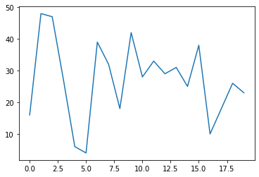


```python
y = y.cumsum()
```


```python
plt.plot(y)
```


    [<matplotlib.lines.Line2D at 0x1190fd460>]


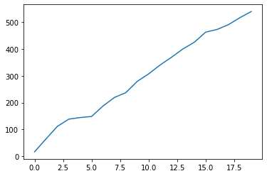


```python
plt.plot(x, y)
```


    [<matplotlib.lines.Line2D at 0x1193759a0>]


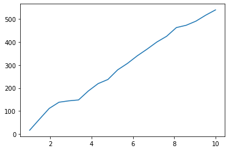


```python
plt.plot(x, y, color = 'r', marker = 'o')
```


    [<matplotlib.lines.Line2D at 0x11a561730>]


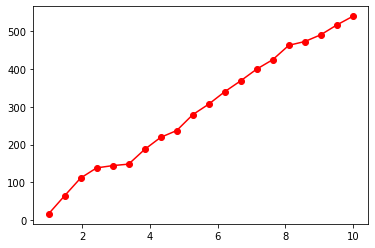


```python
plt.plot(x, y, color = 'r', marker = 'o', linestyle = '--')
```


    [<matplotlib.lines.Line2D at 0x118d3f820>]


## Label


```python
plt.plot(x, y, color = 'r', marker = 'o', linestyle = '--')
plt.xlabel('x axis')
plt.ylabel('y axis')
plt.title('This is a demo plot')
plt.show()
```


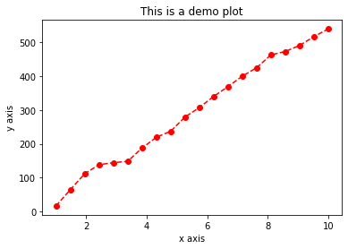


## Scatter, Bar, Hist and Box Plots

### Scatter


```python
x, y
```


    (array([ 1.        ,  1.47368421,  1.94736842,  2.42105263,  2.89473684,
             3.36842105,  3.84210526,  4.31578947,  4.78947368,  5.26315789,
             5.73684211,  6.21052632,  6.68421053,  7.15789474,  7.63157895,
             8.10526316,  8.57894737,  9.05263158,  9.52631579, 10.        ]),
     array([ 16,  64, 111, 138, 144, 148, 187, 219, 237, 279, 307, 340, 369,
            400, 425, 463, 473, 491, 517, 540]))


```python
plt.scatter(x, y, linewidth = 1)
plt.show()
```


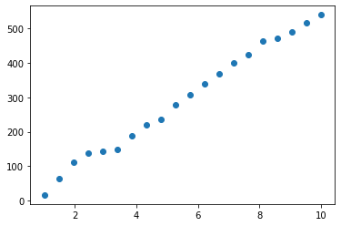


### Bar 


```python
b = [10, 23, 43, 5, 66]
a = ['a', 'b', 'c', 'd', 'e']
plt.bar(a, b, width = 0.8)
```


    <BarContainer object of 5 artists>


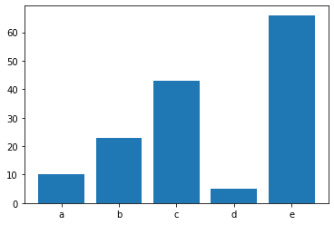


### Hist


```python
plt.hist(y, rwidth = 0.8, bins = 30)
```


    (array([1., 0., 1., 0., 0., 1., 1., 2., 0., 1., 0., 1., 1., 0., 0., 1., 1.,
            0., 1., 0., 1., 1., 0., 1., 0., 1., 1., 1., 1., 1.]),
     array([ 16.        ,  33.46666667,  50.93333333,  68.4       ,
             85.86666667, 103.33333333, 120.8       , 138.26666667,
            155.73333333, 173.2       , 190.66666667, 208.13333333,
            225.6       , 243.06666667, 260.53333333, 278.        ,
            295.46666667, 312.93333333, 330.4       , 347.86666667,
            365.33333333, 382.8       , 400.26666667, 417.73333333,
            435.2       , 452.66666667, 470.13333333, 487.6       ,
            505.06666667, 522.53333333, 540.        ]),
     <a list of 30 Patch objects>)


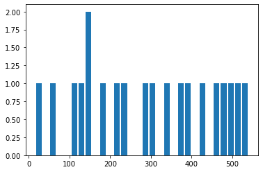


### Box


```python
data = [np.random.normal(0, std, 100) for std in range(1, 3)]
```


```python
data[1]
```


    array([-3.58540722,  0.51370031, -0.29359   ,  0.60104532, -1.34300935,
           -0.81727276, -3.12673847,  0.88123195,  2.02300474,  0.0811324 ,
            0.9408526 , -0.53770817, -1.20903819,  2.45784135,  0.80222897,
           -0.06406815,  2.11834022,  1.68757347, -2.19563613,  0.9089787 ,
            0.33326958, -0.44353735, -1.99130385, -1.25436161, -2.04556787,
           -2.45991205,  2.98190663,  0.18350123,  1.29006602, -2.94316604,
           -2.44829612, -1.80521975, -1.83105096, -2.14731256, -3.34501434,
           -0.03485502, -0.18655719,  2.34498966, -1.47393637, -2.69162257,
           -1.44592089,  4.15157766, -0.20959642, -0.07822125,  0.28935805,
           -4.28629603, -2.00733193,  0.45734912, -0.98529767,  3.22634199,
           -0.17605326, -2.36888175,  3.04824225,  2.47800449, -1.91217911,
           -3.05395982, -0.10850076, -2.06424191, -0.05422179,  0.60493718,
            0.87595449, -0.37024667, -2.21234556,  0.4572922 , -0.03315854,
            1.63777597,  0.75072559,  1.85708228, -3.57491329,  2.35891915,
           -1.29855996,  1.04275369,  4.43579048, -1.81217887, -3.05181674,
           -1.7505746 ,  6.12921593, -3.77314533, -1.35893305,  0.63819694,
            0.65308343, -1.31119982, -1.654168  , -0.69554981,  1.3270875 ,
           -3.25093888,  0.56112834,  0.79190141,  1.25205283,  4.45487133,
            0.11582045,  1.17307557, -0.75322739, -2.4110405 ,  1.65052549,
           -3.73646982,  1.50266719,  0.22804947, -0.0349879 , -3.44671291])


```python
plt.boxplot(data, vert = True, patch_artist = True)
plt.show()
```


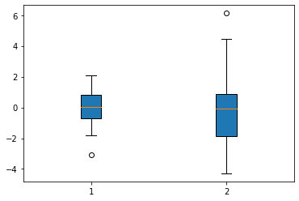


## Subplot


```python
x
```


    array([ 1.        ,  1.47368421,  1.94736842,  2.42105263,  2.89473684,
            3.36842105,  3.84210526,  4.31578947,  4.78947368,  5.26315789,
            5.73684211,  6.21052632,  6.68421053,  7.15789474,  7.63157895,
            8.10526316,  8.57894737,  9.05263158,  9.52631579, 10.        ])


```python
y
```


    array([ 16,  64, 111, 138, 144, 148, 187, 219, 237, 279, 307, 340, 369,
           400, 425, 463, 473, 491, 517, 540])


```python
y2 = y*x
```


```python
plt.plot(x, y)
plt.plot(x, y2)
```


    [<matplotlib.lines.Line2D at 0x11941b730>]


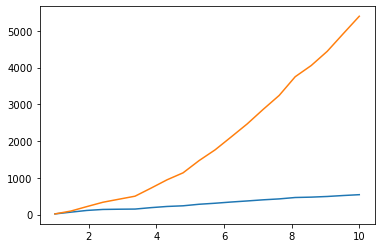


```python
plt.subplot(1, 2, 1)
plt.plot(x, y)

plt.subplot(1, 2, 2)
plt.plot(x, y2)
```


    [<matplotlib.lines.Line2D at 0x11a85f3a0>]


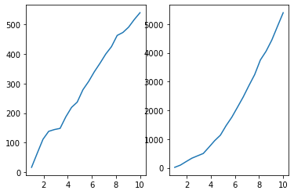


```python
plt.subplot(1, 2, 1)
plt.plot(x, y, marker = 'o', color = 'r')

plt.subplot(1, 2, 2)
plt.plot(x, y2, marker = '*', color = 'k', markersize = 8)
```


    [<matplotlib.lines.Line2D at 0x11a951640>]


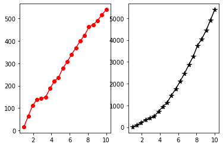


```python
fig = plt.figure()
ax1 = fig.add_axes([0, 0 , 1, 1])
ax2 = fig.add_axes([0.1, 0.6, 0.4, 0.3])

ax1.plot(x, y, 'r')
ax1.set_xlabel('X')
ax1.set_ylabel('Y')
ax1.set_title('Y Plot')

ax2.plot(x, y2, 'g')
ax2.set_xlabel('X')
ax2.set_ylabel('Y')
ax2.set_title('Y2 Plot')
```


    Text(0.5, 1.0, 'Y2 Plot')


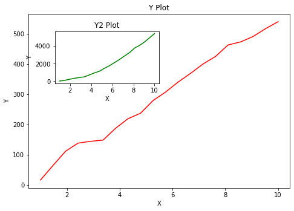


## xlim, ylim, xticks and yticks


```python
fig, ax = plt.subplots(1, 2, figsize = (12, 4))

ax[0].plot(x, y , x, y2)

ax[1].plot(x, y**2, 'k')

ax[1].set_ylim([500, 5000])
ax[1].set_xlim([-5, 5])
```


    (-5.0, 5.0)


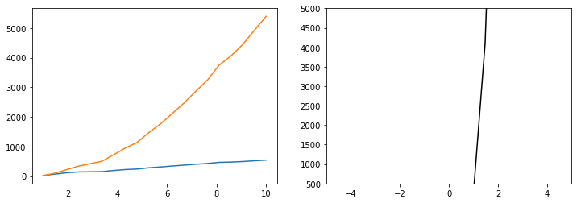


```python
fig, ax = plt.subplots(1, 2, figsize = (12, 4))

ax[0].plot(x, y , x, y2)
ax[0].set_xticks([1, 4, 9])

ax[1].plot(x, y**2, 'k')
ax[1].set_xticks([1, 4, 9])
ax[1].set_xticklabels([r'$\alpha$', r'$\beta$', r'$\delta$'])
plt.show()
```


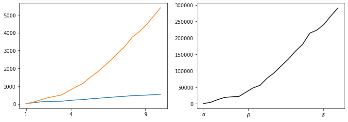


## Pie Plot

#### Colormap Matplotlib : https://matplotlib.org/3.1.1/tutorials/colors/colormaps.html


```python
%matplotlib inline
```


```python
labels = ['Frogs', 'Cats', 'Dogs', 'Lions']
sizes = [15, 30, 45, 80]
```


```python
fig, ax = plt.subplots(figsize= (6, 6), dpi = 100)
explode = (0.1, 0, 0, 0)
ax.pie(sizes, labels = labels, autopct = '%1.1f%%', shadow = True, startangle = 90, explode = explode)

plt.show()
```


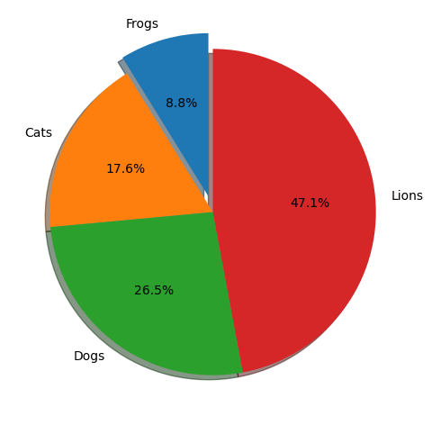


## Pie Plot Text Color


```python
fig, ax = plt.subplots(figsize= (6, 6), dpi = 100)
explode = (0.1, 0, 0, 0)

patches, texts, autotexts = ax.pie(sizes, labels = labels, autopct = '%1.1f%%', shadow = True, startangle = 90, explode = explode)
plt.setp(autotexts, size = 12, color = 'white')
autotexts[0].set_color('yellow')
plt.show()
```


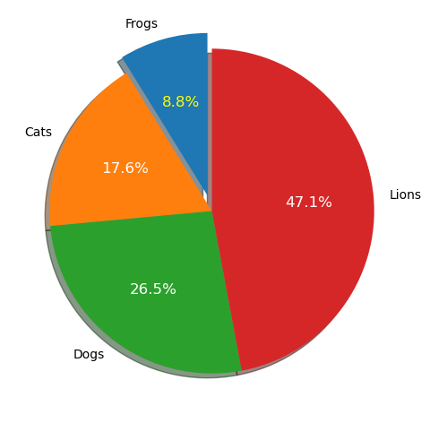


## Nested Pie Plot


```python
fig, ax = plt.subplots(dpi = 100)
size = 0.3

vals = np.array([[60, 32], [35, 20], [26, 36]])
vals_sum = vals.sum(axis = 1)
vals_flat = vals.flatten()

cmap = plt.get_cmap('tab20c')
outer_colors = cmap(np.arange(3)*4)
inner_colors = cmap(np.arange(6)*3)

ax.pie(vals_sum, radius = 1, colors = outer_colors, 
       wedgeprops = dict(width = size, edgecolor = 'w'))

ax.pie(vals_flat, radius = 1-size, colors = inner_colors, 
       wedgeprops = dict(width = size, edgecolor = 'w'))

plt.show()
```


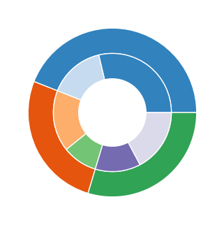


## Bar Chart on Polar Axis


```python
np.random.seed(0)
N = 20
theta = np.linspace(0.0, 2*np.pi, N, endpoint = False)
radii = 10*np.random.rand(N)
width = np.pi/4*np.random.rand(N)
colors = plt.cm.plasma(radii/10)

plt.figure(dpi = 100)
ax = plt.subplot((111), projection = 'polar')
ax.bar(theta, radii, width = width, bottom = 0, color = colors, alpha = 0.7)
plt.show()
```


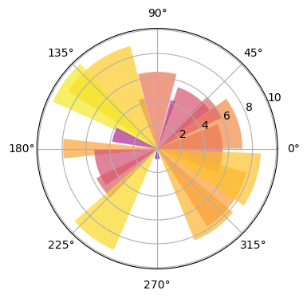


```python
np.linspace(0, 2, 4, endpoint = False)
```


    array([0. , 0.5, 1. , 1.5])


## Line Plot on Polar Axis


```python
r = np.arange(0, 2, 0.01)
theta = 2*np.pi*r

plt.figure(dpi = 100)
ax = plt.subplot(111, projection = 'polar')
ax.plot(theta, r)
ax.set_rmax(2)
ax.set_rticks([0, 0.5, 1, 1.5])
ax.set_rlabel_position(-30)
ax.grid(True)
plt.show()
```


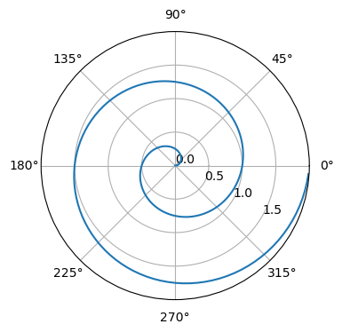


## Scatter Plot on Polar Axis 


```python
np.random.seed(0)

N = 150
r = 2*np.random.rand(N)
theta = 2*np.pi*np.random.rand(N)
area = 50*2*np.pi*r**2
colors = theta

fig = plt.figure(dpi = 100)
ax = fig.add_subplot(111, projection = 'polar')
c = ax.scatter(theta, r, c = colors, s = area, cmap = 'hsv', alpha = 0.8)
plt.show()
```


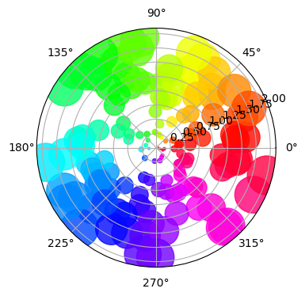


## Integral in Calculus Plot as Area Under the Curve


```python
from matplotlib.patches import Polygon
```


```python
def func(x):
    return (x-3) * (x-5) * (x-7) + 85

a, b = 2, 9
x = np.linspace(0, 10)
y = func(x)

fig, ax = plt.subplots(dpi = 100)
ax.plot(x, y, 'r', linewidth = 2)
ax.set_ylim(bottom = 0)

ix = np.linspace(a, b)
iy = func(ix)
verts = [(a, 0),*zip(ix, iy), (b, 0)]
poly = Polygon(verts, facecolor = '0.9', edgecolor = '0.5')
ax.add_patch(poly)

ax.text(0.5*(a + b), 30, r"$\int_a^b f(x)dx$", horizontalalignment = 'center', fontsize = 20)

fig.text(0.9, 0.05, 'x')
fig.text(0.1, 0.9, 'y')

ax.spines['right'].set_visible(False)
ax.spines['top'].set_visible(False)
ax.xaxis.set_ticks_position('bottom')

ax.set_xticks((a, b))
ax.set_xticklabels(('a', 'b'))
ax.set_yticks([])
plt.show()
```


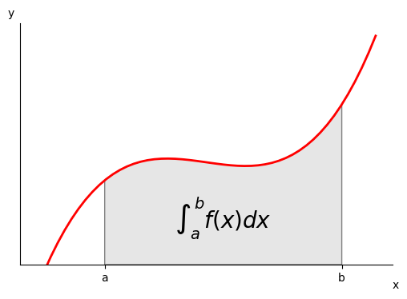


## Animation Plot


```python
import matplotlib.pyplot as plt
%matplotlib inline
```


```python
from matplotlib.animation import FuncAnimation
```


```python
from psutil import cpu_percent
```


```python
cpu_percent()
```


    13.7


```python
uses = []
```


```python
cpu_use = cpu_percent()
uses.append(cpu_use)
print(cpu_use)
```

    22.5


```python
print(uses)
```

    [22.5]


```python
plt.plot(uses)
```


    [<matplotlib.lines.Line2D at 0x11a78aa00>]


```python
%matplotlib notebook

frame_len = 200

y = []

fig = plt.figure(figsize=(8,4))

def animate(i):
    y.append(cpu_percent())
    
    if len(y) <= frame_len:
        plt.cla()
        plt.plot(y, 'r', label = 'Real-time CPU uses')
        
    else:
        plt.cla()
        plt.plot(y[-frame_len:], 'r', label = 'Real-time CPU uses') 
        
    plt.ylim(0, 100)
    plt.xlabel('Time (s)')
    plt.ylabel('CPU Uses (%)')
    plt.legend(loc = 'upper right')
    plt.tight_layout()

ani= FuncAnimation (plt.gcf(), animate, interval = 800)        
```


    <IPython.core.display.Javascript object>


<img src="data:image/png;base64,iVBORw0KGgoAAAANSUhEUgAABIAAAAJACAYAAAD1kB3UAAAAAXNSR0IArs4c6QAAQABJREFUeAHs3QecZWV5OOAPWIqUpQiKGBQsFDEqJSqguGBDEsGWSIzG9kdDNJooRo3GHmvsGowVbJEoAmpAVIog2AARlSJIR0FxEZa2lJ3/+947Z++Zu1PuzL135szM8/1+75x+7neeMww773ylFIUAAQIECBAgQIAAAQIECBAgQIAAAQIECBAgQIAAAQIECBAgQIAAAQIECBAgQIAAAQIECBAgQIAAAQIECBAgQIAAAQIECBAgQIAAAQIECBAgQIAAAQIECBAgQIAAAQIECBAgQIAAAQIECBAgQIAAAQIECBAgQIAAAQIECBAgQIAAAQIECBAgQIAAAQIECBAgQIAAAQIECBAgQIAAAQIECBAgQIAAAQIECBAgQIAAAQIECBAgQIAAAQIECBAgQIAAAQIECBAgQIAAAQIECBAgQIAAAQIECBAgQIAAAQIECBAgQIAAAQIECBAgQIAAAQIECBAgQIAAAQIECBAgQIAAAQIECBAgQIAAAQIECBAgQIAAAQIECBAgQIAAAQIECBAgQIAAAQIECBAgQIAAAQIECBAgQIAAAQIECBAgQIAAAQIECBAgQIAAAQIECBAgQIAAAQIECBAgQIAAAQIECBAgQIAAAQIECBAgQIAAAQIECBAgQIAAAQIECBAgQIAAAQIECBAgQIAAAQIECBAgQIAAAQIECBAgQIAAAQIECBAgQIAAAQIECBAgQIAAAQIECBAgQIAAAQIECBAgQIAAAQIECBAgQIAAAQIECBAgQIAAgXkm8Kyo70cjTo+4KWIk4osRk5W94uDxEcsjbo04L+KfI9aJmKg8Pw78JOLmiBsjTo34qwiFAAECBAgQIECAAAECBAgQIEBgyALnxv0z6bMi4oLR9ckSQAfFOXdFZCLnMxHvi7gwIu/x1Yjxyn/Gzjx+VcQHIz4e8ceI3PfyCIUAAQIECBAgQIAAAQIECBAgQGCIAvvGvR8csVbEsohMykyUAFoax34fsTJij4iqbBArZ0bktQdXO0eX2Voo918SsfnovlxsF5FJoNtH12OhECBAgAABAgQIECBAgAABAgQIDFtgWXzAZAmgF40eP3Kciuw3euz7Xcc+P7r/hV37c/Nto8feOs4xuwgQIECAAAECBAgQIECAAAECBIYgsCzuOVkCKFsG5fG/jeguS2LHLRF3RqxfO3h1rOc196ntq1b3HD2W4w8pBAgQIECAAAECBAgQIECAAIHGCGSiY7GWHUcf/NfjAOS4QJdF7BLxgIgcT2ijiPtG5HhBv4voLheP7tih+8AE22dPsP+hsT8/4/IJjttNgAABAgQIECBAgAABAgQILEyB7eKxclKr7Qf9eIs5AbTpKGbO4jVeqfZvNnpwuuePd89e9q1zj3vcY4udd955i15Odg4BAgQIECBAgAABAgQIECCwMAQuuOCCcttttw3lYRZzAmgq0LVGT8guX9MpvZ6/+wQ3PTuSP7udffZEDYQmuMpuAgQIECBAgAABAgQIECBAYF4L7L777uWcc865fBgPsfYwbjpP7lm18Kla9nRXO2cJy1KdVy0nOr/aX53XvtpXAgQIECBAgAABAgQIECBAgMAcCyzmBNBFo/bjjdmTLaOyv12OBXTp6Hk5KPQ1ERtHjDcIdE4/n2W8MYXaR3wlQIAAAQIECBAgQIAAAQIECMyBwGJOAJ086r3/OO77xL4NI86MWFk7Ptk1Txk9rzqndplVAgQIECBAgAABAgQIECBAgMDcCSzmBNDXgv36iIMj9qi9gg1i/R2j24fX9ufqJ0a33xDLzUfXc7FdxMsiMln0uQiFAAECBAgQIECAAAECBAgQINAYgYU2CPTTQjYjy9btRdkzlkeMrmfC57DR9ZxW7ZCITASdGvGViOURB0bkFPG5/6iIeskWQR+IeFXEeRF5znoRz47IWbv+KeLyCIUAAQIECBAgQIAAAQIECBAg0BiBhZYAekTIPr9L9wGxnZHliogqAZTbx0Y8LiJb9DwzIlv/XBKRCZ6PRIw3o9erY38mf14e8ZKIVRHnRLwv4lsRCgECBAgQIECAAAECBAgQIECgUQILLQH0ltDNmE45I04+YDoXxLlHjsY0L3M6AQIECBAgQIAAAQIECBAgQGD2BRZaAmj2BX0iAQIECBAgQIAAAQKLWmDVqlVl+fLlZcWKFWXlypVlZGS8jgSLmsjDE1iUAmuttVZZf/31yyabbFK22GKLsvbaczsMswTQovw29NAECBAgQIAAAQIECAxCIJM/V111Vbn11lsHcTv3IEBgAQlkMvj2229vxS233FK23XbbOU0CSQAtoG8uj0KAAAECBAgQIECAwOwKZMufTP4sWbKkbL311mWjjTaa01/wZvfpfRoBApMJZII4Ez/XXntt6+dE/rzYcsstJ7tkqMfmtv3RUB/NzQkQIECAAAECBAgQIDBcgez2lSWTP9nNY667eAz3ad2dAIHpCOTPg/y5kD8fslQ/L6Zzj0GeKwE0SE33IkCAAAECBAgQIEBgUQnkmD9ZsuWPQoAAgfEEqp8P1c+L8c6ZjX0SQLOh7DMIECBAgAABAgQIEFiQAtWAz1r+LMjX66EIDEQgB4POUv28GMhNZ3ATCaAZoLmEAAECBAgQIECAAAECBAgQINCLQJUA6uXcYZ4jATRMXfcmQIAAAQIECBAgQIAAAQIECDRAQAKoAS9BFQgQIECAAAECBAgQIECAAAECwxSQABqmrnsTIECAAAECBAgQIECAwJwJHHHEESW73+RyUGXZsmWtew7qfu5DYLYEJIBmS9rnECBAgAABAgQIECBAYAELZKKlHuuss07ZYostSiZMMgEz1wPg9kr/ghe8oPUcl19+ea+XzIvz/vjHP5a3v/3tZa+99ipbbrllWXfddcs973nP8tjHPra8853vLNddd92Y56gSXfV3mlOa77777q3zb7vttjHnV+eN2dm1sd122y1I267HbOzmksbWTMUIECBAgAABAgQIECBAYN4JvPnNb27V+c477yyXXHJJOeaYY8r3v//9ctZZZ5WPfexj8+55uiv8+c9/vtx6663duxu9/a1vfas897nPLTfeeGN50IMeVJ7+9KeXe93rXq3tH//4x+WNb3xjK6mT72vrrbce8yzPf/7zSyZuMoF39dVXl69//evlDW94QznuuOPKD37wg1YiacwFNhorIAHU2FejYgQIECBAgAABAgQIEJh/Am95y1vGVPqMM84o++yzT/mv//qv8upXv7psv/32Y47Pt4373e9+86rKmXx7xjOeUbJF1uc+97mSCZ1srVMvv/jFL8orX/nKcvvtt9d3t9azRVS2BqrKO97xjrLrrruWn/zkJ+XLX/5y637VMctmC+gC1uz3o3YECBAgQIAAAQIECBCY1wJ777132WmnnVotSM4+++w1niVboDzrWc9qtTxZb731yrbbblte+tKXlt/+9rdrnJvXZ6Li4Q9/eKt72QYbbFAe/OAHtxJLN9xwwxrnT3dHJkaOPPLI1mWZqKq6NWULmKpUXaOq7VyeeuqprXMz+ZUtnfbff/+y6aabls0337w885nPLFdddVXr9EsvvbQcfPDBZauttir3uMc9yr777lt+/vOf12+1ej1bGb3rXe8qj3jEI8pGG21UNt5447LnnnuW//mf/1l9zlQrq1atKv/wD/9QsjXWhz/84VJ1b+u+7s///M/L9773vXLf+963+9Aa2/e5z31aCaU8kEmgYZb0ryef6p9VPUt3V71vfOMb5fGPf3zJeq6//vplm222KY973ONaCcj69bm+fPny8vrXv77svPPOrfeR7yyv/c53vtN9arnjjjvKRz7ykbLbbru13uuGG25Y8vvioIMOatmtcUEDd2gB1MCXokoECBAgQIAAAQIECBBYSALV+D857ky9ZIuUQw45pPWL+oEHHthK/lx88cXl05/+dPnmN79ZfvSjH5V6i5tPfepTrS5l+Qv9E57whHL33XeXc845p3zgAx8oJ5xwQslkUo5TM9OS3deOPfbYVlImE02bbbZZ61bVcqr7/vSnPy3vec97WgmHfK5sWZNdpnKZiYnHPOYxrWTY3//935crrriideyJT3xiycRQJniq8qc//anst99+5Wc/+1kr4fCiF72oZDLnxBNPLM95znPKr371q5ItcaYq2frnwgsvbCV2XvziF096+tprr10yeinV++xuSdTLtcM855Of/GQreZjd2J761Ke2xjr6/e9/X84777xW66d//Md/XP3x6Z/JpUwg5ThImbS75ZZbSnaXy/X//u//bn1vVhdkwimTbw996ENLvr9M4GWSMrvBffvb3259P1bnWhLoVeDsyCjGf08KAQIECBAgQIAAAQJNFzj//PNHMpQYIKaUVnRbRBJiJBILI9G6ZyR+YV59+KKLLhqJhNDIAx/4wJEYW2b1/lw56aSTWtc87WlPG7M/flkfueuuu8bsy41IGLU++93vfveYY5Fgau3PZa8luki1rrnsssvGvSSST2s85ymnnNLalwZf/OIXx1wXyZvWsWgNNBJJmzHH3va2t7WOfehDHxqzv6pDJJPG7I+Bl0ee/OQnj0TiZSSSQ2OOjbdR3f/v/u7vxjs86b7qOfPZ6iXfYYwf1Kp3jIe0+tBE73/1CbFy//vfv3XdRLb1c3M975n1GK9URvV75e/S+X0WA1qvcckf/vCHMfvyvukYSZ0x+6Ml2Ui0MBuJ1mUj1157betYJORa58YA2ON+/11//fVj7jHeRq8/K/IZ4rnXbCoXO/stvaX3+v0U1xMgQIAAAQIECBAgQGAxCkQXlugbND9iQO8nu0Fl5EDBz372s1stI+IX4vKf//mfrW451cccfvjhq7smdXc9ytYv2SIoWwGtWLGiuqREAqE1ls3qHaMr2UJm6dKlrRYy3cdmcztb+ESyZcxH5pg7WbJ70ete97oxx7IlSZZzzz139f6crSuSSGWPPfYo//qv/7p6f65kl7dsYZSeOf7OVOV3v/td65Q/+7M/m+rUCY/nDG75PrN1VLYieshDHlKyVc0jH/nIVne2CS+cowNLliwZd2DqnPmsKtntLltHZfe87JJXL9na661vfWtrPKSjjz66dShbOqV5dikbr5VUzqY2H8qS+VBJdSRAgAABAgQIECBAgACB+SGQvzzXS/7y/JnPfKa88IUvrO8uP/zhD1vb+Yt4dp3qLplkyC5ev/71r1tTj+fxHMsmu+Z85StfKdGiojWLVXaNqso111xTrU64zIRGdvupl+wKlNFvyaRNd8kxaLLkWD45EHO9VImvnF2rKmmRz51umXjpLmmQ5YILLug+tMZ2Ji2y5L1mWqoxkfL6HIsox1zKxMmrXvWqcRMtM/2cQVyXybccaHyXXXZpJR+jlU/JMahyzKV6qb73cla08YyjtVDr9Mo4k4vZpSwTkvke8/mz29ijHvWokmMBzZciATRf3pR6EiBAgAABAgQIECBAYB4IVEmHHE8lf9HOViM5EHG23smWPVXJli5Z3ve+91W7xl3efPPNq/dni6KcVv4BD3hAa/DdHOslW2VkiW5UZeXKlavPnWglE0CZdOoug0gAZSuf7pItUrJMdqxK6uR5lUsmgsZLjOU5Weou7T1rfq2ST/UE05pnTb4nuoD1lByrWslkQm68VjL5KVWybqLjk9dk6qOZlMqWPjnjXA7YnN8TWa9MBOX3WZWgq4y/+93vloyJSt34qKOOarW+ypZX2RoqS7bIygHMs3Xbve9974lu05j9EkCNeRUqQoAAAQIECBAgQIDAghMYbYGx4J6rhwfK1iI5UHO2msiZk7IrVIz7s7rFRJUQyVYY2cJiqpKza2XyJ+95/PHHj2l9komF9773vVPdonU8Z+xqcqlc/uVf/qU1uHU/dc0uaVnymbNVUXcLpH7u3X1t1jsHr87kSneLmzw3E4M561aWXgfVzuRNjPnUuqb7S37WeCW71WXk8TPPPLP1PfPZz362xNhJrVZTMX7R6mRczoz2ile8YrzbrLEvB33O1kIZOavbaaedVjKZmN31skXZ6aefvsY1TdthDKCmvRH1IUCAAAECBAgQIECAwAISeNjDHtaaTSlboXzwgx9c/WSPfvSjW+u9/uJ8ySWXtM7PsYG6ZxPL6chjgOTV9+5npUqSZMJkLkqOrZMtZHp1mayO2fJlp512KmmfM65NVjKJVm+JNNm54x2LgZNbu6vuVd3n5Exc2Spsu+226ynhl9fHwNmtZEv3vfLd1MdN6j6e25lkOuCAA0rOHJczeGXyqTKd7vde9/233Xbb1lhPOStbdonLmcCqVkXd5zZpWwKoSW9DXQgQIECAAAECBAgQILAABd74xje2ustkV5mYZan1hC9/+ctbiZxs6ZLj/HSXO+64Y/Uv7HksEwdZulvw5FhBL3vZy1rHBvGlGtD3yiuvHMTtpn2PbKGSY9lki6e3v/3t47aA+c1vflNi9qsp752JpE984hMlu6FlS5dsrVJ10atfnOMpPelJTyq9jKFUv66+nkmWLG9605tarW9aG6NfsmteNaB1dV79+ETrmQzL9/Cd73xnzCkxm1rJady7S07HPl6LofweyVKN15NdwXIMn69//eslWweNV37xi1+0BrvOYzkm0I9//OM1TsuEVg5Snr4x+9gax5u2Qxewpr0R9SFAgAABAgQIECBAgMACE8jBjl/60peW7HKTXbXe9a53tVqm5C/fOYNXDtq7//77lx122KHVCiV/6c/WGtmV6MILL2xp/MVf/EVrQN/8pX2vvfYq2b0ppvsuJ5xwQtlxxx1LNd5Nv3SPf/zjW+PFHHLIIa3xXTbeeONWa5JMWM1W+djHPlYuvvjiVjLlC1/4QutZc4yZmIK91Y0pxwaK6cvL9ttvP2WVshVQmj3vec9rRSaVli1b1rLN7neZaMrkRnbZy25OMy3ZxS9bxOQA3fkes6VWjtGULWOyy16+06xL90xok33eYYcd1rrnQQcd1BrUeYsttmh168rkVz5DdzIwZ/TKcXnyeyMThpnsyu+j9Iop3FvdB6vPy7F8ckyqHKMqxwvKAZ2z1VC2lsrWSr/85S9bY1hlQi4TY9lqaOedd251Z8wWQDfddFP51re+VWKq+FZybZNNNqlubUmgZ4Gzo39sfJ8qBAgQIECAAAECBAg0XSBaToxkKK3BjnLKqQkp4hflkWiB0Ypcr0r8sj0SyYOR+93vfiPRimIkuv2MREJo5CUvecnISSedVJ3WWkYyYeTQQw8diQGlR2Lw55EYDHrk9a9//Ui0xGjty/31Et2eWnXK5XTK+9///pHoOtWqTz5T/b6RxFjjOWOg5Na+GBx4jY+JZEXrWD7jeCXvn/fsLtFqZuSjH/3oyJ577jkSYyS16hKJh5FIWoxEV7qR66+/vvuSSbfz/Le97W2t+0UiZSRarbSs8/6RFBqJZNqY66vnzGfrtUQ3spFIWI1EEm0kWlK1PiOSKiMxE9dIJLVGolVXr7dafd5xxx03Esmb1vvOesdA4CMx5k7reybt0rcqhx9++MjTnva0kUiMjUQyq/V8MWvXyHve856RSNhUp61e5r7/+I//GMnfwSMBNhLJo5FIHI1E17GRmG1uJAaBbp0brdZGYna7kX333XckEo2tdxHJrdZ7i0TSSD73VKXXnxVZl3iusyMGXtYa+B3dsF+BTADtdvbZQ3nf/dbN9QQIECBAgAABAgQI1ASqaaKzZYBCgACBiQR6/VmRLZXOiRL32X2ie810vzGAZirnOgIECBAgQIAAAQIECBAgQIDAPBGQAJonL0o1CRAgQIAAAQIECBAgQIAAAQIzFZAAmqmc6wgQIECAAAECBAgQIECAAAEC80RAAmievCjVJECAAAECBAgQIECAAAECBAjMVEACaKZyriNAgAABAgQIECBAgAABAgQIzBMBCaB58qJUkwABAgQIECBAgAABAgQIECAwUwEJoJnKuY4AAQIECBAgQIAAAQIECBAgMIXAyMjIFGfMzmEJoNlx9ikECBAgQIAAAQIECCxAgbXWWqv1VKtWrVqAT+eRCBAYhECVAKp+XgzinjO5hwTQTNRcQ4AAAQIECBAgQIAAgRBYf/31Ww633HILDwIECIwrUP18qH5ejHvSLOyUAJoFZB9BgAABAgQIECBAgMDCFNhkk01aD3bttdeWFStWlGwJVP21f2E+saciQKAXgfw5kD8P8udC/nzIUv286OX6YZyzZBg3dU8CBAgQIECAAAECBAgsBoEtttii5F/3b7311nL11Vcvhkf2jAQIzEBgww03LPnzYi6LBNBc6vtsAgQIECBAgAABAgTmtcDaa69dtt1227J8+fLWX/pXrlypBdC8fqMqT2BwAjnmT3b7ypY/mfzJnxdzWSSA5lLfZxMgQIAAAQIECBAgMO8F8pe6LbfcshXz/mE8AAECC1ZgbtNPC5bVgxEgQIAAAQIECBAgQIAAAQIEmiMgAdScd6EmBAgQIECAAAECBAgQIECAAIGhCEgADYXVTQkQIECAAAECBAgQIECAAAECzRGQAGrOu1ATAgQIECBAgAABAgQIECBAgMBQBCSAhsLqpgQIECBAgAABAgQIECBAgACB5ghIADXnXagJAQIECBAgQIAAAQIECBAgQGAoAhJAQ2F1UwIECBAgQIAAAQIECBAgQIBAcwQkgJrzLtSEAAECBAgQIECAAAECBAgQIDAUAQmgobC6KQECBAgQIECAAAECBAgQIECgOQISQM15F2pCgAABAgQIECBAgAABAgQIEBiKgATQUFjdlAABAgQIECBAgAABAgQIECDQHAEJoOa8CzUhQIAAAQIECBAgQIAAAQIECAxFQAJoKKxuSoAAAQIECBAgQIAAAQIECBBojoAEUHPehZoQIECAAAECBAgQIECAAAECBIYiIAE0FFY3JUCAAAECBAgQIECAAAECBAg0R0ACqDnvQk0IECBAgAABAgQIECBAgAABAkMRkAAaCqubEiBAgAABAgQIECBAgAABAgSaIyAB1Jx3oSYECBAgQIAAAQIECBAgQIAAgaEISAANhdVNCRAgQIAAAQIECBAgQIAAAQLNEZAAas67UBMCBAgQIECAAAECBAgQIECAwFAEJICGwuqmBAgQIECAAAECBAgQIECAAIHmCEgANeddqAkBAgQIECBAgAABAgQIECBAYCgCEkBDYXVTAgQIECBAgAABAgQIECBAgEBzBCSAmvMu1IQAAQIECBAgQIAAAQIECBAgMBQBCaChsLopAQIECBAgQIAAAQIECBAgQKA5AhJAzXkXakKAAAECBAgQIECAAAECBAgQGIqABNBQWN2UAAECBAgQIECAAAECBAgQINAcAQmg5rwLNSFAgAABAgQIECBAgAABAgQIDEVAAmgorG5KgAABAgQIECBAgAABAgQIEGiOgARQc96FmhAgQIAAAQIECBAgQIAAAQIEhiIgATQUVjclQIAAAQIECBAgQIAAAQIECDRHQAKoOe9CTQgQIECAAAECBAgQIECAAAECQxGQABoKq5sSIECAAAECBAgQIECAAAECBJojIAHUnHehJgQIECBAgAABAgQIECBAgACBoQhIAA2F1U0JECBAgAABAgQIECBAgAABAs0RkABqzrtQEwIECBAgQIAAAQIECBAgQIDAUAQkgIbC6qYECBAgQIAAAQIECBAgQIAAgeYISAA1512oCQECBAgQIECAAAECBAgQIEBgKAISQENhdVMCBAgQIECAAAECBAgQIECAQHMEJICa8y7UhAABAgQIECBAgAABAgQIECAwFAEJoDbrX8biOxFXR9wWcWnEVyP2jBiv7BU7j49YHnFrxHkR/xyxToRCgAABAgQIECBAgAABAgQIEGiUgARQKe+JN/KtiN0ivh3x4YhzIg6KOCPiuRH1kvtPi9gn4piIj0esF/HBiK9EKAQIECBAgAABAgQIECBAgACBRgksaVRtZr8yW8dHHhZxXcTDIn4fUZV9Y+XkiLdFfHF059JYfiri7ohlEWdFZPn3iDz3WREHR0gEBYJCgAABAgQIECBAgAABAgQINENgsbcAun+8hjT4cUQ9+ZNv55SIFRFb5cZoyQRPbmeCp0r+5KHbI96YK1EObS98JUCAAAECBAgQIECAAAECBAg0Q2CxJ4AujtdwR8QjI7bseiXZxWuTiO/V9u83up5dxbrLabEjxwPK8YHW7z5omwABAgQIECBAgAABAgQIECAwVwKLvQtYDuL82ogPRJwfcWzEHyMeGHFgxHcjXhpRlR1HV35d7agt74r1yyJ2iXhAxAURk5WzJzi40wT77SZAgAABAgQIECBAgAABAgQIzEhgsSeAEu1DEZdHfDbikIiqXBIrR0TUu4ZtOnrwxtFl96Lav1n3AdsECBAgQIAAAQIECBAgQIAAgbkSWOxdwNL9XyO+FnFERLb82Shi94hLI74U8d6IXstaoyeO9HBBfsZ4cWEP1zqFAAECBAgQIECAAAECBAgQINCzwGJPAC0LqZwG/hsRr4rIpE+O43NOxNMjrol4dUR26cpStfCpWgK193a+Lh1drc7rHLFGgAABAgQIECBAgAABAgQIEJgjgcWeAPqrUfec8au7ZCLoJxFptOvowYtGlzuMLuuL7E63fUSOBZSJJIUAAQIECBAgQIAAAQIECBAg0AiBxZ4Aqmbrqk/1Xn8x1f6cKSzLye1F2X90WV/sExsbRpwZsbJ+wDoBAgQIECBAgAABAgQIECBAYC4FFnsC6PRR/JfE8r5dL+Ipsb13xO0RmdTJkmMFXR9xcMQeEVXZIFbeMbpxeLXTkgABAgQIECBAgAABAgQIECDQBIHFPgtYJnS+F/GEiJy2/ZiIayN2jsjuYTmo8+sicmr4LDdFHBKR150a8ZWI5RE5ZXxOEZ/7j4pQCBAgQIAAAQIECBAgQIAAAQKNEVjsCaBV8SYOiHhZRLbqyYGfsxtXJnWOj/hIxHci6uXY2HhcxBsinhmRrX9yyvgcRDrP72UGsDhNIUCAAAECBAgQIECAAAECBAjMjsBiTwCl8p0RHxqN3O6lnBEnZeJIIUCAAAECBAgQIECAAAECBAg0XmCxjwHU+BekggQIECBAgAABAgQIECBAgACBfgUkgPoVdD0BAgQIECBAgAABAgQIECBAoOECEkANf0GqR4AAAQIECBAgQIAAAQIECBDoV0ACqF9B1xMgQIAAAQIECBAgQIAAAQIEGi4gAdTwF6R6BAgQIECAAAECBAgQIECAAIF+BSSA+hV0PQECBAgQIECAAAECBAgQIECg4QISQA1/QapHgAABAgQIECBAgAABAgQIEOhXQAKoX0HXEyBAgAABAgQIECBAgAABAgQaLiAB1PAXpHoECBAgQIAAAQIECBAgQIAAgX4FJID6FXQ9AQIECBAgQIAAAQIECBAgQKDhAhJADX9BqkeAAAECBAgQIECAAAECBAgQ6FdAAqhfQdcTIECAAAECBAgQIECAAAECBBouIAHU8BekegQIECBAgAABAgQIECBAgACBfgUkgPoVdD0BAgQIECBAgAABAgQIECBAoOECEkANf0GqR4AAAQIECBAgQIAAAQIECBDoV0ACqF9B1xMgQIAAAQIECBAgQIAAAQIEGi4gAdTwF6R6BAgQIECAAAECBAgQIECAAIF+BSSA+hV0PQECBAgQIECAAAECBAgQIECg4QISQA1/QapHgAABAgQIECBAgAABAgQIEOhXQAKoX0HXEyBAgAABAgQIECBAgAABAgQaLiAB1PAXpHoECBAgQIAAAQIECBAgQIAAgX4FJID6FXQ9AQIECBAgQIAAAQIECBAgQKDhAhJADX9BqkeAAAECBAgQIECAAAECBAgQ6FdAAqhfQdcTIECAAAECBAgQIECAAAECBBouIAHU8BekegQIECBAgAABAgQIECBAgACBfgUkgPoVdD0BAgQIECBAgAABAgQIECBAoOECEkANf0GqR4AAAQIECBAgQIAAAQIECBDoV0ACqF9B1xMgQIAAAQIECBAgQIAAAQIEGi4gAdTwF6R6BAgQIECAAAECBAgQIECAAIF+BSSA+hV0PQECBAgQIECAAAECBAgQIECg4QISQA1/QapHgAABAgQIECBAgAABAgQIEOhXQAKoX0HXEyBAgAABAgQIECBAgAABAgQaLiAB1PAXpHoECBAgQIAAAQIECBAgQIAAgX4FJID6FXQ9AQIECBAgQIAAAQIECBAgQKDhAhJADX9BqkeAAAECBAgQIECAAAECBAgQ6FdAAqhfQdcTIECAAAECBAgQIECAAAECBBouIAHU8BekegQIECBAgAABAgQIECBAgACBfgUkgPoVdD0BAgQIECBAgAABAgQIECBAoOECEkANf0GqR4AAAQIECBAgQIAAAQIECBDoV0ACqF9B1xMgQIAAAQIECBAgQIAAAQIEGi4gAdTwF6R6BAgQIECAAAECBAgQIECAAIF+BSSA+hV0PQECBAgQIECAAAECBAgQIECg4QISQA1/QapHgAABAgQIECBAgAABAgQIEOhXQAKoX0HXEyBAgAABAgQIECBAgAABAgQaLiAB1PAXpHoECBAgQIAAAQIECBAgQIAAgX4FJID6FXQ9AQIECBAgQIAAAQIECBAgQKDhAhJADX9BqkeAAAECBAgQIECAAAECBAgQ6FdAAqhfQdcTIECAAAECBAgQIECAAAECBBouIAHU8BekegQIECBAgAABAgQIECBAgACBfgUkgPoVdD0BAgQIECBAgAABAgQIECBAoOECEkANf0GqR4AAAQIECBAgQIAAAQIECBDoV0ACqF9B1xMgQIAAAQIECBAgQIAAAQIEGi4gAdTwF6R6BAgQIECAAAECBAgQIECAAIF+BSSA+hV0PQECBAgQIECAAAECBAgQIECg4QISQA1/QapHgAABAgQIECBAgAABAgQIEOhXQAKoX0HXEyBAgAABAgQIECBAgAABAgQaLiAB1PAXpHoECBAgQIAAAQIECBAgQIAAgX4FJID6FXQ9AQIECBAgQIAAAQIECBAgQKDhAhJADX9BqkeAAAECBAgQIECAAAECBAgQ6FdAAqhfQdcTIECAAAECBAgQIECAAAECBBouIAHU8BekegQIECBAgAABAgQIECBAgACBfgUkgPoVdD0BAgQIECBAgAABAgQIECBAoOECEkANf0GqR4AAAQIECBAgQIAAAQIECBDoV0ACqF9B1xMgQIAAAQIECBAgQIAAAQIEGi4gAdTwF6R6BAgQIECAAAECBAgQIECAAIF+BeYiAbReVHqbiM37rbzrCRAgQIAAAQIECBAgQIAAAQIEphZYMvUpfZ+xSdzh4IgnRuwTsVVEVe6KlfMiTo74esSPIxQCBAgQIECAAAECBAgQIECAAIEBCgwzAXTfqOe/R/xdxEajdf5TLC+KWB5xj4h7RjwiYveIwyLOjfjPiP+JUAgQIECAAAECBAgQIECAAAECBAYgMKwuYG+NumWi58URp0e8IOLBEVtEPCTiMRGZ9NkuYtOI/SLeG5Gtg74U8aOIh0UoBAgQIECAAAECBAgQIECAAAECfQoMKwH0mqjXJyPuF3FAxOcjfhMxXrk1dp4a8fqI+0ccFLFuxNMiFAIECBAgQIAAAQIECBAgQIAAgT4FhtUF7EFRr9/OoG4jcc03R2PrGVzvEgIECBAgQIAAAQIECBAgQIAAgS6BYbUAmknyp6tq5druHbYJECBAgAABAgQIECBAgAABAgSmLzCsBND0a+IKAgQIECBAgAABAgQIECBAgACBoQjMVQLoKfE0p0b8YTROieWTIxQCBAgQIECAAAECBAgQIECAAIEBC8xFAuiQeIb/i9gm4uSIMyMeHnF8xAsjFAIECBAgQIAAAQIECBAgQIAAgQEKzEUC6N+i/h+P2CHi2RE569f2EedH5DGFAAECBAgQIECAAAECBAgQIEBggALDTAC9J+q5/jh13Tb2fb1r/42x/Z2IPKYQIECAAAECBAgQIECAAAECBAgMUGCYCaAXRz3Pjdirq74Xx/ZLI+5R279drD8j4te1fVYJECBAgAABAgQIECBAgAABAgQGIDDMBNBDon6/ijgt4kMRG0ZkeWPEX0fkVPE/ivhZRCZ+svVPHpur8tj44KMjfhexcnSZrZIOiOgumdTKMYuWR9wacV7EP0esE6EQIECAAAECBAgQIECAAAECBBolMMwE0O/jSZ8VcfBo/CKW+0ZkkuUvIjKBsm7ESMRREbtHfCNiLkomnjJRtU/EtyPeH/HNiM0jlkXUS45ZVJ17TKzneEbrRXww4isRCgECBAgQIECAAAECBAgQIECgUQJLZqE2X4vPyNm+PhrxvYhPRbwm4u8imlCyNdLbI7Ju2Q1tRUS9ZJKqKktjJet/d8SyiLMisvx7RD5jlfCSCEoVhQABAgQIECBAgAABAgQIEGiEwNqzVIvsKpUJn2w985cRv4rYP2KuSz5/Dlad3bieE9Gd/Ild5c78MloywbNVRCZ4quRPHro9ouq+dmjuUAgQIECAAAECBAgQIECAAAECTRGYrQRQ9bzfipVdIr4bkV3AjojYLGKuSo7lk1PQZ11uiMjk1GsjXhmxZ0R32W90R3YT6y6nxY5MJOU9x5v9rPt82wQIECBAgAABAgQIECBAgACBWREYdhewp8RTvCzi/hFXRPxXRCZbcoawbEXzyYjzI/4x4tiI2S5/MfqB18XynIg/76pAJnWy1c8fRvfvOLr89eiyvrgrNi6LyATXAyIuiJisnD3BwZ0m2G83AQIECBAgQIAAAQIECBAgQGBGAmvP6KreLnp2nPZ/Edki5pbRZQ6s/LcRWbIV0EMjjonIgaEzIbRlxGyWe41+2D/E8h4RT4jYJCLrdWJEDgr91YiqbDq6cmO1o2tZ7Z/LVk1dVbJJgAABAgQIECBAgAABAgQILHaBYSaA/i1wfxWxXcSjR5fZKuZ1EVXJxFC2EMrZwXaLmKrVTJwy0FJN275W3DVb+pwUcXNE1vvpEVdHPC5ivO5gsXuNkvfJkjObTVV2jxPGiwunutBxAgQIECBAgAABAgQIECBAgMB0BIaZAMpuUCdE3DRaoVxm96/c311Oix0Pizii+8CQt3PcnyyXRvy8tdb5clusZiugLI9sL0rVwqdqCTS6e/UiZwnLUp3X3vKVAAECBAgQIECAAAECBAgQIDCHAsNMAOV4OHtH1D8ju4NdHjFeuT12vma8A0Pcd9Hovf80wWdUCaLsHpalOn+H9uaYrzme0vYRORZQJpQUAgQIECBAgAABAgQIECBAgEAjBOrJmUFX6D1xw+w6lYM8f3l0mQmg90Y0pWTLo0zYPDhivXEqlWMBZbm89bWUk0eX+48u64scL2jDiDMjVtYPWCdAgAABAgQIECBAgAABAgQIzKXAMBNAX4oHOygiW8M8POKKiBxX5wsRTSnXR0WOisguXW/qqtQTY/vJEdmd69ujx74Wy7zm4Ig9RvflYoOId4xuHz66tCBAgAABAgQIECBAgAABAgQINEIguy0Ns+SsXxlNLq+Kyj0q4g0R2YrnJxH3j8hk1d0Rh0RUXcRyHKPczkTQqRE5c9nyiAMjcor43J8JJYUAAQIECBAgQIAAAQIECBAg0BiBYbYAasxDTlGR38fxTAB9MGLbiFdE7BfxfxGPjahPAx+b5diInBksu489M+KfIu6MyERStgzqZQawOE0hQIAAAQIECBAgQIAAAQIECMyOwLBaAN03qn9Nn49wn7j+d33eo9fLsxVPJnAyeilnxEkH9HKicwgQIECAAAECBAgQIECAAAECcy0wrBZAl8SDZYuaTARNp6wVJx8U8bOI7GqlECBAgAABAgQIECBAgAABAgQI9CkwrATQ+6JeL4m4POKEiBdGPDhivLJx7MwuVzlr2FURX4/IKeFzqRAgQIAAAQIECBAgQIAAAQIECPQpMKwuYDmj1icjcvmciCdFZFkRcW3EDRE5c9Y9I7KrVyaisvVPtvw5LCIHV1YIECBAgAABAgQIECBAgAABAgQGIDCsBFBW7eqIbAWUCZ1MAj0hYu+IHSKqckesnBtxasTRET+KUAgQIECAAAECBAgQIECAAAECBAYoMMwEUFXNnDr9E6OR+9aNyJY/t0XcGKEQIECAAAECBAgQIECAAAECBAgMUWA2EkDd1c8p07MbmEKAAAECBAgQIECAAAECBAgQIDALAsMaBHoWqu4jCBAgQIAAAQIECBAgQIAAAQIEehGQAOpFyTkECBAgQIAAAQIECBAgQIAAgXksIAE0j1+eqhMgQIAAAQIECBAgQIAAAQIEehGQAOpFyTkECBAgQIAAAQIECBAgQIAAgXksIAE0j1+eqhMgQIAAAQIECBAgQIAAAQIEehGQAOpFyTkECBAgQIAAAQIECBAgQIAAgXksIAE0j1+eqhMgQIAAAQIECBAgQIAAAQIEehGYrQTQ5lGZh0Ss31WpF8b2cRFfjnhk1zGbBAgQIECAAAECBAgQIECAAAECAxBYMoB79HKLd8ZJz424V+3kf4r1D0WsNbrvabHcI+L80W0LAgQIECBAgAABAgQIECBAgACBAQjMVgugvaOuJ0XcVqvzYbF+TcQ+EX8zuv9Vo0sLAgQIECBAgAABAgQIECBAgACBAQnMVgug+0Z9MwFUlewOtm3EayN+MLrzr2OZySCFAAECBAgQIECAAAECBAgQIEBggAKz1QLoHlHn22v1zhZBIxHfq+37TaxnokghQIAAAQIECBAgQIAAAQIECBAYoMBsJYCyq9dOtXo/OdZvivh5bV8OFF3vIlY7ZJUAAQIECBAgQIAAAQIECBAgQGCmArPVBeyUqODzI14ekS2BDow4OmJVRFUeFCtXVRuWBAgQIECAAAECBAgQIECAAAECgxGYrRZA74rq3hzx4YhPRmQS6C0RVcnZwR4XcWa1w5IAAQIECBAgQIAAAQIECBAgQGAwArPVAuiyqO4uEc8arfY3Ynnl6Hou7h/x8Ygv54ZCgAABAgQIECBAgAABAgQIECAwOIHZSgBlja+N+NgEVf9p7M9QCBAgQIAAAQIECBAgQIAAAQIEBiwwW13A6tXeKDZ2jXhsfad1AgQIECBAgAABAgQIECBAgACB4QjMZgLoz+IRcuDnGyLOijgloiqPiZXzI5ZVOywJECBAgAABAgQIECBAgAABAgQGIzBbCaD7RHV/HHFQxLcifhixVkRV8lgOBP3saoclAQIECBAgQIAAAQIECBAgQIDAYARmKwH05qhuJnieEPGMiO9G1MudsXF6xN71ndYJECBAgAABAgQIECBAgAABAgT6F5itBNABUdWc+evUSap8ZRzbZpLjDhEgQIAAAQIECBAgQIAAAQIECMxAYLYSQPeOul08Rf2yFVAOEK0QIECAAAECBAgQIECAAAECBAgMUGC2EkDLo87bTlHvHeJ4ThWvECBAgAABAgQIECBAgAABAgQIDFBgthJAZ0SdD4zYeoK6Pzj27x9RnxlsglPtJkCAAAECBAgQIECAAAECBAgQmI7AbCWA3heV2iDi+xFPidgwIkt2+crtb0asinh/hEKAAAECBAgQIECAAAECBAgQIDBAgSUDvNdkt8pp3l8S8YmInAa+KjeNrtwVyxdF/Ko6YEmAAAECBAgQIECAAAECBAgQIDAYgdlKAGVtPxfxg4h/jHh0xD0jboz4UcTHIi6KUAgQIECAAAECBAgQIECAAAECBAYsMJsJoKx6zgT2LwN+BrcjQIAAAQIECBAgQIAAAQIECBCYRGC2xgCapAoOESBAgAABAgQIECBAgAABAgQIDFNgthJAu8ZDZNevTWsPkwNAHxnxp4jfRrwyQiFAgAABAgQIECBAgAABAgQIEBiwwGwlgF4b9X5DRI75U5V3xcrzIrIOOR7QByKeFKEQIECAAAECBAgQIECAAAECBAgMUGC2EkB7RJ1PrdV73Vh/fsRPIu4VsX3E9RGviFAIECBAgAABAgQIECBAgAABAgQGKDBbCaBM8lxVq3cmhDaJ+O+I2yOyC9hxEQ+LUAgQIECAAAECBAgQIECAAAECBAYoMFsJoJGoc33GscfEdu77fu1Z/hDrW9W2rRIgQIAAAQIECBAgQIAAAQIECAxAYLYSQFdGXR9dq+9BsX51xKW1fdvE+g21basECBAgQIAAAQIECBAgQIAAAQIDEJitBND/Rl33ivhaxBcj9hxdj8Xq8tBY+83qLSsECBAgQIAAAQIECBAgQIAAAQIDEah3yxrIDSe4yQdj//4Rzxg9fm4s3za6nouHROwe8c7cUAgQIECAAAECBAgQIECAAAECBAYnMFsJoJujyntHZCufLOdHrGqttb/cGounR5xV22eVAAECBAgQIECAAAECBAgQIEBgAAKzlQCqqvrLaqVreXlsZygECBAgQIAAAQIECBAgQIAAAQIDFpitMYAGXG23I0CAAAECBAgQIECAAAECBAgQ6FVgmC2A6jN8jVef7AL2p4ifRxwRcXqEQoAAAQIECBAgQIAAAQIECBAgMGCBYSaAtuuxrrvFeS+IeHfEGyIUAgQIECBAgAABAgQIECBAgACBAQoMMwG0/RT1zO5nW0bk9PCviXhdxGkRJ0YoBAgQIECAAAECBAgQIECAAAECAxIYZgLoih7qeFmc89OIoyN+FXFohARQICgECBAgQIAAAQIECBAgQIAAgUEJNGUQ6KvjgY6LeOSgHsx9CBAgQIAAAQIECBAgQIAAAQIE2gJNSQBlbbLF0D3b1fKVAAECBAgQIECAAAECBAgQIEBgUAJNSgAtjYe6bVAP5j4ECBAgQIAAAQIECBAgQIAAAQJtgSYlgJ4YVbrIiyFAgAABAgQIECBAgAABAgQIEBisQBMSQJvHI306YseIYwb7eO5GgAABAgQIECBAgAABAgQIECAwzFnATp6CN5NPOebPDhHrRuQsYB+JUAgQIECAAAECBAgQIECAAAECBAYoMMwE0LIe67kyzjsy4tURt/Z4jdMIECBAgAABAgQIECBAgAABAgR6FBhmAmjfKeqwKo7fGJHj/mQSSCFAgAABAgQIECBAgAABAgQIEBiCwDATQN8fQn3dkgABAgQIECBAgAABAgQIECBAYJoCTRgEeppVdjoBAgQIECBAgAABAgQIECBAgMB0BCSApqPlXAIECBAgQIAAAQIECBAgQIDAPBSQAJqHL02VCRAgQIAAAQIECBAgQIAAAQLTEZAAmo6WcwkQIECAAAECBAgQIECAAAEC81BAAmgevjRVJkCAAAECBAgQIECAAAECBAhMR0ACaDpaziVAgAABAgQIECBAgAABAgQIzEMBCaB5+NJUmQABAgQIECBAgAABAgQIECAwHQEJoOloOZcAAQIECBAgQIAAAQIECBAgMA8FlgyxzpdOce9VcfxPET+POCLi9AiFAAECBAgQIECAAAECBAgQIEBgwALDTABt12Ndd4vzXhDx7og3RCgECBAgQIAAAQIECBAgQIAAAQIDFBhmAmj7KeqZ3c+2jNgr4jURr4s4LeLECIUAAQIECBAgQIAAAQIECBAgQGBAAsNMAF3RQx0vi3N+GnF0xK8iDo2QAAoEhQABAgQIECBAgAABAgQIECAwKIGmDAJ9dTzQcRGPHNSDuQ8BAgQIECBAgAABAgQIECBAgEBboCkJoKxNthi6Z7tavhIgQIAAAQIECBAgQIAAAQIECAxKoEkJoKXxULcN6sHchwABAgQIECBAgAABAgQIECBAoC3QpATQE6NKF3kxBAgQIECAAAECBAgQIECAAAECgxVoQgJo83ikT0fsGHHMYB/P3QgQIECAAAECBAgQIECAAAECBIY5C9jJU/Bm8inH/NkhYt2InAXsIxEKAQIECBAgQIAAAQIECBAgQIDAAAWGmQBa1mM9V8Z5R0a8OuLWHq8Z5mnPi5t/fvQDDolltk7qLnvFjjdGPDpig4hLIj4b8dGIuyMUAgQIECBAgAABAgQIECBAgEBjBIaZANp3iqdcFcdvjMhxfzIJ1ISybVQikzg3R2w8QYUOiv1HR9wecVTE8oinRnwwYu+Iv45QCBAgQIAAAQIECBAgQIAAAQKNERhmAuj7jXnK3iqyVpz2uYg/Rnw94rCI7pIzlX0qIlv5LIs4KyLLv0dkl7dnRRwc8ZUIhQABAgQIECBAgAABAgQIECDQCIHZGAT6fvGkz4x4RkS2sGlqeUVUbL+IF0bcMkElM8GzVUQmeKrkT56arYGyS1iWQ9sLXwkQIECAAAECBAgQIECAAAECzRAYdgLoP+MxL43434ivRlwW8b6IppWdo0LvjvhwxGmTVC4TRFm+3V6M+ZrX5RhGOT7Q+mOO2CBAgAABAgQIECBAgAABAgQIzKHAMLuAPSee61URIxEXRmQXq5zqPfedE/E/EU0oafCFiCsj/m2KCmX9s/y6vRjz9a7YygTXLhEPiLggYrJy9gQHd5pgv90ECBAgQIAAAQIECBAgQIAAgRkJrD2jq3q76MVxWiZFnhCRSZGHRDw5Igd/zmNNKW+Kiuwa8YKI2yImK5uOHszBq8cr1f7NxjtoHwECBAgQIECAAAECBAgQIEBgLgSG2QLoYfFAx0acUnuw78X6cRHLavvmcvWR8eHZ6uf9ET8cQEWylVOWbPU0Vdl9ghOyZdBuExyzmwABAgQIECBAgAABAgQIECAwbYFhtgDaPGqTU7x3l+wO1oQWMlXXr+zOlbN49VKqFj5VS6Dua3KWsCzVee0tXwkQIECAAAECBAgQIECAAAECcygwzARQ3vvOcZ4t91UtZcY5PGu7No5P2iEiB4DOWbyy1U4Vb471LDnle+77UG5EqRJaeV13yYTS9hHZ7S0HvlYIECBAgAABAgQIECBAgAABAo0QGGYXsHzATJ40tayMin1mgsplF6xdI34QkUmfqnvYybH+dxH7R/xPRL3sExsbRpwWkfdWCBAgQIAAAQIECBAgQIAAAQKNEBh2Augt8ZQZ45W7x9mZCaNh16n62Bzw+f9VG13Lt8R2JoCOjPh0RFW+FivviTg44qMRZ0Vk2SDiHa21Ug4fXVoQIECAAAECBAgQIECAAAECBBohMOxky3S7ek33/NlGvCk+8JCITASdGvGViOURB0bsGJH7j4pQCBAgQIAAAQIECBAgQIAAAQKNERhmAmiY4wvNJWDObPa4iDdEPDMiW/9cEvGqiI9ENLnbW1RPIUCAAAECBAgQIECAAAECBBabwDATQPPZ8i1R+YyJyhlx4ICJDtpPgAABAgQIECBAgAABAgQIEGiSwEJtpdMkY3UhQIAAAQIECBAgQIAAAQIECMypwDATQOvHk/0k4qSIdSd5yvVGz/nRFOdNcguHCBAgQIAAAQIECBAgQIAAAQIEJhIYZgIop0vfPeL9EXdOVIHYf0fE+yIeGZHXKAQIECBAgAABAgQIECBAgAABAgMUGGYC6BlRz0sjju+hvt+Ocy6O+OseznUKAQIECBAgQIAAAQIECBAgQIDANASGmQDaNepx6jTqclqc+4hpnO9UAgQIECBAgAABAgQIECBAgACBHgSGmQDaMj7/uh7qUJ2S596z2rAkQIAAAQIECBAgQIAAAQIECBAYjMAwE0C3RRU3nkY189zbp3G+UwkQIECAAAECBAgQIECAAAECBHoQGGYC6Kr4/L/ooQ7VKXvEypXVhiUBAgQIECBAgAABAgQIECBAgMBgBIaZADo1qvjoiEzsTFVytrC9Ik6Z6kTHCRAgQIAAAQIECBAgQIDAghG4MybNfs97Svn4x0sZGVkwj+VBmicwzATQx+Jx87v3qxE7T/LoO42ec3cs/2uS8xwiQIAAAQIECBAgQIAAAQILSyCTP697XSkvf3kpX/7ywno2T9MogWEmgC6KJ31bxP0jfhbxxSV0GuUAAEAASURBVIgXRTwp4okRL4zIfXlsu4i3RuQ1CgECBAgQIECAAAECBAgQWPgCq1aV8slPdp7zS1/qrFsjMGCBJQO+X/ftMgF0V8SbI54T8bcR9bJWbER7t/KGiHfVD1gnQIAAAQIECBAgQIAAAQILWuCUU0q5KofPHS0nnVTKTTeVsnRptceSwMAEhtkCqKrkO2Nlh4i3R8R3d7kwIlv65HomiPKY5E8gKAQIECBAgAABAgQIECCwiASOOGLsw95xRyknnDB2ny0CAxIYdgugqppXxEq2AlIIECBAgAABAgQIECBAgACBbOlz9NFrOhxzTCnPfvaa++0h0KfAbLQA6rOKLidAgAABAgQIECBAgAABAgtM4KsxX9Jtt7UfaqutOg93/PGlrFzZ2bZGYEACEkADgnQbAgQIECBAgAABAgQIECDQs8CRR3ZOfe1rS3ngA9vbK1aUkmMBKQQGLCABNGBQtyNAgAABAgQIECBAgAABApMKXHJJKaef3j5lnXVKee5zS3na0zqXZDcwhcCABSSABgzqdgQIECBAgAABAgQIECBAYFKBz3++c/iAA0q5971LefrTO/uOO66Uu+/ubFsjMAABCaABILoFAQIECBAgQIAAAQIECBDoSWDVqlLq3b9e8IL2ZXvu2U4E5dYf/lDKmWe29/tKYEACEkADgnQbAgQIECBAgAABAgQIECAwpcCpp5Zy5ZXt07bYopS//Mv2+trx6/lBB3UuP/bYzro1AgMQkAAaAKJbECBAgAABAgQIECBAgACBngSOOKJz2nOeU8r663e2693AchygkZHOMWsE+hSQAOoT0OUECBAgQIAAAQIECBAgQKAngZzh6+ijO6dW3b+qPfvtV8rSpe2tyy4r5bzzqiOWBPoWkADqm9ANCBAgQIAAAQIECBAgQIBADwJnn13Krbe2T9x551J2223sReut1+kSlkfMBjbWx1ZfAhJAffG5mAABAgQIECBAgAABAgQI9CiQLYCq8sAHlrLWWtVWZ2k6+I6FtYEKSAANlNPNCBAgQIAAAQIECBAgQIDABAJV6588vOGG45/0lKd0xgXKLmC/+93459lLYJoCEkDTBHM6AQIECBAgQIAAAQIECBCYkUA9AXSPe4x/i002KWXHHTvHrr22s26NQB8CEkB94LmUAAECBAgQIECAAAECBAj0LFBPAE3UAihvtummnVveeGNn3RqBPgQkgPrAcykBAgQIECBAgAABAgQIEOhZoNcEUDUTWN5YAqhnXidOLiABNLmPowQIECBAgAABAgQIECBAYDACt93WuU+vLYBuuqlzjTUCfQhIAPWB51ICBAgQIECAAAECBAgQINCzQK8tgHQB65nUib0LSAD1buVMAgQIECBAgAABAgQIECAwc4F6AmiiQaDz7hJAMzd25YQCEkAT0jhAgAABAgQIECBAgAABAgQGKFBPAPXaBcwYQAN8AYv7VhJAi/v9e3oCBAgQIECAAAECBAgQmC0BCaDZkvY54whIAI2DYhcBAgQIECBAgAABAgQIEBi4wEwGgdYCaOCvYbHeUAJosb55z02AAAECBAgQIECAAAECsyvQawsg08DP7ntZJJ8mAbRIXrTHJECAAAECBAgQIECAAIE5FqgngAwCPccvY/F9vATQ4nvnnpgAAQIECBAgQIAAAQIE5kKgngDqdRDom26ai5r6zAUoIAG0AF+qRyJAgAABAgQIECBAgACBBgrMJAFkDKAGvsj5WSUJoPn53tSaAAECBAgQIECAAAECBOabgEGg59sbW1D1lQBaUK/TwxAgQIAAAQIECBAgQIBAYwV6bQG0ySadR1ixopS77+5sWyMwQwEJoBnCuYwAAQIECBAgQIAAAQIECExLoJ4AmmwQ6HXWKaU7CTStD3IygTUFJIDWNLGHAAECBAgQIECAAAECBAgMVmBkpJReE0D5yZtu2vl84wB1LKzNWEACaMZ0LiRAgAABAgQIECBAgAABAj0KrFxZSiaBsqy3XilLlrTXJ/q6dGnniARQx8LajAUkgGZM50ICBAgQIECAAAECBAgQINCjQK8DQFe3q7cAMhV8pWLZh4AEUB94LiVAgAABAgQIECBAgAABAj0J1Lt/bbjh1JfUE0BaAE3t5YwpBSSApiRyAgECBAgQIECAAAECBAgQ6FOgngCabADo6mMkgCoJywEJSAANCNJtCBAgQIAAAQIECBAgQIDAhAL1BJAWQBMyOTA8AQmg4dm6MwECBAgQIECAAAECBAgQaAtIAPlOmGMBCaA5fgE+ngABAgQIECBAgAABAgQWgUA/g0AbA2gRfIMM/xElgIZv7BMIECBAgAABAgQIECBAYLELaAG02L8D5vz5JYDm/BWoAAECBAgQIECAAAECBAgseIF6AqiXQaCXLu2QaAHUsbA2YwEJoBnTuZAAAQIECBAgQIAAAQIECPQoUE8ATXcQ6Jtu6vFDnEZgYgEJoIltHCFAgAABAgQIECBAgAABAoMR6CcBpAXQYN7BIr+LBNAi/wbw+AQIECBAgAABAgQIECAwCwIGgZ4FZB8xmYAE0GQ6jhEgQIAAAQIECBAgQIAAgUEIaAE0CEX36ENAAqgPPJcSIECAAAECBAgQIECAAIGeBOoJoF4Ggd50085tdQHrWFibsYAE0IzpXEiAAAECBAgQIECAAAECBHoUqCeAehkEuj4LWA4CPTLS4wc5jcD4AhJA47vYS4AAAQIECBAgQIAAAQIEBicw3QTQuuuWUrUUWrWqlJtvHlxd3GlRCkgALcrX7qEJECBAgAABAgQIECBAYFYFpjsIdFau3g3MVPCz+roW4odJAC3Et+qZCBAgQIAAAQIECBAgQKBZAtNtAZS1ryeAjAPUrPc5D2sjATQPX5oqEyBAgAABAgQIECBAgMA8E6gngKquXVM9ggTQVEKOT0NAAmgaWE4lQIAAAQIECBAgQIAAAQIzEqgngHoZBDo/RAJoRtQuGl9AAmh8F3sJECBAgAABAgQIECBAgMDgBCSABmfpTjMSkACaEZuLCBAgQIAAAQIECBAgQIDANAQkgKaB5dRhCEgADUPVPQkQIECAAAECBAgQIECAQF2g31nADAJd17Q+AwEJoBmguYQAAQIECBAgQIAAAQIECExLYCYtgJYu7XyEBFDHwtqMBCSAZsTmIgIECBAgQIAAAQIECBAgMA2BegJoJrOA3XTTND7MqQTWFJAAWtPEHgIECBAgQIAAAQIECBAgMDiBkZFS+k0AaQE0uPexSO8kAbRIX7zHJkCAAAECBAgQIECAAIFZErjjjlJWrWp/2LrrlpLRSzENfC9KzulRQAKoRyinESBAgAABAgQIECBAgACBGQnMZADo/CAJoBlxu2h8AQmg8V3sJUCAAAECBAgQIECAAAECgxGod//acMPe7ykB1LuVM6cUkACaksgJBAgQIECAAAECBAgQIECgD4F6AqjXAaDz4ySA+kB3abeABFC3iG0CBAgQIECAAAECBAgQIDBIgXoCaDotgBb7NPA33FDKN75RyooVg3wbi/ZeEkCL9tV7cAIECBAgQIAAAQIECBCYFYGZJoDqLYByGvicTWyxlHzWAw4o5aCD2svF8txDfE4JoCHiujUBAgQIECBAgAABAgQIECgzHQR6gw1KWW+9NuCdd5Zy++2LB/Pqq0v50Y/az/uDH5SycuXiefYhPakE0JBg3ZYAAQIECBAgQIAAAQIECLQEZtoCKC+utwK68cbFA/qzn4191j/+cey2rWkLSABNm8wFBAgQIECAAAECBAgQIEBgGgL1BNB0BoHOj5AAakNff/00wJ06noAE0Hgq9hEgQIAAAQIECBAgQIAAgUEJ1BNA0xkEOj9/sSaAzj13rL4E0FiPGWwt9gTQPcPs/0UcE3FJxG0R2aYuOhiWF0dM5LNXHDs+YnnErRHnRfxzxDoRCgECBAgQIECAAAECBAgQ6AhIAHUsel3TBaxXqZ7PW9LzmQvzxL+Oxzo84ncRp0RcGXHviGdEfDriKRF5Tn2o9RiCvBwdkaNvHRWRSaCnRnwwYu+IPF8hQIAAAQIECBAgQIAAAQJtgZkOAp1XL8YWQMvj1+wrrhj73aMF0FiPGWwt9gTQr8PswIj/i1hV8/u3WP9JxDMjMhmUCZ8sSyM+FXF3xLKIsyKy/HvEyRHPijg44isRCgECBAgQIECAAAECBAgQiH4j2XFktEy3C9jS/DV0tCyWQaC7u3/l4xsEuvoumPFyoi5OM77hPLswkzbfjKgnf/IRro34RK5EWdb62v6SCZ6tIjLBUyV/8ki2BnpjrkQ5tL3wlQABAgQIECBAgAABAgQIhEA9AdTPINA33bQ4OLu7f+VTawHU97tf7AmgyQDvHD14V+2k/UbXv13bV62eFiuZ1s3xgdavdloSIECAAAECBAgQIECAwCIXqCeAptsCaDF2AZMAGsp/MIu9C9hEqOny96MH68meHUf3Zdex7pKJossidol4QMQFEZOVsyc4uNME++0mQIAAAQIECBAgQIAAgfkoIAE0vbemC9j0vHo8Wwug8aHeHbsfGpEzfZ1YO2XT0fWcKWy8Uu3fbLyD9hEgQIAAAQIECBAgQIDAIhQwCHTvLz2tLrxwzfN1AVvTZJp7tABaE+wVsevVEfkd97w1D0+6Z63Ro/VZwya6YPcJDmTLoN0mOGY3AQIECBAgQIAAAQIECMw3AS2Aen9jv/hFTLuU8y5FyfGSquSZQaDbJn181QJoLN7LYvPDEedH7BuxPKJeqhY+VUug+rFcr4Znr87rPm6bAAECBAgQIECAAAECBBabQD0B1M8g0IthFrD6+D/77NP5TtECqGMxwzUJoA7cP8fqxyJ+GZHJn5wJrLtcNLpjh+4DsZ2tqbaPyLGALo1QCBAgQIAAAQIECBAgQIDA2FnADAI9+XdEPQG0bFkp66zTPn/FilLuuGPyax2dVEACqM3z2lh8MOLciEz+/D5ivHLy6M79xzmYqckNI86MWDnOcbsIECBAgAABAgQIECBAYDEK1FsATTcBtLTqaBJwi2Ea+HoCaLcYHWWLLTrfMbqBdSxmsCYBVMq/h1sO+pxj7zw+4vqIicrX4kAePzhij9pJG8T6O0a3D6/tt0qAAAECBAgQIECAAAECi12gGscmHaabAFpM08DfFR1qzjuv892y666lbLllZ1s3sI7FDNYW+yDQzw+zt0XkCFOnR+QA0N3l8thxxOjOm2J5SEQmgk6N+EpEjhN0YEROEZ/7j4pQCBAgQIAAAQIECBAgQIBAW6CfFkCLKQH061+XcvvtbbP73reUrbYq5Z737HwXaQHUsZjB2mJPAOWYPVmyU2GOATRe+X7sPKJ24NhYf1zEGyKeGZGtfy6JeFXERyJ6mQEsTlMIECBAgAABAgQIECBAYFEI1BNA0x0EOlsM5Tg4OTNWJkdyHJz11luYbPXuX9n6J4sWQG2HAXxd7Amgt4RhxnTLGXHBAdO9yPkECBAgQIAAAQIECBAgsAgF6gmg6XYBW2utUrIV0PLsfBIlZwLLljELsdQTQI94RPsJJYAG9qaNATQwSjciQIAAAQIECBAgQIAAAQLjCPSTAMrbLZZuYPUEUNUCSBewcb6hZrZLAmhmbq4iQIAAAQIECBAgQIAAAQJTC9x5Z7v7Vp65JDrhrLvu1Nd0nzHsBFB2LfvsZ0s58cTuT5697ZEYTWW8BJAWQAN7BxJAA6N0IwIECBAgQIAAAQIECBAg0CXQb+ufvF19KvjsAjbo8pEYzvbFLy5l//1jfuycIHsOylVXlXLDDe0P3myzUrbbrr2uBdDAXoYE0MAo3YgAAQIECBAgQIAAAQIECHQJ1BNA0x0AurpVvQXQTTk59YDLD37QueEpp3TWZ3Ot3vonx//JsY+yaAHUdhjAVwmgASC6BQECBAgQIECAAAECBAgQGFegngCa7gDQ1Q3rCaBhtAC69trqk2KO65zkeg5KdwKoqoIEUCXR91ICqG9CNyBAgAABAgQIECBAgAABAhMIzIcE0O9+16n8XCWAfv7zTh2qAaBzjy5gHZc+1ySA+gR0OQECBAgQIECAAAECBAgQmFDgtts6h5rYAmjVqlKuu65Tx7lKAF1xRacOO+7YWdcCqGPR55oEUJ+ALidAgAABAgQIECBAgAABAhMKNL0F0PLlpeRMZVW58spSVq6stmZvefXVnc/6sz/rrOeA0GuPpi5y/KN6XTtnWetBQAKoBySnECBAgAABAgQIECBAgACBGQnUE0CDGAR60GMA1cf/yQfM6dgvu2xGjzrji3Ia+j/8oX35OuuUsvXWnVtl8meLLTrbf/xjZ93atAQkgKbF5WQCBAgQIECAAAECBAgQIDANgXoCqIldwLoTQPlos90N7JprOqDbbFNKJoHqRTewusaM1yWAZkznQgIECBAgQIAAAQIECBAgMIXAIBJAS5d2PmTQ08DXB4CuPmW2E0BXXVV9cinbbttZr9YMBF1J9LWUAOqLz8UECBAgQIAAAQIECBAgQGASgaYPAj1eC6Df/GaSBxrCoYnG/6k+SgugSqKvpQRQX3wuJkCAAAECBAgQIECAAAECkwgMogVQDoRclUGPgdO0FkD1AaCrZ663ALr++mqv5TQFJICmCeZ0AgQIECBAgAABAgQIECDQs0A9ATTTQaC3264zE1a2zrn55p4/fsoTx2sBNNtdwOotgMbrAlZvATToBNiUQAvnBAmghfMuPQkBAgQIECBAgAABAgQINE2gngCa6SDQG21Uys47t59s1apSzj13cE85XgLo8stnd7r1egJovBZA9QRQLy2A3vWuUv71X0v53Oc6s4sNTmze3kkCaN6+OhUnQIAAAQIECBAgQIAAgcYLDCIBlA+5xx6dRz377M56v2vjdQG7665Srryy3zv3fv2gB4H+/OdLed/7SnnRi2b3OXp/4jk5UwJoTth9KAECBAgQIECAAAECBAgsCoFBDAKdULvv3uE666zOer9r9RZAD3lI526z2Q1skC2A7rxz7DT2O+3UeaZFviYBtMi/ATw+AQIECMyRwMhIKRddVEr+hU0hQIAAAQIEFq7AMFoADSoBlMmpP/2pbb/OOqU86lGd9zBbCaDbb+9008o6bL11pw7V2nQGgc56V/++ut/9Ssnuc0pLQALINwIBAgQIEJgLgZe+tJT8i9SyZaVkX36FAAECBAgQWJgCg0oAPfzhpWSCJEv+EWnFivZ6P1+vu65z9b3vXcoOO3S2ZysBdM01nc/cZpvOM3b2llIfA2iqQaAvuKBzZTVuUmfPol6TAFrUr9/DEyBAgMCcCGTT5COPbH/0GWeU8stfzkk1fCgBAgQIECAwCwL1BNBMZwHLauYA0rvs0q5wtiT+2c/6r3y9+9d97lPKgx7UuedsJYDq4/+MNwB01qieAJpqEGgJoM477FqTAOoCsUmAAAECBIYucOGFpdxxR+djfvCDzro1AgQIECBAYGEJ1BNAM50FrBIZ9DhA9QGgs+vVXCSA6uP/jDcFfD77ZpuVstZabYUbb5x8hrLzz6+0OjOndfYs6jUJoEX9+j08AQIECMyJwM9/PvZjJYDGetgiQIAAAQILSWBQg0CnSX0msEGMA9TdAuiBD+zIX3ppKXff3dke1lovLYCy69sWW3RqsHx5Z717TQugbpHV2xJAqymsECBAgACBWRKQAJolaB9DgAABAgQaIDDIFkDDTABlC6BNNinlXvdqo2Vr5XrrnGFR1j9johZA+dm9dAPLcRWzpXVVjAFUSbSWEkBjOGwQIECAAIFZEOhOAOVfvq68chY+2EcQIECAAAECsy4wyATQwx5WypIl7Ue4+OJSsjtUP6XeBSzHAMoy293A6gmgicYAynrVZwKbaCDo/PdU1eIqE0b1pFHeY5EXCaBF/g3g8QkQIEBgDgS6E0BZhdNPn4OK+EgCBAgQIEBg6AL1BFA/g0BnRTfYoJSHPrRT5XPO6azPZK3eBayafn22E0D1LmD9tgDS/WvS7wIJoEl5HCRAgAABAgMWyH9o/f73a97UOEBrmthDgEBzBbJryFvfWspf/VUp557b3HqqGYEmCNQTQP0OAp3PM8huYPUWQHOVABpkCyAJoEm/4yWAJuVxkAABAgQIDFig3von/4pXFQmgSsKSAIGmC/z2t6UsW1bKW95Syv/9XykveUnTa6x+BOZWoOqSlLVoWgKo3gJomF3A3v/+Uh796FJOOGHsu7j99lL+8If2vhzouUpCjT2rvVXvzjXRVPASQOPJrd4nAbSawgoBAgQIEJgFgXoC6FnPKiX/sZPll78s5YYb2usz+ToyMpOrXEOAAIHpCWSyOqeh/uEPO9f99Kel1LtwdI5YI0Dgzjs7U5bn//PXXbd/k3oLoLPPnvn9csDk667rXF8lXwbdBeySS0o57LBSfvzjUg49tJT6v1muuabz+dts0/l3UWdvZ00CqGMxwzUJoBnCuYwAAQIECMxIoJ4A2nvvUnbbrXObM8/srPe6dsstpfz935dy73uX8pnP9HqV8wgQIDA9gfyF7eMfL2XffUuptxio7vLNb1ZrlgQI1AW6W/+stVb96MzWcwygKpH0m9/M/A9IOZV6JqiybLppKdX4RPUEUN4/E0X9lPrPhyuuGDvxRT15PNkA0Pn5Uw0CnT+n6i2AHvKQfmq9IK+VAFqQr9VDESBAgEBjBeoJoIc/vJTHPKZT1el2A8uxhPKXsS98od18+jWvKeXuuzv3s0aAAIFBCbzudaW8/OWl3HVX+475l/jnPa9z9298o7NujQCBjkB9/J8qwdI5OrO19dcvJWcDq8pMWwHVk7lV65+85+abl7LFFu27ZwKrPk5Q9ZnTWX7rW2PPrv/Bqz7+z2QDQOcdpmoBlF3JMqmVZeONS5kqodQ+c1F9lQBaVK/bwxIgQIDAnApkP/cLL2xXIf8C+Od/PjYBNJ2ZwLI59V57lZJdL6qSXcjqCaZqvyUBAgT6EcifTe99b+cO2f0kf+F8xzs6+04+uZSbbupsL5S1bJ2QA14rBGYqUE8ADWL8n6oe9W5gZ51V7Z3esp7Yqcb/qe7wwAdWa6VkK6CZlpym/rTTxl59xhmd7XoCaKqEzVQtgOqtf3baqZRBtLbq1HRBrEkALYjX6CEIECBAYF4InH9+p4VO/sMq/zpVbwGUyZxMEk1V8rxM/oz3D7JTT53qascJECDQu8DKlWMHeX7yk0vJhND97teORzyifa/sRnLiib3fdz6c+eEPt58xu5Fkd1uFwEwEuruAzeQe411TTwANugVQfl69G1j+0Wmm5Tvf6bQcrO5RTwBNpwvYVC2A8t9ZVdl552rNsiYgAVTDsEqAAAECBIYqUJ8qObt/ZbnXvUrZYYf2ev6Veby/4uVfD3/0o/b4Gy9+cXv2nWrGjJxJ7G/+pn19fj3llM66NQLzXeDSS0t56lPbg4fWBw2d7881n+r/7nd3Wi5uskkpn/50KfUZDA86qPM0xx3XWV8Ia4cf3n6KTLbnbGcKgZkIDKsFUA7GXpXx/u1QHZtsOVEXsLxmvARQ/tvjla8s5YlPbLcCnOze1bHu7l+5/7zzSlmxon1GvQVQv13A6i2AJICqNzBmKQE0hsMGAQIECBAYokC9e1aVAMqPq7cCqo8DlL907LdfKUuXlrLnnu3xNz772VKqf0xm//yTTirlP/6jU+lsZl2N0dHZa43A/BR4/etLyV8ecvrg+iCi8/Np5l+ts8vqO9/ZqXeud3fROPDAzvFMklQDynb2zs+17LZy0UWdumtd2bHoZy1nfPrf/y0lfRdLqf6fnc87yC5gu+xSSo4FlOXyy0uZaFr01gkTfJmsC1g9AZQ/C3IQ+PyD1Uc+Usr3vldK/kFqqsR8jkt4/PGdD89/z2TJQaXzD1tZptMCKMcmqrp1/elPa/57RwKobTrJVwmgSXAcIkCAAAECAxWYTgLo4otLedzj2i16xhvYOf9hloMoZlew7E523/u2q5pjcNRbGg30AdyMwCwK5C8I3/1u5wPr65291oYlkP4veUln/JtHPao9fXP35+26aycplL+Q1bt2dJ87n7a7u9RoXdn/28suzvn/rGc/e+wA4v3fudl3qCeABjUIdD7xeuuVUv9jUvf3bC8qvbYAOuaY9h+h8r/xquS/aXJa98lKHq8SUznG0HOe0zm7+lkxnRZA66zTHqC6uks14HO1LQFUSUy4lACakMaBGQmM90vKjG7kIgIE5qVAjhVR7+s+Lx9iSJXOv5L1kgDKfxDlP2Ay+ZN/Kc2Sf+3KwQzzH07ZEuLUU0v51a9K2XHH1uHW8ZwNrCp+UakkLOezQHYRyIHNq+L7upKYnWW2NqwGpl+ypJRPfrKU/OWru+TPp3oroIXSDaw+wH4+c7aAqLeW6HawPbVAdlO68sr2edmy749/nPqahXBGPQE0yBZAaVMfB+gnP5m+Vv17unsQ6HoLoPqd6z8HPvGJ+pE11+vdv/7yL8e2eM4/YmVSsOrSnvetz0S25t3aeyYaCDr/AFb9u2ndddt/HJvoHot4vwTQIn75A3v0TPqccEIp2Qf86U8f2G0X9I3yB1QvA70uaAQPN+8FsoXKoYeW8qQntWezyv8h57gQOUbERz867x9v4A+QTZyrv5xttll7YNHqQ/IfWTkWUJY859GP7vyikX8tzG5emRT60pdKedWr2smh/MtfvUgA1TWsLwSB7oRPJj1///uF8GSDeYbsgvHqV5eSP4sHXbJVwGte07nrYYeNnXK6c6S91p0AmqpbSPf1TdzuTgBlHb///SbWdP7U6Yc/7NQ1v0fy/22LodT/MDboBFC2qKrKscdWa70vJ2sBtNVWnang847575Hscl7/2XzUUWMT9d2fXE8A/dVflbL33p0zsgtYlRDMvdtsM36SuXNFe22igaCrWVbzrAc/uJRMXCtrCEgArUFix7QF8j/czOh+4xvtfvrZB1WZWCD/Z5c/uHKQs3qf14mvcIRAMwX+9m9Lyb/8ZLeMX/6ylKoZbiaFc9yOKtnRzNrPfq3qrX8e9rBOH/asSf4F/bGP7dSpmko5/6GYCfZ6cqdz1ti1Zcs62/lX+4UyDkfnqawtNoFs6dZd/ALeFvntb9uDY3/gA6U885kTj8ORv2TnWGI339wtOfn2v/1b52f4Ax5QypveNPn5+fMnk/9ZLruslPpMPO298+/reIPq1n/xnX9PNPc1rsZ8qWqSs0MthjLMFkCZVKn+IHTOOaVMd7auyRJA+W+THAQ+u5jnv/kywZI/G3Lcwuz6mSX/oP35z7fXu79ecUUpv/hFe2+OVfT4x5dy//u3Ez25NweBzn/jVKV7fLFqf/dyogSQ7l/dUuNurz3uXjsJTEdg++3bLQDymvyHxqc+NZ2rF9+5OYBi/mKW/WFzJg2FwHwUyJl5JutrntPlfuYz8/HJhlfnegKo3me/+sT6QNC5b6ONSvn2t9utfapzJlvmz+KcljlL/rKX/xBUCMxXgUwkj5fs8Qt4+41++cudlsT5C1bVVav7fedgrdnCMP8aXo3D0X1O93Ymb448srM3Z8KaatyS/OVu//0718z3bmDZJSV/ee0uvv+6RXrfzt8R6i2A8spMAOX+hV6GmQDadNOx/+199au9a2bLpOqPddlapt61qrrLIYeUkmP05M+c6t8YmRh66UurM9p/DBzvPdZnzss/ZG28cfsPXvVWQNmCqCq9JoDq9ax3I5QAqiQnXUoATcrjYM8C//APnVPzlz5/ee541Neuu649dke178QTqzVLAvNLoP4/9X32aScb8q9I//3fnefIbmBmo+p4TJUAyr+M/f/2zgbutqnO49trEgp5qdR9YiJFJipv1b00kSYlSaZw70QvKMyYYiqD0qQQCunNvakpGSqpppfh3kpqCpUaIrlPiChEykux5/91zn/2/6xnnfOcfZ7zPOec5/n9P5//2Xuvvfbaa3/XXm//tdY+LjSSKB/irCA/125LgyzOFFJHJU8KLnA96aT8ebkOBwE+ZO7/EsS77aL3ukHiM59xIo1t7jscjK4fc0zjPOUzHbhu5F3vavxDD3533bUa5Jvs2rgMjFnhoyxx+RczHfxv71lu598YGeXnG0TcmfUevzdDHHC77rpBxGZm7xkNQJMZU3uJ2d57V1fxD2vdCv0Slw02KIoVa5gG+CYhbRWEmUE5I3S6/Kvhu3UZWDQKTvYX8H69ZgA5iZ62NVK5p/B10VwhwPRD1m0iFCajPvLTeJL+/15wQdWoInQ+1hYt1/2/o0IUgekhECt1pgXTQKbxsN9+jSWO3JXR017Wo09PjAcf6mQGoC23bPzFKv+OwsyHOELWbewXLKh8qqNcsfA9pqrTaL300sb3TeJoofvRdjgILFtWxWOPPaolDnQ04pKFytfc2WPGTyxPeHLaF/4hVSfBLGM3ouF2/vl+pv2Wf+zh335c4l/Au1u77UtfWn2/g3BGOZ2iAYjZmfE7K/HdbMdC7hMJpMu/3MdcWAYWDUD9/gYQHHffvfo7eIzn3RrVokEu/QC0p0+7LUs+X/e66mxqhGYm+CWXVOf5XIhLu/ZNP2cAPeMZfjdtEwIyACVAdNgjAaYNHnhgdXGcBVC5ai+1yjNdUn9rq/di1AgwqhwbwLFSZ2Qrzgg89dRRe7rpiS8NIV+Xz79cPPOZ+fscfHBRnHtuUWy9df78ZK5xBhBGjn7MxqQhucUWjVkzuSURk8VpmM4zayJ2Si+6aJhip7hEAtGAudtuRbH99tXZWP5UrnNnL539w5M/+GBRLFlSMSDvn3JKdcweZUJ8/1vPNpbiHHVU5Yoxuk5ZtM46rbMWv/CFKqxR24sGoOc+tyg6GddZQsM7SjnJh8oleQLRABSNDTIA5XnVcV1rraLAAOuS9jfcPd3G8qCbf99Kr4/LwFIjNB+p559hEfLG2Ngju4/8sAw+ZwjrZQYQ36CkvONefO8MYdao/0tqw0W/gYAMQAGGdqdIAAOQTx0k03tnZ4rBzprLsbJ/5zsTH4dvfEhEYJQIYLSks4FQiacVNkYM/n4T4S/NY0O64Tr3fhmx9/XxNEqmYwo4VPm4It8CQhhx7Af7I49sdGroPPKPb+ksg8bdhv/34YcnLvuKM9nSJ6CTzWAG10lmlgBLR2N9iWGzUwd8ZmM32LvxbST+DdBlr718r/E37f6+8l2N9I8mKIPi7J7qysYeHXE3rjGwd/zxqY/Jj/fcs/LD94c8PpXr8O/BKZad/M12NK5H4yRPwweyacth/DnssOF/vkHFMBqAqFdc4OltCnebbdvp/BcwZ9XLMrBoAIpGOQ9zsi2zv5/3vIYvN0JTfjO48u53V1ezUiQKbUS/Lrp3OwMoGqvIe7RFP/axqrzB2DRd7awY3xHdlwFoRBNuKKNNJzDOBCAjSioCTL32DmAsZCm4RrGBVD2Z9uYagdhpTit1WPB+77NPRaWfs4D4uDGzaToJDa1hM1LE5Rq5D0B3ep665/rZUYZjTG9mAzHSzSywURMapNde2xprDJT+73XxDN9KYTkjs9n4xxPJzBL48Y+rd4x/n9lkk9YOuBspZjZWw3E3lof6N2j4DgbfXeQjsAgDbyy5oK3xgQ803PjddNNqn1H6nNAO4d8bXRjU4+PRdWXhwqJgNgJCfpvqLDs6qJOV+Y271f+lw5r7MDYfvL399kZ4LHPBaE9n1TuU/AmC/3U1z8hHsl3gP+ozJf1Z+rlldkb84wiW4vLvcgjpG78D03CdXb/TvQQMWrTH/FtVDDp1s8Q5LgGLRpU69OOsb76tx0AU3wOLf0SRayvmloGlA4rt4kE7J85O5FkPPbTyvfnm1b72JhCQAWgCEjlMiUCcCrh4cTX1b0qBzpKL43RMPrDoX7Dnm0lXXTVLHlKPMesJ0EmIH4DOVepAOPzwCgXvvndYKtd6ezRS6JDTGGf5FB/izAn5iRGp9dcvitNPz/kYjBuzZ1ym2wDUaaTa49DtFkNI+iFvGvF8k4Xv6YySxA6xx5v3OTcL84wz3EdjGQ1/az0XhI5vu7w1k88fZ1jwPjOdf9ttq84Nhkj+Bn0uSlz+haEdYwtGFxdmrTGThw4gwr8JRqMPxrOc0YN/DsLwhmDoOProxn7dX+Jz0EHVVbl8V51tv0fexPjK9yUxwIyPt/fbyxk65PyBwXrrFcX73tcaQpz9s802jdnt/M127LDCEXn721vLSIxvn/5045x+KwJ8l8Zn+WBYhDszSl1m+zKwaAByQ6I/e7+2fJA5DsTHfke7e8QZQL0agFgq6kZoDKdp2bz//q3f0PK4xPyEG8vju40Dz4rREIOTf4jaw2UrA1CkMWFfBqAJSOQwJQL8Baj/RSANjFFe/z0lEMnFdH69A8gyuVe/urXiy3VAkiCm/ZDGHxZ7NVymHfVI3+Dyy6uRURpwfBshJ4zM0LhGMCDEDnXDtbtf1nWffHKjA+AdH0ZXFy0qCpZCRKHhjRHaZ3m87W0Tl0BE/5PtY+BgRIl73XVXe98sqSDvtPtXPxpD8W9OGbmaTokGoMsu62yIZ+SVWTDtjDlLllQx5d+AXBjl5uOPaRr4+WHb8oywQOjIsUzRJc5wwg3jgvvlmE5L/C4KbqMm5A0YXHxxUfAX37zPuJF+NKLf+c5qOSezRU44YWpPyKwqZpAccEBR3HNP/bBSAxAhMLIdvwMU/fAcLMN55SuHw4BV/4m7u4JOZPyQM0ZxJA6+8eH9OGuNdOD7G/4RY1ilf9RBOcvAlAvLmPyPPdytzpZyk3yGkJd49+oIeQ6jFoYZ3lPaULxLGIX6JXwgmw9VI/xTGsZPl2gAinVcLFt5/9Dcv5196lPVjG8Pcy5safe//vVF8cY3Tpy1FZd/bbddg8ZUDUC0LZi1Rr7vZraLpwHv1GmnNYwlpD3p3c93y+8Tt9EAlPv2TfQ7lX2MMS7dGIDiDKC4OsHD6GbL80QjNNcwCMcyPwYUyA/xnxw9TMrz6M79MQJ1K5QxRxzRqLP33bf1qjg7qPWMjkRgKAlcsfXWW5cjLe95D0VrQ1/4wul5lDvuKMsvf7ksr7qqc/jXX1+WF11Uln/9a2d/8exDD5Xl5ZeX5Re/WJZ//nM807qPv699rSx/8YtW99zRKadUTP7u7xo+PvWpym3+/NxVk7v96U9l+dWvluVNN03ut52Phx8uy2OOqeJC2r3tbWXJ86WC23e+U5Y/+Ul6ZviOSRfS/oEHhi9udWNEGn3ve2X5P/9T98r++z/66OpdWbSoc/jkIS8L1lmnLHlf68jFF5fl5ptXYXhYvj3xxNbQPv3piX733bfVjx/xXnzpS2V5443uMnFLPvB77bPPxPO4/PKXZbnyyg1/j350Prwjj6zC2WGHfDj9dv2bv6nuSZ7NCe/VggUNf9tvX5YPPtjqi3zuz7/aamV5111l+e//Xrlx7sAD82VFa0jV0f33N8rWSy+tVy5XIfS29/KXV/F+/esbZZg/2+MeV5Z/+UsV7jvfWfl1P2zJg6MquWciTddaK/+sK65Ylt/+dv5p77uvUbb+7nf58+Qt6n5nd8ABeX/tXHkP11ijuv5Xv6p8vvvdlTvvnss//VPlvsUWM/tueRxmYnvuudVzPu1pZUkednnBC6pzzn6llcpyfLzh4+STq/MveYlf1djGdtvaazfyequP+kfkM4/HK17R/fV3312WtJP82rg9/fTuw+nkk3d0o41a73HYYdUVL3pRde688yr3yy6r3J/ylLJ89rOr4733bs1PlHG9CGlK3uNeMX17Cavba372s7L8r/+a2v0oF6jfPL3++Z9b7/6a11TnPB2pU3hHuWaFFcqyXZnSGlJ1dMghVZhPelJZ/uY31blOe7SbPZ6+3WCDsuSd/cpXpsaB+9JW5h4//WkVC69ruR9tm+mSe+8ty9VXr56PtO0kz3lO5Zd3rlf54x/LcuHCstxrr7I8//zu296U154GtEOmIt/9blm+8pVl+cY3TmzPTCXcAV2LPcAsFTblWjIXCIy+AeiWW6oCnUx99dVTzzpUgv/7v2X5/veXJY0cGqeEvcoqDYNE7g4Yf7xx+9KXtjbwU/8UmBde2OjMPOEJVWFEI7ad8ejNb67i8N//nYbYekyh5gXcxz7WOHfrrZUbHch77mm9ptMRPP7zP8vyyU9uhPGYx5Tlj37U6Yr8OTo9NM49bnH72te2FuA//GFZPu95Db9U1J/5TD7Mbl3/4z/K8m//tnH/uoaBTvegAUHhTxx5Hhokv/99pyuG+xxGzvnzqzT64AcHG9/Y4KWS7yTknY03ruKeGmw6XRs7K/5ePv3pZbnfflV4j3pUVb7cfHNZ0pF3v3Gb5g0aqs9/fsPvuuuW5a9/PTEmN9xQlquu2hrelVdO9PcP/9Dqh/hFoTPj5RBxwig2E0Ln2Bm86135O37965Uf/KbvVuxU85wIZU9057o3vKE7IxB5c9ttq3vCHgPd5z/fnw5nI4YTf6+5pron8aVO4jliB9CNHbyz0X1srLqWuHPdqMnPf95aJ/t7MdkWDgy2RPntb8vyGc9oMHnsY8ty2bJ4tsHnH/+xYsY9KIvrDBp8//vV9XSyI3Ma+B7vTTZp3Pussyo3P+f1bGvsRv/oZS+rnhVjWBTqZH9+31KPu2AIcnfaTnfe2ThD2nDs5yh7+yHkMw+TLflwMqH9SLsgXrfZZtUxHVuM7lOVj3+8CtPvhQH/ttsaZRnvtrtTF7hgnKS95ed8y7XUQZSF7hYNlH79ZNu0TbbLLt0NMk4Wbqfz3/xmNYhB3o35rdN18RzXvO511bPDgLSKBp1586rzDLK6RKMRBs5u5cMfrsJz5ttsM/lAE4w7DSwRFv2MOmVWjDMs3PhJ2Uc8kVj3UcZNp2CMdCYM2nWSWN8tX97J5/Sce9Obqri++tXTc48RDVUGoLlg9qmecfQNQGS0PfesMnQ3FQoFJoXt8ceX5XbbVZWRF2CdtnRIc7NVXvWqKg5cf+ihE4sA7kunh8q73T0+8IGJ16WjB3Q8280EonPpYTPSEY0RsTPNbIRuBENYHJ3ysDFc5WYCXXttWTKrbP31y5JZDDQSiQNGr7//+ypuhLPeeq3H3AdDGg0ZN6j4/WAWRzc87oRLZ5HRFDqKf/iDn2lsaUCRFh4OWxq1uE8m+CG9CBvDwlveUpZ0YunQ03H7yEfKkpkmMWz2aUB2U7Ex44uKG8NCGgYdkY9+tL1BcLK40+igIUA60ak86KDGCFG7WWaMjMHJR8c8PqQDs99SwYhGZxpjw847Nzhdd13qa2rHNHA9HnQYMG5MJqedVl3DO8P72EnIy6mBgdkAJ53UMEjyDvA+ezwwSsIWI6+7wXe33apjGnPkdYQtnNwvW0ab/XzDV1nGBpT7TUfNf/zj1nDcXzQ4YfRy9003zZdVfs9+bhm19vuSr3NG1l13rfzgd801yxLDNALnWB584xsNd35Jo4ULW6/FkJwrh/0qZnEwY8HjlG4xgh9xRHflgIfZ7TYauXffvbrKjfjEhdleyLe+VcURAxXvaywPPve5hr92v3QWGTjw8iJ9r7iOMvKtb22d5ZLyiMdPfGLDUI7xkFHWOsL948gzYZEOcYbNhhs2ynjqIOqxWIZSl/sz0DnHCBvjhpEUA54LgzTxvO9Tl3g47rfdNs4y4z2LwgyyWF8vXjyxjOSe1BG5QRVmHpCu1L10jH7wg87vbbz3dO1jdKAupm444YT2dcztt7e2jeLMKOJGPcizOXO2lFFR4mg/s5CZCbPVVtU1tL/aDXrFcLrdJ795fCabCcYMu3nzKv9ch5GL53rmMyt3jPftyhqMWuRRjBHwxCAQDTjEm/oiDkxE49e//msjz3uc4Zm+t2m5id9/+7cGEZ7Br6U8Tctd3m3aYtQvy5c3rvFfyoVYj3k4xO/tb2+8zzw37yxGfQxl1Pe0E2gvpELb4rjjypI8T90VjTHul/Zp+s7wDtaVOIPM483WBx8oO9yd/Ev94nLMMdU52l/dCLOVfCDYw/Utbf927wdhn3lmdT/SaP/9y/Lxj6/cPBzCp43phtJu4oWfXBnILOD4Dufazt2G342/Cy6onod2R7s8DSefwcxzk9dmWpip78zrDBLOdDwHcD8ZgCrjyFzYmx0GIEYUPEOzpaGdK4BowBx8cOuIa7yu3T6d4NgxXrKkNWuy5CF37RlnVP6ID43wnL/YwKTxj9HFhcqACjW9jiUX0bjj/uNMBhoOUWhseDgwioJhAyMBI0quGHBiYe3X+pYGQewgMMqQVu74pWKjgezXsaUSpPDnntG90z7PHBse3Hv+/NbruQ8NTSoaOpe5aercg5kTnSrtSy6pRp7TODHSxGhw6h6P6eSkjeHIm4bai1/cOQzCo0GZjt4wKn722Y1OJM9KQz0K7+OznpUPm3eNxr+nMVsayjQSY/zjPiOQcXSKhh0N9+jH96n8WaoVw2efRgozA9LGbYx3uh9H2n0pY+onPaaDEZ+d0b5cWcB1dO5Sw8uOO06c1s2U5thoT9+5pUvLEuNXzCs0iBCMzM4mbjEeusRGPH6i8ZOwXaKRKTZGMQDAlWdnWrrfh1HnmRLujRHC733qqa13pkzzc3FLOYAwI9LdeYY0zTiOs7Hwi7E/9UdYjPbG9xmeafnj94Id+Skn5CuWQWIIoRFPB54y/JOfrAxX8To6eszOjDO5mEHiwlR/vy8jwkgcxfZBAzpf7m/evPaNZGaIUc64X7bkbTeqET6dt06GsHhtbp9nYVYABr5u8m5cMkSdSZ53wUCCUTctdzEExXszm4alFZQl0d33SU/eL9Il5hU6s7Gehnc3wvN52GndzvXtlgdhGI75jWVvUTBUebhxy7tJGcmMxm6M2jHMTvvkQQyKRx1VlhieOE6FAZa4XJN4YeBIjTukdexkUy7mBCOqPxv1WSp07v08xhkMF37MksB2A1lpON0exxlbvLsYAlKBC22hWIby3pCvXShD4rvksxXhwkwjOo7z57f68eei4x3TNc6UYrnb4sUVAwwCpJVfmxr9iU9kiD8MTd7uIj4xf8eZ0rQ/PVy28MZAg6EGI+Bzn9t6Pvpln7IllqPxPMZ62iDkZeJA+f3Up7aGt+WWrW0T6tvcPcnDX/gCTzpRGNCLxht8xMEG4hQHaJhJxTWE5/GlDRgl1rfMRiH+tEUx8rzjHY20pb7CHaEMi7NqGQSKn1ngPmneb1zZiEs09rzvfY0z1Fu066hPYruBsPDPQHA3M8/SMtCfOd32e3DOn8+3vFNxphr1G7Pu0/qZtqPHjYHsQQjpyrtLHk4NpoOIzxDdUwaguWD2qZ5xdhiAqITiVGUKGNaAe+ZmS+M9jqx6IdRuS4HP2lIahFSWjCy4Xxp9jJ4g3DtWanGkkwYExikqF8Ly69lSadMIYd0252MlRnh0JpDY6aFiiMYiRlrTRp4vm+IesUFDWEyf9zgwa4GCEIWNu7fb0liisqJijRXWHns0GNAAiHFrFw7uVLJeubJ973vz9ydNmf0UmZKuMKcz0c64wz0wUKSGs3Q0+fDDq3jAB2GEKjUKdHoWztHwYZYMDf7Y+aNxR4M8Fd5HZs1MFm48T4eB0cmYvn6eBhTL/uAYO5R+vu6WuPGuxAYdy//oWDK6GRucdcPmvWOUi3RlmV9Upuz7ewGzmKdTg0LKNB5jeIvvaG6UB0MiDfgYf2YftJshFWcJxGu80879eZ/8HAbC2PDHfd686jyNJVjyLsc0xehKWns4vMcwiXmXvEinOT4j+ZKyyq/D4EG5MpMSOzKUkTT4XVgm6XFLO/aUgayj9/N0YHNCYzKywT8GpPgOMRofG6KU+XS04XzFFWV57LETl3wQVwwlCOUpHYxujLOU03SoMMKy9IXOnT8DW0+7RsiNdyuWkRhw0mP80oGJnYbcCDn1SiwX430xwlMWUa7HTmz008s+dVhu0MGfj05pNIgws65biQMBMIkGdp6BmX1xaQ7xj+8/hjzSLoZDeZ92HjnGmO3vDOkev1/h36+J8c7VT9QtGLNIe2dJB9u/8UX4HPu5dlsMyxiYKN/oEHq8ut1ioKQzwywE6pt4H/IZAzsuhBln2UW/vEsYjDGG8r6lRqJosPbw2PI+YBzC6JEz5tCJ9fvwrPF9dKNKDG+q+5SVcXCCd9DbgYRNZz5d8kVbj/ooldguIi15t+JMHn+u3BZjPW04yh1fwog/yh/c4pKguPyLe6ZCGsd7kN5R4vvpAyXMoIys4/XU6zF/cY42GeVRXB4Vr2m3zzIjjFbtzvO9FdrPSJwBSd6NM8HIg5TPCGnI9y49HSnDKWu5npm5MV/RVqGei3UKdXU0ovtsy0bojXSJBh3K+lgG+LPAiTZvrh1EWNT97pftOef4HaptjMe8efk6GYNiOyMzZR5G1qVLJ5ZlpFeMN+3h2GaKcaOsmm5JeXB/0oV2iZdn0ShO+SwZKgIyAFXGkbmwNzsMQGQhGn9p55cKhEI5jkx7oYj1maVDWKlpxFDppBqzJgaHOIpMwx+JnTwqKgrzOO2Zyp3Oud+XLetO084Zswyi8YBKPR0Z5ZjOTAyLKax8t4VKL1beVLDp9xRgFBuJ3NPXDscw030a13EKabqenQo0jqbReeGbQTwDz+6jtGzjrKgGwcbv4sVVg57GCdM0XdIRH4xxNDpjPJllEjsf8RxxY+SFhhf+4jlmaGAwYLSTxozH1f3QmWQ0hpF9GpOxYUxHxaeMe1ypqGODjvBoIDEjhM4HhsOddmqNA2HEd48G6zHH1DNYenzjlviRBsxmohGRdqCiX/YZDYsj/enIFw3nmAd4NtjwPmCYi42RNOxuj0lDjAUYNGLnmJHrOkL+9Ht6vuR6OOdGK/m4YzpaFe9HYz4aagibd8ENwfglv6VGAI8DDVXKkGiEnD9/YvmxfHnjI6qxLGCUzxvDhIcRBOEjoh4+eSZ2NCgPZlownsX3w7+LwqhfbLTz/Zu4bJd4xxlWnb7dQR7upsyCC2V8nIHjPAiDfBHzOrwXLmzfQXbOdba5TmVsoMclucxa4910icsGKL8og8lr1C/UadH4wXOmhrE0npT7ixc3ysBY1qT7vOd8mJMOYZxJ5+ExK4DOWU4w3Lk/3oN0OW7uGnfj3YlLFjwcntO//UU9ndal+OPd9+UmdDZj5w6jJMJzUqbQCfOw0y0dvZzEGQNcEzurvEtx8IblnhiB4OTh0wliZhQz1trNqHC/07GlbCbtY/lMfmSpdWokiHnC48L7VXdZSuQYO/oeJp1V2E2HkM5+H9/yTlD/URe4G1vKZTfapXGhvZSLe7weXrQbaD8w0BDPUT7HuGBk8zYZeTj69f3ccmvypA+6cK+0niL+nm5sMfrFPEA5E8savxdbyhbKGhfyCXGL7y/vLO8u+RADu38LMobj+yznpC6N7UHK9zgzHb/MoCHPRkMURlXa03FA1cPNbclX/l7yfrsf2p+xDe6zcf0Z2cYBB79usi1twTgTmnSJs3KpwzDgucGRAZ5Yj3/2szEGrftwh2+ur+Lxol3Jh6358wna7rG9i2ESnsQpbeNyvXNqvWt/j2jfMhMq9jE87rktA9iSoSIgA9BcMPtUzzh7DEBkIxoU8R9wcoUOlQuzMigo60o0fNCYolMaK0MfuWb6eiycYzxoFLRr+GCkcL9UJnEUmIalS7vZCH4tW5YC5IQZO+4vdtZww5DDd2ei8u8BVE6p8I8LHk7cUhGl001ZSkElHCvPNDyOuQ7DT2oc41z6nZZ4Tx9JZASa9I+dSRok8XsiNJ5i5zOGk+4zqp8bOeE7HRgOc99AIq5p5ezhwjvtVNERbSdMy6fx7tf7lkY7HUJGtjCExcaW+8HImPvYMCOyjMjENGYfw080Znic2q19pyHtHTP3S7rBOg37Qx9qGD27bRj4M/i2l5EiGiOxY0a+p/McG2wePiPeuXfcn8u3XO8I3Ct3AAAlzklEQVQdCBrauX9dYSTfw/UtjXdv+DOaG9PLw8Mv765LnE1EB8zDokHpsxTaGZzoaMxEg8/jGrcYKTyulAWUs7zj7kaawJpniAY+P4+hazKh/Mw1cj0MtpTLcSltLkw6Su0MdoRBGtMBZGkRyyRp3NPRmz9/YsfZ740RlY9MLl2au2Mjb7jfuPUyzK+CW5wlEP3Gfe7ny6wwUnMcz7NPWbF8uYdcb0sZkmPNaDyGOq/LKBNjucvMmLrCQEbMDxh/6EBHwVAUy0Q6RanBMH4Tg9lQzPKJy7xSPn5MuuWEsiS+J2mHMs7OI6w4SMB1sT6EF2UA71K7TrnHp5ctRqyFC1sNAGk41IkYtRC+HxaN0tEvbOnMd7MUpRFa/pcBjhiut53yvqfuSh0fZ4TEe/s+7xlGCH9/292VNkt8r7me8pUZV4sXT1w+SgfY78E2LolnNogL+TvOLPFrckvWuIY2FPVtO6NqnLEY6xfKA8KECbO44nuMEZDBhZywhI3ZGuSdlBHtBAzE0bhBWUmZ4DMEaR/FePjzscWI4fUteTcOmEV/7LcLI81X5NF581rZe1i5f+qKbXn3xzvDLJbcbDqeL2ecg1NquMaIQxkRZ5JjuPNnzvF2N4xHxI1/kczVjx7XuIUfbRMX7hPzHKzgM1NCu4TyLRohY3x9nxl1kqEiIANQZRyZC3uzywDkWYkOJwW2FzRsMaZ84hMTKzO/ppstlSjrmj3cOErC1Oq47judnsk1TF/tVAnQKKCi8PB9y5rv2KEjDJY++Pm4pcKkg5Kbjs0zxu+qxOtoNNapJGARR7MJi+/VtPueBveeihA3/yelGO/c0iCenedhhhejMKlgqEhn4XiYGFc45//Sk17b7TGjchjh0vfQ78M2t7QjFz4j7nzPiRlujMDFdwH/NLoYOeN5MXBM9i9xuXt0ckv//QKDRLu/+u4UDiOqGBQx5jGSzyhd1Ng4jZz+5V86hdr+HIa4tPEew+V+nUblciGTFszoooGbE54x7QCmH6Km8RzjwT7lR2zc0+DPGcwwDEVJv0VAWPAdlDDLKX7Ul+UKlF/+vIwuu8RvjPh5yqduhE4Jz557jzDW5Ay3uXAxsqaj/Bjv+VaJG9py15EHmdXBEl3eB2YS0lnsVL4TDvHyZ/Uthg5fJhHvxQADxpt2ZQh1UWqEZmmjf3ScDhqzEiirpyoY5tMBA+JPZ5jZHPGvdTFKT8ahXXyoo3leOqfMeM0Jz8MMP4w66ffR8E/5zlJT55tuyfex3GGfzlq7zjdhku+p7zCU5yQ3o4B0Xbo057tyI/0wmGPUSuPU7TGdf58d5typh5m1kT47XNK2AUa1uHyD9MOA5zMZqtj2tpd+/8tnZfUWWndXYdhidg+d8bQOwPA2mXE43gUjCfUvg3cMHsalrdEf+5RL6XJ/0oD3OW0bpW0xyp1ehfooTWtmrKTfIWSWCLOBMTD4stde74lhkHYoBhNfvhXDoq2SGnAwavv3i9wvTNOZaBjoWH5FeUmcGVhigBS2lLcsKUol/eYRPEj/nJCGzDQmT1OPRCMt/qnHaUdR37I8q9O/hWEkn2zWkhtcc3Fp50a+pNzhu6VxoDmmM9xYDpwTZuHz3a3UiJ7zOx1u1EWU06xMSMsyytvcAOV0xENhdk1ABqC5YPapnnF2GoB43RktoXFKBdTLl/XbZRkqq1gA+36u48JSEyp+LPnddjQZEeEaD5dt7mOWVGA+qskIgE8NpbLsJMuXt4ZN+IxaecOx07XpOTp7brCiIk0r9tT/VI9poEejG4a+XgVjnS8jo0PAbJ+ccaXX8P06DFDwjZ1gmOe+S+PXDOMWIwzxZtSyTuO5zrNgAMWwxEipL2diBJV3tlfJzZajg8lo/2R5pdd7YuQiD5MvWX6XCnk3GpLhmvvGRlzGhh/KMwxDUVKDE53OQTesYrxjWUbeJb4udNTjEgAa/fEj7+5vurd0dPkeG50ZDB28h9Mp6cwPOmOdBOPQ4sWNjhbvAO8CnZJoMEyvp3PW7/ebdy9n6CA+rtS3aaczjdtkxxi+4oesJ/OfOx+/NRHjxowWn42Xu65XNzqQqaEBY9agBQMZAzMwYAlrJyMXxtDcgEk/noH2CXFgm84o6Uf4ncLgfuQFZpixlH2670954sz93cOYkQr1QPxOIbOzexXuGWdcUMe1M6D2eo9eriMfunGHsiudredh8r1KDNbUFxhdcrN23G+7LfVJbB/CHkPDTAjvFDN34qx9T/t+xIH2efzUA+lLXc89JSLQJwIyAFXGkbmwN3sNQGQIOvmdGsm9ZhpmdnjhzpYpoO06DczOSGdsTHbfuF6aUbx2QqVDg63OzB3C8m+Z0FjPdTzb3S/nzr0ZKe/FgJQLbzI3GhBMHe1H44aRZBq97dJusrjUOc89MAgympMunaoTziD9Ylig0TpTQodzqveDuxspyassMeIfXqZbMGR0MmYwQ5AGHHFi9kTuHcTAGj/aygdEc0Je8PKo27+1zYXTLzfKu9zsJWb8pMJ3cjzuncq69LpRPmZ6vD8z2zojtBjQKLNmqrxNOXNfRsNZFpebEYSBZRiEeLqBH8bsT9UwNdlzxX/ESj88O9m103keFsw0GtQ7w7Nxb2bADDIO08k4DTt+BoABwHbfGYqza+O3eNLwujmOs7iGaYBp6dLGgAtLHzsJRrqpzjpjln0sW9OltZ3u349z1H0MOPvMJwxa02FUxYidmzXaj2dQGHOWwHQagFaYCxaVEXtGDEBbX3HFFSMW7QFH95primLLLYvioYcaEfn614ti1137FymqsHPOKYq77iqKgw8uilVX7V/YhLR8eSP8XXYpiu2372/YCk0Eho3A3XcXxUc+UhSbbloUe+xRFCuuOBwxvOyyovjWt4riTW8qig03zMfpK18piv33L4pnP7soLrywKNZYI++Pc9dfXxSHHFIUq62W9zOTrkcdVRTvf391R+J0441Fsd56lZvvffWrRXH11Y24r766u87e7Q9/WBTbbtt4vnXXLYpbbul/GT8T9KiniPuVVzZ0zTWL4q1vLYpVVpmJu09+j9tuK4ozziiKrbYqij33LIoVprkJ+te/FsWZZzby6KJFw1POTE5KPqaDwE03FcXZZxdFp3YWeejjHy+KBx4oije/eWp55/77i+L004ti3ryi2Guv6X/fp4PZVMO8997G8995ZyOk73+/KLbbbqqh1r/+qquK4rzzimK33Ypixx3rX68rRGAABLbZZhurzqnQi236fftprn37Hd05EZ4MQL0m81lnFcXxxxfFvvsWxQkn9BqKrhMBERCB2Ufg9tuLYmysKO67r/FsBx7Y6OjMviet/0R0+jDsf/nLRXHiiUXx2tfWD0NXiIAIiIAITCRwwQVFceihRfHiFxfF4sVz0xA2kYpcRGBSAjIATYpoVnmQAWhWJaceRgREQASGhMCxxxbFcccVxVprFQWzXjbbbEgipmiIgAiIgAiIgAiIgAg4gek0AK3sN9FWBERABERABERgFhM45pii2Gmnothoo6LYZJNZ/KB6NBEQAREQAREQAREQgRwBGYByVOQmAiIgAiIgArONAN9cmT9/tj2VnkcEREAEREAEREAERKBLAkPy5c0uYytvIiACIiACIiACIiACIiACIiACIiACIiACtQnIAFQbmS4QAREQAREQAREQAREQAREQAREQAREQgdEiIAPQaKWXYisCIiACIiACIiACIiACIiACIiACIiACtQnIAFQbmS4QAREQAREQAREQAREQAREQAREQAREQgdEiIAPQaKWXYisCIiACIiACIiACIiACIiACIiACIiACtQnIAFQbmS4QAREQAREQAREQAREQAREQAREQAREQgdEiIAPQaKWXYisCIiACIiACIiACIiACIiACIiACIiACtQnIAFQbmS4QAREQAREQAREQAREQAREQAREQAREQgdEiIAPQaKWXYisCIiACIiACIiACIiACIiACIiACIiACtQnIAFQbmS4QAREQAREQAREQAREQAREQAREQAREQgdEiIAPQaKWXYisCIiACIiACIiACIiACIiACIiACIiACtQnIAFQbmS4QAREQAREQAREQAREQAREQAREQAREQgdEiIAPQaKWXYisCIiACIiACIiACIiACIiACIiACIiACtQnIAFQbmS4QAREQAREQAREQAREQAREQAREQAREQgdEiIAPQaKWXYisCIiACIiACIiACIiACIiACIiACIiACtQnIAFQbmS4QAREQAREQAREQAREQAREQAREQAREQgdEiIAPQaKWXYisCIiACIiACIiACIiACIiACIiACIiACtQnIAFQb2SMXbGS/Z5veYvqA6bjpqaZrm0pEQAREQAREQAREQAREQAREQAREQAREYKgIrDxUsRmNyGxi0bzMdH3TC01/Yfo808NMX2K6o+kdphIREAEREAEREAEREAEREAEREAEREAERGAoCmgFUPxnOtEsw/hxquofpUaY7m55iupnpe00lIiACIiACIiACIiACIiACIiACIiACIjA0BGQAqpcUG5v3XUzHTc8wjXKMHfzJdD/Tx8QT2hcBERABERABERABERABERABERABERCBQRKQAagefWb6IN80ffiRvernj7b7PdPVTbernLUnAiIgAiIgAiIgAiIgAiIgAiIgAiIgAoMloG8A1ePPEi/kusZmwu8vzYUZQpuaXjzhbKvDFa2H/3+01TXXXFNss802/++gHREQAREQAREQAREQAREQAREQAREQgdlPAHuAydh0PKkMQPWoPrbp/e42l7n749qc78b5ofvuu+/uK6+8crwbz0Pm5+nN+PBhbMnsIKA0nR3pmD6F0jUlMvrHStPRT8PcEyhdc1RG303pOvppmD6B0jQlMjuOla6zIx3jU4xKmo5ZpO+JEe/XvgxA/SLZCGeFZnBlF8HOxik+PqtpNj5bF0k6K70oTWdlshZK19mXrkrT2ZemPJHSVek6OwnMvqdSXp19acoTKV1nX7rO+TTVN4DqvdQ+w8dnAqVXr9V0cH/peR2LgAiIgAiIgAiIgAiIgAiIgAiIgAiIwIwTkAGoHvJrm975xk9OntZ0bPeNoNw1chMBERABERABERABERABERABERABERCBaSUgA1A9vEub3vnQc8puTXPb0fQ+0x+YSkRABERABERABERABERABERABERABERgKAikRoyhiNQQR+JXFjf+An7M9BDTKMfZwWNMzzH9UzyhfREQAREQAREQAREQAREQAREQAREQAREYJAF9BLo+/YPtkstMP2T6IlP+o21b051MWfr1TlOJCIiACIiACIiACIiACIiACIiACIiACIjAiBN4ssV/semtpg+a/tr0NNN1TCUiIAIiIAIiIAIiIAIiIAIiIAIiIAIiIAIiIAIiIAIiIAIiIAIiIAIiIAIiIAIiIAIiIAIiIAIiIAIiIAIiIAIiIAIiIAIiIAIiIAIiIAIiIAIiIAIiIAIiIAIiIAIiIAIiIAIiIAIiIAIiIAIiIAIiIAIiIAIiIAIiIAIiIAIiIAIiIAIiIAIiIAIiIAIiIAIiIAIiIAIiIAIiIAIiIAIiIAIiIAIiIAIiIAIiIAIiIAIiIAIiIAIiIAIiIAIiIAIiIAIiIAIiIAIiIAIiIAIiIAIiIAKzm8BG9nhnm95i+oDpuOmppmubSoaTwLoWrQNNv2h6vel9pnebXmp6gOmKplHG7KDsoOdGz9ofKIFxu3u7tPptm5jtYO5fM73T9M+mV5kebrqSqWSwBBbZ7dulp7s/FKI4Nol/5dUAawZ297J7fNj0u6b3mJJmnzHtJL3kx4UW4A9N7zWlLF9m+jJTyfQQqJOuT7MoHGl6ielNpg+a3mZ6oelOpjlZZI6ev3PbN+cuktuUCNRJ0zG7Uy5d3K1TObvQrlVenVJS1bq4TrousZA9DdttL07uvmiSa5RXE2B9OKzbh/Fbqm5tkljZiWgrAj0S2MSuu8x0fVMaM78wfZ7pYaYvMd3R9A5TyXAReLVF5yOmt5ouNb3RdAPTPU0/YbqbKX6oAKP81A6+FB2a+z/PuMlpcAToAGKETeXe1MGOX2F6gen9pp83xQi0u+kppuRf3gPJ4Aj8xG59XJvbv8Dcdzb9r8x55dUMlAE4vcvuuZUpee9m06ebdpJe8uNJFuARpoT/cdNVTfcxvcj0raanm0r6S6BOur7Hbv0a06tNv2ZKGbuZ6cubephtP2SaE9pVlAGpXJ466HjKBOqkqd+sbjmrvOrkZm5bJ11p3463idp+5r6xaa6+5RLlVSjMjPTSh1HdOjNpo7vMEQLfsOfESEAjM8oH7QD3s6Kj9oeGAJ1GOvkrJjHa0I5vNCXtXhXOjTXdlgQ37Q4ngXGLFtqNrGWebjdl5t5zwgWr2T6GXd4DOpKS4STwfYsWaURH0mXMdnBbYioZPAFmeDADZAXTBaakTbsZQL3kR0Y0CfN607VNXcZs5w7T+03Zl/SXQJ10XWS3fnbm9vPNjdlAlL9PSM4vsmPSla1kZgjUSdMxixLps8S0W1Fe7ZZUf/3VSdd2d36cnfizKXn18YmnRXasvJpAmebDun0Y1a3TnCAKfm4R2Ngel0JvuemKyaOvaceMeP7J9DHJOR0ON4F3WPRI1w+HaI413ZYEN+0OJ4FxixbajbzePJHWn8p4poLl3Lcz5+Q0eAJbWBRIH2Z9rBSiM2b7uC8xlQwXgQUWHdKmnQGol/x4TjPMf7RtKu82B+53XHpCx30lsMBC65SunW72zea1ccAF/4ua7mwlM09ggd2yU5qONc8vsW23orzaLanp87fAgu6Uru3uzCA3130u42FR8xxbyeAJ5PowqluTdFkxOdahCNQhsHPTMw2Yh5ML/2jH3zNd3XS75JwOh5vAX5rR+2smmk80tzeZUsCyfZapZPgIPMqitK8p6cTygp1Mo5HADh8Rz8Nfd4ew/Y7tM+K1gynhSYaLAPkP+aTpQ4/stf4or7byGIWjXvJjp2t8qYL7GQUGcy2OnepbWPyt6eGmR5myBGUjU8nwEKhTzno+zNW3yqvDk6a5mLyh6fix3Mmmm/JqBzgzeCpXpnbKe9+xuOXaup2uUX6dwQTVrYaPwIkWJSziR7SJGt8d4PxBbc7LefgIrGxR+pkp6bZriN5Y0w33VJea21NMJcNBYNyikaYRxzeYzjeN8iM74Nw20THs/7x5fvPgpt3BE3i0ReEuUww/T06iM2bHufTHbamp8qpBGJAssPuSDu1mANXNj8yuJTwGXHLCUgXO35Y7Kbe+EVhgIXVK13Y3mmcn7jdlpnRcvof/RaaEmSoDM2eZskxXMn0EFljQndJ0rHk+TR+Ol5qm5azyqkEZAllgceiUrrkobt+85trcSXNb1DyfvgvKq22ATaNzuz6M6tYE+orJsQ5FoA6BxzY9393mIndn7axkNAicYNFkaQkfqvxGiDLW8feYYiigoYrON6Whs8D0YlMaOJLBE1hsUXiR6YampMmWph81HTNl1GIrUxflYScxWtu9LbqUq6TnTUnUlVcTICN0WDc/1vU/QihmfVSZVfkfpmyPNb3LNMpyO2DZyWamlOPMNCHfj5u+yfRsU8ngCNQtZ5VXB5dWU73zG5sB8IH9nCiv5qgMxq1dH6Zu/qvrfzBPq7uKwIAIMBWyND2wzf3/vXn+qDbn5TxcBA5tptc1tl2ny6hhbf9B87rDurxG3gZDgH8fIb9+Mdz+uqbb3wS3uOsfgt4uOmp/4ARYXkta7l4jJsqrNWBNk9cFFi7p9pk24dfNjxgFCO/mNuGt0jx/f5vzcu4PgQUWTKd0Te+ykjmc17zmXNuukHrocMyMvztNud9WHfzp1NQILLDL66Sp361dOau86oQGu11gt6+TrhgCmKH3gCkzKuuI8modWlP326kPo7o14asZQAkQHdYi4DN8KCBzslbT0f3l/MhtOAgcYtE4zfRqU74XQwOzG2GK6yeaHl/YzQXyMzACZ2XSyfOm8vDAkqX2jZ9hV+xgSqf/azWuVl6tAWtAXuvmx8n8e752fwN6LN02EMD4gwGQvzHGCLSvKR3SboUZf57vVed2S23m/LUrZz0Pep5MY+Tu7i89r+PBECB/8i3TL5j+vmYUlFdrApuC98n6MJ6vPJ+lt0r7q5P593DcXxre0B/LADT0STTUEfT1sJu2ieXTmu5YXiXDS4APTPK9Jr73gvHnt6Z15HdNz0xTlwwvgdubUYvp1CkPM5L5VFMatDc0r9Vm8ARY/oF80vShR/a6/1Fe7Z7VIHzWzY+MTP/GdA3TJ2QirDo4A2WATpSpnzPdx/Szpq81pXytK8rHdYnNrP9c+iivzmwa9Otub2gG9NEeA8y9Cz0GpcvaEOimD6O6NYEnA1ACRIe1CCxt+t7Ftum7tKa57Wh6nylLhCTDSeBIi9Yppj8xxfjjRgLb7Vp8eZCMBF0jG4jH7Zt3jel0SdPtJZkYvdDcGPliGdgDmfNymnkCq9kt9zN92BQDUF1RXq1LbGb995IfO12zWzP67mdmn0Z3iwRWtYPzTZn5c44p+biuAdcueUS2bW5vaG61GS4C7cpZz4e5+lZ5dbjSkNiQz7YyZRB7mWkvorzaC7Xur+m2D9Mp773Qbpdr63a6Rvm1+zSSz1lK4Bv2XExf5mOFUT5oB7ifFR21P1QEjrbYkEaXm072zR8qMRqwqexsDvebEg7LUiSDJfBMu30uLeeZ+y9NSad3mLow7ZURKgw8z3FH22JowPCD/31MJcNBgE4jaXJRh+gor3aAM+BTC+z+pB9LgHLSS36k3CXM603XDoGO2f4dppTP7Eumj8ACC7pTuj7Kzn+16ecTtk0HzMxpgrxggkvjW0H/au7ci3Lbly1kvMppigQW2PWd0rSXclZ5dYqJ0ofLJ0vXeItP2gHvwBHRMbOvvJqBMgNOR9s9SJ9u+jCqW5MEWSE51qEI1CWwiV1AR3F90wtNrzGlYmQ2yXWmVHg0QiXDRWChRWeJ6UOmHzbNrWMdN/clpsgyU4wLbG82RZ5ligEIoSA+/pE9/QySwLF286NMl5ouN/2jKXn0700x6vDtiFeaPmjqsoftMDJNR/Fc0ztNX266mSnue5tSyUoGT+C7FoXnm5I+7YxAy+yc8qpBGBIhf6HIhqa7mt5gSloivzf9l0f2Gj+95MeT7dJ/NqVsJs+uavoa03VNGZxhia+kvwTqpOtiu/UiU9L6TNNcebrM3FEX/NCG+pHpb0z55gSzqrcw/bMp5fg3TSX9I1AnTZfZbXspZ5VX+5de3YZUJ109zLVs5xbTVUyfZErebSfKq+3ITJ/7Qgt6iWm3fRhioroVChIR6COBJ1tYi01vNaVj+WvT00xzMxHMWTIEBI61OFBpddJldt7lANv5ium46b2mzBi50fTzpi8wlQwHgfkWjc+Z/sL0D6Z/Mf2d6bdM9zdtZ/SnY4Fx6C7T+0x/ZvpPpiuZSoaDwOYWDfLrTaad0kV5dTjSy2NxrO10KmfH3WPY9pIfF9r1GAv41giG32+bvsxUMj0EjrVgu03XZZP4JZxjTaOcaAekIZ1QjPMYfSjXMeZtbCrpP4FjLchu03Qq5azyav/TrlOIddLVwznIdngXaE9NJsqrkxHq//ljLchOeZVzy0xTUd2aEtGxCIiACIiACIiACIiACIiACIiACIiACIiACIiACIiACIiACIiACIiACIiACIiACIiACIiACIiACIiACIiACIiACIiACIiACIiACIiACIiACIiACIiACIiACIiACIiACIiACIiACIiACIiACIiACIiACIiACIiACIiACIiACIiACIiACIiACIiACIiACIiACIiACIiACIiACIiACIiACIiACIiACIiACIiACIiACIiACIiACIiACIiACIiACIiACIiACIiACIiACIiACIiACIiACIiACIiACIiACIiACIiACIiACIiACIiACIiACIiACIiACIiACIiACIiACIiACIiACIiACIiACIiACIiACIiACIiACIiACIiACIiACIiACIiACIiACIiACIiACIiACIiACIiACIiACIiACIiACIiACIiACIiACIiACIiACIiACIiACIiACIiACIiACIiACIiACIiACIiACIjA9BBYZMGWpmxHSdaxyN5pekaPkX6VXcdzv6jH63WZCIiACIiACIiACIiACIiACIiACIiACAyEAAaNOrrI/KOjaAA63eJ9n+mTTHuRFeyiK0x/arpiLwHoGhEQAREQAREQgeEgQKUuEQEREAEREAEREIG5RODYzMMebm6PNT3N9A/J+S/Z8XLTJ5jeanq36SjIUyySvzJdbPrGKUR4b7v286avM/3sFMLRpSIgAiIgAiIgAiIgAiIgAiIgAiIgAiIwUALjdndm+IyZzhZ5rz0Iz7TDFB/oUXb9XaaXTjEcXS4CIiACIiACIiACIiACIiACIiACIiACAyUwbnfvZABa1DzPNsq4HaBrmJ5iepMpS65+YrqHKbKy6TtMf2l6vymzct5i2k52tRNfM/296QOm+D/R9HGm3QqzvG8xvbHNBRuY+0mm15r+yfQPzf0ltt3YNBVmEcHn6ekJHYuACIiACIiACIiACIiACIiACIiACIjAqBAYt4j2agD6jV37fVOMKXxz52OmfzR9yJSPJ19gerPpx005f5sp93qNaSr/Zg6cu8P0U6YYfr5hitv/mq5l2o1sYZ645nMZz6ub2/XN89+0LYagk03PN2Wmz8tMUznQHAjvLekJHYuACIiACIiACIiACIiACIiACIiACIjAqBAYt4hi4Bgzzckic+Q82yjjdoD7RaaPMnV5ge3gzj9w/cg0zt5hhs2Dpj82jbKTHXDNZabRP34WmXKOWUbdyJvNE/6PyHjevXkuF9aqdm7NzDVbNa85L3NOTiIgAiIgAiIgAiNAQP/mMAKJpCiKgAiIgAiIgAgMPYHDLYYs13L5ru0sN13b9EhTlli53GA73zPd0nQld7Ttoc39N9g2+sd5ielPTPkQczfCB6CRWxub7C9L1VLBMMXspVR+23TwcNPzOhYBERABERABERhyAqxJl4iACIiACIiACIiACPROAGMN3+lJhW/wPNX0ivSEHbNsDOPPhs192xTbm/7F9NVNtU2LMDtnPdN1Te9oOTPxAD/IXY1Ny++37Yj7H2W6tSnfG/qeKQYmlq3lhJlMyOMbG/2KgAiIgAiIgAiMGgEZgEYtxRRfERABERABERCBYSPQ7m/h/9qMaO68n1slPAxGG9pmxwS33O4a5jiZAchn96yWCeAec9vO9DjTl5vuaor83vRM0+NNMURFeXTzwMON57QvAiIgAiIgAiIwAgRkABqBRFIURUAEREAEREAE5gQBDEUsz1+nD097ezMMnwmUBnmzORxguoLpM0x3Nj3ElI9QE4ejTaN4OB5uPKd9ERABERABERCBESCgbwCNQCIpiiIgAiIgAiIgAnOCwA/sKflm0DP78LRXNcN4+iRh8aFo/l3sw6Yvbvrdo7mNGw+HZWISERABERABERCBESQgA9AIJpqiLAIiIAIiIAIiMCsJ+L9y8XfxT8w84WPMjaVb3QgfoeZ7Pjn/W5j7mGkqGzQd/pyesGMPZ2nmnJxEQAREQAREQARGgICWgI1AIimKIiACIiACIiACc4LAxfaUR5m+z/SXpnycmX8S45s/80znm15q+hLTyYTlZIS3wJRZRfFj0H9nxx805e/mf2HKsq6NTF9h+rDpiaap7GIOfOz6kvSEjkVABERABERABERABERABERABERABERgVAiMW0RL0zHTnCwyR86zjTJuB2hOlpkj1+RkiTm2u9/z7dx5pvyLGH/L/jtTll5htHmOabeCQYd7HJRcsLkdE9blpoTN39ePm55vuoNpKpuaA+Gcmp7QsQiIgAiIgAiIgAiIgAiIgAiIgAiIgAiIwGAJ8DfzV5tiPOJjz73KyXYhRqKNew1A14mACIiACIiACIiACIiACIiACIiACIiACEwfgZda0MzeeVWPt3iCXcc3gU7q8XpdJgIiIAIiIAIiMCQEGBmSiIAIiIAIiIAIiIAIzE4CfEuI7//8xfRnPTzilnbNb035LtD9PVyvS0RABERABERABERABERABERABERABERABERABERABERABERABERABERABERABERABERABERABERABERABERABERABERABERABERABERABERABERABERABERABERABERABERABERABERABERABERABERABERABERABERABERABERABERABERABERABERABERABERABERABERABERABERABERABERABERABERABERABERABERABERABERABERABERABERABERABERABERABERABERABERABERABERABERABERABERABERABERABERABERABERABERABERABERABERABERABERABERABERABERABERABERABERABERABERABERABERABERABERABERABERABERABERABERABERABERABERABERABERABERABERABERABERABERABERABERABERABERABERABERABERABERABERABERABERABERABERABERABERABERABERABERABERABERABERABERABERABERABERABERABERABERABERABERABERABERABERABERABERABERABERABERABERABERABERABERABERABERABERABERABERABERABERABERABERABERABERABERABERABERABERABERABERABERABERABERABERABERABERABERABERABERABERABERABERABERABERABERABERABERABERABERABERABERABERABERABERABERABERABERgiAj8H7xYQoxUm2wPAAAAAElFTkSuQmCC" width="576">

